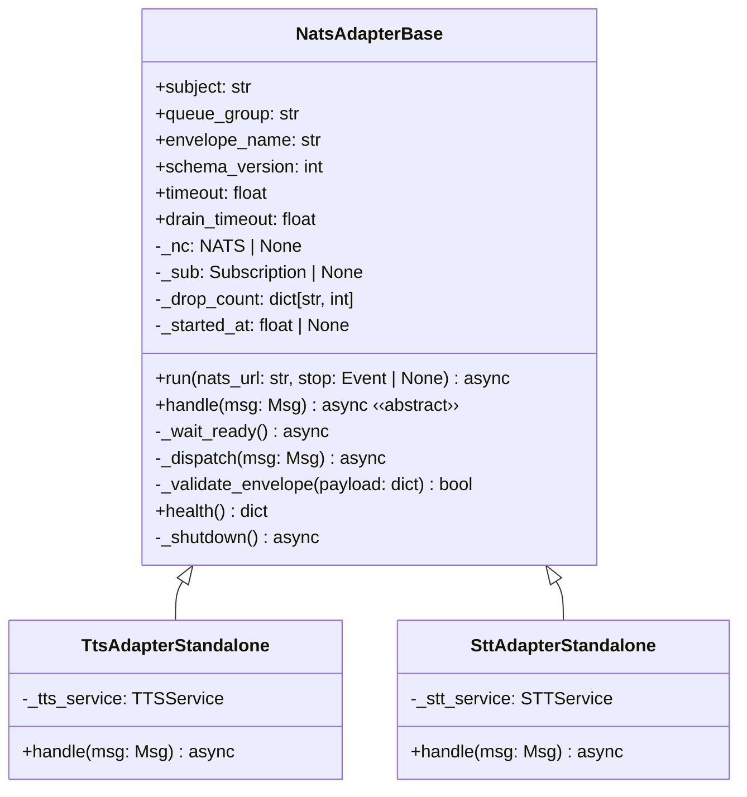
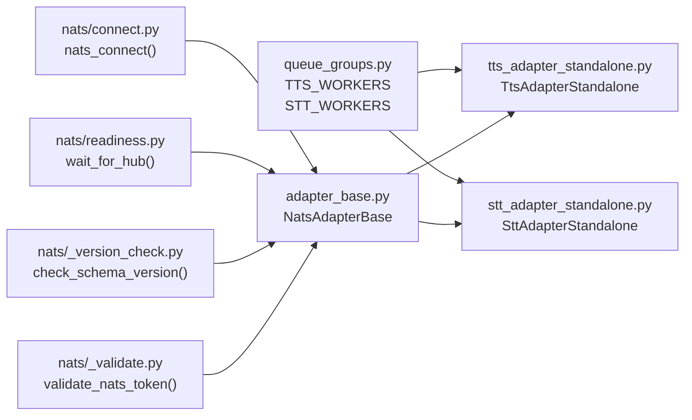

## Context

Source: `artifacts/frames/582-nats-adapter-base-frame.mdx` (approved, F-lite).

TTS and STT standalone adapters call `nats.connect()` directly, bypassing nkey auth. No shared base class exists — each adapter re-implements connect/subscribe/shutdown/validate from scratch. This spec defines `NatsAdapterBase`: a base class all NATS request-reply adapters inherit, making correct behavior structurally enforced rather than optional.

Part of epic #581 (NATS Adapter SDK). Closes #563 (nkey bypass).

Not in scope:
- #566 (`OutboundMessage` schema version in `nats_outbound_listener.py`) — different file, different pattern (pub/sub in Telegram/Discord adapters, not request-reply); needs its own fix.
- #567 (`NatsSttClient` request timeout) — hub-side client concern, not adapter process.

## Goal

Introduce `NatsAdapterBase` in `src/lyra/nats/adapter_base.py` that enforces nkey auth (`nats_connect()`), schema version validation, queue group constant usage, and graceful lifecycle; migrate `tts_adapter_standalone.py` and `stt_adapter_standalone.py` to inherit it.

## Users

- **Primary:** Lyra adapter processes (`lyra_tts`, `lyra_stt`) running under supervisord on Machine 1.
- **Secondary:** Future NATS request-reply adapter authors who inherit `NatsAdapterBase` (e.g. Machine 2 LLM worker, #451).

## Expected Behavior

1. **Construction** — `NatsAdapterBase.__init__(subject, queue_group, envelope_name, schema_version, timeout, drain_timeout)` validates `subject` and `queue_group` immediately via `validate_nats_token()`. `envelope_name` is required (no default) — callers must pass a semantic schema name (e.g. `"TtsRequest"`, `"SttRequest"`), not the NATS subject. Invalid strings raise `ValueError` at construction time (fail-fast).

2. **Run** — single entry point `run(nats_url, stop)` owns the full lifecycle: connect → probe → subscribe → wait → shutdown. `SIGTERM`/`SIGINT` signal handlers are registered inside `run()` if and only if `stop` is `None` (i.e. run creates the event; test-injected `stop` skips signal registration). `nats_connect()` is always called internally — bare `nats.connect()` is never accessible from the base API.

3. **Hub readiness probe** — after connecting, `_wait_ready()` calls `wait_for_hub(timeout=self.timeout)`. On timeout: logs a warning and continues (graceful degradation).

4. **Subscribe** — `nc.subscribe(subject, queue=queue_group, cb=_dispatch)` registers the internal dispatcher. Queue group enables load-balanced delivery during rolling restarts.

5. **Envelope validation** — `_dispatch()` calls `_validate_envelope()` on every received JSON payload before calling `handle()`. Payloads with `schema_version > self.schema_version` are dropped with a rate-limited ERROR log (uses `envelope_name` as the rate-limit bucket key). Missing `schema_version` is treated as version 1 (backward compat).

6. **Handle** — `handle(msg)` is abstract; subclass implements domain logic. Contract: single-reply request-response. Streaming adapters that need to publish multiple replies must override `_dispatch()` — this is documented in the base class docstring.

7. **Shutdown** — `_shutdown()` calls `nc.drain(timeout=self.drain_timeout)` → `nc.close()`. `drain()` subsumes unsubscribe — `sub.unsubscribe()` is NOT called explicitly (it is a no-op or raises `ConnectionDrainedError` after drain, depending on NATS client version). `drain_timeout` must satisfy: `drain_timeout < stopwaitsecs - expected_max_handler_duration` (supervisord `stopwaitsecs = 75 s` for `lyra_tts` / `lyra_stt`; default `drain_timeout = 30 s` leaves ample margin).

8. **Health** — `health()` returns `{"status": "ok", "subject": ..., "queue_group": ..., "schema_version": ..., "connected": nc.is_connected, "uptime_s": ...}`. `connected` reflects live NATS connectivity; `uptime_s` is seconds since `run()` entered.

## Data Model & Consumers

| Consumer | Fields / Methods consumed | When | Status |
|---|---|---|---|
| `tts_adapter_standalone.py` | `run()`, `handle()`, `TTS_WORKERS` | This issue | This issue |
| `stt_adapter_standalone.py` | `run()`, `handle()`, `STT_WORKERS` | This issue | This issue |
| Future LLM worker (#451) | Full base API | Machine 2 offload | Future |
| `health()` caller | `status`, `connected`, `uptime_s`, `subject`, `queue_group` | Supervisor health checks | Future |

## Breadboard

| ID | Affordance | Handler | Data in | Data out |
|---|---|---|---|---|
| N1 | `NatsAdapterBase(subject, queue_group, envelope_name, schema_version, timeout=30.0, drain_timeout=30.0)` | `__init__` → `validate_nats_token(subject)` + `validate_nats_token(queue_group)` | `str`, `str`, `str`, `int`, `float`, `float` | `ValueError` if subject/queue_group invalid |
| N2 | `await adapter.run(nats_url, stop=None)` | `nats_connect(nats_url)` → `_wait_ready()` → `nc.subscribe(...)` → register SIGTERM/SIGINT if `stop is None` → `await stop.wait()` → `_shutdown()` | `NATS_URL`, `NATS_NKEY_SEED_PATH` env | full lifecycle; `_started_at` set |
| N3 | NATS message received | `_dispatch(msg)` → `_validate_envelope(json.loads(msg.data))` → `handle(msg)` if valid | `msg.data` (JSON bytes) | drop + ERROR log if version mismatch |
| N3b | `_validate_envelope(payload)` | `check_schema_version(payload, envelope_name=self.envelope_name, expected=self.schema_version, counter=self._drop_count)` | `dict` | `True` (accept) or `False` (drop) |
| N4 | `handle(msg)` | abstract — subclass implements; single-reply contract | `nats.aio.msg.Msg` | `nc.publish(msg.reply, ...)` |
| N5 | `_shutdown()` | `nc.drain(timeout=self.drain_timeout)` → `nc.close()` — drain subsumes unsubscribe | — | logged confirmation |
| N6 | `adapter.health()` | returns status dict including `connected` and `uptime_s` | — | `dict[str, Any]` |
| N7 | `TTS_WORKERS`, `STT_WORKERS` | constants in `queue_groups.py` | — | `"tts-workers"`, `"stt-workers"` |

## Slices

| # | Slice | Files | Demonstrates |
|---|---|---|---|
| S1 | Base class + queue group constants | `adapter_base.py` (new), `queue_groups.py` (extend) | Construction (N1), dispatch/validate (N3–N3b), shutdown (N5), health (N6), constants (N7) — unit-testable with mock NATS |
| S2 | TTS adapter migration | `tts_adapter_standalone.py` (refactor) | TTS inherits base; nkey enforced; `run()` lifecycle (N2, N4) |
| S3 | STT adapter migration | `stt_adapter_standalone.py` (refactor) | STT inherits base; nkey enforced; `run()` lifecycle (N2, N4) |

## Success Criteria

- [ ] `NatsAdapterBase` exists at `src/lyra/nats/adapter_base.py` with `run()`, `handle()` (abstract), `health()`, `_shutdown()`, `_dispatch()`, `_validate_envelope()`; `envelope_name` is a required ctor param (no default)
- [ ] `TTS_WORKERS = "tts-workers"` and `STT_WORKERS = "stt-workers"` exported from `queue_groups.py`
- [ ] `tts_adapter_standalone.py` has no bare `import nats` / `nats.connect()` — connection goes through base
- [ ] `stt_adapter_standalone.py` has no bare `import nats` / `nats.connect()` — connection goes through base
- [ ] `NatsAdapterBase.__init__` raises `ValueError` immediately for invalid subject or queue group strings (startup-time, not handler-time)
- [ ] `_dispatch()` drops payloads with `schema_version > self.schema_version` with rate-limited ERROR log; missing field treated as version 1; drop counted in `_drop_count`
- [ ] `_shutdown()` calls `nc.drain()` then `nc.close()`; test asserts `drain()` is called before `close()` AND `sub.unsubscribe()` is NOT called
- [ ] `health()` returns dict with `status`, `connected` (live NATS bool), `uptime_s` (float), `subject`, `queue_group`, `schema_version`
