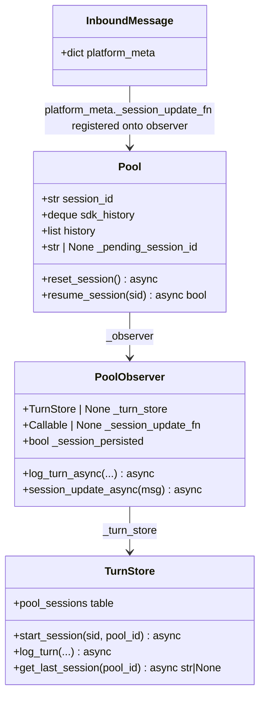
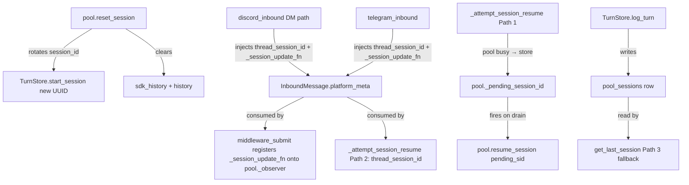

## Context

Four session-persistence bugs in the hub-and-spoke backend. Root cause analysis is
in the issue body. This spec translates those findings into acceptance criteria, a
breadboard of fix points, and independently deliverable slices.

Source: [frames/592-persistence-session-resume-frame.mdx](../frames/592-persistence-session-resume-frame.mdx)

## Goal

After this fix, session history is correctly resumed on daemon restart for all
platforms, `/clear` produces a clean-slate session with a new ID, reply-to
messages always route to the correct session regardless of pool busy-state, and
guild channels / Telegram groups use a shared pool per channel rather than
per-user isolation.

## Users

- **Primary:** Any Lyra user on Discord DMs or Telegram whose session context is
  silently wiped after a daemon restart.
- **Secondary:** Users of `/clear` who expect a genuinely fresh session, and users
  who use reply-to threading to switch conversation context.

## Out of Scope

- Migration of existing per-user pool history to the new shared pool (prior turns stay under their old pool_id).
- Backfilling history for sessions already lost to prior restarts.
- Adding session-resume to Discord threads (already working).
- Schema changes to `TurnStore`, `MessageIndex`, or `ThreadStore`.
- History rehydration for non-CLI (SDK/Anthropic) agent backends — those backends hold
  history only in-memory; this fix targets CLI-backend pools where the CLI subprocess
  maintains conversation history on disk.

## Expected Behavior

**After daemon restart (Discord DM / Telegram):**
The first message after restart triggers Path 3 in `message_pipeline._attempt_session_resume`.
`TurnStore.get_last_session(pool_id)` returns the prior CLI session UUID (written by
`TurnStore.log_turn` on the previous turn). `pool.resume_session(last_sid)` succeeds via
`_session_resume_fn` → Claude CLI resumes that session → history is live again.

If `get_last_session` returns `None` (first-ever user, no prior turns in TurnStore),
the pool starts a fresh session — no resume attempted, no error.

**After `/clear`:**
`cmd_clear()` → `pool.reset_session()` clears `sdk_history` + `history` and rotates
`pool.session_id` to a new UUID. The next turn is logged under the new UUID.
Pre-clear and post-clear turns never share a `session_id` in TurnStore.

**Reply-to while pool is busy:**
Path 1 in `_attempt_session_resume` finds the target `session_id` via `MessageIndex.resolve()`.
If `pool.is_idle == False`, the resume is stored as `pool._pending_session_id` rather
than silently dropped. When the running task completes and the pool drains, the pending
resume fires before the next message is dispatched.

## Data Model & Consumers

| Consumer | Fields / methods consumed | When | Status |
|----------|--------------------------|------|--------|
| `middleware_submit` | `platform_meta._session_update_fn` | On every inbound message | This issue |
| `_attempt_session_resume` Path 2 | `platform_meta.thread_session_id` | On every inbound message | This issue (DM + Telegram) |
| `_attempt_session_resume` Path 3 | `TurnStore.get_last_session` | Already wired; needs UUID written correctly | Existing |
| `pool.reset_session` | `pool.session_id`, `sdk_history`, `history` | On `/clear` | This issue (UUID rotation) |
| `pool._pending_session_id` | `pool.is_idle`, drain hook | When pool is busy + reply-to | This issue |

## Breadboard

### Fix A — UUID rotation on `/clear` (`pool.py`)

| Affordance | Handler | Data in | Data out |
|---|---|---|---|
| U1: `/clear` issued | `cmd_clear()` clears `sdk_history` + `history`, then calls `pool.reset_session()` | current `pool.session_id` | new UUID in `pool.session_id` |
| N1: old session end | `pool_observer.end_session_async(old_sid)` | old session UUID | TurnStore: `ended_at` set |
| N2: new session eager-register | `TurnStore.start_session(new_sid, pool_id)` | new UUID, pool_id | `pool_sessions` row created eagerly |

Wiring: `Pool.reset_session()` saves `old_sid = self.session_id`, calls
`await self._observer.end_session_async(old_sid)`, assigns `self.session_id = str(uuid.uuid4())`,
then calls `await self._observer._turn_store.start_session(self.session_id, self.pool_id)`
if `_turn_store` is set (eager registration — the next `log_turn_async` call would create
the row anyway via `INSERT OR IGNORE`, but the explicit call is defensive), then delegates
to `_session_reset_fn` if registered. The history clear (`sdk_history`, `history`) stays
in `cmd_clear()` as it is today — `Pool.reset_session()` only owns session ID rotation.

### Fix B — Session wiring for Discord DMs (`discord_inbound.py`)

| Affordance | Handler | Data in | Data out |
|---|---|---|---|
| U2: DM message arrives | `handle_message()` DM path (¬`_in_owned_thread`) | `adapter._turn_store`, `pool_id` | `platform_meta.thread_session_id` + `_session_update_fn` |
| N3: last session lookup | `adapter._turn_store.get_last_session(pool_id)` | pool_id | prior CLI session UUID or None |
| N4: session update fn | inner async fn → `TurnStore.start_session(new_sid, pool_id)` | session_id after turn | keeps `pool_sessions` current |

Wiring: DiscordAdapter gains `_turn_store: TurnStore | None` attribute (constructor parameter added; hub bootstrap passes `hub._turn_store` when constructing the adapter — the same pattern used for `thread_store`). The DM path (¬`_in_owned_thread`) computes `pool_id = RoutingKey(...).to_pool_id()` and calls `await adapter._turn_store.get_last_session(pool_id)`. If `_turn_store` is None, both injections are skipped (graceful degradation — Path 3 still runs in the pipeline but without the eager lookup).

### Fix C — Session wiring for Telegram (`telegram_inbound.py`)

| Affordance | Handler | Data in | Data out |
|---|---|---|---|
| U3: Telegram message arrives | `handle_message()` | `adapter._turn_store`, `pool_id` | `platform_meta.thread_session_id` + `_session_update_fn` |
| N5: last session lookup | `adapter._turn_store.get_last_session(pool_id)` | pool_id | prior session UUID or None |
| N6: session update fn | inner async fn → `TurnStore.start_session(new_sid, pool_id)` | session_id after turn | keeps `pool_sessions` current |

Wiring: TelegramAdapter gains `_turn_store: TurnStore | None` attribute (constructor parameter + hub bootstrap injection). Same pattern as Fix B. If `_turn_store` is None, both injections are skipped — graceful degradation, Path 3 still runs.

### Fix D — Queue reply-to resume on busy pool (`message_pipeline.py`)

| Affordance | Handler | Data in | Data out |
|---|---|---|---|
| U4: reply-to message, pool busy | `_attempt_session_resume` Path 1 | `session_id` from MessageIndex, `pool.is_idle == False` | `pool._pending_session_id = session_id` |
| N7: pool task drains | pool drain hook / idle transition | `pool._pending_session_id` | `pool.resume_session(pending_sid)` fires |
| N8: resume fires | `pool.resume_session(pending_sid)` | pending session UUID | RESUMED status; `_pending_session_id = None` |

Wiring: `Pool` gains `_pending_session_id: str | None = None`. `_attempt_session_resume` Path 1 sets `pool._pending_session_id = session_id` when pool is busy instead of silently dropping. The drain point is the **top of `PoolProcessor._process_loop()`**, immediately after the debounce `collect()` call and before the agent `process()` call. At that point, if `_pending_session_id` is set and the pool is about to process a new message, `await pool.resume_session(_pending_session_id)` fires first, then `_pending_session_id` is cleared. This ordering guarantees the session is correct for the message being processed.

If `resume_session` fails (returns False) during drain, `_pending_session_id` is cleared anyway — the pool continues with the current active session rather than blocking indefinitely.

### Fix E — Remove per-user scoping from guild channels and Telegram groups

| Affordance | Handler | Data in | Data out |
|---|---|---|---|
| U5: Discord guild channel message | `discord_normalize.normalize()` | `raw.guild`, `resolved_thread_id` | `scope_id = "channel:{channel_id}"` (no user suffix) |
| U6: Telegram group message | `telegram_normalize._make_scope_id()` | `chat_id`, `topic_id`, `is_group` | `scope_id = "chat:{chat_id}"` or `"chat:{chat_id}:topic:{topic_id}"` (no user suffix) |

Wiring:
- `discord_normalize.py`: remove `is_guild_channel` guard + `user_scoped()` call (lines 65-67). Guild channel messages use `scope_id = "channel:{channel_id}"` directly.
- `telegram_normalize._make_scope_id()`: remove `user_scoped(base, user_id) if is_group else base` — return `base` unconditionally.

Note: `user_id` is still present on the `InboundMessage` — hub trust/identity resolution is unaffected. Only the pool routing key changes.

## Slices

| # | Slice | Files | Effort | Demo |
|---|-------|-------|--------|------|
| S1 | UUID rotation on `/clear` | `core/pool/pool.py` | XS | `/clear` → check TurnStore: two distinct session IDs before and after |
| S2 | Reply-to busy-pool queue | `core/hub/message_pipeline.py`, `core/pool/pool.py` | S | Send reply-to while pool processing → confirm correct session used after drain |
| S3 | Discord DM session wiring | `adapters/discord_inbound.py`, `adapters/discord.py` | S | Restart → Discord DM → confirm prior session resumed (CLI logs `resume_and_reset`) |
| S4 | Telegram session wiring | `adapters/telegram_inbound.py`, `adapters/telegram.py` | M | Restart → Telegram message → confirm prior session resumed |
| S5 | Remove per-user pool scoping | `adapters/discord_normalize.py`, `adapters/telegram_normalize.py` | XS | Two users in same guild channel / Telegram group → same pool_id |

Slices are independent: S1 touches only pool.py; S2 touches pipeline + pool (no adapter changes); S3 and S4 touch only their respective adapters + facade.

## Success Criteria

- [ ] After daemon restart, a Discord DM user's prior session is resumed — TurnStore shows same `session_id` pre- and post-restart under the same `pool_id`
- [ ] After daemon restart, a Telegram user's prior session is resumed — TurnStore shows same `session_id` pre- and post-restart under the same `pool_id`
- [ ] First-time user (no prior `pool_sessions` row): system starts a fresh session without error — no crash, no spurious resume attempt
- [ ] `/clear` produces a new `session_id` — TurnStore has two distinct session rows for the same `pool_id` separated by the clear event
- [ ] A reply-to message received while the pool is idle resumes the correct session immediately (existing Path 1 behaviour preserved)
- [ ] A reply-to message received while the pool is busy: correct session is resumed after the current task drains (not dropped, not silently ignored)
- [ ] `_turn_store` absent at adapter startup: DM/Telegram wiring is skipped gracefully; Path 3 fallback still runs
- [ ] Discord threads are unaffected — existing thread-session behaviour unchanged
- [ ] Two users messaging in the same Discord guild channel (non-thread) share one pool — `pool_id` is identical for both
- [ ] Two users messaging in the same Telegram group share one pool — `pool_id` is identical for both
- [ ] `/clear` in a guild channel or Telegram group resets the shared session for that channel/group

**Testing requirement:** all criteria above covered by integration tests using real TurnStore (no mocks).
