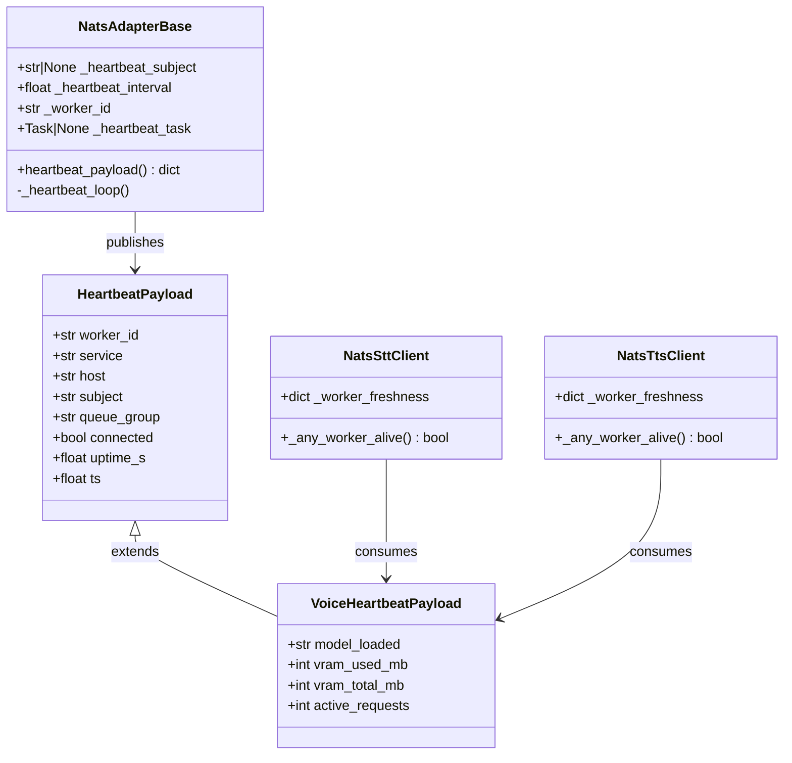
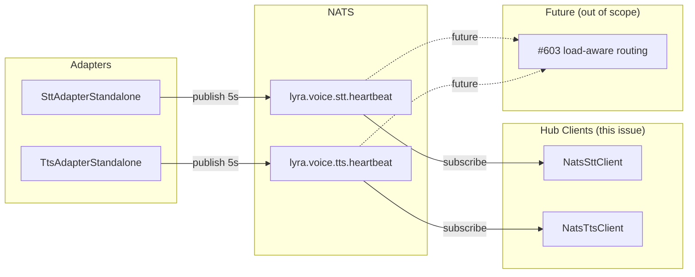

## Context

Lifted from approved frame `602-nats-sdk-heartbeat-frame.mdx`. Analysis phase skipped (F-lite —
scope fully known from frame + existing stubs).

The proven heartbeat pattern in `docker/stubs/stt_stub.py` / `tts_stub.py` is lifted into
`NatsAdapterBase`. Voice adapters opt in with a single constructor kwarg. Hub-side clients
subscribe to heartbeat subjects and gate requests on worker liveness.

## Goal

Adapters proactively broadcast liveness so the Hub knows a worker is dead before the next request
times out — eliminating the silent failure window.

## Users

- **Primary:** Lyra Hub process (via `NatsSttClient` / `NatsTtsClient`) — receives heartbeats,
  gates outbound requests on worker freshness
- **Secondary:** STT and TTS adapter processes — opt in by passing `heartbeat_subject` to
  `super().__init__()`; future adapters (LLM #452) inherit the same hook at zero cost

## Expected Behavior

1. **Adapter startup** — after subscribing to the request subject, the adapter creates a background
   `_heartbeat_loop` task (only if `heartbeat_subject` is set). The loop publishes a JSON payload
   to `heartbeat_subject` every `heartbeat_interval` seconds (default 5s). If the loop's publish
   raises, it logs a warning and retries on the next tick.

2. **Adapter shutdown** — `_shutdown()` cancels the heartbeat task before calling `nc.drain()`.
   Cancellation is graceful: the task handles `CancelledError` without raising.

3. **Hub-side subscription** — `NatsSttClient` and `NatsTtsClient` subscribe to their respective
   heartbeat subjects during construction. Each incoming heartbeat updates
   `_worker_freshness[worker_id] = monotonic()`.

4. **Liveness check** — before sending a request, the client calls `_any_worker_alive()` **first**
   (before the existing `_cb.is_open()` check): returns `True` if any `worker_id` has been seen
   within the last 15s. If `False`, raises `STTUnavailableError` / `TtsUnavailableError` immediately
   (no network hop, no CB state change). The circuit breaker then gates on actual request outcomes
   as before. Order: freshness → CB → request.

5. **Recovery** — when a restarted adapter sends its first heartbeat, `_worker_freshness` is
   updated immediately and `_any_worker_alive()` returns `True` on the next call.

6. **No heartbeat_subject** — `heartbeat_subject=None` (default): no task created, no subscribe,
   zero overhead. All existing adapters (and tests) are unaffected.

7. **Heartbeat loop exit on disconnect** — the `_heartbeat_loop()` exits cleanly when `_nc` is
   `None` or `_nc.is_connected` is `False` (in addition to being cancelled by `_shutdown()`).
   A disconnected adapter does not keep publishing into a broken socket.

8. **Subscription teardown** — `NatsSttClient` / `NatsTtsClient` store the subscription object
   returned by `nc.subscribe()`. The hub's `nc` lifetime covers the client's lifetime (hub closes
   `nc` on shutdown), so explicit unsubscribe is not required in the happy path. The subscription
   handle is stored (`_hb_sub`) to support future explicit teardown if the client is re-created.

## Data Model & Consumers

| Consumer | Fields consumed | When | Status |
|---|---|---|---|
| `NatsSttClient` | `worker_id`, `ts` | every heartbeat | this issue |
| `NatsTtsClient` | `worker_id`, `ts` | every heartbeat | this issue |
| `#603 load-aware routing` | `worker_id`, `vram_used_mb`, `vram_total_mb`, `active_requests`, `uptime_s` | every heartbeat | future |

## Breadboard

| Affordance | Handler | Data |
|---|---|---|
| `NatsAdapterBase.__init__(heartbeat_subject, heartbeat_interval)` | Store params; derive `_worker_id = f"{queue_group}-{hostname}-{pid}"` | `_heartbeat_subject`, `_heartbeat_interval`, `_worker_id` |
| `NatsAdapterBase.run()` | After subscribe: if `_heartbeat_subject`: `_heartbeat_task = create_task(_heartbeat_loop())` | `_heartbeat_task` |
| `NatsAdapterBase._heartbeat_loop()` | Publish `heartbeat_payload()` JSON every interval; log + continue on publish error | `_nc.publish()` |
| `NatsAdapterBase.heartbeat_payload()` | Return base dict with base fields; override hook for subclasses | `HeartbeatPayload` |
| `NatsAdapterBase._shutdown()` | Cancel `_heartbeat_task` (if set) before `nc.drain()` | `_heartbeat_task.cancel()` |
| `SttAdapterStandalone.__init__()` | Pass `heartbeat_subject="lyra.voice.stt.heartbeat"` to `super().__init__()` | — |
| `SttAdapterStandalone.heartbeat_payload()` | Call `super()`, extend with `model_loaded`, `vram_used_mb`, `vram_total_mb`, `active_requests` | `VoiceHeartbeatPayload` |
| `TtsAdapterStandalone.__init__()` | Same as STT with `"lyra.voice.tts.heartbeat"` | — |
| `TtsAdapterStandalone.heartbeat_payload()` | Same override pattern as STT | `VoiceHeartbeatPayload` |
| `NatsSttClient.__init__()` | Subscribe to `"lyra.voice.stt.heartbeat"`, store `_worker_freshness = {}` | `_worker_freshness` |
| `NatsSttClient._on_heartbeat(msg)` | Parse JSON → `_worker_freshness[payload["worker_id"]] = monotonic()` | `_worker_freshness` |
| `NatsSttClient._any_worker_alive()` | Return any value in `_worker_freshness` within last 15s | bool |
| `NatsSttClient.transcribe()` | Before request: if not `_any_worker_alive()` → raise `STTUnavailableError` | (gate) |
| `NatsTtsClient` | Mirror of all STT client entries above | — |

## Slices

| # | Name | Files | Demo-able by |
|---|---|---|---|
| S1 | SDK heartbeat in `NatsAdapterBase` | `adapter_base.py` + unit tests | Unit test: heartbeat publishes at interval; task cancelled on shutdown; no-op when subject=None |
| S2 | Voice adapter opt-in | `stt_adapter_standalone.py`, `tts_adapter_standalone.py` + tests | Integration test: adapter emits heartbeat JSON to NATS subject |
| S3 | Hub client freshness tracking | `nats_stt_client.py`, `nats_tts_client.py` + tests | Unit test: stale workers blocked; fresh worker re-enabled; no workers → raises unavailable |

## Success Criteria

### SDK (NatsAdapterBase) — S1
- [ ] `heartbeat_subject: str | None = None` and `heartbeat_interval: float = 5.0` are accepted as keyword-only constructor params; existing callers without them are unaffected
- [ ] `_worker_id` auto-generated as `{queue_group}-{socket.gethostname()}-{os.getpid()}`
- [ ] `heartbeat_payload()` returns dict with keys: `worker_id`, `service`, `host`, `subject`, `queue_group`, `connected`, `uptime_s`, `ts`
- [ ] `_heartbeat_loop()` task created in `run()` after subscribe, only if `heartbeat_subject` is set
- [ ] Loop publishes `heartbeat_payload()` JSON to `heartbeat_subject` every `heartbeat_interval` seconds
- [ ] Publish error in loop → log warning, continue (no crash)
- [ ] Loop exits cleanly when `_nc is None` or `_nc.is_connected is False`
- [ ] `_shutdown()` cancels heartbeat task before `nc.drain()`
- [ ] `heartbeat_subject=None` → no task created, no attribute set, zero overhead
- [ ] Unit test: heartbeat publishes correct payload at interval
- [ ] Unit test: heartbeat task cancelled cleanly on shutdown
- [ ] Unit test: `heartbeat_subject=None` → no task, no publish

### Voice adapters — S2
- [ ] `SttAdapterStandalone` passes `heartbeat_subject="lyra.voice.stt.heartbeat"` in `super().__init__()`
- [ ] `TtsAdapterStandalone` passes `heartbeat_subject="lyra.voice.tts.heartbeat"` in `super().__init__()`
- [ ] Both override `heartbeat_payload()` adding: `model_loaded` (str), `vram_used_mb` (int), `vram_total_mb` (int), `active_requests` (int)
- [ ] Unit tests: STT heartbeat payload includes `model_loaded`, `vram_used_mb`, `vram_total_mb`, `active_requests`
- [ ] Unit tests: TTS heartbeat payload includes `model_loaded`, `vram_used_mb`, `vram_total_mb`, `active_requests`

### Hub clients — S3
- [ ] `NatsSttClient` subscribes to `"lyra.voice.stt.heartbeat"` on init; stores sub handle as `_hb_sub`; updates `_worker_freshness[worker_id]` on each message
- [ ] `NatsTtsClient` same for `"lyra.voice.tts.heartbeat"`
- [ ] `transcribe()` calls `_any_worker_alive()` before `_cb.is_open()` — raises `STTUnavailableError` immediately if no worker seen in last 15s (no CB state change)
- [ ] `synthesize()` same ordering — raises `TtsUnavailableError` immediately if no worker seen in last 15s
- [ ] Heartbeat resumes after gap → worker re-enabled on next request (no restart required)
- [ ] Unit test: stale `_worker_freshness` (>15s) → request raises unavailable without network call
- [ ] Unit test: fresh heartbeat → request proceeds normally
- [ ] Unit test: no heartbeats ever → first request raises unavailable
