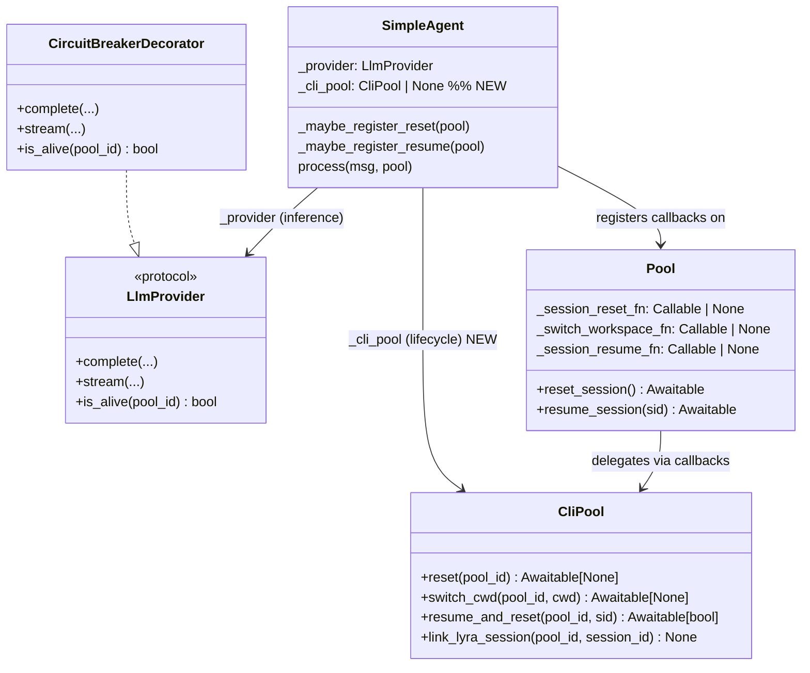
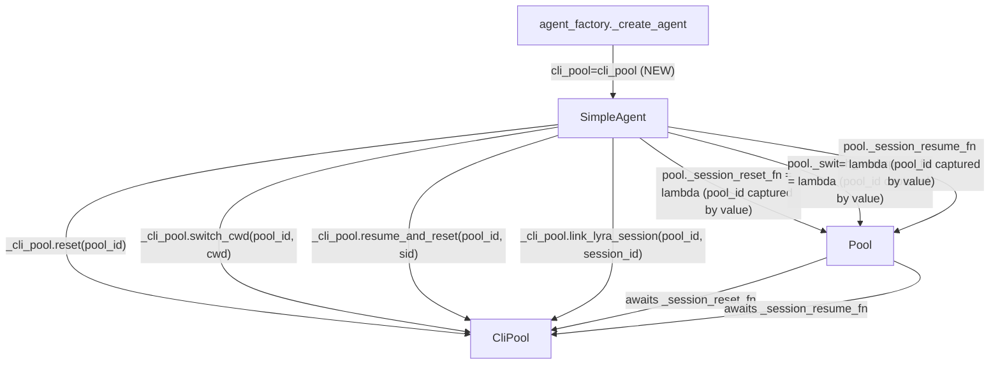

# Spec: CLI Lifecycle / Decorator Gap (#620)

## Context

Promoted from `artifacts/analyses/620-cli-lifecycle-decorator-gap.mdx` (second-checked
by backend-dev + architect agents — see issue #620 comments for findings).

The analysis identified one gap vs. the original issue description: `link_lyra_session`
is wired via an inline `getattr` call in `process()`, not via `_maybe_register_reset`.
Both the original three pool-callback sites and this fourth inline site are in scope.

## Goal

Ensure all four CLI subprocess lifecycle operations (`reset`, `switch_cwd`,
`resume_and_reset`, `link_lyra_session`) fire correctly regardless of what decorator
stack wraps `ClaudeCliDriver` — by routing lifecycle calls through a direct `CliPool`
reference rather than through the inference provider chain.

## Users

**Affected:** Any Lyra deployment with a `claude-cli` circuit breaker configured
(`[circuit_breakers.claude-cli]` in `config.toml`). Without this fix, `/clear`, `/new`,
`/workspace`, and reply-to-resume silently no-op at the subprocess level while appearing
to succeed at the history/session-ID level.

**Unaffected:** Deployments using `anthropic-sdk` backend. Deployments using
`claude-cli` without a circuit breaker (bare `ClaudeCliDriver` has `reset()` directly).

## Expected Behavior

### Before fix (with circuit breaker configured)

1. User sends `/clear`
2. `pool.reset_session()` clears `pool.history`, rotates session ID — ✓
3. `pool._session_reset_fn` is `None` → subprocess kill skipped silently
4. Next message: same CLI subprocess receives the turn; full context window intact
5. User believes they have a fresh session; they do not

### After fix

1. User sends `/clear`
2. `pool.reset_session()` clears history, rotates session ID — ✓
3. `pool._session_reset_fn` is set (wired to `cli_pool.reset`) → subprocess killed — ✓
4. Next message: new CLI subprocess, genuinely empty context window
5. Same for `/workspace` (calls `switch_cwd`), reply-to-resume (calls `resume_and_reset`),
   and per-turn session linking (calls `link_lyra_session`)

### Invariants

- `AnthropicAgent` is unaffected (no `cli_pool`, no subprocess)
- `cli_pool=None` produces no errors — SDK backend path unchanged
- Adding future decorators (e.g. `RetryDecorator` wrapping `CircuitBreakerDecorator`)
  does not re-introduce the gap

---

## Data Model & Consumers

### Class diagram



### Consumer map



### Consumer summary

| Consumer | Fields / Methods | When | Status |
|---|---|---|---|
| `SimpleAgent._maybe_register_reset` | `cli_pool.reset`, `cli_pool.switch_cwd` | First `configure_pool()` call per pool | This issue |
| `SimpleAgent._maybe_register_resume` | `cli_pool.resume_and_reset` | First `configure_pool()` call per pool | This issue |
| `SimpleAgent.process` | `cli_pool.link_lyra_session` | Every message turn | This issue |
| `Pool.reset_session` | `_session_reset_fn` (registered above) | On `/clear`, `/new` | No change needed |
| `Pool.resume_session` | `_session_resume_fn` (registered above) | On reply-to-resume | No change needed |
| `CliLifecycle` protocol | All four methods | Type boundary | Recommended (non-blocking) |

---

## Breadboard

### Affordances

| ID | Element | Handler | Data in | Data out |
|---|---|---|---|---|
| N1 | `SimpleAgent.__init__` new param | Constructor | `cli_pool: CliPool \| None` | `self._cli_pool` stored |
| N2 | `_maybe_register_reset` rewrite | `self._cli_pool` directly | `pool: Pool`, `self._cli_pool` | `pool._session_reset_fn`, `pool._switch_workspace_fn` set |
| N3 | `_maybe_register_resume` rewrite | `self._cli_pool` directly | `pool: Pool`, `self._cli_pool` | `pool._session_resume_fn` set |
| N4 | `process()` link_lyra_session fix | `self._cli_pool` directly | `pool.pool_id`, `pool.session_id` | CLI session mapped |
| N5 | `agent_factory._create_agent` | Pass `cli_pool=cli_pool` (CLI path only; `AnthropicAgent` path unchanged, `cli_pool` is `None` by default) | existing `cli_pool` var | `SimpleAgent` receives direct ref; SDK path unaffected |

### Wiring

```
configure_pool(pool)
  → _maybe_register_reset(pool)     [N2]
      if self._cli_pool is not None:
          _pool_id = pool.pool_id    # ← capture by value, not by reference
          pool._session_reset_fn     = lambda: self._cli_pool.reset(_pool_id)
          pool._switch_workspace_fn  = lambda cwd: self._cli_pool.switch_cwd(_pool_id, cwd)
  → _maybe_register_resume(pool)    [N3]
      if self._cli_pool is not None:
          _pool_id = pool.pool_id    # ← capture by value
          pool._session_resume_fn    = lambda sid: self._cli_pool.resume_and_reset(_pool_id, sid)

Note: existing `if pool._session_reset_fn is None` / `if pool._session_resume_fn is None`
guards remain — `configure_pool` is idempotent (called once per pool at first wire-up,
but safe if called again).

process(msg, pool)
  → if self._cli_pool is not None:  [N4]
        self._cli_pool.link_lyra_session(pool.pool_id, pool.session_id)

agent_factory._create_agent(...)   [N5]
  → SimpleAgent(config, provider, cli_pool=cli_pool, ...)
```

### Removed wiring (deleted code)

```
# _maybe_register_reset — DELETE
reset_fn = getattr(self._provider, "reset", None)
if reset_fn is not None:
    pool._session_reset_fn = lambda: reset_fn(_pool_id)

switch_fn = getattr(self._provider, "switch_cwd", None)
if switch_fn is not None and pool._switch_workspace_fn is None:
    pool._switch_workspace_fn = lambda cwd: switch_fn(_pool_id, cwd)

# _maybe_register_resume — DELETE
resume_fn = getattr(self._provider, "resume_and_reset", None)
if resume_fn is not None:
    pool._session_resume_fn = lambda sid: resume_fn(_pool_id, sid)

# process() — DELETE
_link = getattr(self._provider, "link_lyra_session", None)
if _link is not None:
    _link(pool.pool_id, pool.session_id)
```

---

## Slices

| # | Slice | Files | Independently demo-able |
|---|---|---|---|
| S1 | Add `cli_pool` param to `SimpleAgent`; rewrite `_maybe_register_reset/resume` to use it | `simple_agent.py`, `agent_factory.py` | Yes — `/clear` kills subprocess with CB configured |
| S2 | Fix `link_lyra_session` inline call in `process()` | `simple_agent.py` | Yes — session mapping works with CB configured |
| S3 | Regression tests: CB-wrapped provider + all four lifecycle ops | `tests/` | Yes — test suite passes |

---

## Success Criteria

- [ ] `/clear` with `CircuitBreakerDecorator`-wrapped `ClaudeCliDriver`: `CliPool.reset()` is called (subprocess killed)
- [ ] `/workspace <key>` with CB-wrapped driver: `CliPool.switch_cwd()` is called
- [ ] Reply-to-resume with CB-wrapped driver: `CliPool.resume_and_reset()` is called
- [ ] Per-turn `link_lyra_session` with CB-wrapped driver: `CliPool.link_lyra_session()` is called
- [ ] `cli_pool=None` (SDK backend / `AnthropicAgent`): no errors, no behavior change
- [ ] Bare `ClaudeCliDriver` (no circuit breaker): behavior unchanged — all four ops still fire
- [ ] Regression test: `SimpleAgent(config, CircuitBreakerDecorator(ClaudeCliDriver(mock_pool)), cli_pool=mock_pool)` + `/clear` → `mock_pool.reset.assert_called_once()`
- [ ] Regression test covers `switch_cwd`, `resume_and_reset`, `link_lyra_session` with same CB-wrapped setup
- [ ] Regression test: bare `ClaudeCliDriver` (no CB) + `cli_pool=mock_pool` → all four ops still fire (existing behaviour preserved)
- [ ] `configure_pool` is idempotent — calling it twice on the same pool does not double-register or overwrite callbacks
- [ ] `CircuitBreakerDecorator` and `RetryDecorator` — no changes to these files
- [ ] `Pool._session_reset_fn` / `_switch_workspace_fn` / `_session_resume_fn` signatures — unchanged
