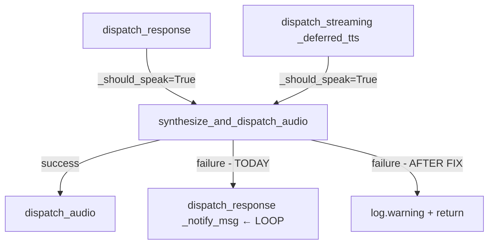

## Context

Promoted from `artifacts/frames/621-tts-retry-loop-duplicate-replies-frame.mdx`.
Production incident: same `msg.id` repeating ×hundreds in `lyra_hub_error.log` until
manual restart. Companion issue #622 owns Fix 2 (`original_msg` embed in `stream_start`).

## Goal

Remove the `dispatch_response` call from the TTS error handler in
`synthesize_and_dispatch_audio` so that a TTS failure logs once and exits cleanly,
without risk of reentrancy or duplicate notifications.

## Users

- **Primary:** Any voice-modality user when TTS adapter is unavailable — currently receives
  a flood of stale fallback notifications across multiple conversation turns.
- **Secondary:** On-call developer — hub must be restarted manually to stop the loop today.

## Expected Behavior

**Before fix:**
1. User sends voice message → hub dispatches text response ✓
2. Hub spawns background TTS task → TTS adapter unavailable
3. Error handler calls `dispatch_response(notify_msg, "Voice output is temporarily unavailable.")`
4. This notification is published via NATS ×hundreds for the same `msg.id`
5. Adapter receives each copy, finds stale cache, fires Telegram notification attached to old message

**After fix:**
1. User sends voice message → hub dispatches text response ✓ (unchanged)
2. Hub spawns background TTS task → TTS adapter unavailable
3. Error handler **logs and returns** — no secondary dispatch
4. User sees the text response only (already delivered at step 1)
5. Loop never establishes — hub runs indefinitely without degradation

The text response reaching the user is sufficient; no "voice unavailable" notification is
needed since the content is already delivered in text form.

## Data Model & Consumers

```classDiagram
    class InboundMessage {
        +id: str
        +modality: str  ← "voice" on original, "text" on _notify_msg (removed)
        +user_id: str
        +platform_meta: dict
    }

    class AudioPipeline {
        +_hub: Hub
        +synthesize_and_dispatch_audio(msg, text, ...)
    }

    class HubOutboundMixin {
        +dispatch_response(msg, response)
        +_should_speak: bool  ← guard computed at call site
        +_memory_tasks: set[Task]
    }

    AudioPipeline --> HubOutboundMixin : calls dispatch_response (REMOVED from error path)
    HubOutboundMixin --> AudioPipeline : spawns TTS task
```



| Consumer | Field(s) used | When | Status |
|---|---|---|---|
| `dispatch_response` | `msg.modality`, `response.speak` | Decides `_should_speak` | This issue |
| `synthesize_and_dispatch_audio` | `msg.id`, `msg.user_id`, `msg.language` | TTS synthesis | This issue |
| `_notify_msg` (removed) | `msg.*` with `modality="text"` | Error path only | **Removed** |

## Breadboard

| Element | Handler | Notes |
|---|---|---|
| `synthesize_and_dispatch_audio` exception block | `except Exception` (L208) | Remove `dispatch_response` call, keep log |
| `TtsUnavailableError` branch (L220–224) | `isinstance(_tts_exc, TtsUnavailableError)` | log.warning stays |
| Generic exception branch (L225–229) | `else` | log.exception stays |
| `_notify_msg` + `dispatch_response` call (L219, L230) | **Deleted** | Not needed — text already sent |

Wiring after fix:
```
TTS fails
  └── log warning/exception (msg.id)
  └── return   ← no further dispatch
```

## Slices

| # | Slice | Files | Demo |
|---|---|---|---|
| 1 | Remove `dispatch_response` + `_notify_msg` from TTS error handler | `tts_dispatch.py:208-230` | TTS failure logs once, no second dispatch |
| 2 | Add/update unit test: TTS failure → `dispatch_response` NOT called | `tests/` | Test passes; confirms no regression on happy path |

## Success Criteria

- [ ] `dispatch_response` is **not** called from within `synthesize_and_dispatch_audio` error handler
- [ ] `dataclasses.replace(msg, modality="text")` (`_notify_msg`) line is removed
- [ ] A `TtsUnavailableError` causes exactly one `log.warning` per invocation — no additional dispatch
- [ ] A generic TTS exception causes exactly one `log.exception` per invocation — no additional dispatch
- [ ] Normal TTS happy path untouched: voice messages still dispatch audio via `dispatch_audio`
- [ ] `dispatch_streaming` TTS error path behaves identically (same fix path via `_deferred_tts`)
- [ ] Unit test: mock `dispatch_response` on hub — assert call count == 0 after TTS failure
- [ ] Unit test: mock `dispatch_audio` — assert it IS called on TTS success
