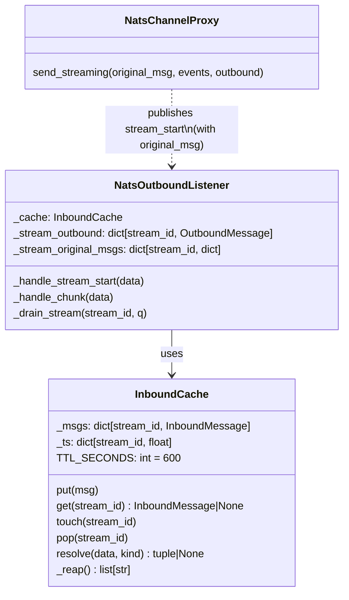

## Context

Streaming LLM responses are silently dropped in two failure modes:

- **Mode A** — Hub takes >120 s; InboundCache TTL reaper evicts the entry before chunks arrive; `_drain_stream` finds `original_msg is None` and discards all chunks.
- **Mode B** — Adapter process restarts (NATS disconnect), fresh `InboundCache()` has no prior state; hub delivers chunks for pre-restart `stream_id`s; same cache-miss path, same silent drop.

The `send`-type path already has a working fallback: `original_msg` is embedded in the envelope, and `InboundCache.resolve()` reconstructs from it on miss. The `stream_start` envelope has no equivalent, so streaming lacks the same resilience.

Source: [frame](../frames/622-nats-streaming-cache-miss-frame.mdx) — approved 2026-04-08.

## Goal

Streaming responses are delivered even when `InboundCache` does not hold the mapping — by raising the TTL ceiling (Fix 1) and by embedding the `original_msg` fallback in the `stream_start` envelope and using it in `_drain_stream` (Fix 2), mirroring the already-proven `send` pattern.

## Users

- **Primary:** Lyra users whose messages trigger LLM responses on slow turns (>120 s) or sessions that span a NATS reconnect.
- **Secondary:** Operators watching `lyra_telegram_error.log` — the `drained N chunk(s) for unknown stream_id` warning currently gives no signal of whether delivery actually failed.

## Expected Behavior

**Normal path (cache hit — unchanged):**
1. Adapter receives inbound message → `cache_inbound(msg)` stores it.
2. Hub publishes `stream_start` → `_handle_stream_start` stores `OutboundMessage` + raw `original_msg`.
3. Hub publishes chunks → `_handle_chunk` routes to `_drain_stream`.
4. `_drain_stream` retrieves `original_msg` from cache → calls `adapter.send_streaming()`.
5. Stream completes → cache entry popped, `_stream_original_msgs` entry cleaned up.

**Failure path A/B (cache miss — fixed):**
1. Cache entry is missing (TTL eviction or restart).
2. `_drain_stream` calls `self._cache.get(stream_id)` → `None`.
3. Fallback: check `self._stream_original_msgs.pop(stream_id, None)`.
4. Raw dict is present → deserialize to `InboundMessage` → proceed with `adapter.send_streaming()`.
5. Message is delivered to Telegram. No silent drop.

**Failure path — both missing (no recovery):**
1. Cache miss AND `_stream_original_msgs` has no entry for the stream (e.g. `stream_start` was never received, or process restarted before `stream_start`).
2. `_drain_stream` logs warning: `"NatsOutboundListener: drained %d chunk(s) for unknown stream_id=%r"`.
3. Queue drained, stream cleaned up. No delivery possible. **The Telegram user receives no message and no error** — silence is intentional; the warning log is the operator signal.

**Known gap — `outbound is None` path:**
When `send_streaming()` is called with `outbound=None` the hub skips the `stream_start` publish entirely (proxy lines 112–121). In that case `_stream_original_msgs` is never populated and the fallback cannot fire. This is a pre-existing constraint not introduced by this fix. The drain-warn path fires for this case as before.

## Data Model & Consumers

```mermaid
flowchart LR
    Hub["NatsChannelProxy\nsend_streaming()"] -->|stream_start\noutbound + original_msg| NATS
    NATS -->|subscribe| NOL["NatsOutboundListener"]
    NOL -->|_handle_stream_start| SM["_stream_original_msgs\ndict[stream_id, dict]"]
    NOL -->|_drain_stream cache miss| SM
    SM -->|deserialize fallback| IC["InboundCache.resolve()"]
    IC -->|InboundMessage| Adapter["ChannelAdapter\nsend_streaming()"]

    style SM fill:#e8f4fd,stroke:#4a9eca
    style IC fill:#f0fde8,stroke:#6abf40
```





| Consumer | Fields consumed | When | Status |
|---|---|---|---|
| `NatsOutboundListener._drain_stream` | `original_msg` (raw dict) | Cache miss — fallback path | **This issue** |
| `NatsOutboundListener._handle_stream_start` | `original_msg` (raw dict) | Store alongside outbound | **This issue** |
| `InboundCache.resolve()` (existing) | `original_msg` (raw dict) | send / attachment / audio cache miss | Existing (unchanged) |

## Breadboard

### Fix 1 — TTL bump

| Element | Handler | Data |
|---|---|---|
| `TTL_SECONDS` constant | `_inbound_cache.py` module-level | `int`, currently `120` → `600` |

### Fix 2 — `stream_start` fallback

**Hub side — embed `original_msg`:**

| Element | Handler | Data |
|---|---|---|
| `stream_start` envelope | `NatsChannelProxy.send_streaming()` | Add `"original_msg": json.loads(serialize(original_msg).decode())` — mirrors `send()` pattern |

**Adapter side — store + use fallback:**

| Element | Handler | Data |
|---|---|---|
| `_stream_original_msgs` | `NatsOutboundListener.__init__` | New dict `dict[str, dict]` — parallel to `_stream_outbound` |
| Store on `stream_start` | `_handle_stream_start()` | `raw_orig = data.get("original_msg")` → store if not None |
| Fallback in drain | `_drain_stream()` | On cache miss: `raw = self._stream_original_msgs.pop(stream_id, None)` → deserialize → proceed |
| Cleanup on completion | `_drain_stream()` finally block | `self._stream_original_msgs.pop(stream_id, None)` — prevents leak on normal path too |

### Fix 2 wiring

```
Hub                              NATS                        Adapter
  │                                │                              │
  │  stream_start {                │                              │
  │    stream_id, outbound,        │                              │
  │    original_msg  ← NEW         │                              │
  │  }                             │─────────────────────────────►│
  │                                │       _handle_stream_start   │
  │                                │         _stream_outbound[id] = OutboundMessage
  │                                │         _stream_original_msgs[id] = raw ← NEW
  │                                │                              │
  │  chunk {stream_id, seq, ...}   │─────────────────────────────►│
  │                                │       _handle_chunk → _drain_stream
  │                                │         cache.get(id) → None (miss)
  │                                │         _stream_original_msgs.pop(id) → raw ← NEW
  │                                │         deserialize → InboundMessage ← NEW
  │                                │         adapter.send_streaming() → DELIVERED ← NEW
```

## Slices

| # | Slice | Files | Demo |
|---|---|---|---|
| S1 | TTL bump | `src/lyra/adapters/_inbound_cache.py` | `TTL_SECONDS == 600` in test/inspection |
| S2 | Embed `original_msg` in `stream_start` + `_stream_original_msgs` fallback | `src/lyra/nats/nats_channel_proxy.py`, `src/lyra/adapters/nats_outbound_listener.py` | Unit test: cache miss with embedded msg → `send_streaming` called |
| S3 | Tests | `tests/adapters/test_nats_outbound_listener.py` (or new file) | All criteria green |

S1 is independent. S2 is functionally coupled (hub + adapter sides of the same protocol change) — if split, the fix is not effective, but neither side breaks the existing behaviour. S3 validates S1+S2.

## Success Criteria

- [ ] `TTL_SECONDS` is `600` in `src/lyra/adapters/_inbound_cache.py`
- [ ] `stream_start` envelope published by `NatsChannelProxy.send_streaming()` includes `"original_msg"` key when `outbound is not None` (same serialization as `send()`)
- [ ] `NatsOutboundListener` has a `_stream_original_msgs: dict[str, dict]` field initialized in `__init__`
- [ ] `_handle_stream_start` stores `data.get("original_msg")` into `_stream_original_msgs[stream_id]` when present
- [ ] `_drain_stream` on cache miss checks `_stream_original_msgs.pop(stream_id, None)` and deserializes to `InboundMessage` before falling back to drain+warn
- [ ] `_drain_stream` calls `self._stream_original_msgs.pop(stream_id, None)` in its `finally` block to prevent leaks on the normal (cache hit) path
- [ ] Unit test: simulate cache miss with `original_msg` embedded in `stream_start` → `adapter.send_streaming()` is called, not the drain-warn path
- [ ] Unit test: cache hit path unchanged — `_stream_original_msgs` fallback is not invoked
- [ ] Unit test: both cache and `_stream_original_msgs` missing → warn log fires, stream drained, no crash
- [ ] `stop()` clears `_stream_original_msgs` and `_stream_outbound` alongside `_stream_queues` and `_stream_tasks`
- [ ] Unit test: `stop()` clears `_stream_original_msgs` (no stale entries after stop)
