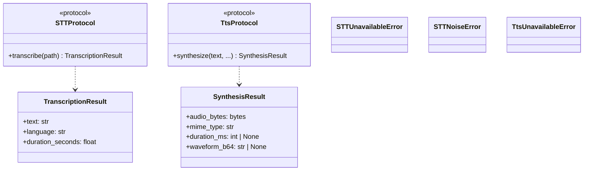
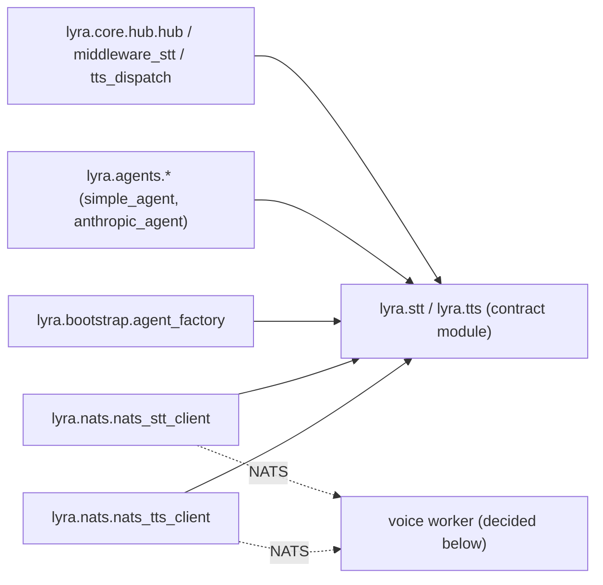

## Context

Promoted from [658-voicecli-nats-decouple-frame.mdx](../frames/658-voicecli-nats-decouple-frame.mdx).

Today Lyra has two voice paths:

```
Hub ──NATS──► lyra_stt satellite (src/lyra/bootstrap/stt_adapter_standalone.py)
                 └─► STTService (src/lyra/stt/__init__.py)
                        └─► import voicecli.* ───► voicecli stt-serve (Unix socket)
                                                   OR in-process whisper (fallback)
```

`voicecli_stt` / `voicecli_tts` supervisor programs run voicecli's native **Unix-socket** daemons (`voicecli stt-serve` / `voicecli tts-serve`). They do **not** speak NATS. The lyra-side `lyra_stt` / `lyra_tts` satellites bridge NATS ⇄ voicecli (via Python import or Unix socket).

Acceptance #1 forbids any `from voicecli` under `src/lyra/` — so the bridge has to move or its implementation has to change. **That is the core decision of this spec** (see `## Design decision`).

## Goal

One voice path in Lyra: NATS only. No `from voicecli` anywhere under `src/lyra/`. `voicecli` dropped from `pyproject.toml`. Pyright green on a fresh worktree without `--all-extras`. NATS voice contract frozen and documented.

## Users

- **Primary:** Lyra developers — pyright passes in fresh worktrees; `uv sync` is fast (no GPU deps pulled in by default).
- **Secondary:** CI / pre-commit hooks; voicecli maintainers (contract-only coupling).

## Expected Behavior

1. Dev clones lyra → `uv sync` → `uv run pyright` → green. No voicecli installed.
2. Hub & adapters boot → publish on the **frozen contract subjects**: `lyra.voice.stt.request`, `lyra.voice.tts.request` (request/reply), and observe heartbeats on `lyra.voice.stt.heartbeat`, `lyra.voice.tts.heartbeat`. All payloads carry `contract_version: "1"` (new additive field — consumers ignore unknown values).
3. On Machine 1 (production), voicecli processes consume `lyra.voice.{stt,tts}.request` directly and emit matching heartbeats → reply with transcription / synthesized audio bytes.
4. Fresh `rg "from voicecli" src/lyra` returns zero matches.
5. `voice` extra removed from `pyproject.toml`; `voicecli` removed from `[tool.uv.sources]`. `scripts/deploy.sh` no longer re-syncs voicecli into the lyra venv.
6. A new ADR (`docs/architecture/adr/044-lyra-voicecli-nats-contract.mdx`) freezes the voice contract (topics, request/response/heartbeat schemas, `contract_version`) with rationale. `docs/ARCHITECTURE.md` voice section links to the ADR instead of duplicating schema.

## Data Model & Consumers

### Voice contract types (frozen, zero voicecli coupling)



### Consumer map



### Consumer summary

| Consumer | Fields/types consumed | When | Status |
|---|---|---|---|
| `lyra.core.hub.hub` | `TtsUnavailableError` (via `tts_dispatch`) | outbound audio path | this issue (unchanged) |
| `lyra.core.hub.middleware_stt` | `STTNoiseError`, `STTUnavailableError` | inbound voice message handling | this issue (unchanged) |
| `lyra.agents.{simple,anthropic}_agent` | `STTProtocol`, `TtsProtocol`, `is_whisper_noise` | agent loop, TTS gating | this issue (unchanged) |
| `lyra.bootstrap.agent_factory` | `STTProtocol`, `TtsProtocol` (types for wiring) | process bootstrap | this issue (unchanged) |
| `lyra.nats.nats_stt_client` | `TranscriptionResult`, `STTNoiseError`, `STTUnavailableError`, `is_whisper_noise` | hub STT call over NATS | this issue (unchanged) |
| `lyra.nats.nats_tts_client` | `SynthesisResult`, `TtsUnavailableError` | hub TTS call over NATS | this issue (unchanged) |
| Voice worker process (NATS subscriber) | request payload → result payload | handles `lyra.voice.{stt,tts}.request` | this issue (implementation moves per design decision) |

## Design decision — locked

**Responder:** voicecli grows a NATS mode (new `voicecli nats-serve {stt,tts}` entry point in the voicecli repo). It subscribes to `lyra.voice.{stt,tts}.request` directly.

**Cutover:** on Machine 1, the existing `voicecli_stt` / `voicecli_tts` supervisor programs switch command from `voicecli {stt,tts}-serve` (Unix socket) to `voicecli nats-serve {stt,tts}`. The lyra-side `lyra_stt` / `lyra_tts` supervisor programs + their bootstrap modules are deleted.

**Hub flow unchanged.** The hub keeps calling `nats_stt_client.transcribe(...)` / `nats_tts_client.synthesize(...)` (NATS request-reply on the same subjects, same payload schema). No orchestration-model change (the choreographed-saga alternative is tracked separately, out of #658).

**Dependency:** a sibling voicecli-repo issue must land before Slice S3 (cutover). Tracked as a pre-req on Slice S2.

Rationale: matches the issue goal literally ("voicecli becomes a satellite daemon"); removes the NATS ⇄ voicecli bridge entirely; voicecli change is small and additive (one new entry point, ~<200 LOC).

## Breadboard

### Modules

| ID | Kind | Role | Status |
|---|---|---|---|
| M1 | pkg | `src/lyra/stt/` contract module (types only, zero voicecli imports) | shrink in place |
| M2 | pkg | `src/lyra/tts/` contract module (types only, zero voicecli imports) | shrink in place |
| M3 | file | `src/lyra/bootstrap/stt_adapter_standalone.py` | delete |
| M4 | file | `src/lyra/bootstrap/tts_adapter_standalone.py` | delete |
| M5 | file | `deploy/supervisor/conf.d/lyra_stt.conf` | delete |
| M6 | file | `deploy/supervisor/conf.d/lyra_tts.conf` | delete |
| M7 | conf | `deploy/supervisor/conf.d/voicecli_stt.conf` + `voicecli_tts.conf` | update `command=`, migrate env (`NATS_URL`, `NATS_NKEY_SEED_PATH`, `LYRA_TTS_ENGINE`); re-evaluate `startsecs` for GPU load time |
| M8 | conf | `pyproject.toml` | drop `voicecli` from `[project.optional-dependencies] voice` and `[tool.uv.sources]`; drop the `voice` extra if empty |
| M9 | script | `deploy/supervisor/scripts/run_adapter.sh` | remove `stt`/`tts` cases (keep `telegram`/`discord`) |
| M10 | file | CLI: `lyra adapter stt` / `lyra adapter tts` entry points | delete (CLI subcommands) |
| M11 | adr | `docs/architecture/adr/044-lyra-voicecli-nats-contract.mdx` (new) | create — topics, request/response/heartbeat schemas, `contract_version`, examples, rationale |
| M12 | doc | `docs/ARCHITECTURE.md` — voice section | remove `lyra_stt`/`lyra_tts` satellites; link to ADR-044 |
| M13 | tests | `tests/**/*stt*`, `tests/**/*tts*` | remove tests that exercise `STTService`/`TTSService` in-process; keep NATS-client tests |
| M14 | external | voicecli repo — new `nats-serve {stt,tts}` entry point | tracked as sibling issue (dependency of S3) |
| M15 | conf | NATS nkey credentials for voicecli nats-serve | either reuse existing `~/.lyra/nkeys/{stt,tts}-adapter.seed` (reassign owner) or provision `~/.lyra/nkeys/voicecli-{stt,tts}.seed`; decide in S3 |
| M16 | script | `scripts/deploy.sh` | S5: delete the `uv sync --all-extras --upgrade-package voicecli` block (lines 78–81) that re-syncs voicecli into lyra's venv |
| M17 | script | `Makefile` | S3: add `voice-smoke` target — round-trip test (Telegram bot voice message → reply audio) |
| M18 | doc | `CLAUDE.md` (project root), `src/lyra/bootstrap/CLAUDE.md`, `~/projects/CLAUDE.md` | remove any mention of `lyra_stt`/`lyra_tts`; update voice topology description |
| M19 | ci | CI config (GitHub Actions `uv sync` step) | check if any job uses `--all-extras`; if so, remove the flag or update after S5 (voice extra is gone) |

### Wiring (after)

```
[Hub, agents] ── import ──► lyra.stt / lyra.tts (contract types)
[Hub]        ── NATS  ─────► lyra.voice.{stt,tts}.request
                               └─► voicecli nats-serve {stt,tts}  (on Machine 1)
```

## Slices

Execute in order. Each independently reviewable and green-on-CI.

| # | Slice | Demoable via | Files touched (approx) |
|---|---|---|---|
| S1 | **Freeze the NATS voice contract as an ADR** — write `docs/architecture/adr/044-lyra-voicecli-nats-contract.mdx`. Must include: (a) request subjects `lyra.voice.{stt,tts}.request` with full JSON schema; (b) reply schema (success + error); (c) heartbeat subjects `lyra.voice.{stt,tts}.heartbeat` with payload `{"worker_id": "<str>", ...optional: model_loaded, vram_used_mb, vram_total_mb, active_requests}` + interval ≤ 5 s (hub TTL is 15 s in `_HB_TTL`); (d) `contract_version: "1"` additive field. Lyra side: add `contract_version` to outgoing payloads + ignore it on incoming (forward-compat). No behavioral change. | Read ADR; unit tests updated; existing integration tests still pass. | ADR 044 (new), `nats_stt_client.py`, `nats_tts_client.py`, `bootstrap/{stt,tts}_adapter_standalone.py`, tests. |
| S2 | **Stand up `voicecli nats-serve`** — sibling PR in the voicecli repo. Subscribes to `lyra.voice.{stt,tts}.request` and emits heartbeats per ADR-044. Verified against lyra hub via docker-compose NATS E2E test. | Local compose E2E: `voicecli nats-serve tts` + lyra hub → synthesis round-trip. | voicecli repo only. Lyra unchanged. |
| S3 | **Cut over on Machine 1 (ordered runbook + rollback)** — (1) provision NATS nkey seed for voicecli (M15); (2) update `voicecli_{stt,tts}.conf` `command=` to `voicecli nats-serve {stt,tts}` + migrate env vars (`NATS_URL`, `NATS_NKEY_SEED_PATH`, `LYRA_TTS_ENGINE`); re-tune `startsecs` if GPU load >10 s; (3) `supervisorctl reread && update` to reload confs; (4) wait for `lyra.voice.{stt,tts}.heartbeat` visible from hub (`make lyra logs` grep `worker_id`); (5) `supervisorctl stop lyra_stt lyra_tts`; (6) run `make voice-smoke`. **Rollback:** `supervisorctl stop voicecli_{stt,tts} && supervisorctl start lyra_{stt,tts}` + revert `voicecli_{stt,tts}.conf` command field. Add `make voice-smoke` target (M17). | `make voice-smoke` green; journalctl shows no errors on `voicecli_*` programs. | `deploy/supervisor/conf.d/voicecli_{stt,tts}.conf`, `Makefile`, `~/.lyra/nkeys/*` on Machine 1. |
| S4 | **Delete lyra-side satellites + update docs touching them** — remove `bootstrap/{stt,tts}_adapter_standalone.py`, the `lyra adapter stt/tts` CLI subcommands, `run_adapter.sh` stt/tts cases, `deploy/supervisor/conf.d/lyra_{stt,tts}.conf`. Strip `STTService`/`TTSService` + all `from voicecli` lines from `lyra.stt` / `lyra.tts`. Simultaneously update `docs/ARCHITECTURE.md` voice section + `src/lyra/bootstrap/CLAUDE.md` + `CLAUDE.md` + `~/projects/CLAUDE.md` (co-located with file deletions — avoids stale docs between S4 and final slice). | `rg "from voicecli" src/lyra` → empty. `uv run pyright` green. `rg "lyra_(stt\|tts)" docs/ CLAUDE.md ~/projects/CLAUDE.md` → empty. | `src/lyra/{stt,tts}/__init__.py`, `src/lyra/bootstrap/*adapter_standalone.py`, `src/lyra/cli.py` (voice subcommands), `deploy/**`, tests, 4× CLAUDE.md, `docs/ARCHITECTURE.md`. |
| S5 | **Drop voicecli dep + deploy-script cleanup + CI** — remove `voicecli` from `[project.optional-dependencies] voice` (delete the `voice` extra entirely if empty), `[tool.uv.sources]`. Update `uv.lock`. Delete `scripts/deploy.sh` lines 78–81 (`uv sync --all-extras --upgrade-package voicecli` block — voicecli is no longer a lyra dep). Audit CI workflows for `uv sync --all-extras` (M19) — remove the flag or confirm harmless. Update `src/lyra/commands/svc/handlers.py` if it references the extra (it references program names — likely no change). | `uv sync` clean; no voicecli in `.venv/`. Pyright clean on fresh worktree. CI green. | `pyproject.toml`, `uv.lock`, `scripts/deploy.sh`, `.github/workflows/*.yml` (if any). |
| S6 | **Post-cutover housekeeping** — delete stale log files under `~/.local/state/lyra/logs/lyra_{stt,tts}*.log` on Machine 1 (orphaned after S3). Confirm `start.sh --all` includes `voicecli_{stt,tts}` for boot-start if that was previously provided by `lyra_{stt,tts}`. | `ls ~/.local/state/lyra/logs/` shows no lyra_{stt,tts} logs; reboot test: voice works after `systemctl restart lyra.service`. | Machine 1 only (no repo edits). |

## Success Criteria

- [ ] `rg "from voicecli" src/lyra` returns zero matches
- [ ] `voicecli` not present in `pyproject.toml` (`[project.optional-dependencies]`, `[tool.uv.sources]`)
- [ ] `uv run pyright` green on a fresh worktree without `--all-extras` (confirmed via CI + a clean `git worktree add`)
- [ ] `lyra_stt` and `lyra_tts` supervisor programs no longer exist; only `voicecli_stt` and `voicecli_tts` serve voice requests on Machine 1
- [ ] Telegram voice-note round-trip passes E2E on Machine 1 (voice note → transcript reply → synthesized reply audio) using NATS only; no in-process voicecli fallback
- [ ] `make voice-smoke` exists and runs the round-trip E2E
- [ ] `docs/architecture/adr/044-lyra-voicecli-nats-contract.mdx` exists and specifies: topic list, request schema, response schema, heartbeat schema (required/optional fields), heartbeat interval, `contract_version`, example payloads, rationale
- [ ] `docs/ARCHITECTURE.md` voice section updated: no references to `lyra_stt`/`lyra_tts`, links to ADR-044
- [ ] `src/lyra/bootstrap/CLAUDE.md`, root `CLAUDE.md`, and `~/projects/CLAUDE.md` no longer mention `lyra_stt`/`lyra_tts` or `{stt,tts}_adapter_standalone.py`
- [ ] `scripts/deploy.sh` voicecli-resync block (current lines 78–81) deleted
- [ ] Sibling voicecli issue for `nats-serve` opened, linked as a dependency, and merged before Slice S3 runs
- [ ] NATS nkey credentials for voicecli side provisioned on Machine 1 (seed file exists + readable by voicecli user)

## Edge cases

| Case | Handling |
|---|---|
| NATS offline on Machine 1 | Hub circuit breaker opens — `STTUnavailableError`/`TtsUnavailableError` raised as today. Unchanged. |
| voicecli nats-serve crashes | Supervisor `autorestart=true` respawns. No heartbeat → hub reports "no live worker". Unchanged behavior, different process. |
| In-flight requests during cutover (S3) | Two subscribers on same subject form a competing-consumer pair (NATS queue group) — only one handles each request. Safe. Duplicate replies impossible on the same request_id. |
| Cutover fails — voicecli nats-serve unhealthy | Execute rollback (S3 runbook): `supervisorctl stop voicecli_{stt,tts} && supervisorctl start lyra_{stt,tts}` + revert `voicecli_{stt,tts}.conf` command field. Heartbeats resume from lyra satellites; hub recovers within 15 s TTL. |
| Hub running against a Machine 1 that still has `lyra_{stt,tts}` supervisor programs after upgrade | Cutover order: voicecli first (S2/S3), then lyra drops satellites (S4). No cross-version NATS contract change. |
| Developer with `voicecli` still installed in `.venv` from before | `uv sync` after S5 will remove it. Document in PR body. |
| GPU model load slower than `startsecs=15` | S3 re-tunes `startsecs` on `voicecli_{stt,tts}.conf` if first-heartbeat time exceeds 10 s (observed via `supervisorctl status`). |
| Heartbeat extras (VRAM, `active_requests`) emitted by lyra satellites today vs. voicecli `nats-serve` | ADR-044 declares `model_loaded`, `vram_used_mb`, `vram_total_mb`, `active_requests` **optional** fields on heartbeat. Hub reads only `worker_id` today (`_on_heartbeat` in `nats_{stt,tts}_client.py`) — either side may omit the extras. voicecli SHOULD emit them when `pynvml` is available. |

## Dependencies

- **Voicecli repo:** sibling issue for `voicecli nats-serve` entry point (Slice S2). Blocks S3+.
- No other external dependencies.
