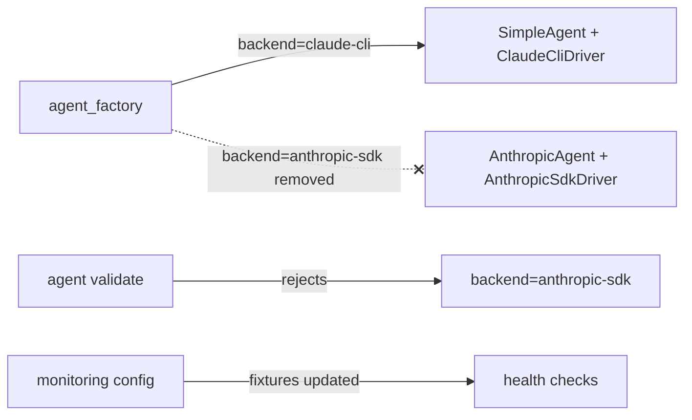

## Context

Lyra is CLI-only in production (`ClaudeCliDriver` + `SimpleAgent`).
`AnthropicSdkDriver` and `AnthropicAgent` predate the CLI path, run
through the `anthropic` Python SDK, and carry their own message-history
machinery (`AgentPool.sdk_history`, `max_sdk_history`,
`extend_sdk_history`). User direction: drop the SDK path completely —
no shims, no compat aliases.

Source: [frame #666](../frames/666-drop-anthropicsdkdriver-frame.mdx).

## Goal

Eliminate the `anthropic-sdk` backend: driver, agent, dependency,
factory branches, validator allow-list entry, and any sdk-only state on
`AgentPool`. Production behavior for CLI agents is unchanged.

## Users

- **Primary:** Lyra maintainer (Mickael) — owns the LLM layer.
- **Secondary:** any installed agent TOML seed or SQLite agent row
  declaring `backend = "anthropic-sdk"` must have been migrated to
  `claude-cli` before removal. The implementation will grep for seeds
  and fail loudly if any remain.

## Expected Behavior

After this change:

1. `pyproject.toml` no longer lists `anthropic`; `uv sync` removes it
   from `uv.lock`.
2. `src/lyra/llm/drivers/sdk.py` and `src/lyra/agents/anthropic_agent.py`
   no longer exist.
3. `lyra agent validate` rejects any agent with
   `backend = "anthropic-sdk"` with a clear "backend removed — migrate
   to claude-cli" error, rather than building a driver.
4. `AgentPool` no longer exposes `sdk_history`, `extend_sdk_history`,
   or `max_sdk_history`. Hub/config no longer thread `max_sdk_history`.
5. `agent_factory.build_shared_providers` / `build_agent` no longer
   reference `anthropic-sdk`, the `anthropic` circuit breaker, or
   `AnthropicSdkDriver`.
6. Smart-routing: the `backend == "anthropic-sdk"` gate is removed.
   The `SmartRoutingProtocol` infrastructure and
   `SmartRoutingConfig` stay in place (they are backend-agnostic by
   shape), but the factory no longer wires them — they become dead
   bindings surfaced only to callers that re-attach smart routing to a
   future backend. Validators continue to reject `smart_routing.enabled
   = true` for unsupported backends; the supported set for this cycle
   is **empty** (all new configs must set `enabled = false`). A
   follow-up issue captures the option of deleting smart routing.
7. ADR-016, ADR-017, ADR-018, ADR-025, ADR-028, ADR-032 get a
   superseded-by banner pointing to #666; historical content untouched.
8. `docs/ARCHITECTURE.md`, `docs/HAPPY-PATHS.md`,
   `docs/architecture/current-state.md`,
   `docs/architecture/target-architecture.md`,
   `docs/architecture/gap-analysis.md`,
   `docs/ROADMAP.md`, `src/lyra/llm/CLAUDE.md`,
   `src/lyra/agents/CLAUDE.md` updated to reflect CLI-only reality.
9. Test suite green: `uv run pytest` passes with the SDK tests deleted
   and monitoring/circuit/config tests updated to drop `anthropic-sdk`
   fixtures.

## Data Model & Consumers

```mermaid
classDiagram
    class AgentPool {
      +deque history
      -deque sdk_history  «removed»
      -int max_sdk_history  «removed»
      +extend_sdk_history()  «removed»
    }
    class HubConfig {
      +int max_sdk_history  «removed»
    }
    class AgentConfig {
      +LlmConfig llm_config
      +SmartRoutingConfig? smart_routing
    }
    class LlmConfig {
      +str backend
      note "allowed ∈ {claude-cli, ollama, litellm}\n(anthropic-sdk removed)"
    }
    class AgentFactory {
      +build_shared_providers()
      +build_agent()
      note "no anthropic-sdk branch"
    }
    AgentFactory ..> LlmConfig : reads backend
    AgentFactory ..> AgentPool : constructs
```



| Consumer | Fields / symbols | When | Status |
|----------|------------------|------|--------|
| `agent_factory.build_agent` | removes `anthropic-sdk` branch | build time | this issue |
| `agent_factory.build_shared_providers` | removes sdk driver + `"anthropic"` circuit breaker wiring | startup | this issue |
| `AgentPool` | drops `sdk_history` / `extend_sdk_history` / `max_sdk_history` | runtime | this issue |
| `HubConfig`, `BaseConfig` | drops `max_sdk_history` | config load | this issue |
| `LlmConfig.backend` validator | remove `"anthropic-sdk"` from allowed set | validate | this issue |
| `SmartRoutingConfig` | factory no longer wires it; validator keeps rejecting `enabled=true` on unsupported backends | validate | this issue |
| ADR-016/017/018/025/028/032 | superseded-by banner | docs | this issue |
| Monitoring/health fixtures | drop `anthropic-sdk` test cases | tests | this issue |
| Future smart-routing follow-up | decide: keep infra or delete entirely | later | out of scope |

## Breadboard

| ID | Affordance | Handler → Data |
|----|------------|-----------------|
| D1 | `rm src/lyra/llm/drivers/sdk.py` | — |
| D2 | `rm src/lyra/agents/anthropic_agent.py` | — |
| D3 | `rm tests/llm/test_sdk_driver.py` | — |
| F1 | `agent_factory.build_shared_providers`: drop sdk driver + `"anthropic"` circuit breaker branch; retain `claude-cli` path | reads `api_key`, `circuit_registry` |
| F2 | `agent_factory.build_agent`: drop `backend == "anthropic-sdk"` branch + AnthropicAgent import + fallback `AnthropicSdkDriver` instantiation | reads `agent_config.llm_config` |
| F3 | `agent_factory` smart-routing gate: drop `backend == "anthropic-sdk"` condition; log warning remains for unsupported config | reads `smart_routing_config` |
| V1 | `core/agent/agent_config.py`: remove `"anthropic-sdk"` from allowed backends set; adjust error message | validator |
| P1 | `core/pool/pool.py`: remove `sdk_history` deque, `max_sdk_history`, `extend_sdk_history`, and their resets | pool state |
| P2 | `core/pool/pool.py`: remove `source_turns=len(self.sdk_history)` metric (replace with `0` or drop field) | metrics |
| C1 | `core/config.py` + `bootstrap/factory/config.py`: remove `max_sdk_history` field | config schema |
| C2 | `core/hub/hub.py`: remove `MAX_SDK_HISTORY` constant + kwarg threading | hub ctor |
| X1 | Remove `anthropic` from `pyproject.toml` + `uv.lock` regenerated | deps |
| T1 | Update `tests/conftest.py`, `tests/test_monitoring_config.py`, `tests/test_monitoring_escalation.py`, `tests/test_circuit_config.py`, `tests/test_health_endpoint_config.py`, `tests/test_cli_wizard_create.py`, `tests/test_cli_wizard_validate.py`, `tests/test_agent_cli_workflows.py`, `tests/core/test_agent_refiner_profile.py`, `tests/test_monitoring_checks_http_idle_reaper.py` — drop `anthropic-sdk` fixtures or switch to `claude-cli` | tests |
| M1 | `monitoring/config.py`, `monitoring/escalation.py`, `core/hub/hub_circuit_breaker.py`: drop `anthropic` circuit name / health entry | monitoring |
| M2 | Drop `anthropic-sdk`-specific branches in `core/messaging/events.py`, `tool_recap_format.py`, `render_events.py`, `core/processors/stream_processor.py`, `core/commands/command_router.py`, `core/agent/agent_seeder.py`, `core/agent/agent_refiner.py`, `bootstrap/infra/health.py`, `cli_agent_create.py`, `agent_cmd/agents/init.py` | runtime |
| DOC1 | Superseded banner on ADRs 016/017/018/025/028/032 | docs |
| DOC2 | Update `ARCHITECTURE.md`, `ROADMAP.md`, `HAPPY-PATHS.md`, `docs/architecture/{current-state,target-architecture,gap-analysis}.md`, `src/lyra/llm/CLAUDE.md`, `src/lyra/agents/CLAUDE.md` | docs |
| PRE | Pre-flight: grep workspace + `~/.lyra/auth.db` agent rows for `backend = "anthropic-sdk"`. Any hit → abort, emit migration message | guard |

## Slices

| # | Slice | IDs | Demo |
|---|-------|-----|------|
| 1 | **Guard + validator** — pre-flight scan, remove `"anthropic-sdk"` from allowed backends, update error message | PRE, V1 | `lyra agent validate` on a fake sdk-backend agent rejects it |
| 2 | **Factory + driver/agent deletion** — delete sdk.py, anthropic_agent.py, prune factory branches, drop `anthropic` circuit breaker wiring, drop smart-routing sdk gate | D1, D2, F1, F2, F3, M1 | `uv run pytest tests/bootstrap tests/llm` green; `uv run lyra --help` starts |
| 3 | **Pool + hub + config cleanup** — remove `sdk_history`, `max_sdk_history`, `MAX_SDK_HISTORY`, related metric | P1, P2, C1, C2 | pool unit tests green; hub bootstraps without kwarg |
| 4 | **Runtime branches + test fixtures** — prune `anthropic-sdk` branches across messaging/commands/monitoring/CLI wizard and update/delete tests; delete `tests/llm/test_sdk_driver.py` | D3, M2, T1 | `uv run pytest` full suite green |
| 5 | **Dependency + docs** — drop `anthropic` from pyproject + lockfile; ADR superseded banners; update ARCHITECTURE/ROADMAP/CLAUDE.md | X1, DOC1, DOC2 | `uv sync` drops `anthropic`; `grep -rin AnthropicSdkDriver docs/ src/` returns 0 live refs (banners in historical ADRs allowed) |

Slices 1→5 sequential (each depends on the prior being green).

## Success Criteria

- [ ] `src/lyra/llm/drivers/sdk.py` does not exist.
- [ ] `src/lyra/agents/anthropic_agent.py` does not exist.
- [ ] `tests/llm/test_sdk_driver.py` does not exist.
- [ ] `grep -rn "AnthropicSdkDriver\|AnthropicAgent" src/ tests/` returns zero matches.
- [ ] `grep -rn "anthropic-sdk" src/ tests/` returns zero matches (docs may still reference it in historical ADRs with superseded banner).
- [ ] `"anthropic-sdk"` is not in `LlmConfig` allowed backends.
- [ ] `AgentPool` exposes no `sdk_history`, `extend_sdk_history`, or `max_sdk_history`.
- [ ] `HubConfig` / base config expose no `max_sdk_history`.
- [ ] `pyproject.toml` `[project].dependencies` does not contain `anthropic`; `uv.lock` regenerated.
- [ ] `uv sync` + `uv run lyra --help` succeed.
- [ ] `uv run ruff check .` and `uv run pyright` pass.
- [ ] `uv run pytest` passes.
- [ ] ADRs 016, 017, 018, 025, 028, 032 each carry a `> Superseded by #666` banner above the body.
- [ ] `docs/ARCHITECTURE.md`, `docs/ROADMAP.md`, `docs/HAPPY-PATHS.md`, `docs/architecture/{current-state,target-architecture,gap-analysis}.md`, `src/lyra/llm/CLAUDE.md`, `src/lyra/agents/CLAUDE.md` no longer present `anthropic-sdk` as a supported backend.
- [ ] Pre-flight guard: implementer ran the workspace grep + agent DB scan for live `backend = "anthropic-sdk"` seeds and found none (or migrated them) before merging.
