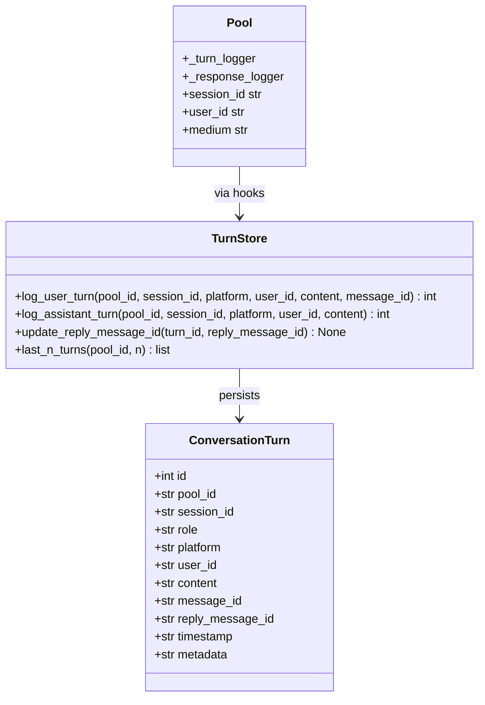
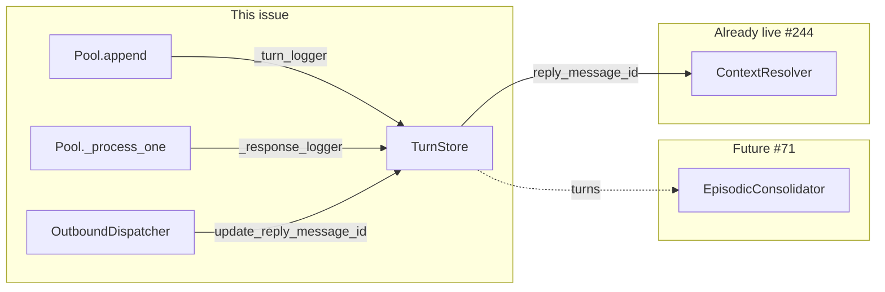

## Context

Promoted from frame: `artifacts/frames/67-raw-turn-logging-frame.mdx`.

Lyra's memory layer (#83) added session identity (`session_id`, `user_id`, `medium`) and the
`_turn_logger` hook on `Pool`. This issue activates that hook and adds a parallel
`_response_logger` hook (introduced here): every conversation turn is persisted verbatim to
SQLite in a new `conversation_turns` table (vault.db v3 migration), providing an audit trail,
a cross-reference for Telegram/Discord message IDs, and a stable source for the future L2
episodic consolidation pipeline (#71).

`ContextResolver` (`src/lyra/core/context_resolver.py`) already queries
`conversation_turns.reply_message_id` — it was written anticipating this issue (#244).

## Goal

Every conversation turn (user and assistant) is persisted to SQLite with platform message IDs,
before any summarisation or compaction occurs, with zero user-visible change.

## Users

- **Primary:** Lyra system internals — `Pool` logs turns automatically on every `append()` and
  after every agent response.
- **Secondary:** Developer/admin — `TurnStore.last_n_turns(pool_id, n)` enables debugging
  session continuity and inspecting exact exchanges.
- **Future consumer:** L2 episodic consolidation (#71) reads from `conversation_turns`.

## Expected Behavior

**Normal flow — user sends a message, non-streaming response:**

1. User message arrives; `Pool.append(msg)` fires `_turn_logger(session_id, msg)`.
2. `TurnStore.log_user_turn(...)` INSERTs a row with `role='user'`, `platform=msg.platform`,
   `message_id=msg.id`, `reply_message_id=NULL`. Returns `user_turn_id` (unused for now).
3. Agent processes; `await result` resolves to a `Response`.
4. `Pool._process_one()` converts: `outbound = result.to_outbound()`.
5. `_response_logger(outbound, pool)` is called (new hook — introduced by this issue).
   Type: `Callable[[OutboundMessage, Pool], Awaitable[None]] | None`.
6. `TurnStore.log_assistant_turn(...)` INSERTs a row with `role='assistant'`,
   `reply_message_id=NULL`, stores the returned `turn_id` in `outbound.metadata["turn_id"]`.
7. `hub.dispatch_response(msg, outbound)` passes `outbound` (already converted) to the Hub.
8. Hub enqueues to `OutboundDispatcher` (fire-and-forget).
9. Dispatcher worker calls `adapter.send(msg, outbound)`.
10. Adapter writes platform message ID to `outbound.metadata["reply_message_id"]`.
11. Dispatcher reads `outbound.metadata.pop("turn_id", None)` and calls
    `TurnStore.update_reply_message_id(turn_id, reply_message_id)`.
    `.pop()` is intentional — prevents double-updates on any retry path.
12. `ContextResolver.resolve(reply_to_message_id)` can now resolve a Telegram/Discord
    `reply_to_message_id` to `(session_id, pool_id)` — enabling #244.

**Streaming response path (`ClaudeCliAgent`):**

- `agent.process()` returns an `AsyncIterator[str]`.
- `Pool._process_one()` creates a stub `outbound = OutboundMessage.from_text("")` before calling
  `dispatch_streaming`, and fires `_response_logger(outbound, pool)` to insert an assistant row
  with `content=''`.
- `dispatch_streaming(msg, chunks, outbound=outbound)` passes the stub so the dispatcher can
  write `reply_message_id` and `turn_id` after streaming completes.
- `content=''` for streaming turns is acceptable until a follow-up issue captures streamed text.
  **Note:** This is a known data-quality gap — permanently blank content for CLI turns. A
  follow-up should accumulate streamed content and update the row post-stream.

**Cancel-in-flight (debounce cancel):**

- If `_process_one` is cancelled during `await result` (LLM computing), `_response_logger` has
  not fired — no orphaned row, user turn already persisted.
- If cancelled between `_response_logger` and `dispatch_response()`: the assistant row exists
  with `reply_message_id=NULL`. This is acceptable — the content is recorded even if delivery
  was abandoned. The OutboundDispatcher never sees `turn_id`, so no update fires.

**Circuit-open / delivery failure:**

- `OutboundDispatcher` sets `outbound.metadata["reply_message_id"] = None` on circuit-open.
- Dispatcher pops `turn_id` and calls `update_reply_message_id(turn_id, None)` — row stays
  with `reply_message_id=NULL`, confirming delivery was attempted but dropped.

**Developer admin query:**

- `TurnStore.last_n_turns(pool_id, n)` returns the last N rows ordered by `timestamp DESC`.
- Callable from Python (not a CLI command — out of scope).

## Data Model & Consumers



%%
%% role: 'user' | 'assistant'
%% platform: 'telegram' | 'discord' | 'cli'
%% message_id: incoming platform ID (nullable)
%% reply_message_id: outgoing platform ID (nullable)
%% timestamp: ISO 8601 UTC
%% metadata: JSON blob for extensibility
%%



| Consumer | Fields consumed | When | Status |
|----------|----------------|------|--------|
| `ContextResolver` (#244) | `reply_message_id`, `session_id`, `pool_id` | On reply-to message | Already live — queries anticipating this issue |
| L2 Episodic (#71) | All fields | Periodic consolidation | Future |
| Dev/admin query | All fields | On demand | This issue |

## Breadboard

### Hooks introduced by this issue

**`Pool._response_logger`** (new — mirrors `_turn_logger`):
```python
_response_logger: Callable[[OutboundMessage, Pool], Awaitable[None]] | None = None
```
Call site in `_process_one`: after `outbound = result.to_outbound()`, before `dispatch_response(msg, outbound)`.

### Affordances

| ID | Affordance | Handler | Data in | Data out |
|----|-----------|---------|---------|----------|
| N1 | Inbound turn persisted | `TurnStore.log_user_turn()` | `pool_id`, `session_id`, `platform`, `user_id`, `content`, `message_id` | `turn_id: int` |
| N2 | Assistant turn persisted | `TurnStore.log_assistant_turn()` | `pool_id`, `session_id`, `platform`, `user_id`, `content` | `turn_id: int` stored in `outbound.metadata["turn_id"]` |
| N3 | `reply_message_id` updated | `TurnStore.update_reply_message_id()` | `turn_id`, `reply_message_id` | — |
| N4 | Admin query | `TurnStore.last_n_turns()` | `pool_id`, `n` | `list[Row]` |
| N5 | Schema v3 migration | `roxabi_vault.schema.migrate()` | existing `vault.db` | `conversation_turns` table |
| N6 | Streaming assistant stub | `TurnStore.log_assistant_turn()` | same as N2, `content=''` | `turn_id` in `outbound` stub |

### Wiring

```
# Hub.__init__()
turn_store = TurnStore(db_path=vault_path)  # same path as MemoryManager

# Pool creation (Hub._get_or_create_pool / wherever pools are instantiated)
pool._turn_logger = lambda session_id, msg: turn_store.log_user_turn(
    pool_id=pool.pool_id, session_id=session_id,
    platform=str(msg.platform), user_id=msg.user_id,
    content=str(msg.content), message_id=str(msg.id),
)
pool._response_logger = lambda outbound, pool: turn_store.log_assistant_turn(
    pool_id=pool.pool_id, session_id=pool.session_id,
    platform=pool.medium, user_id=pool.user_id,
    content=outbound.to_text(),
)
# log_assistant_turn stores turn_id in outbound.metadata["turn_id"]

# OutboundDispatcher construction (Hub.register_outbound_dispatcher caller)
dispatcher = OutboundDispatcher(..., turn_store=turn_store)

# OutboundDispatcher._worker_loop() — after adapter.send(msg, outbound):
turn_id = outbound.metadata.pop("turn_id", None)  # pop = prevent double-update
reply_id = outbound.metadata.get("reply_message_id")
if turn_id is not None:
    await turn_store.update_reply_message_id(turn_id, reply_id)
```

**Note on `platform` vs `medium`:** `Pool.medium` holds the resolved platform string (e.g.,
`'telegram'`). `ConversationTurn.platform` is the column name. In wiring, pass `pool.medium`
as the `platform` argument to `TurnStore` methods.

## Slices

| # | Name | Scope | Independently demo-able |
|---|------|-------|------------------------|
| S1 | Schema + TurnStore | Add `conversation_turns` table (roxabi-vault v3 migration) + `TurnStore` class in Lyra | Yes — unit-test inserts/queries against a temp DB |
| S2 | Turn logging | Add `_response_logger` to `Pool.__init__`; wire `_turn_logger` + `_response_logger` in Hub; log user + assistant turns | Yes — assert rows appear in vault.db after a test exchange. **Note:** assistant rows have `reply_message_id=NULL` at this slice — S3 fills it. |
| S3 | reply_message_id + admin query | OutboundDispatcher constructor takes `turn_store`; post-send callback; streaming stub path; `TurnStore.last_n_turns()` | Yes — assert `reply_message_id` populated after mock adapter.send |

## Success Criteria

- [ ] `conversation_turns` table is created on first connect to `vault.db` when vault is at v2 (v3 migration runs idempotently).
- [ ] Every inbound user message results in a row in `conversation_turns` with `role='user'`, correct `pool_id`, `session_id`, `platform`, `user_id`, and `content`.
- [ ] Every non-streaming assistant Response results in a row with `role='assistant'` and correct `content` (full text, not empty).
- [ ] After `OutboundDispatcher` delivers a message via Telegram/Discord adapter, the assistant turn row has `reply_message_id` set to the platform-returned message ID.
- [ ] When OutboundDispatcher drops a message (circuit-open), the assistant turn row exists with `reply_message_id = NULL`.
- [ ] Streaming assistant turns (`ClaudeCliAgent`) produce a row with `role='assistant'` and `content=''`; `reply_message_id` is populated by OutboundDispatcher after stream completes.
- [ ] `TurnStore.last_n_turns(pool_id, n)` returns the last N rows for that pool, ordered by `timestamp DESC`.
- [ ] Lyra restart: `Pool.history` is empty (in-memory), but `conversation_turns` rows survive.
- [ ] No new platform messages or adapter calls introduced by this feature (zero user-visible change).
