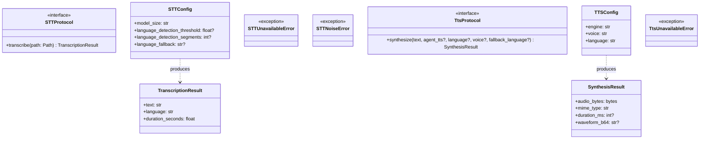
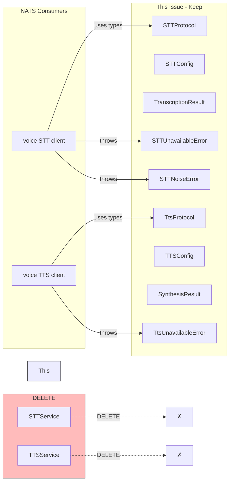

## Context

Slice S4 of #658 (voicecli NATS decouple). Frame: [690-delete-voice-satellites-frame.mdx](../frames/690-delete-voice-satellites-frame.mdx).

**Prerequisite:** voicecli nats-serve must be healthy on Machine 1 (S3 cutover complete) — deleting satellites before then breaks prod.

## Goal

Remove dead voice satellite code from Lyra after NATS migration completes, leaving only protocol/config types for NATS consumers.

## Users

- **Lyra maintainers** — cleaner codebase, no stale voicecli coupling
- **DevOps** — simplified deployment topology (no more `lyra_stt`/`lyra_tts` processes)

## Out of Scope

- Removing `voicecli` from `pyproject.toml` dependencies (#658 S5)
- Deploy scripts for voicecli workers (separate issue)
- Containerizing voicecli workers (#728)
- NATS contract changes (already done in S3)
- Updating CI/CD for removed processes (#658 S5)

## Expected Behavior

1. `lyra adapter --help` shows only `telegram` and `discord` subcommands (no `stt`, `tts`)
2. `rg "from voicecli" src/lyra` returns zero matches
3. `rg "lyra_(stt|tts)" docs/ CLAUDE.md src/lyra/bootstrap/CLAUDE.md` returns zero matches
4. `uv run pyright` passes on fresh worktree
5. `uv run pytest` passes; no tests reference deleted code
6. docs/ARCHITECTURE.md links to ADR-044

## Data Model & Consumers

### Data Structure Diagram

### Consumer Map

### Consumer Summary Table

| Consumer | Types Consumed | When | Status |
|----------|---------------|------|--------|
| voice STT NATS client | `STTProtocol`, `STTUnavailableError`, `STTNoiseError`, `TranscriptionResult`, `STTConfig` | NATS request handling | This issue (keep) |
| voice TTS NATS client | `TtsProtocol`, `TtsUnavailableError`, `SynthesisResult`, `TTSConfig` | NATS request handling | This issue (keep) |
| `lyra_stt` satellite | `STTService` | Process startup | DELETE |
| `lyra_tts` satellite | `TTSService` | Process startup | DELETE |

## Breadboard

| ID | Affordance | Handler | Data |
|----|------------|---------|------|
| N1 | `lyra adapter stt` CLI command | Delete from `cli.py` | — |
| N2 | `lyra adapter tts` CLI command | Delete from `cli.py` | — |
| N3 | `src/lyra/bootstrap/standalone/stt_adapter_standalone.py` | Delete file | — |
| N4 | `src/lyra/bootstrap/standalone/tts_adapter_standalone.py` | Delete file | — |
| N5 | `stt`/`tts` cases in `deploy/supervisor/scripts/run_adapter.sh` | Delete case blocks | — |
| N6 | `deploy/supervisor/conf.d/lyra_stt.conf` | Delete file | — |
| N7 | `deploy/supervisor/conf.d/lyra_tts.conf` | Delete file | — |
| N8 | `stt`/`tts` exports in `bootstrap/standalone/__init__.py` | Remove exports | — |
| N9 | `stt:`/`tts:` entries in `deploy/agents.yml` | Delete entries | — |
| U1 | `STTService` class | Delete from `stt/__init__.py` | — |
| U2 | `TTSService` class + `_merge_wav_chunks` + `_wav_*` helpers | Delete from `tts/__init__.py` | — |
| U3 | `from voicecli` imports | Strip from both `__init__.py` files | — |
| S1 | `tests/stt/test_stt_service.py` | Delete file | — |
| S2 | `tests/bootstrap/test_stt_adapter_standalone.py` | Delete file | — |
| S3 | `tests/bootstrap/test_tts_adapter_standalone.py` | Delete file | — |
| S4 | `tests/tts/test_tts_synthesize.py` | Delete file (18 TTSService refs) | — |
| S5 | `tests/tts/test_tts_agent_override.py` | Delete file (4 TTSService refs) | — |
| S6 | `tests/agents/conftest.py` | `STTService` → `STTProtocol` (line 96) | — |
| S7 | `tests/agents/test_anthropic_agent_stt.py` | `STTService` → `STTProtocol` (line 104) | — |
| S8 | `tests/core/test_audio_pipeline_tts.py` | `STTService` → `STTProtocol` (line 53) | — |
| S9 | `tests/core/test_hub_streaming.py` | `TTSService` → `TtsProtocol` (4 lines) | — |
| S10 | `tests/tts/test_voice_command.py` | `TTSService` → `TtsProtocol` (3 lines) | — |
| S11 | `src/lyra/bootstrap/CLAUDE.md` stt/tts file entries | Remove entries | — |
| D1 | `docs/ARCHITECTURE.md` voice section | Remove satellites, link ADR-044 | — |
| D2 | `docs/CONFIGURATION.md` supervisor programs | Remove `lyra_stt`/`lyra_tts` refs | — |
| D3 | `CLAUDE.md` (root) | Scan + remove satellite refs | — |
| D4 | `~/projects/CLAUDE.md` | Scan + remove satellite refs | — |

## Slices

**Order rationale:** CLI → bootstrap → code → tests → docs. CLI imports bootstrap, so must clean CLI first.

| Slice | Files | Demo |
|-------|-------|------|
| 1. Clean CLI | `cli.py` (remove stt/tts commands), `standalone/__init__.py` (remove exports) | `lyra adapter --help` shows only telegram/discord |
| 2. Delete bootstrap files | `stt_adapter_standalone.py`, `tts_adapter_standalone.py`, `lyra_stt.conf`, `lyra_tts.conf`, `run_adapter.sh` cases, `agents.yml` entries | `rg "lyra_(stt\|tts)" deploy/` returns 0 |
| 3. Strip STT | `stt/__init__.py` (add `__all__`, delete `STTService`) | `rg "from voicecli" src/lyra/stt` returns 0 |
| 4. Strip TTS | `tts/__init__.py` (delete `TTSService`, helpers) | `rg "from voicecli" src/lyra/tts` returns 0 |
| 5. Delete tests | 5 delete + 5 rewrite | `uv run pytest` passes |
| 6. Doc sync | 4 docs + 1 CLAUDE.md | `rg "lyra_(stt\|tts)" docs/` returns 0 |

## Success Criteria

- [ ] `rg "from voicecli" src/lyra` returns zero matches
- [ ] `rg "lyra_(stt|tts)" docs/ CLAUDE.md src/lyra/bootstrap/CLAUDE.md deploy/` returns zero matches
- [ ] `uv run pyright` green on fresh worktree
- [ ] `uv run pytest` green; no tests reference `STTService`/`TTSService`/`stt_adapter_standalone`/`tts_adapter_standalone`
- [ ] `lyra adapter --help` shows only `telegram` and `discord` subcommands
- [ ] docs/ARCHITECTURE.md links to ADR-044
- [ ] `src/lyra/stt/__init__.py` exports only: `STTProtocol`, `STTUnavailableError`, `STTNoiseError`, `TranscriptionResult`, `STTConfig`, `load_stt_config`, `is_whisper_noise`
- [ ] `src/lyra/tts/__init__.py` exports only: `TtsProtocol`, `TtsUnavailableError`, `SynthesisResult`, `TTSConfig`, `load_tts_config`, `LANG_ISO_TO_QWEN`, `normalize_language`, `build_generate_kwargs`, `normalize_text_for_tts`
- [ ] `grep -E "^  (stt|tts):" deploy/agents.yml` returns zero matches
