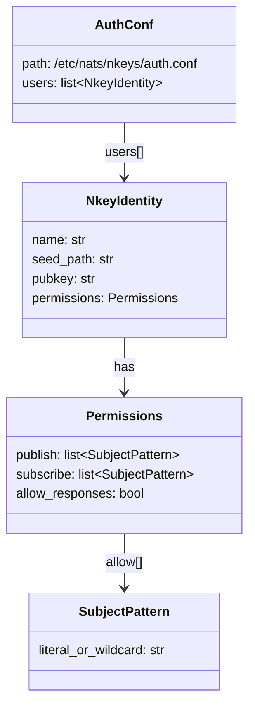
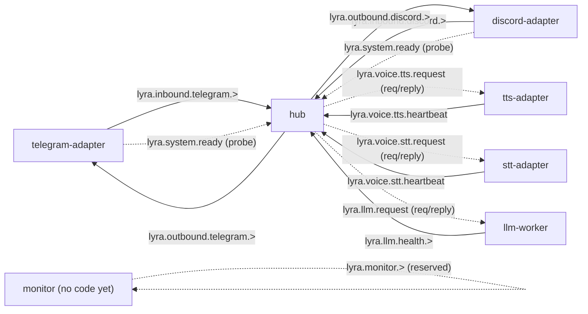

## Context

Promoted from [frame](../frames/706-per-role-nkeys-acls-frame.mdx). `auth.conf` currently authenticates seven (planned) nkey identities but grants each of them full pub/sub on every subject. This spec defines the per-identity `permissions { publish, subscribe }` matrix, extends `gen-nkeys.sh` to generate the two missing seeds (`telegram-adapter`, `discord-adapter`), wires the env var into the hub/telegram/discord supervisor confs, and documents the rollout + rollback runbook. Plugin ACL is documented but not implemented (deferred until ADR-045 lands).

## Goal

Each Lyra NATS identity can only publish and subscribe to the subjects required by its role — any other attempt is denied by the server — and the reload to enable these ACLs does not drop active client connections.

## Users

- **Primary:** operator running Lyra on Machine 1 (`roxabituwer`). Runs `gen-nkeys.sh` to regenerate seeds + `auth.conf`, reloads `nats-server`, verifies every supervisor program reconnects cleanly.
- **Secondary:**
  - Lyra processes (`lyra_hub`, `lyra_telegram`, `lyra_discord`, `lyra_tts`, `lyra_stt`, `lyra_llm_worker`) — each reconnects with its own ACL-scoped identity; a mis-scoped subject surfaces as an explicit NATS error in logs (not silent drop, thanks to `allow_errors: true` + client error callbacks).
  - Future `roxabi-nats` SDK consumers (ADR-045) — the plugin ACL shape documented in §Out-of-scope tells them what namespace they will get when the SDK lands.

## Expected Behavior

1. Operator pulls the change on Machine 1.
2. Operator runs `sudo ./deploy/nats/gen-nkeys.sh --regenerate` (new flag; see §Breadboard). Script:
   - Deletes `~/.lyra/nkeys/` and `/etc/nats/nkeys/auth.conf` (with confirmation prompt unless `--yes` is passed).
   - Regenerates 7 seeds: `hub`, `telegram-adapter`, `discord-adapter`, `tts-adapter`, `stt-adapter`, `llm-worker`, `monitor`.
   - Writes `auth.conf` with one `users[]` entry per identity, each carrying a `permissions { publish { allow: [...] } subscribe { allow: [...] } allow_responses: true }` block from the matrix below.
3. Operator reloads NATS in place:
   ```bash
   sudo systemctl reload nats.service
   ```
   (The unit uses `Type=simple` with `ExecReload=/bin/kill -HUP $MAINPID` — no `.pid` file is written, so reload goes through systemd, not `nats-server --signal`.) Active client connections are preserved; new permission rules apply on the next publish/subscribe.
4. Operator force-reconnects every Lyra program so existing subscriptions opened under the old (unrestricted) ACL are dropped and reopened under the new rules. Order matters — adapters first, hub last:
   ```bash
   make telegram reload && make discord reload
   make tts reload && make stt reload
   make lyra reload     # hub last
   ```
5. Operator runs `scripts/check-nats-acls.sh --since @{reload-timestamp}` (see N6). It inspects `journalctl -u nats-server.service` from the reload timestamp onward, greps for `Permissions Violation`, and exits non-zero on any hit. The operator attaches the stdout + exit code to the PR as the rollout evidence.
6. If any `Permissions Violation` is logged, rollback atomically: restore **both** the timestamped `auth.conf.bak.{epoch}` **and** the timestamped `~/.lyra/nkeys.bak.{epoch}/` seed archive (gen-nkeys.sh backs both up as one pair — old public keys only match old seeds), then reload nats-server and restart programs.

**Fail-loud surface.** The NATS server logs `Permissions Violation for Publication to "X" by user "Y"` on every denied op. This is the primary rollout signal — `scripts/check-nats-acls.sh` anchors its grep window to the reload timestamp via `journalctl --since`, and extends until every identity either (a) re-establishes its core subscriptions (observed via `nats server report connections` on each seed) or (b) 90s elapses, whichever comes first.

**Local dev path unchanged.** `nats-local.conf` (no auth) has no `authorization {}` block; the ACLs only apply when the full `nats.conf` (which `include`s `auth.conf`) is loaded.

## Data Model & Consumers

The "data model" here is the subject → identity ACL matrix. It is the contract between the spec and `auth.conf`.



### Subject → Identity ACL matrix

Derived from the audit (see §Audit Provenance). `PUB` = identity publishes to this subject. `SUB` = identity subscribes. Reply subjects (NATS `_INBOX.>`) are granted automatically by `allow_responses: true` — they do **not** appear in the matrix.

<!-- acl-matrix:begin -->
| Subject | hub | telegram-adapter | discord-adapter | tts-adapter | stt-adapter | llm-worker | monitor |
|---|:-:|:-:|:-:|:-:|:-:|:-:|:-:|
| `lyra.inbound.telegram.>` | SUB | PUB | — | — | — | — | — |
| `lyra.inbound.discord.>` | SUB | — | PUB | — | — | — | — |
| `lyra.outbound.telegram.>` | PUB | SUB | — | — | — | — | — |
| `lyra.outbound.discord.>` | PUB | — | SUB | — | — | — | — |
| `lyra.system.ready` [^ready] | SUB | PUB | PUB | PUB | PUB | — | — |
| `lyra.voice.tts.request` | PUB | — | — | SUB | — | — | — |
| `lyra.voice.tts.heartbeat` | SUB | — | — | PUB | — | — | — |
| `lyra.voice.stt.request` | PUB | — | — | — | SUB | — | — |
| `lyra.voice.stt.heartbeat` | SUB | — | — | — | PUB | — | — |
| `lyra.llm.request` | PUB | — | — | — | — | SUB | — |
| `lyra.llm.health.*` [^health] | SUB | — | — | — | — | PUB | — |
| `_INBOX.>` [^inbox] | SUB | SUB | SUB | SUB | SUB | — | — |
| `lyra.monitor.>` (reserved) [^monitor] | — | — | — | — | — | — | PUB+SUB |
<!-- acl-matrix:end -->

[^ready]: Readiness probe uses request/reply. Adapter publishes `lyra.system.ready` with `reply=<ephemeral>`; hub subscribes, responds via `msg.respond()`. The reply subject is covered by `allow_responses: true` on the hub.
[^health]: Code uses single-token wildcard `*` (`lyra.llm.health.*`) not `>` — matches `lyra.llm.health.<driver>` today; tightening to `.*` prevents a future multi-segment publish from silently landing via a `>`-based ACL.
[^inbox]: The `NatsLlmDriver.stream()` path in `src/lyra/llm/drivers/nats_driver.py:200` uses a manual inbox subscription (`self._nc.new_inbox()` + `subscribe(inbox)`) rather than `nc.request()`. `allow_responses: true` only covers auto-managed inboxes from `nc.request()`, so the hub needs `_INBOX.>` in its subscribe allow-list explicitly for LLM streaming to work. Other clients (adapters, workers) do not need this — they are responders via `msg.respond()`, which is covered by `allow_responses: true`.
[^monitor]: Monitor has no code today (seed + ACL exist only to reserve the namespace). Kept in scope to avoid a second `gen-nkeys.sh --regenerate` + reload cycle when the monitor service lands.

[^inbox-fix]: **Post-ship correction (2026-04-20).** The shipped spec claimed adapters only needed `allow_responses: true` because they are "responders via `msg.respond()`" (see `[^inbox]`). This was incomplete: telegram-adapter and discord-adapter also act as **requesters** for the readiness probe (`nc.request('lyra.system.ready', …)` via `roxabi_nats.readiness.wait_for_hub`), and `allow_responses` does not grant subscribe permission on the requester's own reply inbox. Symptom: `nats-server[…] Subscription Violation - Nkey "UD…" Subject "_INBOX.<uuid>.*"` every 22s during startup; each probe failed silently and the adapter degraded to "start anyway after 30s" graceful path. Fix: append `"_INBOX.>"` to `SUB_ALLOW` for both adapters in `deploy/nats/gen-nkeys.sh`; re-render with `sudo ./deploy/nats/gen-nkeys.sh --regen-authconf` + `sudo systemctl reload nats`. Tightening to per-identity `inbox_prefix` tracked in #717.

### Consumer map (who uses which subjects)



### Consumer summary

The matrix above is authoritative. The table below is a per-identity rollup — if the two ever disagree, **the matrix wins** and this table must be updated from it.

| Identity | Publishes | Subscribes | Uses `allow_responses` | Status |
|---|---|---|:-:|---|
| hub | `lyra.outbound.telegram.>`, `lyra.outbound.discord.>`, `lyra.voice.tts.request`, `lyra.voice.stt.request`, `lyra.llm.request` | `lyra.inbound.telegram.>`, `lyra.inbound.discord.>`, `lyra.voice.tts.heartbeat`, `lyra.voice.stt.heartbeat`, `lyra.llm.health.*`, `lyra.system.ready`, `_INBOX.>` | ✓ (requester) | This issue |
| telegram-adapter | `lyra.inbound.telegram.>`, `lyra.system.ready` | `lyra.outbound.telegram.>`, `_INBOX.>` [^inbox-fix] | ✓ | This issue |
| discord-adapter | `lyra.inbound.discord.>`, `lyra.system.ready` | `lyra.outbound.discord.>`, `_INBOX.>` [^inbox-fix] | ✓ | This issue |
| tts-adapter | `lyra.voice.tts.heartbeat` | `lyra.voice.tts.request` | ✓ (responder) | This issue |
| stt-adapter | `lyra.voice.stt.heartbeat` | `lyra.voice.stt.request` | ✓ (responder) | This issue |
| llm-worker | `lyra.llm.health.*` | `lyra.llm.request` | ✓ (responder) | This issue |
| monitor | `lyra.monitor.>` | `lyra.monitor.>` | ✓ | Reserved (no code; ACL is namespace squat — see footnote) |
| plugin (`lyra.plugin.<name>.>`) | `lyra.plugin.<name>.>` | `lyra.plugin.<name>.>` | ✓ | **Deferred to ADR-045** |

### Audit Provenance

| Source repo | Role | Audit output |
|---|---|---|
| lyra | All 7 identities | `src/lyra/nats/nats_channel_proxy.py`, `nats_bus.py`, `readiness.py`, `adapter_base.py`, `nats_tts_client.py`, `nats_stt_client.py`, `llm/drivers/nats_driver.py`, `adapters/nats_outbound_listener.py`, `bootstrap/voice_overlay.py` |
| voiceCLI | tts-adapter, stt-adapter | `src/voicecli/nats/base.py:70,71,115,167` (subscribe request + heartbeat; publish heartbeat) |
| roxabi-intel | — | No NATS usage. Not an identity. |

## Breadboard

### Affordances

| ID | Element | Location |
|---|---|---|
| N1 | `gen-nkeys.sh` extended: 2 new seed names (`telegram-adapter`, `discord-adapter`); new flags `--regenerate` (backs up + wipes + regens), `--yes` (non-interactive), `--template-only` (write auth.conf to stdout given matrix + dummy pubkeys, no root required — for CI); atomic backup of `auth.conf` **and** `~/.lyra/nkeys/` to `{path}.bak.{epoch}` before wipe | `deploy/nats/gen-nkeys.sh` |
| N2 | Permissions-block templating: a bash function `emit_user(name, pub_list, sub_list)` that writes one `{ nkey: …, permissions { publish { allow: [...] } subscribe { allow: [...] } allow_responses: true } }` block. Works for `--template-only` with dummy pubkeys too. | Inside N1 |
| N3 | Subject → role matrix, as a single source-of-truth block in `gen-nkeys.sh` (bash associative arrays keyed by identity) — the spec matrix is the contract; the script is the executable copy. | Inside N1 |
| N4 | `NATS_NKEY_SEED_PATH` wired into the three missing supervisor confs: `lyra_hub.conf`, `lyra_telegram.conf`, `lyra_discord.conf`. (`lyra_tts.conf`, `lyra_stt.conf` already wired via #563; `lyra_llm_worker.conf` out of repo and owned by voicecli/llm deploy.) | `deploy/supervisor/conf.d/lyra_hub.conf`, `lyra_telegram.conf`, `lyra_discord.conf` |
| N5 | Reload runbook: `sudo systemctl reload nats.service`, per-program reconnect order, `check-nats-acls.sh` evidence capture, rollback procedure that restores seed archive + conf atomically | `docs/DEPLOYMENT.md` (new `## NATS ACL Rollout` section) |
| N6 | `scripts/check-nats-acls.sh` — flags `--since <timestamp>` (default: now - 10s), `--window <seconds>` (default: 90). Calls `journalctl -u nats-server.service --since "$SINCE"` and pipes through `grep -q "Permissions Violation"`; exits 1 on first match. Returns 0 after the window elapses with no violations. Unit-name override via `NATS_UNIT=<name>` env var. | `scripts/check-nats-acls.sh` (new) |
| N7 | ADR reference: auth.conf header comment points to ADR-045 + this spec; notes "plugin ACL intentionally omitted until SDK extraction lands" | `deploy/nats/gen-nkeys.sh` auth.conf heredoc |
| N8 | Test: `tests/nats/test_gen_nkeys_acls.sh` runs `./deploy/nats/gen-nkeys.sh --template-only` (no sudo, no filesystem writes outside stdout), pipes stdout to a tmp file, then runs five discrete assertions (see §Success Criteria) against that file. | `tests/nats/test_gen_nkeys_acls.sh` (new) |

### Wiring

| From | To | Trigger |
|---|---|---|
| Operator | N1 | `sudo ./deploy/nats/gen-nkeys.sh --regenerate --yes` (production) or `./deploy/nats/gen-nkeys.sh --template-only` (CI / local matrix inspection) |
| N1 | backup | Atomic pair: copy `/etc/nats/nkeys/auth.conf` → `/etc/nats/nkeys/auth.conf.bak.{epoch}` AND `~/.lyra/nkeys/` → `~/.lyra/nkeys.bak.{epoch}/` before wiping. Both must succeed or the script aborts before any delete. |
| N1 | N2 → N3 | For each identity, look up allow-lists in matrix arrays and call `emit_user` |
| N1 | seeds dir | `nk -gen user` × 7, install 0600 under `~/.lyra/nkeys/` |
| Operator | nats-server | `sudo systemctl reload nats.service` (step 3 of Expected Behavior) |
| Operator | each program | Force reconnect (adapters first, hub last) — step 4 of Expected Behavior |
| Each program | NATS | `nats_connect()` reads `NATS_NKEY_SEED_PATH` (already wired in #523) — on reconnect, the new permission rules apply |
| N4 | N1 | Supervisor conf env vars reference the same file paths gen-nkeys.sh writes |
| N6 | Operator | Run after reload+reconnects; non-zero exit = rollback trigger |

## Slices

| # | Slice | Affordances | Demo |
|---|---|---|---|
| 1 | Script: matrix + per-user permissions in `gen-nkeys.sh` (including `--template-only` mode for CI) | N1, N2, N3, N7 | `./deploy/nats/gen-nkeys.sh --template-only` prints a complete `auth.conf` to stdout with 7 users, each carrying a permissions block matching the matrix — no sudo, no files written |
| 2 | Supervisor conf env vars for hub/telegram/discord | N4 | `grep NATS_NKEY_SEED_PATH deploy/supervisor/conf.d/lyra_hub.conf deploy/supervisor/conf.d/lyra_telegram.conf deploy/supervisor/conf.d/lyra_discord.conf` shows all three programs point to the expected `.seed` path |
| 3 | Test harness (`test_gen_nkeys_acls.sh`) + violation-detection script (`check-nats-acls.sh`) | N6, N8 | `bash tests/nats/test_gen_nkeys_acls.sh` passes without sudo; `scripts/check-nats-acls.sh --since "$(date -Iseconds)" --window 5` exits 0 when journalctl shows no violations in that window |
| 4 | Rollout runbook + deferred-plugin note | N5 | `docs/DEPLOYMENT.md` contains: the reload command (`sudo systemctl reload nats.service`), the per-program reconnect order, the atomic rollback procedure (restore both backups), and a sidebar on the plugin ACL landing with ADR-045 |

## Success Criteria

### Script + auth.conf shape

- [ ] `gen-nkeys.sh --regenerate` prompts for confirmation, accepts `--yes` to skip, and aborts without deletion if either backup copy (auth.conf or seeds dir) fails.
- [ ] `gen-nkeys.sh --regenerate` writes the backup pair atomically: `auth.conf.bak.{epoch}` **and** `~/.lyra/nkeys.bak.{epoch}/` both exist with the old contents before any delete.
- [ ] `gen-nkeys.sh --template-only` exits 0 without root, writes a complete auth.conf to stdout using dummy pubkeys and the matrix, and performs no filesystem writes outside stdout.
- [ ] `gen-nkeys.sh --regenerate` generates 7 seeds: `hub`, `telegram-adapter`, `discord-adapter`, `tts-adapter`, `stt-adapter`, `llm-worker`, `monitor` — each at `$SEEDS_DIR/<name>.seed` with mode 0600, owned by `$LYRA_USER`.
- [ ] Generated `auth.conf` contains exactly 7 `users[]` entries; each entry has an `nkey`, a `permissions { publish { allow: [...] } subscribe { allow: [...] } allow_responses: true }` block.
- [ ] The publish allow-list for each identity matches that identity's matrix row exactly (set equality, order-insensitive).
- [ ] The subscribe allow-list for each identity matches that identity's matrix row exactly, including the hub's `_INBOX.>` subscription.
- [ ] `plugin` nkey identity is **not** generated; auth.conf header comment references ADR-045 and says "plugin ACL deferred".

### Supervisor wiring

- [ ] `deploy/supervisor/conf.d/lyra_hub.conf`, `lyra_telegram.conf`, `lyra_discord.conf` each set `NATS_NKEY_SEED_PATH` pointing to the matching `~/.lyra/nkeys/<name>.seed` path. (`lyra_tts.conf`, `lyra_stt.conf` already wired via #563 and are out of scope here.)

### Test harness

- [ ] `tests/nats/test_gen_nkeys_acls.sh` exits 0 without sudo and asserts all of: (a) all 7 user blocks exist, (b) each user's publish allow list equals the matrix row, (c) each user's subscribe allow list equals the matrix row, (d) `allow_responses: true` is present on every user, (e) `plugin` does not appear anywhere in the generated conf.
- [ ] `scripts/check-nats-acls.sh --since "$(date -Iseconds)" --window 5` exits 0 when journalctl shows no `Permissions Violation` in that window.
- [ ] `scripts/check-nats-acls.sh` exits 1 when a synthetic `Permissions Violation` line is injected into a test journal (or simulated via `NATS_UNIT=` override against a fake unit) within its window.

### Runbook + evidence capture

- [ ] `docs/DEPLOYMENT.md` has a `## NATS ACL Rollout` section listing, in order: `sudo systemctl reload nats.service`, the per-program reconnect sequence (adapters first, hub last), `scripts/check-nats-acls.sh` as the verification gate, and an atomic rollback that restores both the auth.conf backup and the seeds archive.
- [ ] PR includes a `rollout-evidence.txt` artifact (committed or attached) containing: the reload timestamp, the `check-nats-acls.sh` stdout, and its exit code, captured on Machine 1 before merge.

### No regressions

- [ ] The existing lyra + voicecli pytest suites still pass (no client-side code change — `nats_connect()` is unchanged).

> **Out of scope:** Plugin role ACL implementation. Expected shape for when ADR-045 lands: each plugin gets its own nkey (`<project>.seed`), permissions scoped to `lyra.plugin.<project>.>` for both publish and subscribe, `allow_responses: true`. The hub will need to add `SUB lyra.plugin.>` (or a scoped pattern) when plugins start calling into it — out of scope here.
>
> **Out of scope:** Per-identity `inbox_prefix` (scoped reply inboxes). Using `allow_responses: true` with the default `_INBOX.>` prefix means any authenticated identity could *subscribe* to any inbox if they guess the subject. Mitigation: reply inboxes are random UUIDs (unguessable in practice) and `allow_responses` limits responders to one reply per request within a 2-minute window. Tightening to per-identity `inbox_prefix` is a follow-up issue.
>
> **Out of scope:** Quadlet-path verification. `deploy/quadlet/hub.container` and `lyra-adapter@.container` already wire `NATS_NKEY_SEED_PATH` correctly; the quadlet path is tested only indirectly via the supervisor-path rollout on Machine 1.
