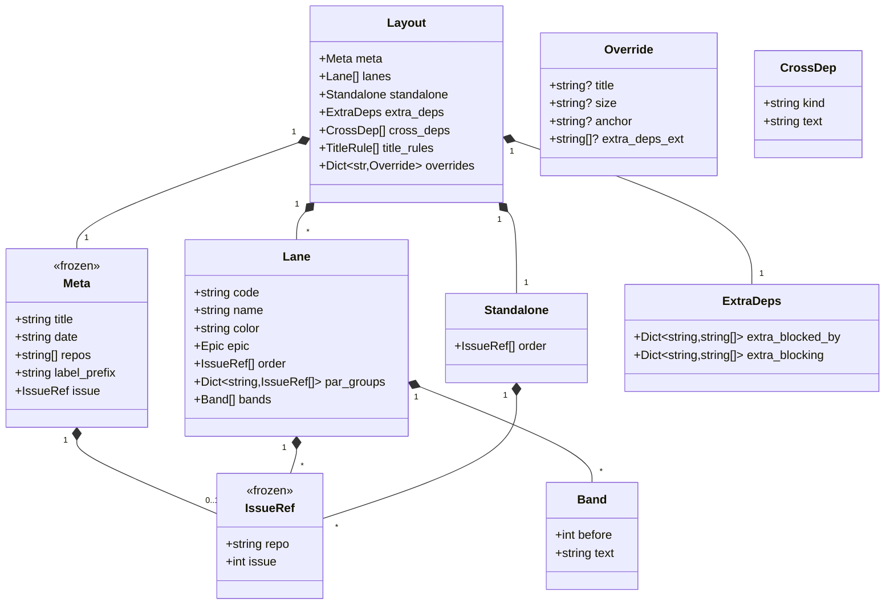
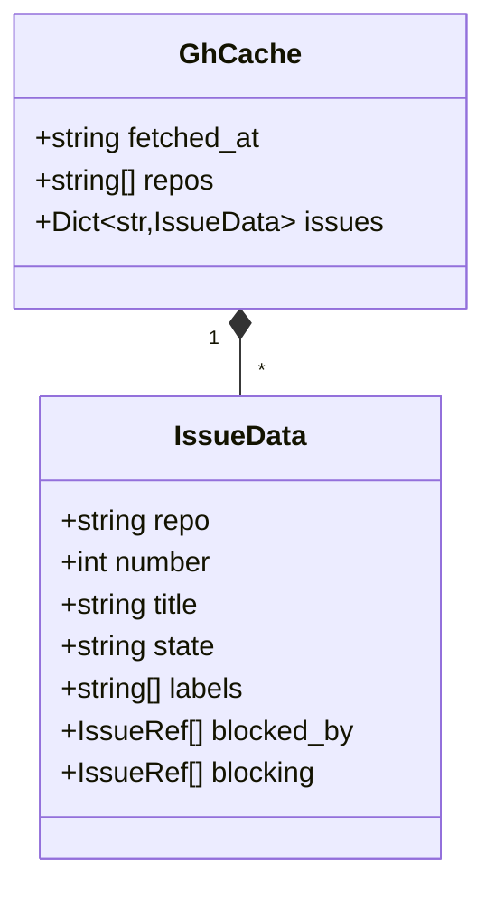
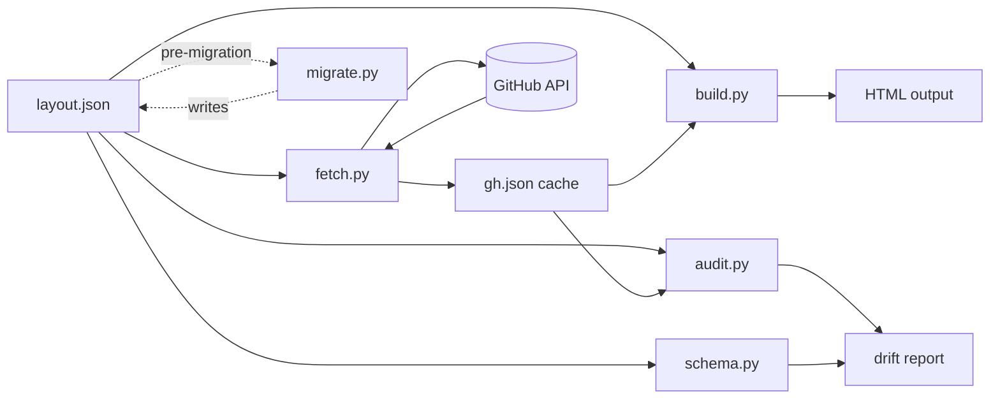

## Context

The dep-graph generator at `scripts/dep-graph/` handles a single repo via `meta.repo`. Cross-repo references exist only as free-text in `cross_deps[]` — no live state, no card, no visual placement in the lane timeline.

Epic #704 (vault + intel ingestion) already has a first-class foreign child at `Roxabi/roxabi-vault#24` (subscriber daemon), plus a future optional co-subscriber in `Roxabi/roxabi-intel` (no concrete issue filed yet). Without multi-repo support, foreign issues remain invisible to the board.

**Scope boundary re. #704:** this spec unblocks #704's *visualization* need only. #704's NATS plumbing (ADR in #703, subscriber in `roxabi-vault#24`) stays in #704's own delivery.

Promoted from: `artifacts/frames/709-multi-repo-dep-graph-frame.mdx`

## Goal

Render mixed-repo lanes as first-class, using GitHub's native cross-repo issue dependencies — no custom dep graph, no synchronization layer.

## Users

- **Primary:** Mickael — uses dep-graph as the single "what's next" board across Lyra + vault + intel.
- **Secondary:** future roxabi-dashboard consumers — uniform `{repo, issue}` refs are the foundation for multi-project aggregation.

## Expected Behavior

### Happy path — single-repo layout (backwards compat)
1. User runs `make dep-graph` on a layout with only `Roxabi/lyra` in `meta.repos[]`.
2. Fetcher queries lyra once, writes `gh.json`.
3. Builder renders HTML.
4. Output is **byte-identical** to pre-migration render (golden test).

### New path — multi-repo layout
1. User edits `lyra-v2-dependency-graph.layout.json`:
   - Sets `meta.repos = ["Roxabi/lyra", "Roxabi/roxabi-vault"]`
   - Adds `{ "repo": "Roxabi/roxabi-vault", "issue": 24 }` to `lanes[i].order[]`
   - Adds override: `"Roxabi/roxabi-vault#24": { "size": "M" }`
2. User runs `make dep-graph fetch`.
3. Fetcher loops `meta.repos[]`:
   - Label-searches each repo for `graph:lane/*` + `graph:standalone`
   - Merges issues listed in `order[]` across all lanes (dedup by `(repo, issue)`)
   - Fetches `/dependencies/{blocked_by,blocking}` for every known issue — GitHub returns cross-repo edges natively
4. `gh.json` structure: flat `issues` dict keyed by `"owner/repo#N"`, values include `repo`, `number`, `title`, `state`, `labels`, `blocked_by[]`, `blocking[]`.
   - **API note:** `gh api repos/X/Y/issues/N/dependencies/{blocked_by,blocking}` returns full issue objects including a `repository` field (`{owner, name, full_name}`). The current `fetch_dep_list` jq filter `[.[].number]` drops this and must be replaced with `[.[] | {repo: .repository.full_name, issue: .number}]` to preserve foreign-repo edges.
5. User runs `make dep-graph build`.
6. Builder renders:
   - Native-repo cards: unchanged visual
   - Foreign-repo cards: small repo badge (top-right corner, e.g. `roxabi-vault`)
   - Dep arrows: traverse the full merged pool, cross-repo edges resolve naturally
7. `make dep-graph audit` label-drift check treats each repo independently (audits only against its own GitHub labels).

### Migration flow
1. User runs `uv run python -m dep_graph.cli migrate` (new subcommand).
2. Script reads current layout (never mutates original), wraps every bare int in `{"repo": "Roxabi/lyra", "issue": N}`, rewrites all dict keys from `"N"` to `"Roxabi/lyra#N"`, writes to `layout.json.new`.
3. User diffs, reviews, replaces `layout.json` manually. `.new` file is the rollback artifact — safe to delete after commit.
4. **Idempotency:** re-running `migrate` on an already-migrated file (detected by validating against the new schema — not just `meta.repos` presence) exits 0 with "Already migrated." A partially-migrated file (mixed bare ints + `IssueRef`) is detected and completed.

### Error behavior
- Unknown repo in `order[]` entry (not in `meta.repos[]`) → `validate` fails with precise error.
- Foreign issue listed in `order[]` but not found in any repo → `build` logs a warning, renders a placeholder card (red border, "not found").
- `gh` rate-limited or auth missing on a foreign repo → `fetch` fails fast with actionable error.

## Data Model & Consumers

### Layout schema (post-migration)



**Field semantics:**
- `IssueRef = {repo: "owner/name", issue: N}` — uniform issue reference.
- Dict keys using issues: `"owner/repo#N"` string format (e.g. `"Roxabi/lyra#641"`).
- `meta.repos[]` is the allowlist — every `IssueRef.repo` (including `meta.issue.repo` if set) must be in it. Validated by schema.
- `meta.issue`: the epic/driver issue for the whole board (e.g. `#445`). Optional. Migration preserves the existing bare-int into an `IssueRef` against `meta.repos[0]`.
- `Override.extra_deps_ext`: free-text edge annotations (e.g. `"←D live"`) rendered on the card; distinct from the structured `ExtraDeps` fields which model real (blocked_by / blocking) relationships.
- `Band`: inter-card text dividers in a lane (e.g. `"M0 tail ‖"` shown before a given issue).
- `ExtraDeps`: closed-PR / informal-dep escape hatch **only** — not a cross-repo crutch. Cross-repo edges come from GitHub native dependencies, not from here.

### gh.json cache shape



Keys: `"Roxabi/lyra#641"`. `blocked_by` / `blocking` arrays contain `IssueRef` objects (not bare ints) — even when self-referential to allow uniform consumption.

### Consumer map



Solid = this issue. Dashed = bootstrap (`migrate` runs once).

### Consumer summary

| Consumer | Fields consumed | When | Status |
|---|---|---|---|
| `fetch.py` | `meta.repos`, `meta.label_prefix`, `lanes[].order[]`, `standalone.order[]` | Every `fetch` invocation | this issue |
| `build.py` | all layout fields + full `gh.json` | Every `build` invocation | this issue |
| `audit.py` | `meta.repos`, `lanes[].order[]`, `standalone.order[]`, gh labels | Every `audit` invocation | this issue |
| `schema.py` (`validate`) | full layout + schema | Manual + pre-commit | this issue |
| `migrate.py` | layout (read+write) | One-shot | this issue |
| Future roxabi-dashboard | `meta.repos[]`, pre-rendered HTML per project | TBD | future |

## Breadboard

### Affordances

| ID | Surface | Handler | Data |
|---|---|---|---|
| C1 | `layout.schema.json` JSON Schema rules | external validator | schema doc |
| C2 | `dep_graph.cli validate` subcommand | `schema.validate_layout()` | layout → bool + errors |
| C3 | `dep_graph.cli fetch` subcommand | `fetch.run_fetch()` | layout → gh.json |
| C4 | `dep_graph.cli build` subcommand | `build.run_build()` | layout + gh.json → HTML |
| C5 | `dep_graph.cli audit` subcommand | `audit.run_audit()` | layout + gh.json → exit 0/1 |
| C6 | `dep_graph.cli migrate` subcommand (**new**) | `migrate.run_migrate()` | old layout → new layout |
| C7 | Foreign repo badge | `build._render_repo_badge()` | `IssueRef.repo` → HTML span |
| C8 | Cross-repo dep arrow resolution | `build._resolve_dep()` | `IssueRef` → lane_of + position |
| C9 | Not-found placeholder card | `build._render_missing_card()` | `IssueRef` absent from `gh.json` → red-border placeholder + stderr warning |

### Wiring

```
user edits layout.json
       ↓
  [C2] validate ──fail→ surface schema errors
       ↓ ok
  [C3] fetch ─→ for repo in meta.repos: gh_api(labels) + gh_api(deps) → gh.json
       ↓
  [C4] build ─→ for issue in merged pool: render card (+ [C7] if foreign) + deps (→ [C8])
       ↓
  HTML output
```

Migration [C6] runs once, before [C2]: wraps bare ints → `IssueRef`, rewrites keys.

## Slices

| # | Slice | Demo | Blocks |
|---|-------|------|--------|
| S1 | **Schema + migration** — update `layout.schema.json` to require `IssueRef` + `meta.repos[]` (rejects `meta.repo` singular, rejects bare ints); add `migrate.py` subcommand; commit migrated Lyra layout (`tests/fixtures/lyra-layout-golden.layout.json`). | `migrate` on current layout produces a new file that passes `validate`; idempotent on re-run. | S2, S3, S4 |
| S2 | **Fetcher multi-repo** — `fetch.py` iterates `meta.repos[]`; replace jq filter to extract `{repo, issue}` from `.repository.full_name + .number`; write `gh.json` with `"owner/repo#N"` keys + `IssueRef[]` dep arrays. | `fetch` on a 3-repo test layout produces `gh.json` containing issues from all three repos with cross-repo `blocked_by` edges preserved. | S3 |
| S3 | **Builder + audit multi-repo** — `build.py` resolves `IssueRef` across merged pool, adds repo badge on foreign cards, renders not-found placeholder (C9); `audit.py` key-handling rewritten for `"owner/repo#N"` format, treats each repo independently. | Byte-identical HTML vs. pre-migration baseline when built from the committed `gh.json` fixture (golden test); `audit` exits non-zero when a `graph:lane/*` label is removed from one repo, zero otherwise. | S4 |
| S4 | **Multi-repo integration + docs** — add `#704` cross-repo children to the Lyra layout; `README.md` multi-repo example + migration section; add risk note re. `gh api` dep endpoint stability. | Lyra board renders `roxabi-vault#24` as a card with repo badge and cross-repo dep arrow without any `extra_deps` override. | — |

Each slice is independently demo-able and individually valuable:
- S1 ships the migrated layout (users can already validate the new format).
- S2 ships multi-repo fetching (users can inspect the merged cache).
- S3 ships the full render + audit (users can generate the new board).
- S4 closes the loop with docs and the real cross-repo use case (#704).

## Success Criteria

- [ ] `layout.schema.json` rejects `meta.repo` (singular) and bare-int issue references with a precise error path pointing to the violating field.
- [ ] `layout.schema.json` validates that every `IssueRef.repo` (including `meta.issue.repo`) appears in `meta.repos[]`.
- [ ] `make dep-graph validate` exits 0 on the migrated Lyra layout.
- [ ] `python -m dep_graph.cli migrate` on a mixed (partially-migrated) layout produces a fully-migrated file; on an already-migrated file it exits 0 with "Already migrated." (detected via full schema re-validation, not `meta.repos` presence).
- [ ] `make dep-graph fetch` on a 3-repo test layout produces a `gh.json` containing issues from all three repos; every `blocked_by[]` / `blocking[]` entry is an `IssueRef` object with `repo` matching the source repository.
- [ ] Golden test passes: `make dep-graph build` fed the committed `tests/fixtures/lyra-layout-golden.{layout.json,gh.json}` produces HTML byte-identical to the committed `tests/fixtures/lyra-layout-golden.html`.
- [ ] Lyra board renders `Roxabi/roxabi-vault#24` as a card with a visible repo badge and a cross-repo dep arrow from `Roxabi/lyra#703`, without any `extra_deps` override. (A future `roxabi-intel` co-subscriber will be added to the layout when filed.)
- [ ] `make dep-graph audit` exits 0 on the migrated Lyra layout; exits 1 when a `graph:lane/*` label is removed from any listed repo; drift report lists the offending issue with its `"owner/repo#N"` key.
- [ ] `scripts/dep-graph/README.md` includes a complete multi-repo example and a migration section with idempotency notes.

Definition of done (hygiene gates, implied on every commit — not tracked as spec ACs):
`uv run ruff check scripts/dep-graph/`, `uv run pyright scripts/dep-graph/`, and `uv run ruff format --check scripts/dep-graph/` must exit 0.

## Out of Scope (reconfirmed)

- Foreign-repo label search (only explicitly-listed issues from non-primary repos appear).
- Dashboard / nav shell across multiple boards.
- Projects V2 integration.
- Visual feature additions (filters, zoom, collapsible lanes).
- Reusable NATS subscriber scaffolding (#704 follow-up).

## Edge cases

| Case | Handling |
|---|---|
| `meta.repos[]` empty | schema rejects (minItems: 1) |
| `IssueRef.repo` not in `meta.repos[]` | schema rejects with clear error pointing to the violating ref |
| Duplicate `IssueRef` across lanes | `fetch` dedupes by `(repo, issue)`; `audit` flags as drift |
| Foreign issue closed while blocker open | render normally, closed styling same as native closed |
| Migration script run on already-migrated layout | Detect via presence of `meta.repos`, print "Already migrated." exit 0 |
| `gh` auth lacks access to one of `meta.repos[]` | fail fast with actionable message ("`gh auth status` for Roxabi/roxabi-vault") |
| Layout has both `meta.repo` (old) and `meta.repos[]` (new) | schema rejects (explicit mutual exclusion) |
| `meta.issue.repo` not in `meta.repos[]` | schema rejects (same rule as any other `IssueRef`) |
| Golden fixture has non-deterministic fields (e.g. `fetched_at`) | `gh.json` fixture is hand-curated and frozen; `fetched_at` is stripped or normalized before HTML render diff; fixture is committed to `tests/fixtures/` |

## Risks

- **`gh api` issue-dependencies endpoint stability** — this endpoint is still listed as "public preview" at time of writing. If GitHub changes the response shape (or the `.repository` field goes behind an auth scope), S2's fetcher breaks silently. Mitigation: fetch.py asserts the expected shape and logs a clear error with the observed payload on mismatch.
- **Schema evolution** — if `IssueRef` gains fields later (e.g., `branch`), migrated files need another migration pass. Acceptable given how stable `(repo, issue)` is as a natural key; flagged for awareness.

## Unresolved

(none — all ambiguities resolved during review + revision)
