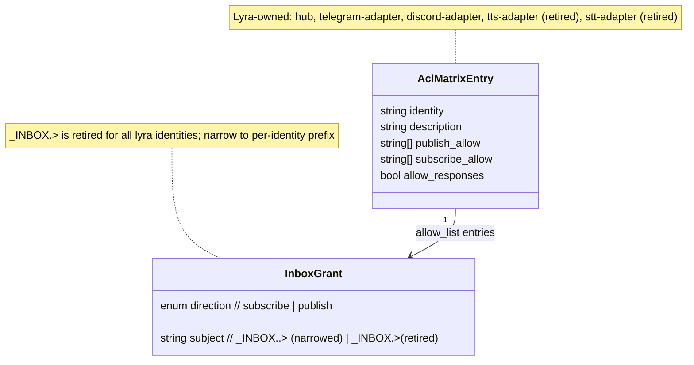
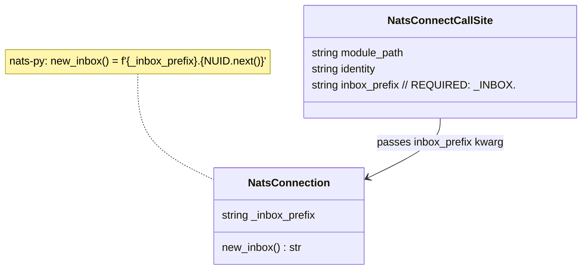
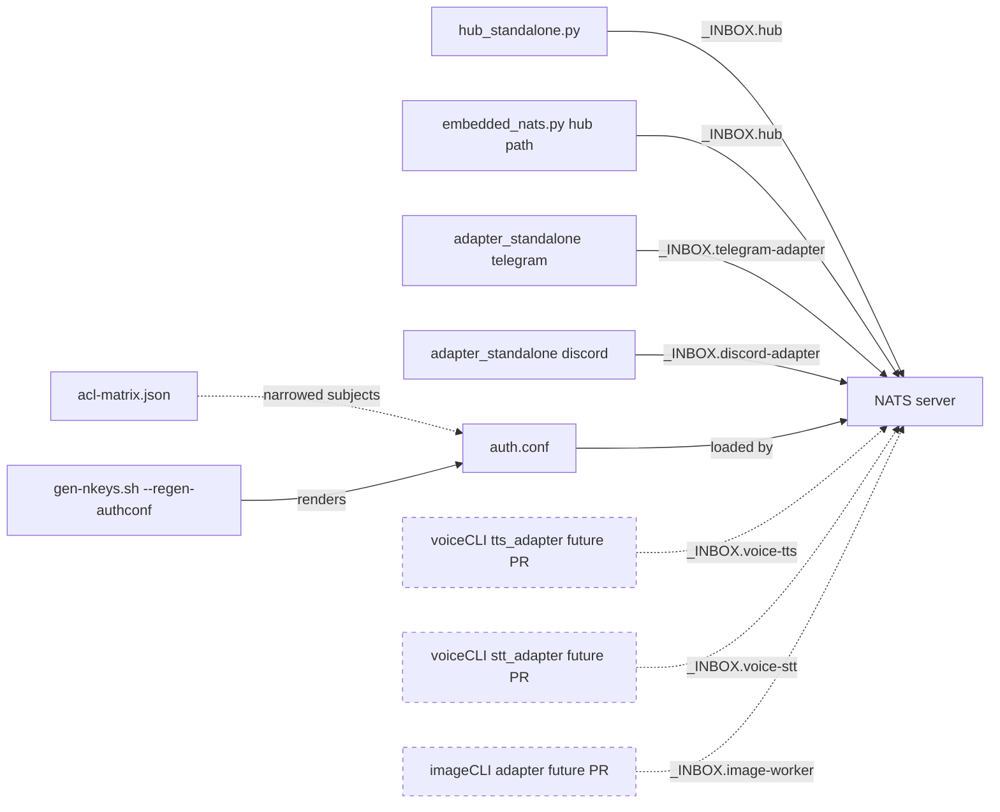

## Context

Source: frame `artifacts/frames/715-per-identity-nats-inbox-prefix-frame.mdx`; decision record `docs/architecture/adr/051-per-identity-nats-inbox-prefix.mdx`.

Every identity in `deploy/nats/acl-matrix.json` (hub, telegram-adapter, discord-adapter, tts-adapter, stt-adapter, voice-tts, voice-stt, image-worker) currently holds the wildcard `_INBOX.>` (subscribe for requesters; publish for repliers). Any leaked seed is therefore a bus-wide wiretap of LLM tokens, TTS/STT payloads, readiness replies, and any future request/reply traffic.

ADR-051 chose Option B: pass `inbox_prefix="_INBOX.<identity>"` to `nats_connect()` at every lyra connect site, then narrow the ACL from `_INBOX.>` to `_INBOX.<identity>.>`. No change to `NatsLlmDriver._stream_gen()` or to worker reply protocol — nats-py's `new_inbox()` derives its subject from `self._inbox_prefix`.

This spec covers only lyra-owned identities (hub + 4 adapters). Satellite identities (voice-tts, voice-stt, image-worker) connect from voiceCLI and imageCLI repos per ADR-047 and are updated in per-satellite PRs. The lyra `acl-matrix.json` entries for satellite identities stay unchanged **in this PR** and are narrowed in follow-up operational PRs once each satellite connect site is deployed with the matching prefix. Supersedes #717 (adapter inbox tightening).

## Goal

Retire the bus-wide `_INBOX.>` ACL grant for every lyra-owned identity by narrowing it to a per-identity prefix `_INBOX.<identity>.>`, enforced at connect time via `inbox_prefix` and verified empirically against the running NATS server on Machine 1.

## Users

- **Primary:** lyra hub + telegram/discord adapters authenticating to NATS on production (M1). Behavior is invisible at steady state; a leaked seed can no longer read other identities' inboxes.
- **Secondary:** operators running `sudo ./deploy/nats/gen-nkeys.sh --regen-authconf` and `systemctl reload nats` — acceptance gate depends on empirical server-side deny verification.
- **Secondary:** authors of future lyra identities — must include `inbox_prefix` from the start; `_INBOX.>` is not available.

## Expected Behavior

1. Hub boots via `_bootstrap_hub_standalone()` → calls `nats_connect(nats_url, inbox_prefix="_INBOX.hub")` → `NatsLlmDriver._stream_gen()` calls `nc.new_inbox()` → nats-py returns `_INBOX.hub.<nuid>` → `nc.subscribe(inbox)` succeeds under the narrowed ACL.
2. Telegram adapter boots via `_bootstrap_adapter_standalone(platform="telegram")` → derives identity `telegram-adapter` → calls `nats_connect(nats_url, inbox_prefix="_INBOX.telegram-adapter")` → readiness probe `nc.request("lyra.system.ready", ...)` produces an inbox under `_INBOX.telegram-adapter.*` → server accepts it under the narrowed ACL.
3. Discord adapter behaves symmetrically with `inbox_prefix="_INBOX.discord-adapter"`.
4. Embedded NATS hub path (used by `lyra start`) opens its NATS connection with the hub prefix (single-process parity with standalone).
5. After operator runs `--regen-authconf` + `systemctl reload nats` on M1, a deliberate attempt to subscribe from the hub to `_INBOX.>` or `_INBOX.other-identity.>` returns `nats-server` Subscription Violation; subscribe to `_INBOX.hub.>` still succeeds. The generated `rollout-evidence.txt` captures the deny line.
6. `lyra ops verify` (ADR-046 Invariant 5) flags a residual `_INBOX.>` entry in `auth.conf` as a drift error. (Flag-only; actual auto-remediation out of scope.)

## Data Model & Consumers

### ACL matrix shape (relevant rows)

### Connect contract

### Consumer map

### Consumer summary

| Consumer | Fields / Grant | When | Status |
|---|---|---|---|
| `hub_standalone.py` | `inbox_prefix="_INBOX.hub"` | bootstrap connect | this issue |
| `embedded_nats.py` (hub path) | `inbox_prefix="_INBOX.hub"` | `lyra start` single-process | this issue |
| `adapter_standalone.py` | `inbox_prefix=f"_INBOX.{platform}-adapter"` | bootstrap connect | this issue |
| `acl-matrix.json` hub row | `_INBOX.hub.>` subscribe | ACL narrow | this issue |
| `acl-matrix.json` telegram/discord rows | `_INBOX.{platform}-adapter.>` subscribe | ACL narrow | this issue |
| `acl-matrix.json` tts/stt-adapter rows | `_INBOX.{role}.>` + lowercase variant | ACL narrow (lyra-side only) | this issue |
| `acl-matrix.json` voice-tts / voice-stt / image-worker | unchanged `_INBOX.>` | narrowed after satellite connect-site PRs land | future (tracked per-satellite) |
| `spec 706` data model | per-identity rows | reflect in specs doc | this issue |
| `tests/nats/test_gen_nkeys_acls.sh` | assertions flipped to `_INBOX.<identity>.>` | ACL generation test | this issue |
| `tests/llm/drivers/test_nats_driver.py` | inbox mocks updated to prefixed form | unit test | this issue |
| `rollout-evidence.txt` | M1 reload + deny log capture | empirical gate | this issue |
| `lyra ops verify` | flag residual `_INBOX.>` as drift | post-merge flag | this issue |

## Breadboard

### Affordances

| ID | Affordance | Handler | Data |
|---|---|---|---|
| U1 | Hub connects with scoped prefix | `hub_standalone.py:_bootstrap_hub_standalone` | `nats_connect(..., inbox_prefix="_INBOX.hub")` |
| U2 | Adapter connects with platform-derived prefix | `adapter_standalone.py:_bootstrap_adapter_standalone` | `nats_connect(..., inbox_prefix=f"_INBOX.{platform}-adapter")` |
| U3 | Embedded NATS hub path connects with scoped prefix | `embedded_nats.py` hub connect | `nats_connect(..., inbox_prefix="_INBOX.hub")` |
| N1 | ACL grants narrowed per-identity | `deploy/nats/acl-matrix.json` | replace `_INBOX.>` with `_INBOX.<identity>.>` for lyra-owned rows (+ `_inbox.<identity>.>` where lowercase variant present) |
| N2 | Spec 706 data model updated | `artifacts/specs/706-per-role-nkeys-acls-spec.mdx` | footnote `[^inbox-fix]` revised, matrix rows updated |
| N3 | ACL generation test flipped | `tests/nats/test_gen_nkeys_acls.sh` | assert narrowed subjects; reject `_INBOX.>` for covered identities |
| N4 | Driver unit tests updated | `tests/llm/drivers/test_nats_driver.py` | mock inboxes use `_INBOX.hub.<uuid>` |
| N5 | Empirical server-side verification on M1 | `deploy/nats/gen-nkeys.sh --regen-authconf` + `systemctl reload nats` | capture `Subscription Violation` for `_INBOX.>` from hub; save to `rollout-evidence.txt` |
| S1 | `lyra ops verify` drift check | existing verify command | flag residual `_INBOX.>` in auth.conf as error |

### Wiring

- `U1/U2/U3` depend on no SDK change — `roxabi_nats.nats_connect` forwards `**extra`.
- `N1` depends on `U1/U2/U3` deployed first to avoid requester-side denial windows.
- `N5` depends on `U*` + `N1` landed on M1.
- `S1` depends on `N1` so the flagged pattern is unambiguous.
- Satellite rows (`voice-tts`, `voice-stt`, `image-worker`) are NOT narrowed in this PR — sequenced behind per-satellite connect-site PRs.

## Slices

| # | Slice | Affordances | Independently demo-able |
|---|---|---|---|
| 1 | Hub + embedded NATS inbox prefix + unit tests | U1, U3, N4 | Local `lyra start`; assert hub uses `_INBOX.hub.<nuid>`; driver tests green. |
| 2 | Adapter inbox prefix + unit tests | U2 | Standalone adapter boot (telegram / discord) produces `_INBOX.telegram-adapter.*`, `_INBOX.discord-adapter.*` inboxes; readiness probe round-trips locally. |
| 3 | ACL narrow (lyra-owned rows) + regen test + spec 706 update | N1, N2, N3 | `tests/nats/test_gen_nkeys_acls.sh` green; regen produces narrowed auth.conf on dev box; spec 706 renders. |
| 4 | M1 empirical verification + rollout-evidence + verify drift flag | N5, S1 | Deploy on M1; capture deny in log; `rollout-evidence.txt` committed; `lyra ops verify` flags seeded residual. |

Order: 1 → 2 → 3 → 4. Slices 1 and 2 can run in parallel (disjoint files); slices 3 and 4 must follow.

## Success Criteria

- [ ] `nats_connect` in `src/lyra/bootstrap/standalone/hub_standalone.py` is invoked with `inbox_prefix="_INBOX.hub"`.
- [ ] `nats_connect` in the hub path of `src/lyra/bootstrap/infra/embedded_nats.py` is invoked with `inbox_prefix="_INBOX.hub"`.
- [ ] `nats_connect` in `src/lyra/bootstrap/standalone/adapter_standalone.py` is invoked with `inbox_prefix=f"_INBOX.{platform}-adapter"` (platform ∈ {telegram, discord}).
- [ ] `deploy/nats/acl-matrix.json`: rows for `hub`, `telegram-adapter`, `discord-adapter`, `tts-adapter`, `stt-adapter` replace `_INBOX.>` with `_INBOX.<identity>.>` (and lowercase `_inbox.<identity>.>` where the lowercase variant was present).
- [ ] `deploy/nats/acl-matrix.json`: rows for `voice-tts`, `voice-stt`, `image-worker` are UNCHANGED in this PR; their descriptions reference sequencing behind per-satellite connect-site PRs.
- [ ] `artifacts/specs/706-per-role-nkeys-acls-spec.mdx` data-model matrix and footnote `[^inbox-fix]` reflect per-identity rows for lyra-owned identities and note satellite sequencing.
- [ ] `tests/nats/test_gen_nkeys_acls.sh` asserts narrowed `_INBOX.<identity>.>` for lyra-owned identities and rejects `_INBOX.>` appearing for any of them.
- [ ] `tests/llm/drivers/test_nats_driver.py` inbox mocks produce inboxes under `_INBOX.hub.*` and tests pass.
- [ ] `uv run pytest` green; `uv run ruff check .` green; `uv run pyright` green.
- [ ] On M1: `sudo ./deploy/nats/gen-nkeys.sh --regen-authconf` renders an `auth.conf` where no lyra-owned identity retains `_INBOX.>`; `systemctl reload nats` succeeds; a deliberate hub subscribe to `_INBOX.>` produces `Subscription Violation` in `journalctl -u nats`.
- [ ] `rollout-evidence.txt` committed on the PR branch captures the deny log line and the reload timestamp.
- [ ] `lyra ops verify` run post-deploy reports 0 residual `_INBOX.>` grants for lyra-owned identities (satellite rows may still be flagged pending their PRs; noted explicitly).
- [ ] PR description cross-links ADR-051, issue #715, and notes supersede of #717.

## Out of Scope

- Updating satellite connect sites (`voicecli/src/voicecli/nats/{tts,stt}_adapter.py`, `imagecli/src/imagecli/nats/adapter.py`). Tracked in per-satellite PRs per ADR-047.
- Narrowing `acl-matrix.json` rows for `voice-tts`, `voice-stt`, `image-worker`. Deferred until each satellite connect site is shipped and deployed — sequencing is satellite PR → lyra ACL PR → regen → reload.
- JetStream migration for LLM streaming (ADR-051 §Option A).
- Auto-remediation inside `lyra ops verify`; this issue adds flag-only drift detection.
