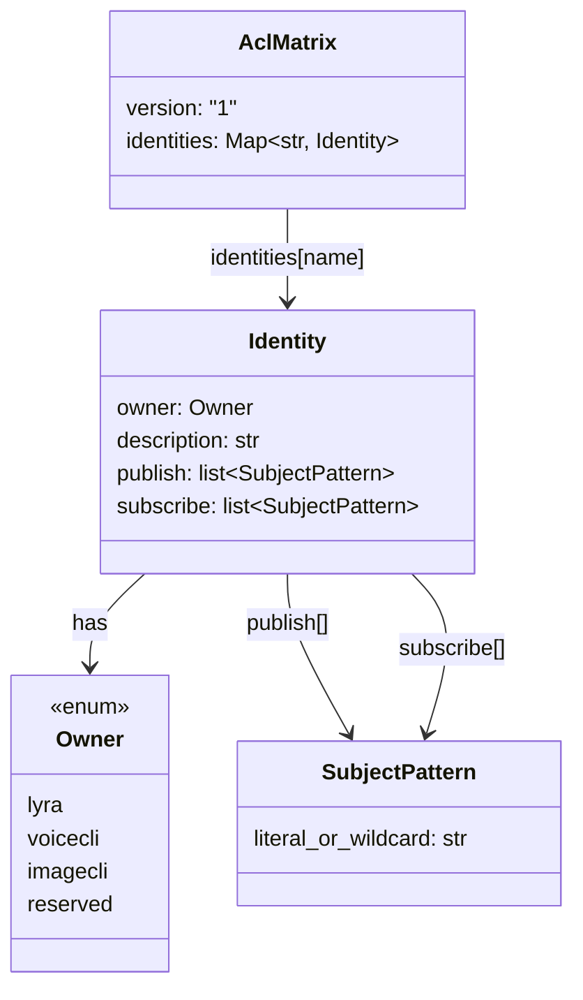
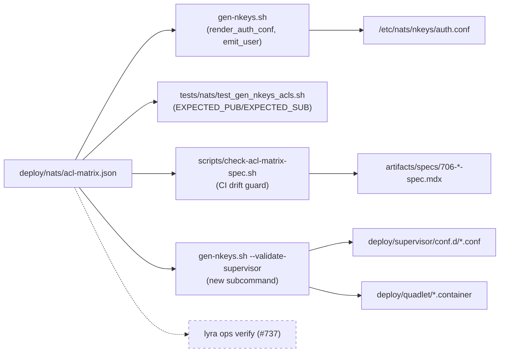

## Context

Promoted from [frame](../frames/717-acl-matrix-json-ssot-frame.mdx). The NATS subject → identity ACL matrix currently lives in three executable or human-authored copies that must stay mutually consistent:

1. `deploy/nats/gen-nkeys.sh` — `PUB_ALLOW` / `SUB_ALLOW` associative arrays + `IDENTITIES=(…)` (the **shipping truth**).
2. `tests/nats/test_gen_nkeys_acls.sh` — `EXPECTED_PUB` / `EXPECTED_SUB` associative arrays (currently already drifted: e.g. `EXPECTED_SUB[telegram-adapter]` is missing `_INBOX.>` that the script has).
3. `artifacts/specs/706-per-role-nkeys-acls-spec.mdx` §Data Model — prose matrix frozen at spec-approval time; acknowledges it is not authoritative.

Identity names are additionally hardcoded in `deploy/supervisor/conf.d/lyra_{hub,telegram,discord,tts,stt}.conf` and `deploy/quadlet/lyra-{hub,telegram,discord}.container` via `NATS_NKEY_SEED_PATH`.

This spec replaces the three copies with one: `deploy/nats/acl-matrix.json`. `gen-nkeys.sh` and the test both read it. The #706 spec matrix is kept hand-maintained, guarded by a CI drift-check. A new `--validate-supervisor` subcommand confirms that every `owner == lyra` identity has its seed wired into at least one local process unit (supervisor conf or quadlet container).

## Goal

`deploy/nats/acl-matrix.json` is the single, machine-readable source of truth for the subject → identity ACL matrix — consumed by `gen-nkeys.sh`, by the test harness, and (next) by `lyra ops verify` (#737). Adding a subject or identity is a single-file edit.

## Users

- **Primary:** operator running Lyra on Machine 1 (`roxabituwer`). Edits `acl-matrix.json`, runs `gen-nkeys.sh --regenerate --yes` + `--validate-supervisor`, reloads `nats-server`. Never touches bash arrays again.
- **Secondary:**
  - Future spec authors — one source of truth removes the "did I update the script?" checklist item.
  - `lyra ops verify` (#737) — consumes `acl-matrix.json` directly.
  - CI — the drift-check script runs on every PR that touches `deploy/nats/` or `artifacts/specs/706-*`.

## Expected Behavior

1. **Byte-identical auth.conf today.** `./deploy/nats/gen-nkeys.sh --template-only` after this change produces auth.conf output with the same 10 identity blocks and the same allow-lists (set-equality preserved). No seed rotation; no ACL content change.
2. **Edit flow.** Operator adds a subject for an existing identity (or a new identity):
   ```bash
   $EDITOR deploy/nats/acl-matrix.json
   ./deploy/nats/gen-nkeys.sh --template-only | diff -u /etc/nats/nkeys/auth.conf -
   sudo ./deploy/nats/gen-nkeys.sh --regen-authconf   # pre-existing flag from #706, unchanged
   sudo systemctl reload nats.service
   ```
3. **Drift guard — script side.** `gen-nkeys.sh` aborts at startup with a clear error if:
   - `deploy/nats/acl-matrix.json` is missing.
   - `jq` is not on `$PATH`, or `jq --version` reports < 1.6 (1.6 is when key-insertion-order preservation became the documented contract; Ubuntu 22.04/24.04 ship 1.6+).
   - the JSON's top-level `version` field is not `"1"`.
   - the JSON fails schema validation (missing top-level `identities`, an identity missing `owner` / `publish` / `subscribe`, or `owner` not in the enum).
4. **Drift guard — test side.** `tests/nats/test_gen_nkeys_acls.sh` derives `EXPECTED_PUB` / `EXPECTED_SUB` from `acl-matrix.json` via `jq`. The current stale `EXPECTED_SUB[telegram-adapter]` bug becomes impossible — script and test read the same bytes.
5. **Drift guard — spec side.** A CI script `scripts/check-acl-matrix-spec.sh` renders a markdown table from `acl-matrix.json` for the 7 identities that appear in the #706 spec matrix (`hub`, `telegram-adapter`, `discord-adapter`, `tts-adapter`, `stt-adapter`, `llm-worker`, `monitor`) and diffs it against the matrix block in `artifacts/specs/706-per-role-nkeys-acls-spec.mdx`. Exits non-zero on diff. Runs in the existing lyra CI workflow on any change under `deploy/nats/` or `artifacts/specs/706-*`.
6. **Supervisor validation.** `./deploy/nats/gen-nkeys.sh --validate-supervisor` greps both `deploy/supervisor/conf.d/*.conf` and `deploy/quadlet/*.container` for `NATS_NKEY_SEED_PATH` ending in `<identity>.seed`. For each identity where `owner == "lyra"` in the JSON, at least one match must exist (either supervisor or quadlet is fine — migration in progress). Exits 0 on pass, 1 on first missing wiring with a diagnostic. No root required.
7. **No client code change.** `src/lyra/**`, `packages/roxabi-nats/**`, tests outside `tests/nats/test_gen_nkeys_acls.sh` are untouched. `nats_connect()` reads `NATS_NKEY_SEED_PATH` as today.

**Fail-loud surface.** Any schema drift in `acl-matrix.json` surfaces as a `jq` parse error or a schema-check failure with the offending identity name printed. Any supervisor gap surfaces as `--validate-supervisor` exit 1 with the missing identity name.

## Data Model & Consumers

### JSON shape



**Schema notes:**
- `version: "1"` is the schema version. Any breaking change bumps it.
- `identities` is keyed by the NATS user name (matches `# <name>` anchor used by the test harness's `extract_block`).
- `owner` enum values:
  - `lyra` — process wiring is in this repo (supervisor conf OR quadlet container). `--validate-supervisor` checks these.
  - `voicecli` — process lives in voiceCLI repo (`voice-tts`, `voice-stt`).
  - `imagecli` — process lives in imageCLI repo (`image-worker`).
  - `reserved` — seed + ACL exist but no process yet (`monitor`, `llm-worker` today).
- `description` is free-form; prints in `--show` and in schema-violation errors.
- `publish` / `subscribe` are ordered arrays of strings — **insertion order is preserved** when regenerating auth.conf so the diff against today is minimal.

### Initial content (snapshot of today's gen-nkeys.sh)

| Identity | Owner | Publish | Subscribe |
|---|---|---|---|
| hub | lyra | `lyra.outbound.telegram.>`, `lyra.outbound.discord.>`, `lyra.voice.tts.request.>`, `lyra.voice.stt.request.>`, `lyra.llm.request`, `lyra.image.generate.request` | `lyra.inbound.telegram.>`, `lyra.inbound.discord.>`, `lyra.voice.tts.heartbeat`, `lyra.voice.stt.heartbeat`, `lyra.llm.health.*`, `lyra.system.ready`, `_INBOX.>`, `lyra.image.heartbeat` |
| telegram-adapter | lyra | `lyra.inbound.telegram.>`, `lyra.system.ready` | `lyra.outbound.telegram.>`, `_INBOX.>` |
| discord-adapter | lyra | `lyra.inbound.discord.>`, `lyra.system.ready` | `lyra.outbound.discord.>`, `_INBOX.>` |
| tts-adapter | lyra | `lyra.voice.tts.heartbeat`, `lyra.system.ready` | `lyra.voice.tts.request`, `lyra.voice.tts.request.>`, `_INBOX.>`, `_inbox.>` |
| stt-adapter | lyra | `lyra.voice.stt.heartbeat`, `lyra.system.ready` | `lyra.voice.stt.request`, `lyra.voice.stt.request.>`, `_INBOX.>`, `_inbox.>` |
| voice-tts | voicecli | `lyra.voice.tts.heartbeat`, `_INBOX.>` | `lyra.voice.tts.request`, `lyra.voice.tts.request.>`, `lyra.voice.tts.heartbeat` |
| voice-stt | voicecli | `lyra.voice.stt.heartbeat`, `_INBOX.>` | `lyra.voice.stt.request`, `lyra.voice.stt.request.>`, `lyra.voice.stt.heartbeat` |
| llm-worker | reserved | `lyra.llm.health.*` | `lyra.llm.request` |
| image-worker | imagecli | `lyra.image.heartbeat`, `_INBOX.>`, `_inbox.>` | `lyra.image.generate.request` |
| monitor | reserved | `lyra.monitor.>` | `lyra.monitor.>` |

This table is **taken from `deploy/nats/gen-nkeys.sh` at HEAD** — it is what the JSON must produce verbatim.

### Consumer map



### Consumer summary

| Consumer | Reads | Uses | Status |
|---|---|---|---|
| `gen-nkeys.sh` render paths | `identities[*].{publish,subscribe}` | Emit `permissions { publish { allow }, subscribe { allow } }` blocks | This issue |
| `gen-nkeys.sh --validate-supervisor` | `identities[*].owner` | Filter to `owner == "lyra"`, grep conf files | This issue |
| `test_gen_nkeys_acls.sh` | `identities[*].{publish,subscribe}` | Set-equality assertions against template-only output | This issue |
| `scripts/check-acl-matrix-spec.sh` | All fields | Render markdown matrix + diff against spec | This issue |
| `lyra ops verify` | All fields | Runtime comparison against connected clients | **Future (#737)** |

## Breadboard

### Affordances

| ID | Element | Location |
|---|---|---|
| N1 | `deploy/nats/acl-matrix.json` — single SSoT file. Top-level keys: `version: "1"`, `identities`. Schema described above. Content matches today's `gen-nkeys.sh` exactly (no ACL change). **Committed directly as a reviewed artifact** — no migration script; the refactor PR authors the JSON by hand, and Slice 1's demo proves byte-equivalence. | `deploy/nats/acl-matrix.json` (new) |
| N2 | `gen-nkeys.sh` refactor: replace `declare -A PUB_ALLOW SUB_ALLOW` + `IDENTITIES=(…)` with a `load_matrix()` helper that calls `jq` against `acl-matrix.json` and populates the same `PUB_ALLOW` / `SUB_ALLOW` / `IDENTITIES` shell-local values. `emit_user` signature unchanged. **Critical format contract:** `PUB_ALLOW[<name>]` / `SUB_ALLOW[<name>]` must be populated with a pre-quoted comma-separated string in the exact shape `"subj1","subj2","subj3"` (matches today's bash literals) so `emit_user`'s `[${PUB_ALLOW[$name]:-}]` expansion still produces a valid NATS allow-list. Reference jq expression: `jq -r '.identities["<name>"].publish \| map("\"" + . + "\"") \| join(",")'`. Plain `jq` (NOT `jq -S`) — key-sort would break byte-identical output. Matrix loaded once at script start; schema-validated before use. | `deploy/nats/gen-nkeys.sh` |
| N3 | `gen-nkeys.sh` startup preflight (runs before any subcommand except `--help`): abort with `error()` + exit 1 on any of: `jq` missing, `jq --version < 1.6`, `acl-matrix.json` missing, `.version != "1"`, any identity missing a required field, or an `owner` outside the enum. Error message names the offending condition (and identity name for schema failures). | `deploy/nats/gen-nkeys.sh` (new `load_matrix` + schema check) |
| N4 | `gen-nkeys.sh --validate-supervisor` subcommand: loads matrix, filters to `owner == "lyra"`, greps `deploy/supervisor/conf.d/*.conf` + `deploy/quadlet/*.container` for `NATS_NKEY_SEED_PATH=.*<identity>\.seed` (or `NATS_NKEY_SEED_PATH="…<identity>.seed"`). Missing → exit 1 with list. Pass → exit 0, print "validated N identities". Runs without root. | `deploy/nats/gen-nkeys.sh` |
| N5 | `tests/nats/test_gen_nkeys_acls.sh` refactor: replace hardcoded `EXPECTED_PUB` / `EXPECTED_SUB` / `IDENTITIES` declarations with a `jq`-driven loader block that reads the same `acl-matrix.json` and populates the same bash associative arrays. The rest of the test (`extract_block`, `assert_allow_list_equals`, #754 assertions) stays untouched — it still runs against the script's stdout. | `tests/nats/test_gen_nkeys_acls.sh` |
| N6 | `scripts/check-acl-matrix-spec.sh` — renders a markdown table from `acl-matrix.json` for the 7 identities in the #706 spec (`hub`, `telegram-adapter`, `discord-adapter`, `tts-adapter`, `stt-adapter`, `llm-worker`, `monitor`), diffs against the table block in `artifacts/specs/706-per-role-nkeys-acls-spec.mdx` between sentinel markers. Exit 1 on diff with unified diff output. `jq`-based; no python. | `scripts/check-acl-matrix-spec.sh` (new) |
| N7 | Sentinel markers in `artifacts/specs/706-per-role-nkeys-acls-spec.mdx` around the existing §Data Model matrix table **only** — not the mermaid diagram or footnote-annotated rows. Format: `<!-- acl-matrix:begin --> … <!-- acl-matrix:end -->`. Narrative and all footnotes (`[^ready]`, `[^health]`, `[^inbox]`, `[^monitor]`, `[^inbox-fix]`) stay outside the sentinels and are untouched. | `artifacts/specs/706-per-role-nkeys-acls-spec.mdx` |
| N8 | CI wiring: add a step named `Check ACL matrix spec drift` (runs `bash scripts/check-acl-matrix-spec.sh`) to the single `ci` job in `.github/workflows/ci.yml`, inserted between the existing `Check supervisor conf drift` step (currently line 56) and `Enforce import layers` (currently line 64). No path filter — the workflow already runs on every push/PR to `main`/`staging`; the check is cheap (jq + diff). | `.github/workflows/ci.yml` |

### Wiring

| From | To | Trigger |
|---|---|---|
| Operator | N1 | `$EDITOR deploy/nats/acl-matrix.json` — primary edit surface |
| N1 | N2 | `gen-nkeys.sh` startup reads+validates; populates in-memory bash arrays |
| N2 | existing `render_auth_conf` | Unchanged — consumes `PUB_ALLOW` / `SUB_ALLOW` / `IDENTITIES` just like today |
| N1 | N5 | Test startup reads+validates; populates `EXPECTED_PUB` / `EXPECTED_SUB` / `IDENTITIES` |
| Operator / CI | N4 | `./deploy/nats/gen-nkeys.sh --validate-supervisor` after editing JSON or supervisor/quadlet conf |
| N4 | `deploy/supervisor/conf.d/*.conf` + `deploy/quadlet/*.container` | Grep for seed path; each lyra-owned identity must match ≥1 file |
| CI | N6 | Runs on PR touching `deploy/nats/` or `artifacts/specs/706-*-spec.mdx` |
| N6 | N7 | Diffs rendered table against the sentinel block |
| N3 | Operator | Clear abort message if preflight fails (`jq missing`, JSON missing, schema invalid) |

## Slices

| # | Slice | Affordances | Demo |
|---|---|---|---|
| 1 | Ship `acl-matrix.json` + refactored `gen-nkeys.sh` (reads JSON, schema-validated, preflight errors clean) | N1, N2, N3 | Before touching the branch: `git show staging:deploy/nats/gen-nkeys.sh > /tmp/old-gen.sh && chmod +x /tmp/old-gen.sh && /tmp/old-gen.sh --template-only > /tmp/baseline.conf`. After refactor: `diff /tmp/baseline.conf <(./deploy/nats/gen-nkeys.sh --template-only)` is empty |
| 2 | Refactor `test_gen_nkeys_acls.sh` to load expected arrays from the same JSON | N5 | `bash tests/nats/test_gen_nkeys_acls.sh` exits 0 without sudo; the stale `_INBOX.>` drift in `EXPECTED_SUB[telegram-adapter]` disappears because test and script now read the same bytes |
| 3 | Ship `--validate-supervisor` subcommand | N4 | `./deploy/nats/gen-nkeys.sh --validate-supervisor` exits 0 and prints "validated 5 lyra-owned identities"; temporarily removing `NATS_NKEY_SEED_PATH` from `lyra_hub.conf` (local edit, not committed) makes it exit 1 and print `hub` |
| 4 | Ship spec drift-check + sentinel markers + CI wiring | N6, N7, N8 | `bash scripts/check-acl-matrix-spec.sh` exits 0 on `staging`; synthetically deleting one row from the sentinel block makes it exit 1 with a unified diff; the CI job runs on a PR that edits `deploy/nats/acl-matrix.json` |

Slice 1 is the foundation; 2/3/4 are independent and can land in any order after it.

## Success Criteria

### JSON + script

- [ ] `deploy/nats/acl-matrix.json` exists with `version: "1"` and 10 identities: `hub`, `telegram-adapter`, `discord-adapter`, `tts-adapter`, `stt-adapter`, `voice-tts`, `voice-stt`, `llm-worker`, `image-worker`, `monitor`.
- [ ] Every identity in the JSON has `owner`, `description`, `publish: [...]`, `subscribe: [...]`. `owner` ∈ `{lyra, voicecli, imagecli, reserved}`.
- [ ] `git grep -nE 'PUB_ALLOW\[|SUB_ALLOW\[|^IDENTITIES=\(' deploy/nats/gen-nkeys.sh` returns **zero** inline data lines — the arrays are populated by a loader, not literal assignments.
- [ ] `./deploy/nats/gen-nkeys.sh --template-only` output is byte-identical to the same command run against the pre-refactor commit (diff empty).
- [ ] `tests/nats/test_gen_nkeys_acls.sh` passes without modification to its assertion logic; its `EXPECTED_*` arrays are loaded from `acl-matrix.json`, not declared inline.
- [ ] `./deploy/nats/gen-nkeys.sh` with `acl-matrix.json` missing exits 1 with a message naming the missing file.
- [ ] `./deploy/nats/gen-nkeys.sh` with `jq` masked from `$PATH` exits 1 with a message naming `jq`.
- [ ] `./deploy/nats/gen-nkeys.sh` with `jq --version` reporting `< 1.6` (simulated by masking `jq` with a shim that echoes `jq-1.5`) exits 1 with a message naming the version requirement.
- [ ] `./deploy/nats/gen-nkeys.sh` with `.version` set to anything other than `"1"` exits 1 naming the unsupported version.
- [ ] `./deploy/nats/gen-nkeys.sh` with an invalid JSON (e.g. an identity missing `owner`) exits 1 naming the offending identity.

### --validate-supervisor

- [ ] `./deploy/nats/gen-nkeys.sh --validate-supervisor` on a clean checkout exits 0 and prints a single summary line of the form `validated 5 lyra-owned identities across supervisor + quadlet`.
- [ ] Removing `NATS_NKEY_SEED_PATH` from any of the 5 lyra supervisor confs (or renaming a quadlet container file) makes `--validate-supervisor` exit 1 and name the offending identity.
- [ ] An identity with `owner ∈ {voicecli, imagecli, reserved}` is **not** required to appear in any supervisor/quadlet file.
- [ ] `--validate-supervisor` runs without root and performs no filesystem writes.

### Spec drift-check (requires Slice 1)

- [ ] `artifacts/specs/706-per-role-nkeys-acls-spec.mdx` contains `<!-- acl-matrix:begin -->` / `<!-- acl-matrix:end -->` markers bracketing **only** the `| Subject | hub | … |` table. All footnotes and narrative stay outside the markers.
- [ ] `scripts/check-acl-matrix-spec.sh` on a clean checkout exits 0 (informational stdout allowed; machine-verified only by exit code).
- [ ] Mutating any cell inside the sentinel block (e.g. changing `SUB` to `PUB` for one row) makes the script exit 1 and print a unified diff on stdout.
- [ ] `.github/workflows/ci.yml` has a step named `Check ACL matrix spec drift` running `bash scripts/check-acl-matrix-spec.sh`, positioned between `Check supervisor conf drift` and `Enforce import layers`.

### No regressions

- [ ] `uv run pytest` passes (no Python code touched; this is a guard).
- [ ] `./deploy/nats/gen-nkeys.sh --show` and `--fix-perms` still work against an existing `~/.lyra/nkeys/` directory.
- [ ] `./deploy/nats/gen-nkeys.sh --regen-authconf` against existing seeds produces byte-identical `auth.conf` output: `diff <(git show staging:deploy/nats/gen-nkeys.sh \| bash -s -- --template-only) <(./deploy/nats/gen-nkeys.sh --template-only)` is empty. PR description captures the diff command and its exit code as evidence.

> **Out of scope:**
> - `src/lyra/**` and any Python consumer of the ACL matrix — this is deploy-side tooling only.
> - `lyra ops verify` (#737) — this issue only ships the JSON it will consume.
> - Per-identity `inbox_prefix` tightening — tracked separately (noted in `[^inbox-fix]` of the #706 spec).
> - Plugin identity / ADR-045 — deferred per #706 out-of-scope.
> - Seed/key rotation — no seeds regenerated by this refactor.
> - Migrating `apply_permissions`'s hardcoded seed list (`gen-nkeys.sh` line ~197) to read from `acl-matrix.json`. After this refactor, adding an identity to the JSON still requires a separate edit to `apply_permissions` for `--fix-perms` to touch the new seed. Tracked as a TODO comment in the script; sweep in a follow-up.
> - Installing `jq` on `roxabituwer` / adding it to `deploy/provision.sh` — operator-level provisioning, not this PR's surface. (Ubuntu 24.04 CI runners already ship `jq` 1.6+.)
