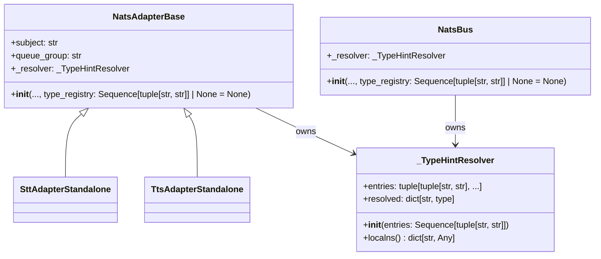

## Context

Promoted from `artifacts/frames/729-replace-global-type-registry-frame.mdx`.

`roxabi_nats._serialize` holds a process-global `_TYPE_CHECKING_IMPORTS: list[tuple[str, str]]` mutated at Lyra startup via `_register_type_checking_import("lyra.core.commands.command_parser", "CommandContext")`. `_get_hints()` reads that list at deserialization time and calls `importlib.import_module` on each entry. The short-term mitigation in PR #724 demoted the helper to a private `_`-prefixed name; this issue removes the global entirely.

ADR-045 Consequences section tracks this as "known design debt"; the note must disappear once the refactor lands.

## Goal

`NatsAdapterBase` and the `_serialize` API accept the set of TYPE_CHECKING-only type hints via an explicit, per-instance `type_registry` parameter — no module-level mutable state, no reliance on import order.

## Users

- **Primary (migrated in this PR):** `roxabi-nats` SDK consumers inside Lyra — `NatsBus`, `NatsRenderEventCodec`, `NatsChannelProxy`, `NatsOutboundListener`, inbound cache, envelope handlers, `SttAdapterStandalone`, `TtsAdapterStandalone`.
- **Primary (broken by this PR):** External SDK consumers — voiceCLI, roxabi-vault, imageCLI. `v0.2.0` is a constructor-signature breaking change *and* removes `_register_type_checking_import` and `_TYPE_CHECKING_IMPORTS` entirely. Any consumer importing those symbols hits `ImportError` at load — a loud, CI-visible failure rather than silent type-coercion degradation. These consumers MUST pin `roxabi-nats = ">=0.1.0,<0.2.0"` until they migrate to the `type_registry=` constructor kwarg. The removed symbols were always `_`-prefixed / hub-internal (documented in PR #724 and ADR-045); external consumers were never entitled to import them. No deprecation shim is introduced — the clean break avoids a transitional release (v0.3.0) and eliminates the possibility of silent data-correctness bugs that a no-op shim would mask.

## Expected Behavior

At adapter construction:

```python
adapter = SttAdapterStandalone(
    ...,
    type_registry=[
        ("lyra.core.commands.command_parser", "CommandContext"),
    ],
)
```

1. `NatsAdapterBase.__init__` builds a `_TypeHintResolver` from the list.
2. The resolver **fail-fast validates** every entry at construction time — any non-existent module or missing attribute raises `ValueError` immediately. Lyra crashes on boot rather than dropping a message on first deserialization.
3. The adapter stores the resolver as `self._resolver` and passes it into every `_serialize.deserialize*` call it makes.
4. `serialize` / `deserialize` / `deserialize_dict` accept an optional `resolver` keyword-only parameter. When omitted, a module-level `_EMPTY_RESOLVER` singleton is used. This singleton is an **immutable null-object** (no mutable fields, `entries == ()`, `resolved` as read-only mapping) — categorically distinct from `_TYPE_CHECKING_IMPORTS`, whose smell was mutation, not existence. Any attempt to mutate `_EMPTY_RESOLVER` raises at type-check time (Pyright) and at runtime.
5. `_register_type_checking_import` is **deleted**. `_TYPE_CHECKING_IMPORTS` is **deleted**. No deprecation shim: the symbols were `_`-prefixed hub-internal (per PR #724 + ADR-045), no known external caller exists, and `ImportError` on upgrade is a safer signal than silent degradation. External v0.1.x consumers that would have called these symbols must pin `<0.2.0` or migrate to `type_registry=`.
6. Non-adapter hub consumers (`NatsBus`, codecs, listeners, `_inbound_cache` factory, `nats_envelope_handlers` module functions) that call `deserialize*` directly accept `resolver` — either as a construction kwarg (for classes) or as a function parameter (for module-level functions). See class diagram note below.

At runtime, deserializing an `InboundMessage` whose `CommandContext` hint needs resolution:

1. `_get_hints()` receives the caller's resolver.
2. It walks the resolver's pre-imported `{type_name: type}` mapping (already populated and validated at adapter init — no `importlib` call on the hot path).
3. Returns type hints; decoding proceeds.

Edge cases:

| Case | Handling |
|------|---------|
| Empty `type_registry` at adapter init | OK. `_resolver` is the empty singleton. Deserialization works for all types that do not use TYPE_CHECKING-only imports. |
| Duplicate `(module, name)` entries | Deduped silently inside `_TypeHintResolver.__init__`. |
| Non-existent module path | Raises `ValueError(f"type_registry: cannot import {module_path}")` at adapter init. |
| Module exists but attribute missing | Raises `ValueError(f"type_registry: {module_path} has no attribute {type_name}")` at adapter init. |
| Caller imports `_register_type_checking_import` or `_TYPE_CHECKING_IMPORTS` from `roxabi_nats._serialize` | Both symbols are deleted in v0.2.0 → `ImportError` at load time. Loud, immediate, CI-visible. Fix: migrate to `type_registry=` constructor kwarg or pin `<0.2.0`. |
| External `v0.1.x` consumer upgrades to `v0.2.0` without migrating | `ImportError` on any code path that imported the deleted symbols. Cannot silently deserialize incorrectly. Documented in ADR-045 Consequences and `CHANGELOG[0.2.0].Breaking`. Mitigation: pin `roxabi-nats = ">=0.1.0,<0.2.0"` until migrated. |
| `deserialize()` called with no `resolver` kwarg | Uses empty-singleton resolver. Types without TYPE_CHECKING hints round-trip correctly; types that need a resolver fail at `get_type_hints` with the same `NameError` as today, caught and returning `{}` (unchanged fallback). |

## Data Model & Consumers

### Resolver structure



Note on non-class consumers: `nats_envelope_handlers` is a module of free functions (no class). It cannot "own" a resolver via `__init__`; instead each exported function gains a `resolver: _TypeHintResolver` parameter, and callers thread the lyra-owned `TYPE_REGISTRY_RESOLVER` through at call time. Same pattern for `_inbound_cache` factory function.

### Consumer summary

| Consumer | How it gets `resolver` | Call sites changed | Status |
|---|---|---|---|
| `NatsAdapterBase` | `type_registry` kwarg → `self._resolver` | `__init__` sig, `self._resolver`, helper `self._deserialize(data, T)` | this issue |
| `SttAdapterStandalone` | Passes `type_registry=None` (no CommandContext use today) | `super().__init__` call site | this issue |
| `TtsAdapterStandalone` | Passes `type_registry=None` | `super().__init__` call site | this issue |
| `NatsBus` | New `type_registry` ctor kwarg → `self._resolver` | `__init__`, every `deserialize_dict(...)` call adds `resolver=self._resolver` | this issue |
| `NatsRenderEventCodec` | Same pattern | `__init__`, `encode`/`decode` | this issue |
| `NatsChannelProxy` | `serialize`-only (no resolver needed for encode); accept kwarg for symmetry | `__init__` accepts param, passed for future-proofing | this issue |
| `NatsOutboundListener` | New ctor kwarg | `__init__`, `deserialize_dict` calls | this issue |
| `_inbound_cache` | Factory function gains `resolver` param | all call sites | this issue |
| `nats_envelope_handlers` | Module functions gain `resolver` param | all call sites | this issue |
| `src/lyra/nats/__init__.py` | Remove `_register_type_checking_import` call | Entire block removed | this issue |
| External consumers (voiceCLI, vault, imageCLI) | Pin `v0.1.x`; migrate in their own repos | — | future (out of scope) |

## Breadboard

### Affordances

| ID | Affordance | Handler | Inputs | Errors |
|----|-----------|---------|--------|--------|
| N1 | `_TypeHintResolver(entries)` | `__init__` imports each `(module_path, type_name)` at construction, dedupes, stores `{type_name: type}` in `resolved` | `Sequence[tuple[str, str]]` | `ValueError` on non-existent module / missing attribute |
| N2 | `_TypeHintResolver.localns()` | returns `dict(self.resolved)` (copy to prevent external mutation) | none | — |
| N3 | `serialize(item, *, resolver=_EMPTY_RESOLVER)` | resolver unused on encode path, accepted for API symmetry | item, optional resolver | — |
| N4 | `deserialize(data, item_type, *, resolver=_EMPTY_RESOLVER)` | passes resolver into `_decode → _decode_dataclass → _get_hints` | bytes, type, optional resolver | JSON errors unchanged |
| N5 | `deserialize_dict(d, item_type, *, resolver=_EMPTY_RESOLVER)` | same as N4, skips JSON parse | dict, type, optional resolver | same |
| N6 | `_get_hints(dc_type, resolver)` | replaces module-global read with resolver.localns() | type, resolver | unchanged fallback to `{}` on `NameError` |
| N7 | `NatsAdapterBase(..., type_registry=None)` | builds `_TypeHintResolver` (empty if `None`) → `self._resolver` | existing args + new kwarg | `ValueError` from N1 propagates |

### Non-code deliverables

- ADR-045 Consequences edit: remove "known design debt" paragraph for global registry; add "Resolved in #729" note recording the clean-break removal (no deprecation shim).
- `packages/roxabi-nats/pyproject.toml` version bump `0.1.x → 0.2.0`.
- `packages/roxabi-nats/CHANGELOG.md` entry under `[0.2.0]` → `Breaking`: constructor signature change + removed `_register_type_checking_import` and `_TYPE_CHECKING_IMPORTS`; include migration snippet showing `type_registry=` usage.

### Wiring

- Lyra bootstrap builds a single `TYPE_REGISTRY: tuple[tuple[str, str], ...]` constant (e.g. in `src/lyra/nats/type_registry.py`) listing `("lyra.core.commands.command_parser", "CommandContext")`. Immediately adjacent: `TYPE_REGISTRY_RESOLVER = _TypeHintResolver(TYPE_REGISTRY)` — a single resolver instance shared across all lyra consumers (fail-fast validation runs once at module import).
- Every lyra consumer (adapters, NatsBus, codecs, listeners, factories, envelope-handler functions) imports `TYPE_REGISTRY_RESOLVER` (not `TYPE_REGISTRY`) and passes it in at construction or per-call.
- `src/lyra/nats/__init__.py` stops calling `_register_type_checking_import`; the file goes back to plain re-exports.
- Scope note: a `NatsAdapterBase._deserialize` convenience helper was considered and rejected as out-of-scope for this issue — subclasses call `deserialize_dict(data, T, resolver=self._resolver)` directly. Can be revisited if boilerplate becomes painful across ≥3 subclasses.

## Slices

| # | Slice | Depends on | Scope | Demo |
|---|-------|------------|-------|------|
| 1 | SDK core: resolver + serialize API | — | `_TypeHintResolver` (with fail-fast `__init__`), updated `_serialize` signatures, `_get_hints` rewrite, `_EMPTY_RESOLVER` singleton. **Delete** `_register_type_checking_import` + `_TYPE_CHECKING_IMPORTS`. SDK-side unit tests use a **local stub dataclass** (e.g. `@dataclass class _StubWithTypeCheckingHint` with a TYPE_CHECKING-only annotation, registered via the test's own resolver) — no dependency on lyra's `CommandContext`. | `uv run pytest packages/roxabi-nats/tests/ -k "serialize or resolver"` green; `grep _register_type_checking_import packages/roxabi-nats/src/` returns zero. |
| 2 | Adapter base + subclasses | Slice 1 | `NatsAdapterBase.__init__` accepts `type_registry` keyword-only; stores `self._resolver`. `SttAdapterStandalone` + `TtsAdapterStandalone` pass `type_registry=None` (no TYPE_CHECKING types in their current payloads). SDK unit test covers fail-fast `ValueError` at resolver construction. | `pytest packages/roxabi-nats/tests/test_adapter_base.py` + `pytest src/lyra/bootstrap` green. |
| 3 | Lyra call-site migration + ADR + release signals | Slices 1, 2 | Introduce `src/lyra/nats/type_registry.py` with `TYPE_REGISTRY` + `TYPE_REGISTRY_RESOLVER`; thread `TYPE_REGISTRY_RESOLVER` through `NatsBus` (+ unit test covering non-empty resolver), `NatsRenderEventCodec`, `NatsChannelProxy`, `NatsOutboundListener`, `_inbound_cache` factory, `nats_envelope_handlers` module functions; drop `_register_type_checking_import` call in `src/lyra/nats/__init__.py`; remove `_TYPE_CHECKING_IMPORTS` module-level dict; update ADR-045 Consequences; bump `packages/roxabi-nats/pyproject.toml` to `0.2.0`; add CHANGELOG `[0.2.0]` entry. | Full `uv run pytest` green; `grep -r "_TYPE_CHECKING_IMPORTS" packages/ src/` returns zero matches; `packages/roxabi-nats/pyproject.toml` shows `version = "0.2.0"`. |

Slices ship as a **single PR** per issue convention (F-lite, one logical change). Slice ordering is for review + implementation sequencing, not multiple PRs — slice 2 cannot compile without slice 1's `_TypeHintResolver`, slice 3 cannot import `type_registry` without slice 2's adapter param.

## Success Criteria

**API shape:**
- [ ] `NatsAdapterBase.__init__` accepts `type_registry: Sequence[tuple[str, str]] | None = None` (keyword-only).
- [ ] `_serialize.serialize`, `deserialize`, `deserialize_dict` accept a keyword-only `resolver` parameter; defaults to a module-level `_EMPTY_RESOLVER` singleton — no read of any module-global mutable list.
- [ ] `_TypeHintResolver` type exists; its `__init__` calls `importlib.import_module` + `getattr` eagerly and raises `ValueError` with a descriptive message on failure (non-existent module, missing attribute).
- [ ] `_EMPTY_RESOLVER` is immutable (no mutable public fields; attempting to mutate `.resolved` raises at runtime and is rejected by Pyright).

**State removal:**
- [ ] `_TYPE_CHECKING_IMPORTS` module-level list is removed from `_serialize.py`.
- [ ] `_register_type_checking_import` function is removed from `_serialize.py` (no shim, no deprecation wrapper).
- [ ] `grep -rE "_TYPE_CHECKING_IMPORTS|_register_type_checking_import"` returns zero matches under `packages/` and `src/`.

**Call-site migration:**
- [ ] All lyra call sites (`src/lyra/nats/__init__.py`, `NatsBus`, `NatsRenderEventCodec`, `NatsChannelProxy`, `NatsOutboundListener`, `_inbound_cache`, `nats_envelope_handlers`, `SttAdapterStandalone`, `TtsAdapterStandalone`) pass `type_registry` / `resolver` explicitly.
- [ ] `src/lyra/nats/type_registry.py` exists with `TYPE_REGISTRY` and `TYPE_REGISTRY_RESOLVER` as the only place listing `("lyra.core.commands.command_parser", "CommandContext")`.

**Tests:**
- [ ] New SDK unit tests cover, using a local stub dataclass with a TYPE_CHECKING-only annotation (no lyra dependency): (a) non-empty resolver round-trip resolves the stub type, (b) empty resolver round-trip of a dataclass with no TYPE_CHECKING hints, (c) duplicate entries deduped, (d) non-existent module raises `ValueError` at resolver construction, (e) non-existent attribute raises `ValueError` at resolver construction, (f) importing `_register_type_checking_import` from `roxabi_nats._serialize` raises `ImportError` (guards the clean-break contract against regression).
- [ ] Lyra-side unit test covers `NatsBus` constructed with `TYPE_REGISTRY_RESOLVER` round-tripping an inbound payload that references `CommandContext`.

**Release signals:**
- [ ] `packages/roxabi-nats/pyproject.toml` version bumped to `0.2.0`.
- [ ] `packages/roxabi-nats/CHANGELOG.md` has `[0.2.0]` entry documenting: Breaking — constructor signature change on `NatsAdapterBase`, removed `_register_type_checking_import` and `_TYPE_CHECKING_IMPORTS`; Migration snippet showing `type_registry=[(module, name), ...]` usage.
- [ ] `docs/architecture/adr/045-roxabi-nats-sdk-uv-workspace-extraction.mdx` Consequences section no longer lists the global registry as design debt; replaced with "Resolved in #729 (v0.2.0 — clean break, no deprecation shim)".

**Quality gates:**
- [ ] `uv run pytest` passes (unit + integration).
- [ ] `uv run pyright` clean.
- [ ] `uv run ruff check .` clean.
