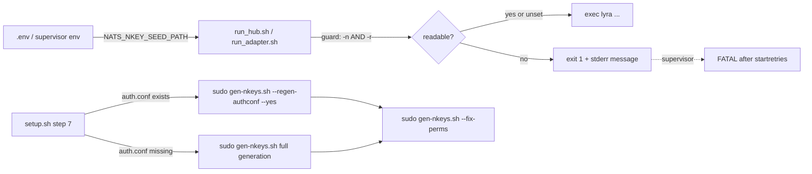

## Context

Promoted from `artifacts/frames/736-supervisor-seed-guard-authconf-frame.mdx`.

Two silent drift sources from the #689 Machine-1 cutover remain after PR #735:

1. `run_adapter.sh` / `run_hub.sh` `exec` the CLI without validating `NATS_NKEY_SEED_PATH`. Missing or unreadable seeds produce a late `FileNotFoundError` inside Python while supervisor still reports `RUNNING` — masking auth failures as connectivity issues.
2. `deploy/nats/setup.sh` step 7 runs `gen-nkeys.sh --fix-perms` only, so a clean re-provision never re-renders `auth.conf` against the current IDENTITIES matrix. This reproduces the exact drift ADR-046 catalogues.

The script surface is small and single-domain (deploy/supervisor hygiene). PR #735 handled the `.env` override regression; this spec handles the structural readiness + idempotent provisioning gap.

## Goal

Make missing-seed failures visible at startup (supervisor `FATAL` state with actionable stderr) and make `setup.sh` idempotently re-render `auth.conf` on every run.

## Users

- **Primary:** Mickael operating Machine 1 during cutovers, re-provisions, and post-incident recovery.
- **Secondary:** Supervisor itself — once the guard exits non-zero, `autorestart=true` + `startretries` eventually surface the failure as `FATAL` in `supervisorctl status`.

## Constraints

- Test must run without sudo and be suitable for CI.
- `gen-nkeys.sh --regen-authconf` and `--fix-perms` have mutually-exclusive early-exit dispatch (see `deploy/nats/gen-nkeys.sh:218-291`) — implementations must issue two separate `sudo` invocations in `setup.sh`, never one combined call.
- `render_auth_conf()` is already deterministic (no timestamps, ordered `IDENTITIES` array; `deploy/nats/gen-nkeys.sh:123-144`). No new template changes required to preserve idempotency.
- Supervisor default `startretries=3` with `autorestart=true` means a missing seed produces 3 `BACKOFF` cycles before `FATAL`. Acceptable — no retry tuning in scope.

## Expected Behavior

**Path A — seed missing:** supervisor starts `lyra_hub` → `run_hub.sh` sources `.env`, reads `NATS_NKEY_SEED_PATH`, finds the file unreadable → exits non-zero with stderr identifying the offending variable and path before `exec`. Supervisor cycles through `startretries` then marks the program `FATAL`. `supervisorctl status lyra_hub` shows `FATAL`; `supervisorctl tail lyra_hub stderr` shows the guard message.

**Path B — seed present:** unchanged. `exec` proceeds, the CLI starts normally.

**Path C — re-provision:** operator runs `make nats-setup`. Step 7 detects existing `auth.conf`, issues **two sequential `sudo` calls**: first `gen-nkeys.sh --regen-authconf --yes` to re-render `auth.conf` from current seeds, then `gen-nkeys.sh --fix-perms` to re-apply seed/auth.conf permissions. Fresh run with no `auth.conf` keeps the current full-generation path (no change).

**Path D — chmod-only recovery:** operator runs `sudo ./deploy/nats/gen-nkeys.sh --fix-perms` directly. Unchanged — preserves the permission-only use case.

**Path E — unexpected guard trigger on prod:** guard fires despite `NATS_NKEY_SEED_PATH` appearing correct. Operator recovery: inspect `supervisorctl tail <program> stderr` for the path, verify file readability as the supervisor user, fix perms with `sudo ./deploy/nats/gen-nkeys.sh --fix-perms` if needed, then `supervisorctl start <program>`.

## Data Model & Consumers

No new data structures. This change is purely control flow in shell scripts. Relevant flow:

**Consumer summary:**

| Consumer | Reads / calls | When | Status |
|---|---|---|---|
| supervisor `lyra_hub` | `run_hub.sh` | startup | this issue |
| supervisor `lyra_telegram` / `lyra_discord` | `run_adapter.sh` | startup | this issue |
| `make nats-setup` | `setup.sh` step 7 | provisioning | this issue |
| Operator chmod recovery | `gen-nkeys.sh --fix-perms` | ad-hoc | preserved (no change) |

## Breadboard

**Affordances:**

| ID | Element | Location | Handler |
|---|---|---|---|
| S1 | Seed-path guard | `deploy/supervisor/scripts/run_hub.sh` | inline `[ -n "$NATS_NKEY_SEED_PATH" ] && [ ! -r "$NATS_NKEY_SEED_PATH" ]` → print message to stderr → `exit 1`; placed after `unset _sv_snapshot`, before `exec` |
| S2 | Seed-path guard | `deploy/supervisor/scripts/run_adapter.sh` | same guard as S1 (shared helper or duplicated inline) |
| S3 | Idempotent auth.conf render | `deploy/nats/setup.sh` step 7 | in the `[ -f "${NKEYS_AUTH}" ]` branch, replace single `--fix-perms` call with **two sequential `sudo` invocations**: `gen-nkeys.sh --regen-authconf --yes`, then `gen-nkeys.sh --fix-perms`. Fresh-generation branch unchanged. |
| T1 | bash syntax check | `tests/deploy/test_supervisor_scripts.sh` | `bash -n run_hub.sh && bash -n run_adapter.sh <arg>` |
| T2 | Missing-seed failure path | `tests/deploy/test_supervisor_scripts.sh` | set `NATS_NKEY_SEED_PATH=/nonexistent`, invoke script with fake `$HOME` (no `.env`, no `.venv` — guard must fire before those are reached), assert exit != 0 and stderr contains `NATS_NKEY_SEED_PATH` + path |

**Wiring:** guard fires only when `NATS_NKEY_SEED_PATH` is set and non-empty — unset = no guard (preserves behavior for future non-NATS invocations). Guard executes after the env-snapshot restore so supervisor-provided per-program paths win, matching the pattern PR #735 established.

## Slices

| # | Slice | Affordances | Demo |
|---|---|---|---|
| 1 | Seed guard in both supervisor scripts | S1, S2 | `NATS_NKEY_SEED_PATH=/missing bash -c './run_hub.sh'` → exit 1 with stderr naming the path |
| 2 | setup.sh re-render on re-provision | S3 | re-run `make nats-setup` on Machine 1 → log shows both `--regen-authconf` and `--fix-perms` ran; `auth.conf` content matches current IDENTITIES |
| 3 | Test harness for guard + bash -n | T1, T2 | `bash tests/deploy/test_supervisor_scripts.sh` → PASS |

Slice 3 depends on slices 1 and 2 landing first (test asserts the guard exists).

## Success Criteria

- [ ] With `NATS_NKEY_SEED_PATH` set to a missing/unreadable file, `run_hub.sh` exits non-zero before `exec`, and `supervisorctl tail lyra_hub stderr` shows a message containing both the variable name and the offending path.
- [ ] Under the same condition, `run_adapter.sh` exits non-zero for any adapter invocation, and `supervisorctl status` reports the affected program as `FATAL` (after `startretries` cycles).
- [ ] With `NATS_NKEY_SEED_PATH` unset, both scripts behave exactly as before (no regression for flows that do not use NATS seeds).
- [ ] `deploy/nats/setup.sh` step 7 issues two sequential `sudo` calls when `auth.conf` exists: `gen-nkeys.sh --regen-authconf --yes` followed by `gen-nkeys.sh --fix-perms`. Both invocations complete with exit 0 on a healthy Machine 1.
- [ ] After re-running `make nats-setup` on a Machine 1 with a stale `auth.conf`, the rendered `auth.conf` matches the current `IDENTITIES` matrix (verified by running `tests/nats/test_gen_nkeys_acls.sh` post-install).
- [ ] `gen-nkeys.sh --fix-perms` remains a valid standalone invocation (Path D unchanged).
- [ ] Running `make nats-setup` twice in a row completes without error both times and NATS auth continues to succeed for all configured identities.
- [ ] `tests/deploy/test_supervisor_scripts.sh` exists, runs `bash -n` on both supervisor scripts, and simulates the missing-seed failure path; test passes via plain `bash tests/deploy/test_supervisor_scripts.sh`.
- [ ] Existing `tests/nats/test_gen_nkeys_acls.sh` continues to pass unchanged.
