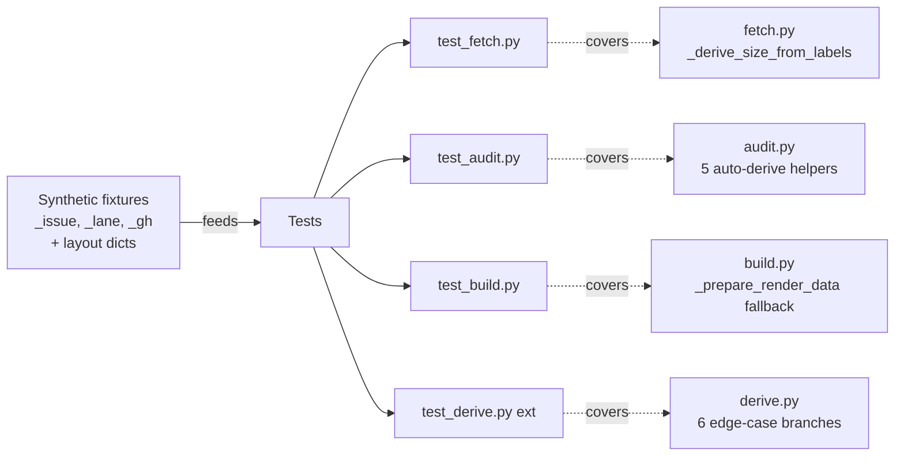

## Context

Promoted from [frame](../frames/740-test-coverage-gaps-frame.mdx). PR #739 shipped the dep-graph auto-derive logic (lane order, par_groups, bands from GitHub metadata) with 11 unit tests focused on the happy path and ordering semantics in `derive.py`. The `tester` review agent flagged 9 specific coverage gaps that were deferred to keep that PR tight. This spec scopes a dedicated backfill PR that closes all 9 gaps without touching production code.

Surgical audit of the 9 gaps is the source of truth for test targets — see [Breadboard](#breadboard) for the concrete code regions.

## Goal

Every enumerated coverage gap has at least one passing unit test that fails if the corresponding production branch is broken.

## Users

- **Primary:** Mickael — iterates on `derive.py` / `audit.py` / `fetch.py` / `build.py`; needs CI red/green feedback on auto-derive behavior.
- **Secondary:** Future `/dev #N` invocations modifying the dep-graph modules — trust in impact analysis scales with coverage.

## Constraints (hard)

1. **No production code changes.** `scripts/dep-graph/dep_graph/*.py` MUST remain byte-identical to `origin/staging` for this PR. If a test needs a helper that isn't currently exported, import it by its private name — do NOT refactor production modules to ease testing.
2. **No filesystem, no network.** Every fixture is a synthetic Python dict built in-test. No `gh.json` load, no real GitHub API.
3. **Import discovery up front.** Before writing `test_audit.py` cases, verify each of the 6 target helpers (`_build_layout_sets`, `_collect_auto_placed`, `_check_placement`, `_check_meta`, `_check_standalone`, `_check_defer`) is importable from `dep_graph.audit` (module-level `def`, not a closure). If any is a closure, note it in the PR description and test via the public entry point.

## Expected Behavior

- `cd scripts/dep-graph && uv run pytest -v` discovers and runs the new/extended tests alongside the existing 11.
- CI step added in PR #739 (`uv sync --frozen && uv run pytest tests/` in `scripts/dep-graph/`) executes the expanded suite on every push.
- A fault introduced in any of the 9 target code regions causes at least one test to fail (mutation-catch semantics).
- Tests run without network access and without touching the filesystem.

## Data Model & Consumers

The "data model" is the synthetic fixture shapes already established in `tests/test_derive.py` (`_issue`, `_lane`, `_gh` helpers). No new production types. New test files reuse these helpers (via import from `tests.test_derive` or by duplicating into a shared `conftest.py` if pytest collection flags the cross-file import) and add thin fixtures for `audit.py` layout dicts.

**Consumer map:**

| Consumer (test file) | Fixtures used | Target module | Gaps covered |
|---|---|---|---|
| `test_fetch.py` *(new)* | Raw label lists | `fetch.py` | G1 |
| `test_audit.py` *(new)* | `_issue`, synthetic layout dicts | `audit.py` | G2a–G2f |
| `test_build.py` *(new)* | `_issue`, `_lane`, `_gh`, layout with + without explicit `standalone.order` | `build.py` | G3 |
| `test_derive.py` *(extended)* | existing helpers | `derive.py` | G4–G9 |

## Breadboard

Each gap → a specific code region → a test handler. IDs are referenced from [Slices](#slices) and [Success Criteria](#success-criteria).

| ID | Gap | File | Region | Handler (test) |
|---|---|---|---|---|
| G1 | `_derive_size_from_labels` dark branches | `fetch.py:133–138` | empty list / no `size:` prefix / `size:*` valid / multiple `size:*` → first wins | `test_fetch.py::test_derive_size_*` (≥4 cases) |
| G2a | `_build_layout_sets` | `audit.py:268–304` | lane with vs without `order` / epic with `repo` → added to `epic_set` / **epic with no `repo` → silently excluded (line 301 `if epic_repo:`)** | `test_audit.py::test_build_layout_sets_*` (≥3 cases) |
| G2b | `_collect_auto_placed` | `audit.py:307–344` | `auto_lane_codes` empty / non-empty match via `lane_label` / `standalone.order` absent → auto-mode extends `standalone_set` | `test_audit.py::test_collect_auto_placed_*` (≥3 cases) |
| G2c | `_check_placement` skip path | `audit.py:347–364` | `layout_lane_of` empty → prints skipped msg, returns False / populated → calls `_check_label_mismatches` | `test_audit.py::test_check_placement_*` (both branches) |
| G2d | `_check_meta` auto_placed plumbing | `audit.py:367–378` | verifies `auto_placed` is forwarded to `_check_defer`, NOT to `_check_standalone` | `test_audit.py::test_check_meta_forwards_auto_placed` (spy/stub on sub-helpers) |
| G2e | `_check_standalone` auto-mode branch | `audit.py:213–265` | `standalone.order` empty/absent → auto-mode returns False with message / explicit order present → drift detection runs | `test_audit.py::test_check_standalone_auto_mode` (both branches) |
| G2f | `_check_defer` `auto_placed` arg | `audit.py:177–210` | `auto_placed=None` (default) → items not excluded / `auto_placed` populated → those items excluded from `only_in_gh` drift bucket | `test_audit.py::test_check_defer_auto_placed` (both branches) |
| G3 | `build._prepare_render_data` `standalone` fallback | `build.py:1210–1211` | `standalone.get("order")` falsy → `derive_standalone_order` called / truthy → `derive_standalone_order` NOT called. **Note:** `derive_lane` at line 1209 is called unconditionally for EVERY lane (graceful degradation lives inside `derive_lane` itself); this gap is only about the `standalone.order` branch. | `test_build.py::test_prepare_render_data_standalone_fallback_called` + `test_prepare_render_data_standalone_fallback_skipped` (split positive/negative) |
| G4 | Epic exclusion | `derive.py:_collect_lane_issues` ~134–135 | epic in `primary_repo` excluded / epic in different repo NOT excluded | `test_derive.py::test_derive_lane_epic_excluded_same_repo` + `test_derive_lane_epic_not_excluded_cross_repo` |
| G5 | `derive_standalone_order` empty + malformed | `derive.py:271–294` | `{}` → `[]` / entry missing `number` → skipped / `standalone=False` → skipped / **(separate test)** entry with no `repo` defaults to `primary_repo` | `test_derive.py::test_derive_standalone_order_skips_malformed` (parametrized skip cases) + `test_derive_standalone_order_defaults_repo` (distinct positive test) |
| G6 | Empty-lane fast path | `derive.py:210–211` | no matching issues → returns `{order: [], par_groups: {}, bands: []}` | `test_derive.py::test_derive_lane_empty_fast_path` |
| G7 | Single-node `par_groups` guard | `derive.py:172` | depth bucket of size 1 → no `par_groups` entry created | `test_derive.py::test_derive_lane_single_node_no_par_group` |
| G8 | `_derive_bands` transitions | `derive.py:227–268` | `None → named` → band inserted / `named → None` → NO band inserted / all-same named milestone → exactly 1 band at start | `test_derive.py::test_derive_bands_none_to_named` + `test_derive_bands_named_to_none` + `test_derive_bands_all_same_milestone` (3 separate tests) |
| G9 | `_build_par_groups` `has_inner_edge` skip | `derive.py:175–180` | bucket with intra-bucket edge → skipped (no par_group) / bucket without → par_group created. **Fixture hint:** construct a cycle between two would-be-same-depth issues (e.g. A and B both `blocked_by` siblings only) so both resolve to the same depth, then add an A→B edge via `blocked_by` that the topo-sort cycle-handler keeps in the edge map. If construction is non-trivial, assert by calling `_build_par_groups` directly with a hand-built `depth`/`edges` input instead of driving through `derive_lane`. | `test_derive.py::test_build_par_groups_has_inner_edge_skip` + `test_build_par_groups_creates_group_without_inner_edge` |

## Slices

Vertical increments — each independently runnable and demonstrable via `uv run pytest -v tests/<file>`.

| # | Slice | Covers | Exit criteria |
|---|---|---|---|
| 1 | **Extend `test_derive.py`** with Gaps 4–9 | G4–G9 | All new `test_derive_*` tests green; existing 11 still pass; each added test flips red if you mutate the target line. |
| 2 | **Create `test_fetch.py`** with Gap 1 | G1 | `uv run pytest -v tests/test_fetch.py` green; ≥4 cases covering empty / no-`size:` / valid / multiple labels. |
| 3 | **Create `test_audit.py`** with Gaps 2a–2f | G2a–G2f | `uv run pytest -v tests/test_audit.py` green; all 6 helpers exercised with synthetic dicts; constraint #3 (closure audit) recorded in PR description. |
| 4 | **Create `test_build.py`** with Gap 3 | G3 | `uv run pytest -v tests/test_build.py` green; patch target is `dep_graph.build.derive_standalone_order` (NOT `dep_graph.derive.derive_standalone_order`) — the import in `build.py` is what we need to intercept. Separate positive (called) and negative (not called) assertions. |

Slice dependencies: `1` and `2` are independent. `3` is independent but benefits from the `_issue`/`_gh` patterns established in 1. `4` is independent. Suggested order: 2 → 1 → 3 → 4 (smallest first for fastest feedback), but any order works — all four slices land in one PR.

## Success Criteria

- [ ] **No production code modified** — `git diff origin/staging -- scripts/dep-graph/dep_graph/` is empty.
- [ ] `scripts/dep-graph/tests/test_fetch.py` exists and covers G1 with ≥4 passing cases (empty list, no-size-label, valid `size:*` label, multiple `size:*` labels → first wins).
- [ ] `scripts/dep-graph/tests/test_audit.py` exists and covers G2a–G2f: `_build_layout_sets` (≥3 cases including epic-with-missing-repo); `_collect_auto_placed` (≥3 cases); `_check_placement` (both skip/populated branches); `_check_meta` forwards `auto_placed` correctly; `_check_standalone` (both auto-mode branches); `_check_defer` (both `auto_placed=None` and populated branches).
- [ ] `scripts/dep-graph/tests/test_build.py` exists and covers G3 with 2 tests: `derive_standalone_order` called when `standalone.order` absent; NOT called when present. Patch target is `dep_graph.build.derive_standalone_order`.
- [ ] `scripts/dep-graph/tests/test_derive.py` is extended with tests for G4 (2 tests: same-repo excluded + cross-repo not excluded), G5 (skip-cases parametrized + separate `defaults_repo` test), G6 (empty-lane fast path), G7 (single-node guard), G8 (3 separate tests for `None→named`, `named→None`, all-same), G9 (intra-edge skip + no-intra-edge creation).
- [ ] All tests use synthetic dicts only — no filesystem reads, no network calls. `grep -E "open\(|json\.load|requests\.|gh\.json" scripts/dep-graph/tests/` returns nothing from the new files.
- [ ] `cd scripts/dep-graph && uv run pytest -v` exits 0; every gap G1–G9 has at least one test whose target line is the sole cause of failure when mutated (verified by spot-mutation on 3 gaps of the author's choice; the PR description records which 3 were mutation-checked).
- [ ] CI workflow step from PR #739 (`.github/workflows/ci.yml` dep-graph job) passes on the PR branch without changes to workflow YAML.
- [ ] `uv run ruff check scripts/dep-graph/tests/` and `uv run ruff format --check scripts/dep-graph/tests/` pass.
