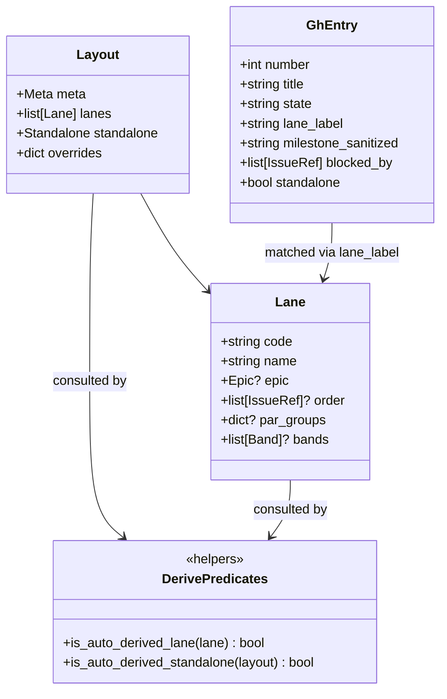
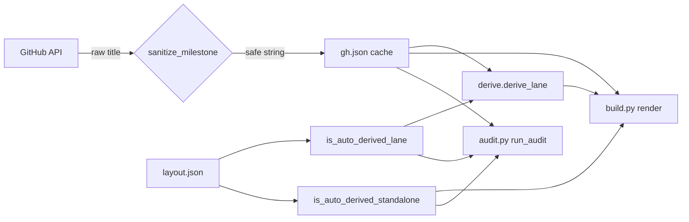

## Context

Promoted from `artifacts/frames/741-dep-graph-review-warnings-frame.mdx` (approved 2026-04-16).

PR #739 landed auto-derive for `order` / `par_groups` / `bands`. Its code review (https://github.com/Roxabi/lyra/pull/739#issuecomment-4258385659) surfaced 8 non-blocking warnings deferred to keep that PR focused. This spec locks in the fix-vs-defer decision for each, and scopes the single follow-up PR.

Code locations verified before drafting:
- `fetch.py:137` — size-label slice, no length cap.
- `fetch.py:194` — `milestone_title = raw_milestone.get("title") or None` — raw GH string lands in `gh.json`.
- `derive.py:201` — `if "order" in lane: return lane unchanged` (auto-derive early-exit).
- `derive.py:72-114` — `_topo_sort` with `_resolve_cycle` fallback (single `max_depth+1` for all cycle members).
- `derive.py:227-268` — `_derive_bands` emits on every milestone transition.
- `audit.py:284` — `if "order" not in lane: auto_lane_codes.add(code)` (duplicate of the derive.py:201 predicate logic).
- `audit.py:332` — `standalone_auto = not bool(layout.get("standalone", {}).get("order"))`.
- `build.py:1210` — `if not standalone.get("order"):` (duplicate of the audit.py:332 standalone-auto predicate).
- `titles.py:82-86` — `re.sub(pattern, replacement, t)` loop with no error guard.
- `layout.schema.json:80-90` — `standalone` object; description does not call out `{} == {"order": []}` equivalence.

## Goal

Land items 1, 2, 7, 8 as a single "pure cleanup" PR with zero behavior change on the golden path, and record an explicit fix-or-won't-fix decision for items 3, 4, 5, 6 so the warnings backlog is fully resolved.

## Users

- **Primary:** Mickael — planning weekly via dep-graph; benefits from sanitized cache, single-source predicates, and clearer schema doc.
- **Secondary:** future `roxabi-dashboard` maintainers — reduced drift cost when the codebase generalizes.

## Expected Behavior

Post-PR, the dep-graph generator must:

1. Produce **byte-identical HTML** to the pre-PR output for the current `lyra-v2-dependency-graph.layout.json` (protected by existing golden test).
2. Write **sanitized `milestone` strings** into `gh.json` — alphanumerics + dash/space/slash/hash/dot/underscore/parens, trimmed, capped to 64 chars. `build.py` and `audit.py` then consume safe-by-construction values; any residual `escHtml` at render becomes a no-op.
3. Derive auto-lane / auto-standalone status via **single-source helpers** in `derive.py` (`is_auto_derived_lane`, `is_auto_derived_standalone`). `audit.py` and `build.py` import these; no independent re-implementation.
4. Emit a **stderr warning** (not a hard fail) when a custom `title_rule` contains an invalid regex; the build continues with built-in rules.
5. **Cap size-label suffix** to 16 chars at ingest (`fetch.py:137`) — unbounded GH labels cannot bloat the cache.
6. `layout.schema.json` **documents** the `standalone: {}` ≡ `standalone: {"order": []}` equivalence in the `description` field.

The HTML output, `gh.json` shape (apart from sanitized string contents), and CLI entry points are unchanged.

## Data Model & Consumers

### Consumer summary

| Consumer | Fields / helpers consumed | When | Status |
|----------|---------------------------|------|--------|
| `build.py::_prepare_render_data` | `gh.milestone` (sanitized), `is_auto_derived_standalone` | every build | this PR — imports helper |
| `audit.py::run_audit` | `gh.milestone` (sanitized), `is_auto_derived_lane`, `is_auto_derived_standalone` | every audit | this PR — imports both helpers |
| `derive.py::derive_lane` | `is_auto_derived_lane` | every auto-derive | this PR — exposes + self-imports |
| `titles.py::apply_title_rules` | custom regex rules (guarded) | every render | this PR — try/except wrap |
| future `roxabi-dashboard` | same helpers | — | future (dashed edge in flow above) |

## Breadboard

### Affordances (functions to add / modify)

| ID | Kind | Location | Signature | Slice |
|----|------|----------|-----------|-------|
| N1 | new fn | `derive.py` | `is_auto_derived_lane(lane: dict) -> bool` | S1 |
| N2 | new fn | `derive.py` | `is_auto_derived_standalone(layout: dict) -> bool` | S1 |
| N3 | new fn | `fetch.py` | `_sanitize_milestone(raw: str) -> str \| None` | S2 |
| M1 | modify | `derive.py:201` | `derive_lane` uses `is_auto_derived_lane` internally | S1 |
| M2 | modify | `audit.py:284` | replace inline `"order" not in lane` with `is_auto_derived_lane(lane)` | S1 |
| M3 | modify | `audit.py:332` | replace inline predicate with `is_auto_derived_standalone(layout)` | S1 |
| M4 | modify | `build.py:1210` | replace inline predicate with `is_auto_derived_standalone(layout)` | S1 |
| M5 | modify | `fetch.py:194` | pipe `milestone_title` through `_sanitize_milestone` | S2 |
| M6 | modify | `fetch.py:137` | cap `lbl[5:]` to `lbl[5:21]` (16-char suffix) | S3 |
| M7 | modify | `titles.py:82-86` | wrap `re.sub` loop with `try/except re.error` + stderr warn | S3 |
| M8 | modify | `layout.schema.json:80-82` | expand `description` to: `"OPTIONAL: standalone section. When order[] is absent, empty, or the entire object is {} (all three forms are equivalent), the section is auto-derived from graph:standalone labels."` | S2 |
| M9 | modify | `derive.py:227-268` | `_derive_bands` emits one band per **unique** milestone | S4 (conditional) |

### Data wiring

- N1 / N2 are pure functions; callers pass in the already-parsed layout / lane dict.
- N3 applies: strip → keep chars matching `[A-Za-z0-9 \-_.#/()]` (preserves real GH names like `v2.4.0 (alpha)`, `Sprint #3`, `Q2 2026 / Backend`) → re-strip → truncate to 64 chars → return `None` if empty. Characters outside the allowlist are dropped silently; this is the documented tradeoff vs escape-at-render.
- M6 truncates after the existing prefix-strip, preserving the `size:` semantics (e.g. `size:very-long-custom-XX` → `very-long-custom`).
- M7 failure path: regex error in a user-supplied rule prints `WARN title_rule regex error: …` and continues with remaining rules.

## Slices

| Slice | Covers items | Scope | Demo-able as |
|-------|--------------|-------|--------------|
| **S1 — Predicate extraction** | 2, 7 | N1, N2, M1–M4 | `make dep-graph audit` output unchanged; `grep` shows single definition of each predicate |
| **S2 — Sanitize + schema doc** | 1, 8 | N3, M5, M8 | `gh.json` milestone strings pass `re.fullmatch(r"[A-Za-z0-9 \-_.]{0,64}")`; `make dep-graph validate` passes; schema `description` rendered in IDE hover |
| **S3 — Defense-in-depth** | 5, 6 | M6, M7 | unit test: malformed title-rule regex → stderr warn, no crash; unit test: `lbl = "size:" + "x"*100` → cached as 16-char string |
| **S4 — Band dedup** *(conditional on Item 4 decision)* | 4 | M9 | unit test: input `[M0, M1, M0, M2]` topo order → exactly 3 band headers (`M0`, `M1`, `M2`), in first-occurrence order |

Item 3 (multi-component cycle collapse) has **no slice** — won't-fix per decision below.

All slices land in **one PR**; the git history has one commit per slice for reviewability.

## Decisions for deferred items (3, 4, 5, 6)

| # | Item | Decision | Rationale |
|---|------|----------|-----------|
| 3 | Multi-component cycle collapse in `_topo_sort` | **Won't fix (documented)** | Current behavior is correct; the only cost is lost parallelism inside a cycle. GitHub native blocked-by cycles are rare-to-nonexistent (would require a user to create one deliberately). Tarjan SCC + per-component depth rebalancing adds ~50 LOC and a new edge case class for a theoretical gain. Revisit if we ever see a real-world cycle. Add a 3-line comment to `_resolve_cycle` noting the simplification. |
| 4 | Interleaved milestone bands | **Fix (M9)** | Observable as weird output: a re-visited milestone emits a duplicate header mid-lane. Fix is local to `_derive_bands`: track `seen_milestones: set[str]`, emit a band only when the compound condition **`milestone != prev_milestone AND milestone not in seen_milestones AND milestone is not None`** holds. Add to `seen_milestones` on emit; always update `prev_milestone`. Preserves topo order, avoids the sort-by-milestone alternative that would scramble card order, and correctly handles the `[None, M0, None, M0]` case (M0 emits once at iter 2, not again at iter 4). |
| 5 | Invalid `title_rule` regex guard (`titles.py`) | **Fix (M7)** | Cheap (3 lines), prevents a malformed user-supplied `title_rule` from killing the build. Matches the "warn, don't crash" posture of the rest of the pipeline. |
| 6 | Size label length cap | **Fix (M6)** | One-line defense-in-depth. Unbounded GH label names can't realistically exploit anything today, but the cost is a 5-char diff. |

No "won't fix" comments posted on the issue until user approval of these decisions.

## Success Criteria

- [ ] `derive.is_auto_derived_lane` exists and is the only place evaluating `"order" in lane` for auto-detection.
- [ ] `derive.is_auto_derived_standalone` exists and is the only place evaluating `not bool(layout.get("standalone", {}).get("order"))` for auto-detection (matches the existing `audit.py:332` form, not attribute access).
- [ ] `audit.py` and `build.py` import both predicates from `derive.py`; no inline copies remain.
- [ ] `fetch._sanitize_milestone` exists; `gh.json` milestones match `r"^[A-Za-z0-9 \-_.#/()]{0,64}$"` or are absent.
- [ ] Size-label suffix in `gh.json` is ≤16 chars for any input label.
- [ ] `titles.apply_title_rules` with an invalid user-supplied `title_rule` regex logs `WARN title_rule regex error: …` to stderr, skips that rule, and continues applying the remaining rules (user + built-in) to the input string.
- [ ] `_derive_bands` emits one header per **unique** milestone across a lane's topo order (no duplicate headers for re-visited milestones).
- [ ] `_resolve_cycle` carries a ≤3-line comment explaining the `max_depth+1` simplification is intentional (multi-component collapse accepted).
- [ ] `layout.schema.json` `standalone.description` mentions the `{} == {"order": []}` equivalence explicitly.
- [ ] Existing golden render test (`lyra-v2-dependency-graph.layout.json` → HTML) passes **byte-identical**.
- [ ] `make dep-graph validate` passes on the updated schema.
- [ ] `make dep-graph audit` output is structurally unchanged on the current layout (no new warnings, no removed warnings).
- [ ] `uv run ruff check .`, `uv run ruff format --check .`, `uv run pyright scripts/dep-graph/` all pass.
- [ ] New unit tests cover: sanitize_milestone (alphanum passes, `v2.4.0 (alpha)` preserved, HTML tag stripped, 100-char input → 64-char output, empty input → None), size-label cap, regex-error guard, band dedup including the `[M0, M1, M0, M2]` and `[None, M0, None, M0]` cases.
