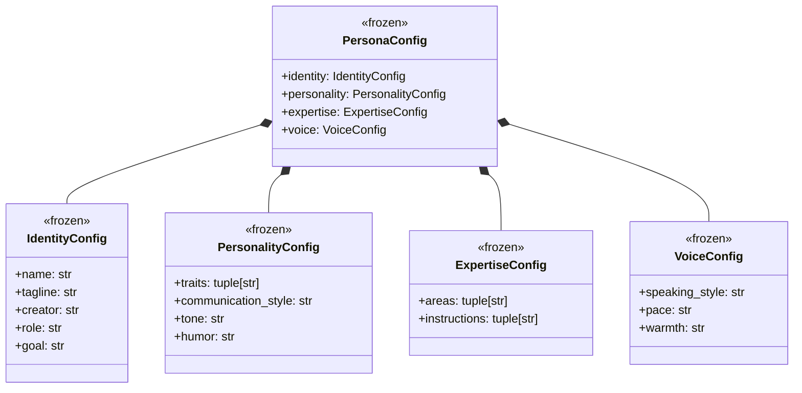
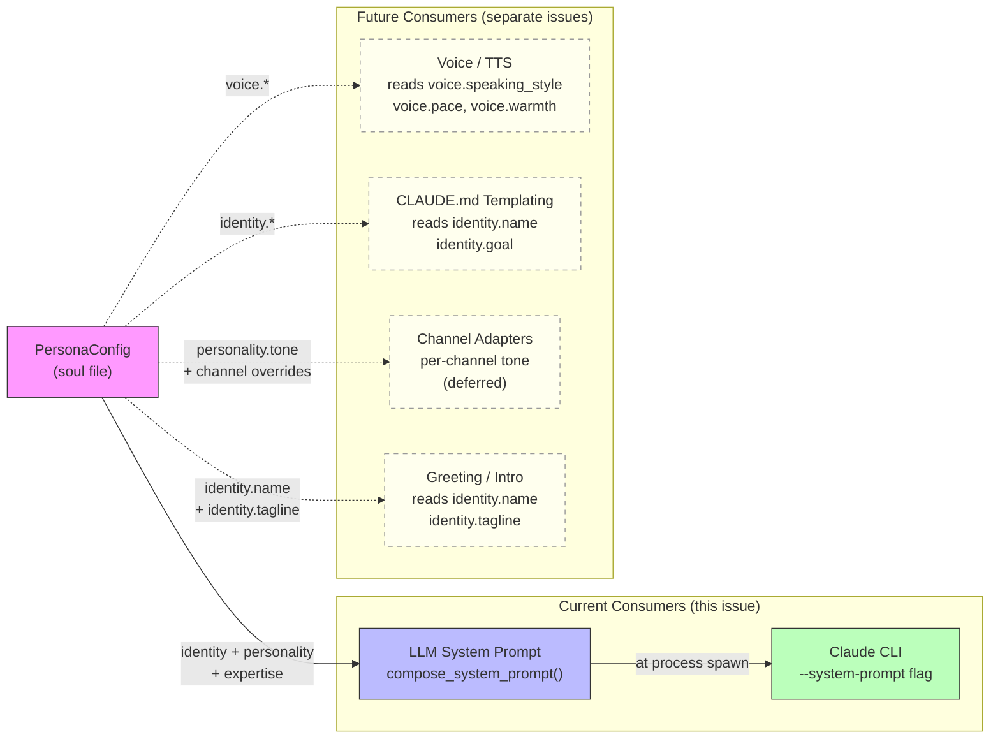

## Context

Promoted from [frame](../frames/75-agent-persona-frame.mdx). Analysis: [analysis](../analyses/75-agent-persona-analysis.mdx).

Lyra's identity is a raw system prompt string in the agent TOML. This works for basic LLM chat but can't serve other consumers (voice/TTS, CLAUDE.md templating) and isn't composable. Additionally, the system prompt is **never injected** into the Claude CLI subprocess (`_build_cmd()` omits `--system-prompt`).

Landscape research (OpenClaw/Soul Spec, CrewAI, OpenFang, etc.) confirms our 4-section structured approach is more granular than most frameworks and appropriate for multi-consumer use.

## Goal

Provide a structured, human-editable persona config file ("soul file") that auto-composes into a system prompt, is actually injected into the CLI subprocess, and is programmatically accessible for external consumers.

## Users

- **Primary:** Mickael — crafts the persona by hand, consumes it across chat and voice.
- **Secondary:** Lyra — presents consistently across all surfaces.

## Expected Behavior

1. Mickael creates `src/lyra/agents/lyra_default.persona.toml` with structured fields covering identity, personality, expertise, and voice characteristics.
2. The agent TOML (`lyra_default.toml`) references the persona file via a `persona_file` key in `[agent]`.
3. At agent initialization, the persona file is loaded into a `PersonaConfig` dataclass.
4. A prompt builder auto-composes a **natural prose** system prompt from the persona fields (name, goal, traits, expertise, rules) — not a mechanical field dump.
5. If `[prompt].system` is present in the agent TOML, it overrides the auto-composed prompt (backwards-compatible escape hatch).
6. The system prompt (composed or override) is passed to the Claude CLI via `--system-prompt` flag — fixing the current injection gap in `_build_cmd()`.
7. External consumers (future voice generation, templates) access persona fields programmatically via `agent.config.persona.name`, `agent.config.persona.voice`, etc.

## Persona Data Model & Consumers

### Data Structure



### Consumer Map



**Legend:** Solid lines = this issue. Dashed lines = future consumers (out of scope, but persona fields must be accessible for them).

| Consumer | Fields consumed | When | Status |
|----------|----------------|------|--------|
| LLM System Prompt | identity.*, personality.*, expertise.* | Agent init / hot-reload | This issue |
| Claude CLI injection | composed system_prompt string | Process spawn | This issue |
| Voice / TTS | voice.speaking_style, voice.pace, voice.warmth | Speech generation | Future |
| CLAUDE.md templating | identity.name, identity.goal, identity.tagline | Project setup | Future |
| Channel adapters | personality.tone + channel overrides | Message routing | Future (deferred) |
| Greeting / Intro | identity.name, identity.tagline | First interaction | Future |

## Breadboard

### Data: Persona TOML structure

```toml
[identity]
name = "Lyra"
tagline = "Personal AI assistant by Roxabi"
creator = "Roxabi"
role = "personal-assistant"
goal = "Be Mickael's primary assistant — direct, precise, no fluff"

[personality]
traits = ["direct", "precise", "curious"]
communication_style = "concise and no-fluff"
tone = "warm but professional"
humor = "dry, occasional"

[expertise]
areas = ["software-dev", "project-management", "research", "automation"]
instructions = [
  "Respond in the user's language (French if French, English otherwise)",
  "Never pretend not to know — state limits clearly",
  "Maintain conversation context and draw on memory",
]

[voice]
speaking_style = "conversational"
pace = "moderate"
warmth = "high"
```

### Affordances

| ID | Element | Type | Description |
|----|---------|------|-------------|
| D1 | `PersonaConfig` | dataclass | Frozen dataclass with identity, personality, expertise, voice sections |
| D2 | `load_persona()` | function | Reads persona TOML, returns `PersonaConfig` |
| D3 | `compose_system_prompt()` | function | Builds system prompt string from `PersonaConfig` fields |
| D4 | `Agent.persona` | attribute | `PersonaConfig` instance on the Agent dataclass |
| D5 | `[agent].persona_file` | config key | Path to persona TOML (relative to agent TOML dir) |
| D6 | `CliPool.send()` `system_prompt` param | parameter | System prompt string passed to `_build_cmd()` → `--system-prompt` CLI flag |

### Wiring

| From | To | Trigger |
|------|----|---------|
| D5 (persona_file key) | D2 (load_persona) | Agent config load |
| D2 (loaded config) | D1 (PersonaConfig) | Parse result |
| D1 (PersonaConfig) | D3 (compose_system_prompt) | No `[prompt].system` override |
| D3 (composed prompt) | Agent.system_prompt | Agent init |
| D1 (PersonaConfig) | D4 (Agent.persona) | Agent init — available for external consumers |

Override path: `[prompt].system` present → skip D3, use raw string directly.

Injection path: `SimpleAgent.process()` passes `self.config.system_prompt` to `self._pool.send()` via D6. `_build_cmd()` appends `--system-prompt <prompt>` to the CLI command.

Hot-reload path: `_maybe_reload` stats both the agent TOML (`_config_path`) and the persona file (`_persona_path`, stored at init). If either mtime changes, reload both. `Agent.persona` is replaced wholesale (not mutated) — `PersonaConfig` is frozen, `Agent` is mutable. On persona change, `SimpleAgent` must trigger `pool.reset(pool_id)` so the CLI process respawns with the new `--system-prompt`.

## Slices

| # | Slice | Delivers | Demo |
|---|-------|----------|------|
| 1 | Persona dataclass + loader | `PersonaConfig` dataclass, `load_persona()` function, TOML schema (incl. `goal` field) | `load_persona("lyra_default.persona.toml")` returns populated dataclass with `.identity.goal` |
| 2 | Prompt composer | `compose_system_prompt()` builds natural prose prompt from `PersonaConfig` | Composed prompt reads as natural text: "You are Lyra, a direct and precise..." |
| 3 | Agent integration + injection fix | Wire persona into `Agent` + `load_agent_config()`, override logic, `--system-prompt` in `CliPool`, hot-reload pool reset | System prompt actually injected into CLI process; hot-reload triggers respawn |

## Success Criteria

- [ ] Persona TOML file (`lyra_default.persona.toml`) exists with `[identity]`, `[personality]`, `[expertise]`, and `[voice]` sections
- [ ] `PersonaConfig` frozen dataclass parses all four sections from TOML, including `voice` fields (speaking_style, pace, warmth accessible via `persona.voice`)
- [ ] `load_persona(path)` loads and validates the persona file — raises `ValueError` on missing `[identity].name`, raises `FileNotFoundError` on missing file
- [ ] `persona_file` path is resolved relative to the agent TOML directory (same dir as `lyra_default.toml`)
- [ ] `compose_system_prompt(persona)` produces a **natural prose** system prompt (not a field dump) where: the persona name, goal, each trait, each expertise area, and each instruction all appear as substrings
- [ ] Composed prompt passes the existing 64 KB size guard (size check runs after composition, not before)
- [ ] `Agent` dataclass has an optional `persona: PersonaConfig | None` field
- [ ] `load_agent_config()` loads the persona file when `[agent].persona_file` is set
- [ ] When `[prompt].system` is present, it overrides the auto-composed prompt — persona is still loaded for programmatic access
- [ ] When `[prompt].system` is absent and persona is loaded, the auto-composed prompt is used as `Agent.system_prompt`
- [ ] When no `persona_file` key exists, `Agent.persona` is `None` and `[prompt].system` is used unchanged (backward-compatible)
- [ ] Lyra introduces itself by name (from `persona.identity.name`)
- [ ] Existing agent tests pass without modification
- [ ] Hot-reload: modifying the persona TOML file causes `_maybe_reload` to re-read it on next check — observable via `Agent.system_prompt` reflecting the updated persona fields
- [ ] `CliPool.send()` accepts a `system_prompt: str` parameter; `_build_cmd()` passes it via `--system-prompt` flag to the Claude CLI
- [ ] `SimpleAgent.process()` passes `self.config.system_prompt` to `self._pool.send()`
- [ ] Hot-reload of persona triggers pool reset (process respawn) so the new `--system-prompt` takes effect

## Edge Cases

| Scenario | Handling |
|----------|----------|
| No `persona_file` key in agent TOML | `Agent.persona = None`, falls back to `[prompt].system` as today |
| `persona_file` points to missing file | Raise `FileNotFoundError` with clear message |
| Both `persona_file` and `[prompt].system` present | `[prompt].system` wins (override), persona still loaded for programmatic access |
| Persona TOML missing required `[identity].name` | Raise `ValueError` at load time |
| Persona file path traversal attempt | Same regex + resolve guard as agent name validation |
| Composed prompt exceeds 64 KB | Raise `ValueError` at init time (same guard as raw `[prompt].system`) |
| Persona change during active CLI session | `_maybe_reload` detects change → config updated → pool reset triggered on next `process()` call → CLI process respawns with new `--system-prompt` |
