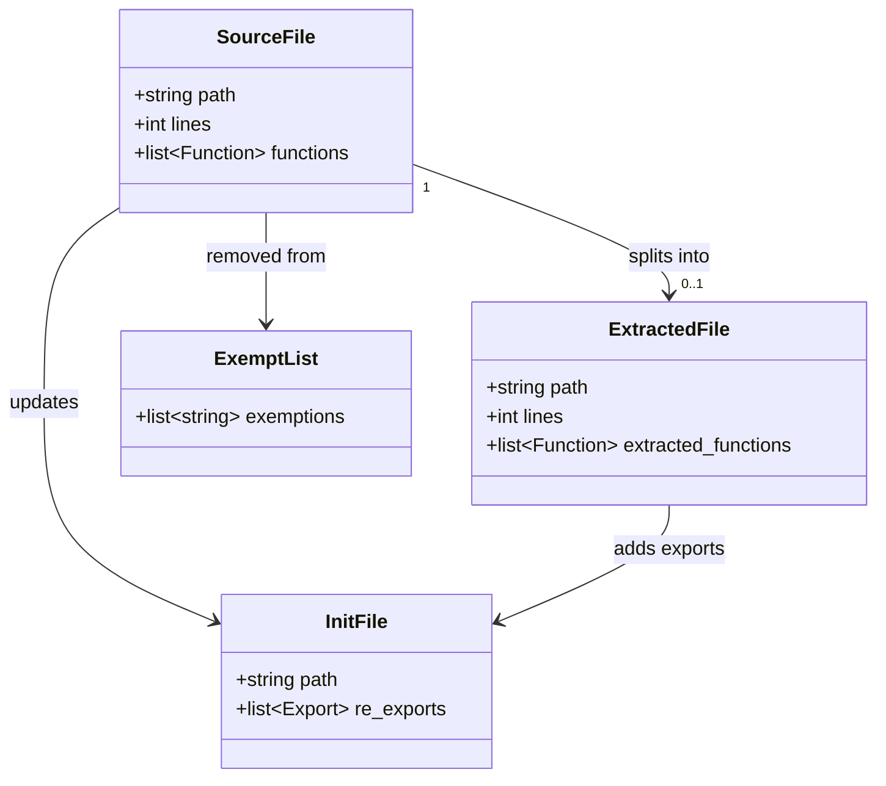
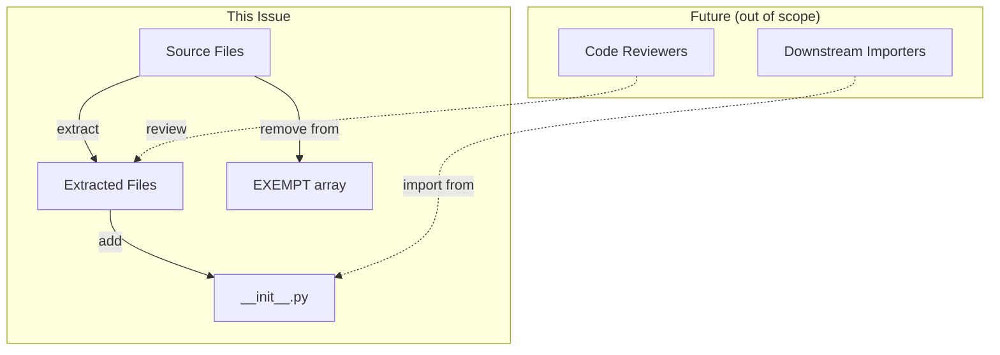

## Context

**Promoted from:** [Frame: Eliminate all 300-line file exemptions](../frames/753-eliminate-all-300-line-file-exemptions-frame.mdx)

ADR-027 established a 300-line file cap with 12 initial exemptions. Exemptions have grown to 25 files without coordinated reduction. This undermines the policy and increases cognitive load for developers and reviewers.

**Breakdown:**
- 21 files over 300 lines → need extraction
- 3 files already under limit → remove from exempt only
- 1 file non-existent (`audio_pipeline.py`) → remove from exempt only

Related: ADR-025 (≤20 files per directory), #396 (original refactor backlog), #293 (epic that introduced the cap).

## Goal

Eliminate all exemptions in `tools/check_file_length.sh` by extracting code into smaller modules while preserving public API and zero behavioral changes.

## Users & Use Cases

- **Developers:** Navigate smaller, focused modules during feature work
- **Code reviewers:** Review PRs with less cognitive overhead
- **CI pipeline:** Enforce policy consistently without exemptions

## Expected Behavior

### Happy path

1. Agent reads source file, identifies extraction boundary (functions/lines)
2. Agent creates new file with extracted code
3. Agent updates source file (remove code + add import)
4. Agent updates `__init__.py` with re-export
5. Agent removes source file from `EXEMPT` array in `check_file_length.sh`
6. Agent runs `pyright` to verify imports
7. All 21 extractions complete → empty `EXEMPT` array

### Edge cases

| Case | Handling |
|------|----------|
| Extraction breaks imports | Agent rolls back its extraction, retries with corrected boundaries |
| Circular import introduced | Agent detects via `pyright`, adjusts extraction to avoid cycle |
| `__init__.py` conflict (multiple agents) | Each agent owns its directory's `__init__.py` — no cross-directory edits |
| File already under 300 lines | Remove from `EXEMPT` array only (no extraction needed) |
| File does not exist | Remove from `EXEMPT` array only (stale entry) |

## Data Model & Consumers

### File structure (before → after)



### Consumer map



### Consumer summary

| Consumer | Fields consumed | When | Status |
|----------|-----------------|------|--------|
| `__init__.py` | Extracted function names | During extraction | This issue |
| Downstream importers | Re-exported symbols | Runtime | Future (no change) |
| `check_file_length.sh` | Exempt list | Pre-commit | This issue |

## Breadboard

### File Extraction Operations

| ID | Operation | Trigger | Logic |
|----|-----------|---------|-------|
| N1 | `extract_functions(src, funcs, dst)` | Agent starts extraction | Copy functions to new file, add imports |
| N2 | `update_source(src, funcs, dst)` | N1 complete | Remove functions, add import from dst |
| N3 | `update_init(init_path, symbols)` | N2 complete | Add re-exports to `__init__.py` |
| N4 | `remove_exemption(file_path)` | N3 complete | Remove from `EXEMPT` array |
| N5 | `verify_imports()` | N4 complete | Run `pyright`, report errors |

### Execution flow per agent

```
N1 → N2 → N3 → N4 → N5
         ↑
         └── (on N5 fail) rollback → retry N1 with adjusted boundaries
```

## Slices

Single slice — all 25 exemption removals in parallel, verified together at end.

**Task breakdown:**
- 21 extraction tasks (N1–N5 flow)
- 4 removal-only tasks (N4 only: 3 under limit + 1 non-existent)

| Slice | Description | Affordances | Demo |
|-------|-------------|-------------|------|
| V1 | All exemptions eliminated | N1–N5 × 21 agents + N4 × 4 agents | `EXEMPT` array empty, all files ≤300 lines, `pyright` passes |

## Constraints

- **Zero behavioral changes** — only code moves + imports
- **Preserve `__init__.py` re-exports** — public API unchanged
- **Parallel execution** — each agent works on independent file group

## Non-goals

- Functional refactoring (logic changes)
- New features or bug fixes
- Documentation beyond code comments
- Performance optimizations
- Folder restructuring beyond natural extraction destinations

## Technical Decisions

| Decision | Rationale |
|----------|-----------|
| Single slice, all parallel | 25 independent tasks (21 extractions + 4 removals) with no shared state — maximizes throughput |
| Rollback + retry on import failure | Self-healing without human escalation; bounded retries |
| Agent owns full extraction (N1–N5) | Atomic ownership prevents partial state leaks |
| `pyright` as verification gate | Type checker catches import errors before commit |

## Success Criteria

- [ ] All files in `src/lyra/**/*.py` ≤ 300 lines
- [ ] `EXEMPT` array in `check_file_length.sh` is empty
- [ ] All extractions preserve `__init__.py` re-exports
- [ ] Zero behavioral changes (tests pass, logic unchanged)
- [ ] `uv run pyright` passes with zero errors
- [ ] `uv run pytest` passes with zero failures

## Open Questions

None — scope is well-defined from issue body.
