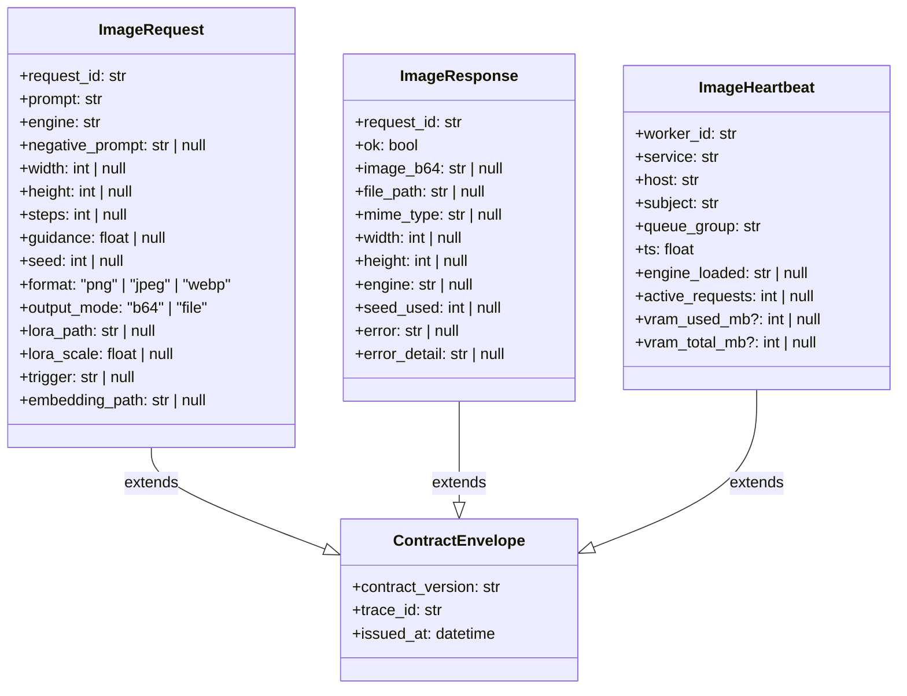
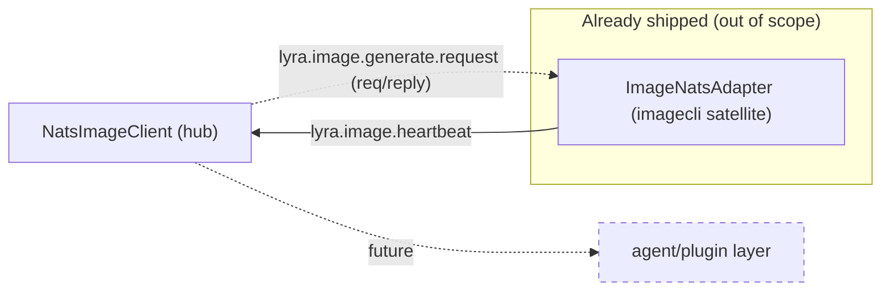

## Context

Promoted from [frame](../frames/754-lyra-image-domain-integration-frame.mdx). ADR-047 (accepted 2026-04-16) codifies satellite-owned workers + lyra-owned contracts/publishers/nkeys. The satellite half shipped via imageCLI#50 on 2026-04-15 — `imagecli nats-serve` runs an `ImageNatsAdapter(NatsAdapterBase)` that subscribes to `lyra.image.generate.request` and publishes heartbeats on `lyra.image.heartbeat`. This spec delivers the lyra half: the contract ADR that freezes the `lyra.image.*` wire protocol, the hub-side publisher (`src/lyra/nats/nats_image_client.py`), the `image-worker` nkey identity + ACL, and the supervisor entry that wires the satellite worker into Machine 1.

**Issue-body reconciliation (locked during spec):** the issue lists the heartbeat subject as `lyra.image.generate.heartbeat`. The shipped satellite uses `lyra.image.heartbeat` (`src/imagecli/nats/adapter.py:18`). Since imageCLI#50 closed before this ticket and a satellite re-release is out of scope, the contract ADR aligns to `lyra.image.heartbeat`. This is a one-way reconciliation — the ADR is authoritative and the issue body is stale on this single field.

## Goal

Mickael can run `scripts/smoke/image-request.py` against Machine 1 and receive a typed `ImageResponse(ok=True, ...)` reply — end-to-end through the new `NatsImageClient` publisher, the `image-worker` nkey, and the shipped imageCLI satellite under the frozen `lyra.image.*` wire contract.

Supporting goals: future agent/plugin code can call `NatsImageClient.generate()` without inline subject strings; future wire-contract edits on either side are visible as ADR diffs.

## Users

- **Primary:** lyra hub maintainer (Mickael) — writes the contract ADR, lands the hub client, extends `gen-nkeys.sh`, wires the supervisor entry. Owns reconciliation against the shipped satellite.
- **Secondary:**
  - imageCLI satellite maintainer — receives the `image-worker.seed` path, updates supervisor env on Machine 1, confirms auth round-trip.
  - Future agent/plugin layer that calls `NatsImageClient.generate()` — consumer of the typed client (out of scope to implement here).
  - Reviewers auditing alignment with ADR-044 (contract shape), ADR-046 (nkey provisioning), ADR-047 (ownership pattern + max-payload rule).
  - Future contract-domain ports (`roxabi_contracts.image`) that lift the inline Pydantic models landed here into the shared package.

## Expected Behavior

1. **Contract ADR lands on staging.** ADR-050 (next free number) documents: subjects, queue group, request/reply/heartbeat envelopes, error codes, max-payload ceiling, user-controlled fields, reconciliation note about `lyra.image.heartbeat`. The ADR is referenced by the hub client and by the satellite adapter's docstring on its next touch.
2. **Hub-side publisher ships.** `src/lyra/nats/nats_image_client.py` exposes `NatsImageClient` with `start()` (subscribes to heartbeats, populates a `VoiceWorkerRegistry`-style image registry) and `generate(prompt, **kwargs)` (publishes via `nc.request()`, parses reply, maps errors to a domain `ImageUnavailableError`). Inline Pydantic models `ImageRequest` / `ImageResponse` live alongside — lifted to `roxabi_contracts.image` in a future ticket, per frame out-of-scope.
3. **nkey identity provisioned.** `deploy/nats/gen-nkeys.sh` gains an `image-worker` entry in `IDENTITIES`, `PUB_ALLOW`, `SUB_ALLOW`. Hub ACL is extended to publish `lyra.image.generate.request` and subscribe `lyra.image.heartbeat`. Running `./deploy/nats/gen-nkeys.sh --template-only` renders a complete auth.conf that contains the new `image-worker` block and the amended hub block.
4. **Supervisor wiring.** `deploy/agents.yml` gains an `imagecli_gen` agent with `command: imagecli nats-serve`, `nkey: image-worker.seed`, `startsecs: 20` (T15 note — re-measure first-ready time on Machine 1 RTX 3080 before production cutover). Running `make gen-conf` produces `deploy/supervisor/conf.d/imagecli_gen.conf` with the env var `NATS_NKEY_SEED_PATH` pointing at `$HOME/.lyra/nkeys/image-worker.seed`.
5. **ADR-047 table amended.** The Subject and nkey ownership table flips the Image row's `lyra nkey identity` from "(to provision)" to `image-worker` and adds a "Status: shipped" column (or footnote) with a reference to this spec + PR.
6. **End-to-end smoke on Machine 1.** With the new `auth.conf` reloaded and `imagecli_gen` started under the new nkey, a manual round-trip (`python -c "from lyra.nats.nats_image_client import NatsImageClient; ..."` or a dedicated script under `scripts/smoke/image-request.py`) publishes one request and receives a non-error reply. The smoke output is committed as `artifacts/rollout-evidence/754-image-smoke.txt`.

**Fail-loud surface.** If the hub publishes before `image-worker` is provisioned, NATS logs `Permissions Violation for Publication to "lyra.image.generate.request" by user "hub"` — surfaced by `scripts/check-nats-acls.sh` (already exists from #706) during rollout verification. If the satellite publishes a heartbeat on a subject the hub has not subscribed to, the hub logs nothing (silent) — mitigated by the round-trip smoke step, which only passes when the reply inbox carries an `ok: true` response (proves full publisher↔worker↔reply wiring, independent of heartbeat observability).

**Local dev path unchanged.** `nats-local.conf` (no auth) allows any subject — the ACL enforcement only applies when the Machine 1 `nats.conf` (which `include`s `auth.conf`) is loaded.

## Data Model & Consumers

### Wire contract — data classes



All three inherit from `ContractEnvelope` (`packages/roxabi-contracts/src/roxabi_contracts/envelope.py`) via Pydantic — `contract_version`, `trace_id`, `issued_at` are mandatory on every payload. Models live **inline** in `src/lyra/nats/nats_image_client.py` for this issue; porting to `packages/roxabi-contracts/src/roxabi_contracts/image/` is a follow-up ticket (mirrors the voice port #763).

**Heartbeat VRAM fields are optional, satellite-emitted-when-available.** The shipped `ImageNatsAdapter.heartbeat_payload()` (`src/imagecli/nats/adapter.py:333–338`) extends the `NatsAdapterBase` base payload with `engine_loaded` + `active_requests` only. Whether `vram_used_mb` / `vram_total_mb` land on the wire depends on whether the base populates them (pynvml-dependent). The contract ADR MUST mark both fields as optional and non-required for registry correctness — the hub registry uses `active_requests` for load-picking, not VRAM. A later satellite upgrade may begin populating VRAM fields additively under `contract_version: "1"` (ADR-044 §Versioning).

### Subjects

| Subject | Direction | Producer | Consumer | Purpose |
|---|---|---|---|---|
| `lyra.image.generate.request` | request-reply | `NatsImageClient.generate` (hub) | `ImageNatsAdapter.handle` (satellite) | Generate image from prompt |
| `lyra.image.heartbeat` | fire-and-forget | `ImageNatsAdapter.heartbeat_loop` (satellite) | `NatsImageClient._on_heartbeat` (hub) | Liveness + VRAM + active count |

Queue group: **`IMAGE_WORKERS`**. Replies use the NATS request-reply inbox; no dedicated reply subject.

### Max payload declaration (ADR-047 Rule 4)

Image responses are binary (PNG / JPEG / WebP). NATS server `max_payload` on Machine 1 is **1 MB** (shipped default in `deploy/nats/nats-container.conf`; no override). Base64 overhead is ~4/3, giving a useful image ceiling of **~750 KB** decoded bytes.

The satellite already enforces this as a dual-mode policy (`src/imagecli/nats/adapter.py:254–310`):

| Path | Trigger | Payload |
|---|---|---|
| `output_mode: "b64"` (default) | encoded length ≤ 750 KB | inline `image_b64` in reply |
| `output_mode: "b64"` fallback | encoded length > 750 KB | writes to `images/images_out/nats_{request_id[:8]}.{fmt}`, reply carries `file_path` |
| `output_mode: "file"` (explicit) | caller opt-in | same as fallback path — always `file_path` |

The contract ADR MUST document: (a) the 1 MB NATS `max_payload`, (b) the 750 KB b64 threshold, (c) that `file_path` mode requires a shared filesystem between hub and worker (holds today — both on Machine 1 — but constrains any future hub/worker split), (d) the `file_path` value is **satellite-resolved, hub-opaque** — it is an absolute path produced by `Path.resolve()` inside the satellite's `cwd` (`adapter.py:259–272`, writing to a CWD-relative `images/images_out/`), and the hub MUST NOT perform path traversal, existence checks, or validation on it. Any future hub-side consumer that needs to read the file MUST first resolve it through a satellite-aware accessor (out of scope here). `file_path` mode is called out as a platform coupling to revisit in any future hub/worker split.

### User-controlled fields (sanitization contract)

Fields carrying user-provided text or filesystem paths MUST be sanitized by the satellite worker (per ADR-047 Rule 4). Enumerated in the contract ADR:

| Field | Trust | Sanitization owner | Enforcement |
|---|---|---|---|
| `prompt` | untrusted | satellite | length cap (TBD — satellite to choose, ADR notes); engine passes verbatim to the model |
| `negative_prompt` | untrusted | satellite | same as `prompt` |
| `trigger` | untrusted | satellite | same as `prompt` |
| `lora_path` | untrusted | satellite | MUST be absolute + resolve under `~/ComfyUI/models/loras` or `~/ComfyUI/models/lora` (already enforced at `adapter.py:66–96`) |
| `embedding_path` | untrusted | satellite | same but under `~/ComfyUI/models/embeddings` |
| `width`, `height`, `steps` | untrusted | satellite | bounded: ≤ 4096, ≤ 4096, ≤ 200 (already enforced at `adapter.py:98–115`) |

The ADR enumerates these as the **authoritative** sanitization contract — any new user-controlled field added later MUST be appended here in the same ADR version.

### Error codes

| Code | When | Detail field |
|---|---|---|
| `missing_required_field` | `prompt` or `engine` missing, or bounds violation (`width`, `height`, `steps` exceed caps), or `lora_path`/`embedding_path` outside allowlist | human-readable reason |
| `unknown_engine` | engine name not in `imagecli.engine.list_engines()` | engine name |
| `engine_load_failed` | import or engine-instantiation failure | sanitized message |
| `insufficient_resources` | `InsufficientResourcesError` or `MemoryError` during engine load/generate | short static message |
| `generation_failed` | any other exception during `engine.generate()` or reply encoding | short static message |

Codes are short snake_case tokens. Hub raises `ImageUnavailableError` on `ok: false` regardless of `error` value — the code is for logs and metrics, not control flow.

### Consumer map



### Consumer summary

| Consumer | Subjects consumed | Fields consumed | Status |
|---|---|---|---|
| `NatsImageClient` (hub) | `lyra.image.heartbeat` (SUB), `lyra.image.generate.request` (PUB via `nc.request`) | all of `ImageResponse`; heartbeat `worker_id`, `active_requests`, `vram_used_mb` for load balancing | this issue |
| `ImageNatsAdapter` (satellite) | `lyra.image.generate.request` (SUB, queue `IMAGE_WORKERS`), `lyra.image.heartbeat` (PUB) | all of `ImageRequest` | shipped (imageCLI#50) |
| Future agent/plugin layer | `NatsImageClient.generate()` (Python call) | `ImageResponse` success path | future — out of scope |

## Breadboard

### Affordances

| ID | Element | Location |
|---|---|---|
| I1 | **ADR-050**: subjects (`lyra.image.generate.request`, `lyra.image.heartbeat`), queue group `IMAGE_WORKERS`, `ContractEnvelope` + `ImageRequest`/`ImageResponse`/`ImageHeartbeat` schemas, error codes, max-payload declaration (1 MB NATS cap + 750 KB b64 threshold + `file_path` fallback coupling), user-controlled-fields sanitization table, heartbeat-subject reconciliation note | `docs/architecture/adr/050-lyra-image-nats-contract.mdx` |
| I2 | `NatsImageClient` — hub publisher. `start()` subscribes to `lyra.image.heartbeat`; `generate(prompt, engine=..., **params)` publishes via `nc.request()`, parses reply, maps errors to `ImageUnavailableError`. Follows `nats_tts_client.py` shape (circuit breaker, readiness, heartbeat registry) minus per-worker subject routing (single-worker on Machine 1). | `src/lyra/nats/nats_image_client.py` (new) |
| I3 | Inline Pydantic models: `ImageRequest`, `ImageResponse`, `ImageHeartbeat` extending `ContractEnvelope`. Subject constants `SUBJECTS.image_request`, `SUBJECTS.image_heartbeat` as `Literal[...]` frozen dataclass attributes. `ImageUnavailableError` exception class. | Inside I2 |
| I4 | `image-worker` added to `IDENTITIES` array + `PUB_ALLOW[image-worker]='"lyra.image.heartbeat"'` + `SUB_ALLOW[image-worker]='"lyra.image.generate.request"'`. Hub ACL extended: `PUB_ALLOW[hub]` gains `"lyra.image.generate.request"`, `SUB_ALLOW[hub]` gains `"lyra.image.heartbeat"`. | `deploy/nats/gen-nkeys.sh` |
| I5 | `imagecli_gen` agent block in agents.yml: `command: imagecli nats-serve`, `priority: 200`, `startsecs: 20`, `nkey: image-worker.seed`. Regenerate via `make gen-conf` → new `deploy/supervisor/conf.d/imagecli_gen.conf`. | `deploy/agents.yml` + generated `deploy/supervisor/conf.d/imagecli_gen.conf` |
| I6 | Unit tests: round-trip serialization of `ImageRequest`/`ImageResponse` (Pydantic JSON), heartbeat parsing + registry update, error-response mapping to `ImageUnavailableError`, max-payload exception translation. | `tests/nats/test_nats_image_client.py` (new) |
| I7 | `gen-nkeys.sh` smoke test extension: `tests/nats/test_gen_nkeys_acls.sh` (already exists from #706) asserts `image-worker` appears with correct PUB/SUB allow-lists; hub block asserts the new entries are present. | `tests/nats/test_gen_nkeys_acls.sh` (edit) |
| I8 | ADR-047 Subject and nkey ownership table amendment: Image row `image-worker (to provision)` → `image-worker` + "Status: shipped" footnote referencing #754 + PR. | `docs/architecture/adr/047-nats-connector-ownership-pattern.mdx` |
| I9 | Rollout evidence: `scripts/smoke/image-request.py` (small script publishing one request + asserting `ok: true` reply); captured stdout committed as `artifacts/rollout-evidence/754-image-smoke.txt` before merge. | `scripts/smoke/image-request.py` (new) + `artifacts/rollout-evidence/754-image-smoke.txt` (new) |

### Wiring

| From | To | Trigger |
|---|---|---|
| Agent/plugin layer (future) | I2 | `NatsImageClient.generate(prompt, engine, ...)` |
| I2 | NATS | `nc.request("lyra.image.generate.request", payload, timeout=...)` |
| NATS | satellite (imageCLI#50, shipped) | queue group `IMAGE_WORKERS` delivers to `ImageNatsAdapter.handle` |
| Satellite | NATS | reply via `msg.respond()`; heartbeat via `nc.publish("lyra.image.heartbeat", ...)` every 5 s |
| NATS | I2 | reply consumed in `nc.request()`; heartbeat via subscription set up in `I2.start()` |
| I2 | registry | heartbeat updates `VoiceWorkerRegistry`-style image registry; `ImageUnavailableError("no live worker")` if stale >15 s |
| Operator | I4 | `sudo ./deploy/nats/gen-nkeys.sh --regenerate --yes` rotates all seeds (creates `image-worker.seed`); OR `--regen-authconf` re-renders auth.conf without key rotation |
| Operator | I5 | `make gen-conf` regenerates `deploy/supervisor/conf.d/imagecli_gen.conf` from agents.yml; `sudo systemctl reload nats` + `make imagecli_gen start` on Machine 1 |
| Operator | I6 | `uv run pytest tests/nats/test_nats_image_client.py` in CI and locally |
| Operator | I9 | After `supervisorctl status imagecli_gen \| grep RUNNING` returns 0, run `python scripts/smoke/image-request.py > artifacts/rollout-evidence/754-image-smoke.txt`; commit as rollout evidence |
| I8 | reader | anyone reading ADR-047 sees Image as shipped, cross-links to ADR-050 + this PR |

## Slices

**Slice ordering constraint.** Slices 1–3 are independently demo-able (ADR, typecheck/unit tests, auth.conf template). Slice 4 depends on Slices 2 + 3 simultaneously — the smoke test (I9) cannot produce rollout evidence without both the hub client (Slice 2) and the provisioned nkey (Slice 3). The constraint is explicit: Slices 1–3 may land in any order; Slice 4 blocks on both.

| # | Slice | Affordances | Depends on | Demo |
|---|---|---|---|---|
| 1 | Contract ADR (ADR-050) — freeze the wire | I1 | — | `docs/architecture/adr/050-lyra-image-nats-contract.mdx` exists, passes docs lint, cross-references ADR-044 / ADR-046 / ADR-047, contains all 5 required tables (subjects, envelopes × 3, error codes, max-payload, user-controlled fields) |
| 2 | Hub publisher + inline models + unit tests | I2, I3, I6 | Slice 1 | `uv run pyright src/lyra/nats/nats_image_client.py` passes; `uv run pytest tests/nats/test_nats_image_client.py` passes; `NatsImageClient.generate()` returns a typed result for a mocked NATS reply |
| 3 | nkey + ACL | I4, I7 | Slice 1 | `./deploy/nats/gen-nkeys.sh --template-only \| grep image-worker` shows the new user block with the correct allow-lists; hub block contains `lyra.image.generate.request` in PUB and `lyra.image.heartbeat` in SUB; `bash tests/nats/test_gen_nkeys_acls.sh` passes |
| 4 | Supervisor wiring + ADR-047 amendment + rollout evidence | I5, I8, I9 | Slices 2 + 3 | `make gen-conf` produces `deploy/supervisor/conf.d/imagecli_gen.conf` with `NATS_NKEY_SEED_PATH` pointing at `image-worker.seed`; ADR-047 Image row amended; `supervisorctl status imagecli_gen` shows `RUNNING`; `scripts/smoke/image-request.py` round-trips through Machine 1 and prints `ok: true`; evidence committed under `artifacts/rollout-evidence/` |

### Slice 4 rollback (runbook, not a gate)

If the post-provisioning smoke (I9) fails after `image-worker` is live:

1. **Diagnose first** — read `/var/log/nats-server/` + `make imagecli_gen errors`. A `Permissions Violation` means the ACL needs patching (re-run Slice 3); a timeout or schema error means the publisher or satellite disagrees with ADR-050 (patch and re-run Slice 2).
2. **Atomic rollback** — only if the above can't be resolved within the rollout window. `sudo ./deploy/nats/gen-nkeys.sh --regenerate --yes` was run as a pair-backup (see `gen-nkeys.sh --regenerate` — backs up `auth.conf` and `~/.lyra/nkeys/` atomically to timestamped `.bak.{epoch}` pair). Restore both together:
   ```bash
   sudo cp /etc/nats/nkeys/auth.conf.bak.<epoch> /etc/nats/nkeys/auth.conf
   sudo rm -rf ~/.lyra/nkeys && sudo mv ~/.lyra/nkeys.bak.<epoch> ~/.lyra/nkeys
   sudo systemctl reload nats
   make telegram reload && make discord reload && make lyra reload
   ```
3. Stop `imagecli_gen` (`make imagecli_gen stop`) until the issue is resolved. The hub remains healthy on its prior nkey — image is simply unavailable.

Matches the #706 rollout-and-rollback shape (spec §Expected Behavior step 6). Operator captures the rollback sequence + resolution in the PR description.

## Success Criteria

### Contract ADR (Slice 1)

- [ ] `docs/architecture/adr/050-lyra-image-nats-contract.mdx` exists with status `Accepted`, date `2026-04-19` or later, and follows ADR-044's structure (Status, Context, Decision with Subjects/Payload/`contract_version`/Request/Reply/Heartbeat, Rationale, Consequences, Relation to other ADRs, References).
- [ ] ADR-050 declares subjects: `lyra.image.generate.request`, `lyra.image.heartbeat` (not `lyra.image.generate.heartbeat` — reconciliation note present).
- [ ] ADR-050 declares queue group `IMAGE_WORKERS`.
- [ ] ADR-050 declares NATS `max_payload: 1 MB` and the 750 KB b64 threshold, and documents `file_path` fallback mode as a shared-filesystem coupling (ADR-047 Rule 4 compliance).
- [ ] ADR-050 enumerates all user-controlled fields with their sanitization owner and enforcement rule, matching the satellite's current behavior (`src/imagecli/nats/adapter.py:66–129`).
- [ ] ADR-050 enumerates all error codes used by the shipped satellite: `missing_required_field`, `unknown_engine`, `engine_load_failed`, `insufficient_resources`, `generation_failed`.
- [ ] ADR-050 is referenced from ADR-047's "Relation to other ADRs" section as the image-domain contract ADR.

### Hub publisher (Slice 2)

- [ ] `src/lyra/nats/nats_image_client.py` exists and exports `NatsImageClient`, `ImageRequest`, `ImageResponse`, `ImageHeartbeat`, `ImageUnavailableError`.
- [ ] `uv run pyright src/lyra/nats/nats_image_client.py` passes with zero errors.
- [ ] `NatsImageClient.start()` subscribes to `lyra.image.heartbeat`.
- [ ] `NatsImageClient.generate(prompt, engine, ...)` builds an `ImageRequest`, publishes via `nc.request()`, validates the reply against `ImageResponse`, and raises `ImageUnavailableError` on schema validation failure, timeout, `max_payload` violation, or `ok: false`.
- [ ] `tests/nats/test_nats_image_client.py` covers: (a) happy-path round-trip with mocked `nc.request`; (b) reply-schema-failure → `ImageUnavailableError`; (c) timeout → `ImageUnavailableError`; (d) **request-direction** `max_payload` translation → `ImageUnavailableError("payload too large")` (the satellite downgrades oversized *replies* to `file_path`, so the reply direction never surfaces a `max_payload` error; only outbound requests larger than 1 MB do); (e) heartbeat parsing updates the registry, including the case where `vram_used_mb`/`vram_total_mb` are absent (optional fields); (f) stale registry (>15 s) raises `ImageUnavailableError("no live worker")`.
- [ ] `uv run pytest tests/nats/test_nats_image_client.py` passes.
- [ ] No inline subject f-strings in the new module — subject constants are `Literal[...]` attributes on a frozen dataclass, mirroring `roxabi_contracts.voice.subjects._Subjects`.

### nkey + ACL (Slice 3)

- [ ] `deploy/nats/gen-nkeys.sh` `IDENTITIES` array contains `image-worker`.
- [ ] `PUB_ALLOW[image-worker]` equals `"lyra.image.heartbeat"` (set equality, order-insensitive).
- [ ] `SUB_ALLOW[image-worker]` equals `"lyra.image.generate.request"`.
- [ ] `PUB_ALLOW[hub]` gains `"lyra.image.generate.request"` (other entries unchanged).
- [ ] `SUB_ALLOW[hub]` gains `"lyra.image.heartbeat"` (other entries unchanged).
- [ ] `./deploy/nats/gen-nkeys.sh --template-only` writes a complete auth.conf to stdout that contains an `image-worker` user block with the correct permissions, and an amended `hub` block with the two new entries.
- [ ] `bash tests/nats/test_gen_nkeys_acls.sh` passes with extended assertions: image-worker block exists, hub block is amended as above, no other identity's allow-lists change.

### Supervisor wiring (Slice 4)

- [ ] `deploy/agents.yml` gains an `imagecli_gen` agent entry: `command: imagecli nats-serve`, `priority: 200`, `startsecs: 20`, `nkey: image-worker.seed`.
- [ ] `make gen-conf` produces `deploy/supervisor/conf.d/imagecli_gen.conf` that contains `NATS_NKEY_SEED_PATH=$HOME/.lyra/nkeys/image-worker.seed` in its env.
- [ ] `make gen-conf` is idempotent: running twice produces no diff.
- [ ] `supervisorctl start imagecli_gen` transitions the program to `RUNNING` within `startsecs=20`; `supervisorctl status imagecli_gen` reports `RUNNING`.
- [ ] **Pre-merge T15 re-measure** — first-ready time on Machine 1 RTX 3080 measured and recorded in the PR description; if observed startup exceeds 20 s, `startsecs` is bumped in `agents.yml` before merge.

### ADR-047 amendment (Slice 4)

- [ ] ADR-047 Subject and nkey ownership table's Image row carries `image-worker` (not `image-worker (to provision)`).
- [ ] ADR-047 has a footnote or "Status" annotation on the Image row referencing ADR-050 + this spec's issue (#754) + the merging PR.

### Rollout evidence (Slice 4)

- [ ] `scripts/smoke/image-request.py` exists and, when run against Machine 1 with `imagecli_gen` in `RUNNING` state (verified via `supervisorctl status imagecli_gen` before firing the smoke), publishes one `lyra.image.generate.request` (e.g. `prompt="test image"`, `engine="flux2-klein"`, `width=512`, `height=512`, `steps=10`) and asserts the reply has `ok: true`.
- [ ] `artifacts/rollout-evidence/754-image-smoke.txt` captures: (a) the reload timestamp, (b) `supervisorctl status imagecli_gen` showing `RUNNING` + PID + uptime, (c) the smoke stdout + exit code, (d) `scripts/check-nats-acls.sh --since <reload-ts>` output showing zero `Permissions Violation` during the round-trip.

### No regressions

- [ ] Existing lyra + voicecli pytest suites still pass (`uv run pytest` on lyra root; the voice clients' tests are untouched).
- [ ] `uv run pyright` passes on the full repo.
- [ ] `bash tests/nats/test_gen_nkeys_acls.sh` still passes for all pre-existing identities (hub, telegram-adapter, discord-adapter, tts-adapter, stt-adapter, voice-tts, voice-stt, llm-worker, monitor).

> **Out of scope:** Extracting `ImageRequest` / `ImageResponse` / `ImageHeartbeat` into `packages/roxabi-contracts/src/roxabi_contracts/image/`. Follow-up ticket mirrors #763 (voice port) — creates `roxabi_contracts/image/{models,subjects,fixtures,testing}.py`, swaps inline defs in `nats_image_client.py` for imports, matches the voice shape 1:1.
>
> **Out of scope:** Agent/plugin layer that calls `NatsImageClient.generate()`. Requires command-parser design, progress reporting, attachment wiring — separate issue.
>
> **Out of scope:** `auth.conf` rollout to Machine 1 production (reload of `nats-server` + restart of `imagecli_gen` under the new nkey). The regeneration and template-only verification land here; the actual Machine 1 reload happens as part of the rollout-evidence step (Slice 4) but is documented as an operator runbook, not an automated gate.
>
> **Out of scope:** Per-worker subject routing (`lyra.image.generate.request.{worker_id}`). Image domain has one worker today; when a second worker lands, add the per-worker shape as an ADR-050 amendment, matching `roxabi_contracts.voice.subjects.per_worker_tts`.
>
> **Out of scope:** `file_path` mode hardening for a future hub/worker split across hosts. Today both run on Machine 1 with a shared home; the ADR flags the coupling but does not solve it.
