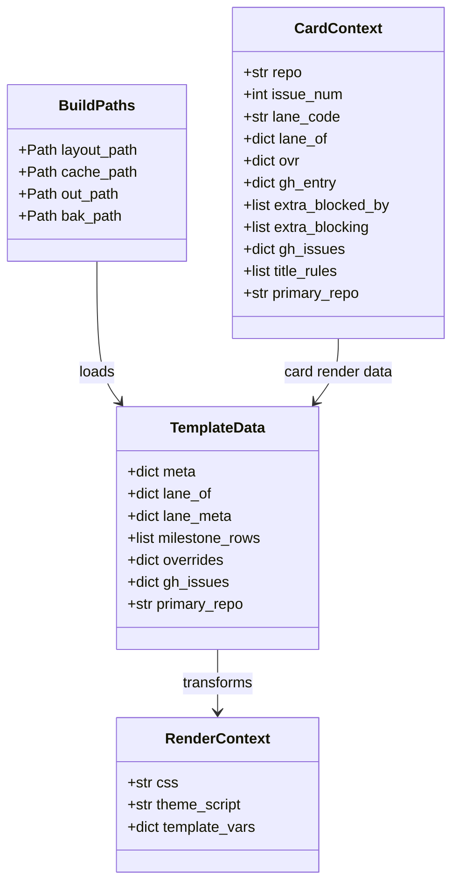
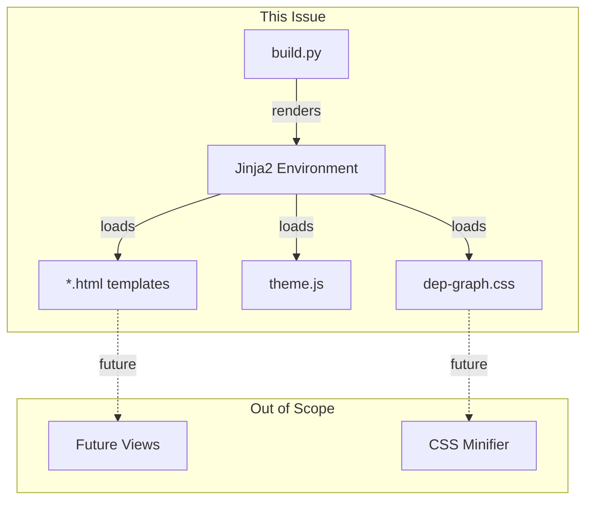

## Context

**Promoted from:** [extract Jinja2 templates frame](../frames/756-extract-jinja2-templates-frame.mdx)

## Goal

Extract inline CSS, JS, and HTML from `build.py` into external Jinja2 templates, reducing `build.py` to business logic only while producing byte-identical HTML output.

## Users

| User | Workflow |
|------|----------|
| Lyra maintainers | Edit CSS/HTML templates directly, without touching Python |
| Future extensions | Reuse card/milestone templates for new views |

## Expected Behavior

**Before:** `build.py` contains ~580 lines of CSS (CSS_BASE), ~20 lines of JS (THEME_SCRIPT), and HTML f-strings in `build_html()`. Any visual tweak requires editing Python strings.

**After:**
- `dep_graph/templates/dep-graph.css` — all CSS, editable with syntax highlighting
- `dep_graph/templates/theme.js` — theme toggle script
- `dep_graph/templates/*.html` — Jinja2 templates for HTML components
- `build.py` — orchestration only (~200 lines, well under 300)

Running `make dep-graph build` produces identical HTML to current golden. Visual regression test passes.

## Data Model & Consumers

### Data Structure



### Consumer Map



### Consumer Summary

| Consumer | Data Consumed | When | Status |
|----------|---------------|------|--------|
| `build.py` | layout.json, gh.json | Build time | This issue |
| Jinja2 templates | TemplateData dict | Render time | This issue |
| Future views | card.html, milestone_row.html | Extension | Future |

## Breadboard

### Affordance Table

| ID | Element | Handler | Data |
|----|---------|---------|------|
| U0 | HTML skeleton | `base.html` template | `meta`, `title`, `date` |
| U1 | CSS file | Jinja2 include | `dep-graph.css` content |
| U2 | Theme toggle button | Inline script | `theme.js` |
| U3 | Milestone row | `milestone_row.html` template | `milestone_rows` list |
| U4 | Lane column | `lane_col.html` template | `lane_meta`, `lane_of` |
| U5 | Card component | `card.html` template | `CardContext` data |
| N1 | `build_html()` | Orchestration | `TemplateData` |
| N2 | `run_build()` | File I/O | `BuildPaths` |
| S1 | Jinja2 Environment | Template loader | `PackageLoader('dep_graph', 'templates')` |

### Wiring

```
layout.json + gh.json
    ↓
run_build() → validate_layout() → build_html()
    ↓
TemplateData assembly
    ↓
Jinja2 Environment (PackageLoader)
    ↓
base.html template
    ├── include dep-graph.css
    ├── include theme.js
    └── for each milestone_row:
        └── milestone_row.html
            └── for each lane_col:
                └── lane_col.html
                    └── for each card:
                        └── card.html
    ↓
HTML output → out_path
```

## Slices

### Phase 1: Static Asset Extraction

| Slice | Scope | Demo |
|-------|-------|------|
| 1.1 | Extract `CSS_BASE` → `templates/dep-graph.css` | `cat templates/dep-graph.css \| head -20` |
| 1.2 | Extract `THEME_SCRIPT` → `templates/theme.js` | `cat templates/theme.js` |
| 1.3 | Add jinja2 to dependencies | `cd scripts/dep-graph && uv add jinja2` |
| 1.4 | Create Jinja2 loader in build.py, load CSS/JS | HTML renders with external assets |

### Phase 2: Template Extraction

| Slice | Scope | Demo |
|-------|-------|------|
| 2.1 | Create `base.html` with HTML skeleton | Template file exists, renders header/footer |
| 2.2 | Create `card.html` from `render_card()` | Card HTML renders identically |
| 2.3 | Create `lane_col.html` from lane rendering | Lane columns render identically |
| 2.4 | Create `milestone_row.html` | Milestone rows render identically |
| 2.5 | Refactor `build_html()` to use templates | Templates render correctly |
| 2.6 | Byte-by-byte verification test | `pytest tests/test_dep_graph_golden.py` |

### Phase 3: Module Extraction (for &lt;300 line goal)

| Slice | Scope | Demo |
|-------|-------|------|
| 3.1 | Extract status + deps functions → `status.py` | `build.py` line count drops by ~120 |
| 3.2 | Extract card rendering → `render.py` | `build.py` line count drops by ~100 |
| 3.3 | Extract milestone grouping → `milestone.py` | `build.py` line count drops by ~200 |
| 3.4 | Extract lane flattening → `flatten.py` | `build.py` line count drops by ~100 |
| 3.5 | Extract anchor/spacer logic → `anchors.py` | `build.py` line count drops by ~80 |
| 3.6 | Final verification: `build.py` &lt; 300 lines | `wc -l scripts/dep-graph/dep_graph/build.py` |

## Success Criteria

### Template Extraction (Phase 1-2)

- [ ] `templates/dep-graph.css` exists with all CSS from CSS_BASE
- [ ] `templates/theme.js` exists with theme toggle script
- [ ] `templates/base.html` exists with HTML skeleton and blocks
- [ ] `templates/card.html` renders card HTML identically to current `render_card()`
- [ ] `templates/milestone_row.html` renders milestone rows identically

### Module Extraction (Phase 3)

- [ ] `status.py` extracted with status derivation functions
- [ ] `render.py` extracted with card rendering functions
- [ ] `milestone.py` extracted with milestone grouping logic
- [ ] `flatten.py` extracted with lane flattening logic
- [ ] `anchors.py` extracted with anchor/spacer logic

### Final Verification

- [ ] `build.py` is under 300 lines (orchestration only)
- [ ] `make dep-graph build` produces HTML byte-identical to pre-extraction golden
- [ ] `uv run pytest` passes (no new test failures)
- [ ] `uv run pyright` passes (no new type errors)

## Ambiguity Notes

None — scope is clear extraction with no new functionality.
