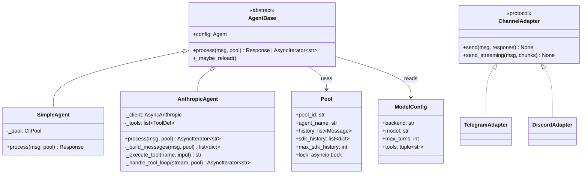
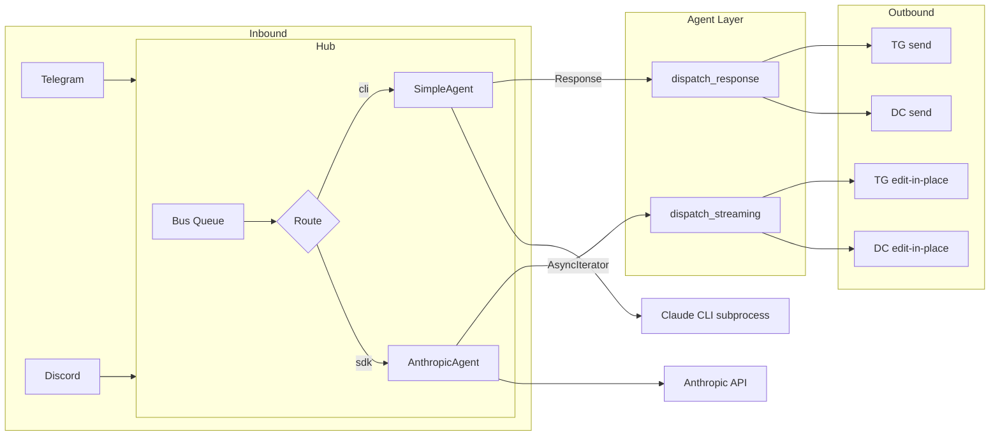

## Context

Issue #76 — Part of Phase 1b (Agent core, epic #73).
Analysis selected **Shape 1: Raw Messages API** (`anthropic` Python SDK with `AsyncAnthropic`).
Strategy: build `AnthropicAgent` alongside `SimpleAgent`, CLI default, SDK opt-in.

## Goal

Add an `AnthropicAgent` that calls the Anthropic Messages API directly with true token streaming, custom tools, and system prompt injection — selectable via agent TOML config while `SimpleAgent` remains the default.

## Users

- **Primary:** Lyra end-users on Telegram and Discord — faster responses via streaming, richer capabilities via tools.
- **Secondary:** Lyra developer (Mickael) — simpler architecture, easier debugging, extensible tool system.

## Expected Behavior

### Happy path (Telegram)

1. User sends "What's in my vault about Python?" on Telegram.
2. Hub resolves binding → `AnthropicAgent` (config: `backend = "anthropic-sdk"`).
3. Agent builds messages array from `pool.sdk_history` + user message.
4. Agent calls `AsyncAnthropic.messages.stream()` with system prompt (persona), tools (vault_search), and history.
5. Telegram adapter sends a placeholder message ("...").
6. As text deltas arrive, adapter edits the placeholder in-place every ~500ms with accumulated text.
7. Claude decides to call `vault_search` tool → agent executes the Python function → appends tool_result → continues streaming.
8. Final response rendered. History appended to `pool.sdk_history`.

### Fallback path

9. If `backend = "claude-cli"` (default), `SimpleAgent` processes as before — no streaming, no change.
10. If SDK call fails before streaming starts (auth error, network), agent returns `Response(content=GENERIC_ERROR_REPLY, metadata={"error": True})`.

### Mid-stream failure

11. If the SDK stream drops mid-iteration (network error, API failure after tokens have been sent), the adapter edits the placeholder with the text accumulated so far and appends " [response interrupted]". If no text was accumulated, the adapter edits with `GENERIC_ERROR_REPLY`.

### Tool failure

12. If a tool execution raises an exception, the agent sends `tool_result` with `is_error=True` and the error message. Claude sees the error and responds to the user (e.g. "I couldn't search the vault right now."). The user sees Claude's response, not a raw error.

### Config switch

13. User sets `backend = "anthropic-sdk"` in `lyra_default.toml` and restarts Lyra. Next message uses SDK agent. Backend changes require restart (no runtime class swap).

### Known limitations

- **Backend switch resets SDK context**: switching from CLI to SDK starts with empty `sdk_history`. Prior CLI conversation context is not migrated.
- **Discord 2000-char truncation**: during streaming, Discord messages are truncated at 2000 chars. Full splitting is deferred.
- **Pool lock during stream**: a second message from the same user during an active stream is queued until the stream completes. "Stop generating" is not supported in this version.

## Data Model & Consumers

## Breadboard

### Affordances

| ID | Affordance | Location |
|----|-----------|----------|
| U1 | User sends message on Telegram/Discord | Adapters (existing) |
| U2 | User sets `backend` in agent TOML (restart required) | `agents/lyra_default.toml` |
| N1 | Hub resolves binding → agent + pool | `hub.py` (existing) |
| N2 | Hub detects streaming vs non-streaming via `isinstance(result, collections.abc.AsyncIterator)` | `hub.py` (new) |
| N3 | Hub dispatches streaming chunks to adapter (inside `pool.lock` scope) | `hub.py` (new) |
| S1 | `AnthropicAgent.process()` is async generator that yields text deltas | `agents/anthropic_agent.py` (new) |
| S2 | `AnthropicAgent._build_messages()` constructs SDK message array from pool history | `agents/anthropic_agent.py` (new) |
| S3 | `AnthropicAgent._execute_tool()` runs Python function for tool_use blocks | `agents/anthropic_agent.py` (new) |
| S4 | `AnthropicAgent._handle_tool_loop()` manages tool_use → tool_result → continue cycle | `agents/anthropic_agent.py` (new) |
| S5 | Telegram adapter: send placeholder → store msg_id → edit via `bot.edit_message_text()` with debounce | `adapters/telegram.py` (new method) |
| S6 | Discord adapter: send placeholder → store message object → edit via `message.edit()` with debounce | `adapters/discord.py` (new method) |
| S7 | `Pool.sdk_history` stores conversation in SDK format, trimmed to last N message-pairs on append | `core/pool.py` (new field) |
| S8 | Agent factory selects `SimpleAgent` or `AnthropicAgent` by backend config at startup | `__main__.py` (modified) |

### Wiring

| Trigger | Handler | Data |
|---------|---------|------|
| U1 → N1 | `Hub.run()` → `resolve_binding()` → `agent.process(msg, pool)` | Existing flow |
| S1 returns async generator → N2 | `isinstance(result, collections.abc.AsyncIterator)` in `Hub.run()` | Branch to streaming path |
| N2 (streaming) → N3 | `Hub.dispatch_streaming(msg, chunks)` called inside `pool.lock` context | Lock held for entire stream |
| N3 → S5/S6 | `Adapter.send_streaming(msg, chunks)` | Edit-in-place loop with debounce |
| S1 internally → S2 | `_build_messages()` reads `pool.sdk_history` + new user msg | `list[dict]` for SDK |
| S1 → SDK returns tool_use → S3 → S4 | Tool loop: execute → append result → re-call SDK | Loop until `stop_reason != "tool_use"` or max_turns |
| S1 completes → S7 | Append messages to `pool.sdk_history`, trim to `max_sdk_history` pairs | Sliding window eviction |
| U2 → restart | User changes TOML → restarts Lyra → factory picks new backend | Backend switch |

## Slices

| # | Slice | Deliverable | Demo | Deps |
|---|-------|------------|------|------|
| 1 | **SDK agent core** | `AnthropicAgent` with `process()` returning `Response` (non-streaming). API key auth. `sdk_history` in Pool. Agent factory in `__main__.py`. | Send message on Telegram → get response from SDK (no streaming, full text). | None |
| 2 | **Streaming pipeline** | `process()` becomes async generator yielding `str`. Hub `dispatch_streaming()`. Telegram + Discord `send_streaming()` with edit-in-place + debounce. | Send message → see text appear progressively (edit-in-place) on Telegram/Discord. | S1 |
| 3 | **Tool loop** | Tool definitions, `_execute_tool()`, `_handle_tool_loop()`. One working tool (`get_time`). | Send "What time is it?" → agent calls tool → returns time. | S1 |
| 4 | **System prompt** | System prompt injection from agent TOML `[prompt] system = "..."`. Persona-aware responses. | Send message → response uses Lyra persona from config. | S1 |

Slices 2, 3, and 4 all depend only on Slice 1. **Slices 3 and 4 are parallelizable** — they operate inside `AnthropicAgent` with no hub/adapter changes. Slice 2 is the cross-cutting infrastructure change.

**Deferred slices** (follow-on issues):
- OAuth auth with httpx hook + token refresh
- Vault/memory tool integration (depends on #9)
- Discord long-message splitting (>2000 chars)
- System prompt variable interpolation (`{user_name}`, etc.)

## Success Criteria

### Slice 1 — SDK agent core
- [ ] `AnthropicAgent` class exists, implementing `AgentBase`
- [ ] Setting `backend = "anthropic-sdk"` in agent TOML does not raise `ValueError` (backend is accepted as valid)
- [ ] `AnthropicAgent` appends each exchange (user message + assistant response) to `pool.sdk_history` in SDK `MessageParam` format
- [ ] `pool.sdk_history` is bounded: when length exceeds configured cap, oldest message-pairs are trimmed
- [ ] At startup, `__main__.py` instantiates `AnthropicAgent` when `backend = "anthropic-sdk"`, `SimpleAgent` when `backend = "claude-cli"`
- [ ] `AnthropicAgent.process()` returns a valid `Response` with text from the Anthropic API
- [ ] `ANTHROPIC_API_KEY` is validated at agent construction time; missing key raises `SystemExit` (follows existing env var pattern)
- [ ] `SimpleAgent` still works when `backend = "claude-cli"` (no regression on existing tests)

### Slice 2 — Streaming pipeline
- [ ] `AnthropicAgent.process()` is an async generator that yields `str` text deltas
- [ ] `Hub.run()` uses `isinstance(result, collections.abc.AsyncIterator)` to detect streaming and calls `dispatch_streaming()`
- [ ] `ChannelAdapter` protocol has `send_streaming(original_msg, chunks)` method, with a default that accumulates all chunks and calls `send()` (backwards-compatible)
- [ ] Telegram adapter: sends placeholder via `send_message()`, stores returned message ID, edits via `edit_message_text()` debounced at ~500ms
- [ ] Discord adapter: sends placeholder via `messageable.send()`, stores returned message object, edits via `message.edit()` debounced at ~1s. Truncates at 2000 chars (splitting deferred).
- [ ] If `send_message()` for the placeholder raises an exception, `send_streaming()` catches it and falls back to non-streaming `send()` with fully accumulated text
- [ ] If the async iterator raises mid-iteration, the adapter edits the placeholder with accumulated text + " [response interrupted]"
- [ ] `pool.lock` is held in `Hub.run()` for the entire streaming iteration (lock acquired before `process()`, released after `dispatch_streaming()` completes)
- [ ] `input_tokens` and `output_tokens` from `response.usage` are logged at `INFO` level per SDK request

### Slice 3 — Tool loop
- [ ] Tools are defined as JSON schema dicts in `AnthropicAgent`
- [ ] When SDK returns `stop_reason == "tool_use"`, agent calls `_execute_tool()` with the tool name and input, appends `tool_result`, and re-calls SDK
- [ ] A `get_time` tool is registered; when invoked, `_execute_tool("get_time", ...)` returns the current time as a string
- [ ] Tool execution errors are caught and returned as `tool_result` with `is_error=True` and the error message
- [ ] When the tool loop reaches `max_turns` iterations without a non-tool-use stop reason, agent terminates the loop and returns the last accumulated text

### Slice 4 — System prompt
- [ ] `[prompt] system` from agent TOML is passed as `system=` parameter to SDK `messages.create()`/`.stream()`
- [ ] Empty system prompt (`system = ""`) is handled gracefully (no error, SDK receives no system parameter)

### Manual verification
- [ ] Persona is reflected in agent responses when system prompt contains persona instructions

### Cross-cutting
- [ ] All existing tests pass (no regression)
- [ ] New tests cover: `AnthropicAgent.process()`, streaming pipeline (mock SDK), tool loop, agent factory, `pool.sdk_history` eviction
- [ ] `MockAdapter` in tests implements `send_streaming()` (protocol conformance for pyright)
