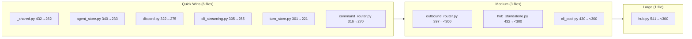

## Context

**Promoted from:** [Analysis #760](../analyses/760-eliminate-all-file-folder-size-exemptions-analysis.mdx)

Issue #753 (dispatch extraction) completed significant refactoring, creating momentum for this cleanup. The codebase has accumulated 10 file exemptions (≤300 lines) and 5 folder exemptions (≤12 files) that bypass pre-commit hooks. These exemptions create technical debt and reduce code navigability.

**Prerequisite:** Exemption files (`tools/file_exemptions.txt`, `tools/folder_exemptions.txt`) contain stale line counts from before #753. Update these first with current measurements.

## Goal

All exemptions removed, `make lint` passes clean, CI enforces uniformly without exemptions.

## Users & Use Cases

| User | Workflow | Impact |
|------|----------|--------|
| Developer (Mickael) | Code navigation, review, refactoring | Smaller files = easier to understand and modify |
| CI/CD pipeline | Pre-commit hook enforcement | Uniform limits, no special cases |
| Future contributors | Onboarding | Clearer module boundaries |

## Expected Behavior

### Happy path

1. Developer runs `make lint` → passes without exemption warnings
2. Developer runs `uv run pre-commit run --all-files` → passes clean
3. All files are ≤300 lines, all folders are ≤12 files
4. Public APIs unchanged — internal refactors only

### Edge cases

| Case | Handling |
|------|----------|
| Import breakage during extraction | Update imports in same PR, run full test suite |
| Test coverage regression | Block extraction if coverage drops below baseline |
| Circular dependency introduced | Reject extraction, find alternative split point |
| Mixin extraction creates name conflict | Use descriptive suffix (e.g., `HubShutdown`, not `Shutdown`) |

## Data Model & Consumers

### File Extraction Priority

### Consumer Summary

| Consumer | Files Consumed | When | Status |
|----------|---------------|------|--------|
| `hub.py` | pool_manager.py, identity/ | Import at module load | This issue |
| `hub_standalone.py` | nats wiring, auth seeding | Bootstrap initialization | This issue |
| `_shared.py` | streaming state module | Adapter initialization | This issue |
| `agent_store.py` | bot mapping module | Store initialization | This issue |
| `cli_pool.py` | session, streaming, lifecycle modules | Pool initialization | This issue |
| `outbound_router.py` | tts, audio dispatch modules | Router initialization | This issue |
| Tests | All extracted modules | Test execution | This issue |

## Breadboard

### Code Affordances

| ID | Handler | Wiring | Logic |
|----|---------|--------|-------|
| N1 | `HubShutdown` extraction | hub.py → hub/shutdown.py | `shutdown()`, `notify_shutdown_inflight()` (~55L) |
| N2 | `HubCircuitBreaker` extraction | hub.py → hub/circuit_breaker.py | `circuit_breaker_drop()`, `record_circuit_success()`, `record_circuit_failure()` (~45L) |
| N3 | `HubPoolDelegation` extraction | hub.py → hub/pool_delegation.py | `get_or_create_pool()`, `flush_pool()`, pool-related methods (~25L) |
| N4 | `HubDispatch` extraction | hub.py → hub/dispatch.py | `dispatch_*` methods (response, streaming, attachment, audio) (~50L) |
| N5 | `TtsDispatch` extraction | outbound_router.py → hub/outbound_tts.py | TTS dispatch logic (~80L) |
| N6 | `AudioDispatch` extraction | outbound_router.py → hub/outbound_audio.py | Audio dispatch logic (~40L) |
| N7 | `NatsAdapterWiring` extraction | hub_standalone.py → bootstrap/nats_wiring.py | NATS connection setup (~90L) |
| N8 | `AuthSeeding` extraction | hub_standalone.py → bootstrap/auth_seeding.py | Agent DB seeding (~30L) |
| N9 | `HubBuilder` extraction | hub_standalone.py → bootstrap/hub_builder.py | Hub construction helpers (~40L) |
| N10 | `StreamingState` extraction | _shared.py → adapters/_shared_streaming.py | State machine for streaming (~170L) |
| N11 | `BotAgentMapStore` extraction | agent_store.py → infrastructure/stores/bot_agent_map.py | Bot→agent mapping (~63L) |
| N12 | `AgentStoreRuntimeState` extraction | agent_store.py → infrastructure/stores/agent_runtime_state.py | Runtime state queries (~44L) |
| N13 | `DiscordLifecycle` extraction | discord.py → adapters/discord/lifecycle.py | on_ready, on_disconnect callbacks (~47L) |
| N14 | `CliStreamingParser` extraction | cli_streaming.py → core/cli_streaming_parser.py | Event parsing (~50L) |
| N15 | `TurnStoreSession` extraction | turn_store.py → core/stores/turn_store_session.py | Session methods (~80L) |
| N16 | `CliPoolSession` extraction | cli_pool.py → core/cli_pool_session.py | Session persistence (~30L) |
| N17 | `CliPoolStreaming` extraction | cli_pool.py → core/cli_pool_streaming.py | Streaming methods (~80L) |
| N18 | `CliPoolLifecycle` extraction | cli_pool.py → core/cli_pool_lifecycle.py | Lifecycle methods (~40L) |

### Data Stores

| ID | Store | Type | Accessed by |
|----|-------|------|-------------|
| S1 | `auth.db` (agents) | Persistent SQLite | N8, N11 |
| S2 | In-memory state | Transient | N10 |

## Slices

Vertical increments — each slice is independently demo-able via lint + tests.

| Slice | Description | Affordances | Demo |
|-------|-------------|-------------|------|
| V1 | Quick wins — 6 single-extraction files | N10–N15 | `make lint` shows 6 exemptions removed |
| V2 | Medium refactors — outbound_router, hub_standalone, cli_pool (multiple extractions each) | N5–N9, N16–N18 | `make lint` shows 9 exemptions removed |
| V3 | Large refactor — hub.py (4 extractions) | N1–N4 | `make lint` passes clean (file exemptions) |
| V4 | Folder reorganization — create subfolders under core/, adapters/, bootstrap/ | All | `make lint` passes clean (folder exemptions) |

## Constraints

- **No breaking changes:** All refactors must preserve public APIs
- **Test coverage:** Must maintain ≥ baseline coverage; measure before extraction
- **Sequential dependencies:** Hub extractions must complete before folder reorg
- **Architecture compliance:** All moves respect Hexagonal layer boundaries (no `core/infrastructure/`)
- **Time budget:** ~20 days

## Non-goals

- Domain-driven package reorganization (deferred to future initiative)
- New features or behavior changes
- Performance optimization beyond line count reduction
- Creating shared utility libraries (over-extraction risk)

## Technical Decisions

| Decision | Choice | Rationale |
|----------|--------|-----------|
| Extraction approach | Module extraction (not mixins) | Clean imports, no composition complexity |
| Hub.py strategy | 4 sequential extractions | Single extraction insufficient (541-175=~366 still over) |
| Folder organization | Subfolders within package | Lower risk than cross-package moves |
| Infrastructure files | Move to `infrastructure/` or stay in `core/` | Never create `core/infrastructure/` (violates Kernel) |

## Success Criteria

- [ ] `tools/file_exemptions.txt` is empty
- [ ] `tools/folder_exemptions.txt` is empty
- [ ] `make lint` passes with zero exemptions
- [ ] `uv run pre-commit run --all-files` passes clean
- [ ] All 10 previously exempt files are ≤300 lines
- [ ] All 5 previously exempt folders are ≤12 files (note: `core/stores/` already compliant at 11 files)
- [ ] Test coverage ≥ baseline (measured before extraction)
- [ ] All existing tests pass
- [ ] Public APIs unchanged (no import changes in external consumers)

## Open Questions

None — analysis resolved all ambiguities.
