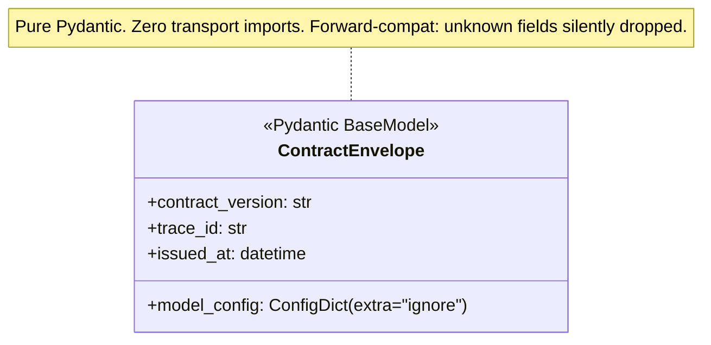
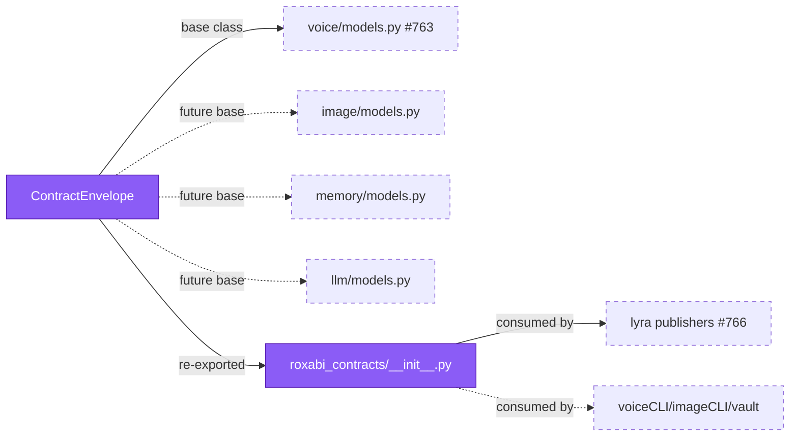

## Context

Promoted from `artifacts/frames/762-scaffold-roxabi-contracts-skeleton-frame.mdx`. Canonical structure from [ADR-049 §Layout](../../docs/architecture/adr/049-roxabi-contracts-shared-schema-package.mdx). Precedent for uv-workspace subpackage: `packages/roxabi-nats/` (ADR-045, shipped in #734).

## Goal

Create `packages/roxabi-contracts/` as a discoverable uv workspace member with `ContractEnvelope` as the shared base class for every future per-domain contract model.

## Users

- **Primary:** Downstream child issues #763–#769 — they import `from roxabi_contracts.envelope import ContractEnvelope` as the base class for voice/image/memory/llm models.
- **Secondary:** `roxabi-nats` (#765 migrates `CONTRACT_VERSION` in and installs a compat shim). Tooling (`uv sync`, `pyright`, `ruff`) must see the new package without special flags.
- **Tertiary:** Future satellite adapters (voiceCLI#69, imageCLI, roxabi-vault) — their dependency chain starts at this scaffold's import path.

## Expected Behavior

A new package lives at `packages/roxabi-contracts/` with the ADR-049 §Layout v0.1.0 shape — minus the voice submodule (deferred to #763) and tests covering voice (#763). Only `envelope.py` + its test ship here.

After the PR merges:
- `uv sync` resolves the workspace without errors.
- `uv run pyright` type-checks the new package under the existing strict config.
- `import roxabi_contracts` works from any consumer in the monorepo.
- `ContractEnvelope` is importable as `from roxabi_contracts import ContractEnvelope` or `from roxabi_contracts.envelope import ContractEnvelope`.
- Unknown fields passed to any `ContractEnvelope` subclass are **silently dropped** (forward-compat invariant, ADR-049 §Versioning).
- `packages/roxabi-contracts/tests/test_envelope.py` passes via `cd packages/roxabi-contracts && uv run pytest` (mirrors roxabi-nats precedent — root pytest integration is #768's scope).
- No placeholder submodules exist (no `voice/`, `image/`, `memory/`, `llm/` — ADR-049 explicitly bans silent empty modules).

**Deliberately deferred from this scope:** `CONTRACT_VERSION` stays in `roxabi_nats.adapter_base` until #765. That issue migrates the constant to `roxabi_contracts.envelope` and installs the compat shim. Defining it in two places across a merge window would create a drift risk (ADR-049 §Migration step 5 sequences this explicitly).

## Data Model & Consumers

### ContractEnvelope base class



### Consumer map



### Consumer summary

| Consumer | Fields consumed | When | Status |
|---|---|---|---|
| `roxabi_contracts.voice.models.TtsRequest/TtsResponse/Stt*` | all envelope fields | #763 | future |
| `roxabi_contracts.__init__` re-export | `ContractEnvelope` | this issue | this issue |
| lyra `NatsTtsClient`/`NatsSttClient` | via voice subclasses | #766 | future |
| satellite adapters | via voice subclasses | voiceCLI#69 | future |
| `roxabi_nats.adapter_base` compat shim | `CONTRACT_VERSION` constant | #765 | future |

## Breadboard

### Affordances

| ID | Name | Type | Handler | Data |
|---|---|---|---|---|
| F1 | Package manifest | file | n/a | `packages/roxabi-contracts/pyproject.toml` — project meta + `[tool.pytest.ini_options]` |
| F2 | Package README | file | n/a | `packages/roxabi-contracts/README.md` |
| F3 | Package init | module | Python import | `src/roxabi_contracts/__init__.py` — re-exports `ContractEnvelope` only |
| F4 | Envelope module | module | Python import | `src/roxabi_contracts/envelope.py` — `ContractEnvelope` only |
| F5 | Envelope test | test | pytest | `tests/test_envelope.py` |
| F6 | Workspace registration | config edit | `uv sync` | root `pyproject.toml` `[tool.uv.workspace].members += ["packages/roxabi-contracts"]` |
| F7 | Pyright registration | config edit | `uv run pyright` | root `pyproject.toml` `[tool.pyright].include += ["packages/roxabi-contracts/src"]` (tests intentionally excluded — matches roxabi-nats precedent) |
| F8 | Ruff registration | config edit | `uv run ruff check` | root `pyproject.toml` `[tool.ruff].src += ["packages/roxabi-contracts/src", "packages/roxabi-contracts/tests"]` |
| F9 | Lockfile | generated | `uv sync` | `uv.lock` regenerated + committed |

### Wiring

```
F1 (pyproject.toml)
   ├─ [project]: name="roxabi-contracts", requires-python=">=3.12", dependencies=["pydantic>=2"]
   ├─ [project.optional-dependencies].testing = ["nats-py>=2.6", "roxabi-nats"]
   ├─ [build-system]: hatchling
   ├─ [tool.hatch.build.targets.wheel].packages = ["src/roxabi_contracts"]
   └─ [tool.pytest.ini_options]: asyncio_mode="auto", testpaths=["tests"]  (mirrors roxabi-nats)
F4 (envelope.py)
   ├─ class ContractEnvelope(BaseModel) with model_config = ConfigDict(extra="ignore")
   └─ fields: contract_version: str, trace_id: str, issued_at: datetime
F3 (__init__.py) ← re-exports ContractEnvelope from F4 (CONTRACT_VERSION deferred to #765)
F5 (test_envelope.py) ← instantiates ContractEnvelope with valid fields; asserts unknown fields are dropped
F6,F7,F8 (root pyproject.toml) ← registers F1 with uv / pyright (src only) / ruff (src + tests)
F9 (uv.lock) ← regenerated by `uv sync` and committed in the same PR
```

## Slices

| # | Slice | Affordances | Demo-able |
|---|---|---|---|
| 1 | **Package + envelope** — create `packages/roxabi-contracts/` with pyproject.toml, README.md, `src/roxabi_contracts/{__init__.py, envelope.py}`, `tests/test_envelope.py`. Self-contained test runnable via `cd packages/roxabi-contracts && uv run pytest`. | F1–F5 | `pytest tests/test_envelope.py` passes inside the subpackage |
| 2 | **Root integration** — add the package to root `pyproject.toml` across `[tool.uv.workspace].members`, `[tool.pyright].include`, `[tool.ruff].src`. Regenerate `uv.lock`. | F6–F9 | `uv sync`, `uv run pyright`, `uv run ruff check` all pass at repo root |

Slice 2 is a gate: if it fails (workspace resolution / type errors / lint), Slice 1 still stands as a self-contained package. The two slices ship together in one PR (scaffold is atomic — split would leave the package invisible to tooling).

## Success Criteria

### Package manifest (F1)

- [ ] `packages/roxabi-contracts/pyproject.toml` declares `name = "roxabi-contracts"`, `requires-python = ">=3.12"`, and `dependencies = ["pydantic>=2"]`
- [ ] Same file declares `[project.optional-dependencies].testing = ["nats-py>=2.6", "roxabi-nats"]`
- [ ] Same file declares `[tool.pytest.ini_options]` with `asyncio_mode = "auto"` and `testpaths = ["tests"]` (matches roxabi-nats precedent; prevents silent failure when async tests land in #763/#764)

### Envelope module (F3, F4)

- [ ] `src/roxabi_contracts/envelope.py` defines `class ContractEnvelope(BaseModel)` with `model_config = ConfigDict(extra="ignore")` and required fields `contract_version: str`, `trace_id: str`, `issued_at: datetime`
- [ ] `src/roxabi_contracts/__init__.py` re-exports `ContractEnvelope` (and **only** `ContractEnvelope` — `CONTRACT_VERSION` is explicitly deferred to #765)

### Root registration (F6, F7, F8, F9)

- [ ] Root `pyproject.toml` `[tool.uv.workspace].members` includes `"packages/roxabi-contracts"`
- [ ] Root `pyproject.toml` `[tool.pyright].include` includes `"packages/roxabi-contracts/src"` (tests intentionally excluded — matches roxabi-nats)
- [ ] Root `pyproject.toml` `[tool.ruff].src` includes both `"packages/roxabi-contracts/src"` and `"packages/roxabi-contracts/tests"` (matches roxabi-nats)
- [ ] `uv.lock` is regenerated and committed in the same PR (without it, `uv sync --frozen` fails at deploy time — ADR-049 §Migration step 8)

### Tooling gates

- [ ] `uv sync` succeeds at repo root after registration
- [ ] `uv run pyright` produces zero new errors under `packages/roxabi-contracts/`
- [ ] `uv run ruff check packages/roxabi-contracts/` produces zero findings

### Functional + integration

- [ ] `cd packages/roxabi-contracts && uv run pytest tests/test_envelope.py` passes — verifies `ContractEnvelope` instantiation AND that `extra="ignore"` silently drops unknown fields (positive + invariant check)
- [ ] From the repo root, `uv run python -c "from roxabi_contracts import ContractEnvelope; print(ContractEnvelope.__name__)"` prints `ContractEnvelope` — cross-package import integration check
- [ ] `packages/roxabi-contracts/src/roxabi_contracts/` contains only `__init__.py` and `envelope.py` — no placeholder `voice/`, `image/`, `memory/`, or `llm/` directories (ADR-049 §Layout)

## Risks

- **uv.lock churn** — adding a workspace member produces a large diff on `uv.lock`. Expected and not a regression signal; reviewers should note the subpackage resolution entries and skip scrutiny of transitive dep hash changes.
- **pyright strict mode on a fresh module** — `datetime` without explicit timezone typing occasionally surfaces strict warnings. If any such warning appears, use `datetime` (no timezone constraint at this layer — per-domain models may tighten in later issues).
- **`[testing]` extra workspace-only at v0.1.0** — `roxabi-nats` in `[project.optional-dependencies].testing` resolves via workspace membership today. External satellites installing `roxabi-contracts[testing]` from a git tag will need `[tool.uv.sources]` pointing `roxabi-nats` to its own git location in *their* pyproject.toml (roxabi-nats is not on PyPI yet per ADR-045 §PyPI deferral). Document this in voiceCLI#69 when that adoption PR lands — out of scope here.

## Notes

- Root pytest `testpaths` is NOT touched here — per Epic #761 progress table, that integration lands in #768.
- `CONTRACT_VERSION` is **not** shipped in this scaffold. #765 migrates it from `roxabi_nats.adapter_base` and installs the compat re-export. ADR-049 §Migration step 5 codifies this ordering.
- `README.md` body can be a minimal stub pointing to ADR-049 — full content arrives with #763's voice submodule.
