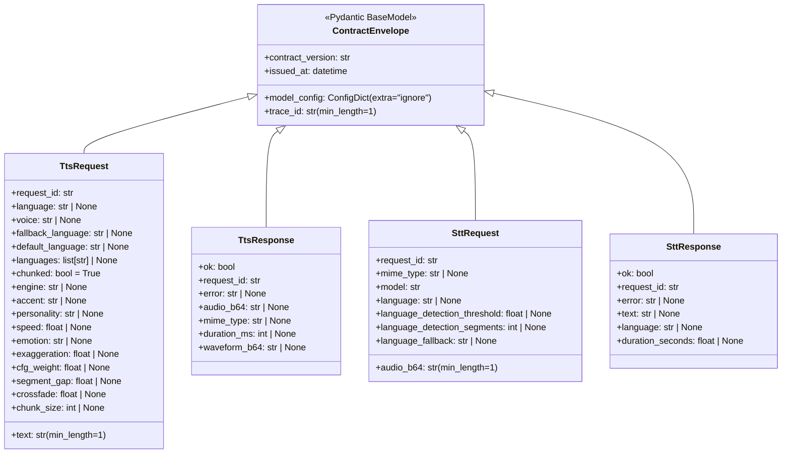
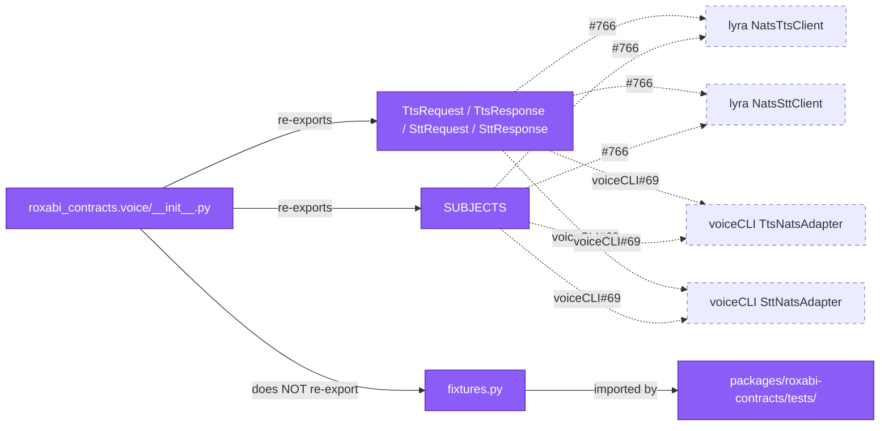

## Context

Promoted from `artifacts/frames/763-port-voice-domain-frame.mdx`. The scaffold landed in PR #771 (issue #762): `packages/roxabi-contracts/src/roxabi_contracts/{__init__.py, envelope.py}` exists with `ContractEnvelope` (extra="ignore", fields `contract_version`, `trace_id`, `issued_at`). `CONTRACT_VERSION` lives in `roxabi_nats.adapter_base` and is migrated separately in #765.

Canonical wire contract: [ADR-044](../../docs/architecture/adr/044-lyra-voicecli-nats-contract.mdx). Migration sequencing: [ADR-049 §Migration Phase 1 steps 1–3](../../docs/architecture/adr/049-roxabi-contracts-shared-schema-package.mdx). Existing implementations this port reconciles:

- Hub side: `src/lyra/nats/nats_tts_client.py` (`NatsTtsClient`, `SUBJECT = "lyra.voice.tts.request"`); `src/lyra/nats/nats_stt_client.py` (`NatsSttClient`, `SUBJECT = "lyra.voice.stt.request"`)
- Satellite side: `~/projects/voiceCLI/src/voicecli/nats/tts_adapter.py` (`TtsNatsAdapter`); `~/projects/voiceCLI/src/voicecli/nats/stt_adapter.py` (`SttNatsAdapter`)
- TTS field tuples: `packages/roxabi-nats/src/roxabi_nats/_tts_constants.py`

## Goal

Ship `roxabi_contracts.voice` — a typed, Pydantic-v2 module containing the four voice NATS models (`TtsRequest`, `TtsResponse`, `SttRequest`, `SttResponse`), a subjects namespace, and synthesized fixtures — that both lyra and voiceCLI can adopt as the single source of truth for the Tts/Stt wire contract, with all current-production field drift documented and reconciled.

## Users

- **Primary:** contracts maintainer implementing the port; reviewers checking ADR-044 fidelity and no-behavioral-drift invariants.
- **Secondary (future consumers, not migrated in this issue):** lyra `NatsTtsClient` + `NatsSttClient` (caller-migration scope: #766); voiceCLI `TtsNatsAdapter` + `SttNatsAdapter` (satellite-migration scope: voiceCLI#69).
- **Tertiary:** later domain ports (image, memory, llm) use this submodule's layout as the template.

## Expected Behavior

After merge:
- `from roxabi_contracts.voice import SUBJECTS, TtsRequest, TtsResponse, SttRequest, SttResponse` resolves. No NATS client imports execute at `roxabi_contracts.voice.__init__` import time (enforced by a test).
- `SUBJECTS.tts_request` == `"lyra.voice.tts.request"`, `SUBJECTS.tts_heartbeat` == `"lyra.voice.tts.heartbeat"`, `SUBJECTS.stt_request` == `"lyra.voice.stt.request"`, `SUBJECTS.stt_heartbeat` == `"lyra.voice.stt.heartbeat"`. `SUBJECTS.tts_workers` == `"tts_workers"`, `SUBJECTS.stt_workers` == `"stt_workers"`.
- All four models inherit `ContractEnvelope` (gaining `contract_version`, `trace_id`, `issued_at` + `ConfigDict(extra="ignore")`).
- Unknown fields in request/response payloads parse cleanly, are silently dropped (forward-compat invariant, ADR-049 §Versioning).
- `from roxabi_contracts.voice.fixtures import silence_wav_16khz, sample_transcript_en` returns pure-Python-generated artifacts: `silence_wav_16khz` is a `bytes` WAV (16 kHz, mono, 16-bit, ~1 s) synthesized on demand via `scipy.io.wavfile.write` into `io.BytesIO`; `sample_transcript_en` is a deterministic English string. Neither is a committed binary, neither is a real user sample.
- `cd packages/roxabi-contracts && uv run pytest` passes, running `test_envelope.py` (already there), `test_voice_models.py`, and `test_voice_extra_ignore.py`.
- `uv run pyright` has zero new errors under `packages/roxabi-contracts/src`.
- The `roxabi_contracts` package `__init__.py` is **not** modified to re-export voice symbols. Per ADR-049 §Layout, consumers import from the per-domain submodule (`roxabi_contracts.voice`), not from the package root.

**Drift reconciliation documented in the PR description** (and mirrored in this spec's `## Risks` section) — specifically the three items enumerated under "Known drift between lyra and voiceCLI" below.

### Known drift between lyra and voiceCLI (resolved here)

1. **TTS `mime_type` on response.** voiceCLI's `TtsNatsAdapter` always returns `"audio/wav"` on success; on the error path (`ok=False`) no `mime_type` is sent. lyra's `NatsTtsClient` reads with `payload.get("mime_type", "audio/ogg")` — that fallback value both disagrees with producer AND is only reached on error. → `TtsResponse.mime_type: str | None = None` (optional because error replies omit it). **Invariant (asserted in tests):** when `ok=True`, `mime_type` is always non-null and equals the satellite-reported producer value. Lyra's `"audio/ogg"` fallback is dead code on the success path once #766 migrates.
2. **STT `language` request field.** voiceCLI's `SttNatsAdapter` validates and accepts a `language` key in the request; lyra's `NatsSttClient.transcribe` never sends one. → `SttRequest.language: str | None = None` is part of the typed contract (present for callers that want to force a language, nullable otherwise). Consistent with ADR-044.
3. **STT `language` response default.** lyra reads `data.get("language", "unknown")`; voiceCLI always fills `result.language` on success, omits on error. → `SttResponse.language: str | None = None`. Same `ok=True → non-null` invariant as item 1, asserted in tests.
4. **STT `duration_seconds` response shape.** voiceCLI always fills `duration_seconds` on success (via `_duration_from_segments`), omits on error. lyra reads with `.get("duration_seconds", 0.0)` default. → `SttResponse.duration_seconds: float | None = None`. Same `ok=True → non-null` invariant, asserted in tests.
5. **TTS `default_language` + `languages` request fields.** voiceCLI's `_AGENT_TTS_FIELDS` in `packages/roxabi-nats/src/roxabi_nats/_tts_constants.py` declares `default_language` and `languages` as expected request fields (forwarded to `api.generate`); lyra's `_TTS_CONFIG_FIELDS` — the tuple `NatsTtsClient.synthesize` iterates — omits them. Today lyra never sends them and voiceCLI silently reads `None`. → `TtsRequest.default_language: str | None = None` and `TtsRequest.languages: list[str] | None = None`. Field types match lyra's `AgentTTSConfig` definitions (`src/lyra/core/agent_config.py` lines 181–182). This closes a latent capability gap without changing current wire behavior.
6. **Envelope fields (`contract_version`, `trace_id`, `issued_at`) currently absent on the wire.** Neither `NatsTtsClient.synthesize` nor `NatsSttClient.transcribe` stamps `trace_id` or `issued_at` on requests today (only `contract_version` is sent, via `CONTRACT_VERSION`). voiceCLI's `TtsNatsAdapter._run_synthesis` and `SttNatsAdapter._run_transcription` do not stamp any envelope fields on replies. Because this spec inherits `ContractEnvelope` (required fields) on all four models, **calling `Model.model_validate(current_wire_payload)` will raise `ValidationError` on existing traffic**. → Documented here as the primary migration obligation for #766 and voiceCLI#69: both migration PRs MUST teach their respective publishers to stamp `trace_id` (new UUID per message) + `issued_at` (current UTC datetime) + `contract_version` (already present for requests; to be added for responses) BEFORE switching to `Model.model_validate()` at the consumer side. This is the architectural point of ContractEnvelope and the reason the port ships before any caller migration.

No silent field renames. No removed fields. All optional TTS config fields (`engine`, `accent`, `personality`, `speed`, `emotion`, `exaggeration`, `cfg_weight`, `segment_gap`, `crossfade`, `chunk_size`, `chunked`) remain optional with their current names per `_tts_constants.py::_TTS_CONFIG_FIELDS`.

## Data Model & Consumers

### Data structure



`SUBJECTS` is a frozen namespace container (not diagrammed separately — see F2 in Breadboard for the literal values and helper signatures). Exposed attributes: `tts_request`, `tts_heartbeat`, `stt_request`, `stt_heartbeat`, `tts_workers`, `stt_workers`; helpers `per_worker_tts(worker_id) -> str`, `per_worker_stt(worker_id) -> str`.

### Consumer map



### Consumer summary

| Consumer | Fields/symbols consumed | When | Status |
|---|---|---|---|
| `roxabi_contracts.voice.__init__` | re-exports SUBJECTS + four models (NOT fixtures) | this issue | this issue |
| `packages/roxabi-contracts/tests/test_voice_models.py` | all four models (roundtrip) | this issue | this issue |
| `packages/roxabi-contracts/tests/test_voice_extra_ignore.py` | all four models (invariant) | this issue | this issue |
| `packages/roxabi-contracts/tests/test_voice_subjects.py` | SUBJECTS namespace constants | this issue | this issue |
| lyra `NatsTtsClient` / `NatsSttClient` | `TtsRequest/TtsResponse`, `SttRequest/SttResponse`, SUBJECTS | #766 | future |
| voiceCLI `TtsNatsAdapter` / `SttNatsAdapter` | same models + SUBJECTS | voiceCLI#69 | future |
| image / memory / llm domain ports | none directly — use this submodule's layout as template | #764, #765+ | future |

## Breadboard

### Affordances

| ID | Name | Type | Handler | Data |
|---|---|---|---|---|
| F1 | Voice package init | module | Python import | `src/roxabi_contracts/voice/__init__.py` — re-exports `SUBJECTS`, `TtsRequest`, `TtsResponse`, `SttRequest`, `SttResponse`. No NATS imports. No `fixtures` re-export. |
| F2 | Subjects namespace | module | constant access | `src/roxabi_contracts/voice/subjects.py` — `SUBJECTS` as a frozen `SimpleNamespace` (or dataclass with `frozen=True`) + `per_worker_tts(wid)` / `per_worker_stt(wid)` helpers |
| F3 | Models module | module | Pydantic validate/dump | `src/roxabi_contracts/voice/models.py` — four `ContractEnvelope` subclasses with fields per Data Model diagram; `text`/`audio_b64`/`trace_id` use `StringConstraints(min_length=1)` |
| F4 | Fixtures module | module | import-time factory | `src/roxabi_contracts/voice/fixtures.py` — `silence_wav_16khz: bytes` (lazy-built via `scipy.io.wavfile.write` into `io.BytesIO`, cached in a module-level variable); `sample_transcript_en: str` literal |
| F5 | Roundtrip test | test | pytest | `tests/test_voice_models.py` — for each of the four models: valid construction, `model_dump_json()` → `model_validate_json()` equality |
| F6 | Extra-ignore test | test | pytest | `tests/test_voice_extra_ignore.py` — for each model: instantiate with unknown fields in both `model_validate` and the JSON path; assert they are silently dropped and do not raise |
| F7 | Subjects test | test | pytest | `tests/test_voice_subjects.py` — assert SUBJECTS values match the canonical strings listed in ADR-044 / NatsTtsClient / NatsSttClient; assert `per_worker_tts("w1")` == `"lyra.voice.tts.request.w1"` |
| F8 | Pyproject `scipy` dep | config edit | `uv sync` | `packages/roxabi-contracts/pyproject.toml` — add `scipy` to `[project.optional-dependencies].testing` ONLY (not a runtime dep; fixtures are only imported by tests; matches ADR-049 §Trust model — no runtime NATS/scipy in the base install) |
| F9 | Package README | doc | Markdown | `packages/roxabi-contracts/README.md` — brief stub grown from #762's placeholder to document the voice submodule's public API |

### Wiring

```
F2 (subjects.py)
   ├─ SUBJECTS constants (literal strings — DO NOT derive from f-strings to keep greppability)
   └─ per_worker_tts/stt helpers → f"{SUBJECTS.tts_request}.{worker_id}"
F3 (models.py)
   ├─ TtsRequest(ContractEnvelope) — fields per Data Model; text, trace_id: min_length=1
   ├─ TtsResponse(ContractEnvelope) — ok, request_id required; error/audio_b64/mime_type/duration_ms/waveform_b64 optional
   ├─ SttRequest(ContractEnvelope) — audio_b64, model required; others optional; language present (drift item #2)
   └─ SttResponse(ContractEnvelope) — ok, request_id required; text/language/duration_seconds optional
F1 (voice/__init__.py)
   ├─ from .subjects import SUBJECTS
   ├─ from .models import TtsRequest, TtsResponse, SttRequest, SttResponse
   └─ __all__ = ["SUBJECTS", "TtsRequest", "TtsResponse", "SttRequest", "SttResponse"]
       (fixtures deliberately excluded — test-only path)
F4 (fixtures.py)
   ├─ import io; import numpy as np; from scipy.io.wavfile import write as _wav_write  (lazy: inside factory)
   ├─ _build_silence_wav_16khz() → bytes (1 second of int16 zeros at 16 kHz, mono)
   ├─ silence_wav_16khz: bytes = _build_silence_wav_16khz()   (module-level, built once)
   └─ sample_transcript_en: str = "Hello, this is a roxabi-contracts test fixture."
F5 (test_voice_models.py) ← F3
   ├─ parametrized over 4 models × (construct valid with stamped envelope fields → dump_json → validate_json → equal)
   └─ success-path invariant tests: TtsResponse(ok=True) requires audio_b64/mime_type/duration_ms non-null; SttResponse(ok=True) requires text/language/duration_seconds non-null (drift items 1, 3, 4)
F6 (test_voice_extra_ignore.py) ← F3
   └─ parametrized over 4 models × {"surprise_field": "x", "nested": {...}} → no exception, field absent
F7 (test_voice_subjects.py) ← F2
   └─ literal equality assertions + per-worker helper assertion
F8 (pyproject.toml) ← F4, F5
   └─ adds scipy to [testing] extra only — fixtures module only imported by tests
F9 (README.md) ← F1–F4
   └─ documents public API, notes "no transport imports at package root"
```

## Slices

| # | Slice | Affordances | Demo-able |
|---|---|---|---|
| 1 | **Subjects + subjects test** — Add `voice/subjects.py` with SUBJECTS + helpers; add `voice/__init__.py` (empty re-exports except SUBJECTS); add `tests/test_voice_subjects.py`. Smallest possible increment, establishes package shape. | F1 (partial), F2, F7 | `cd packages/roxabi-contracts && uv run pytest tests/test_voice_subjects.py` passes |
| 2 | **Models + roundtrip + extra-ignore** — Add `voice/models.py` with all four `ContractEnvelope` subclasses; add `tests/test_voice_models.py` + `tests/test_voice_extra_ignore.py`; extend `voice/__init__.py` to re-export the four models. | F1 (complete), F3, F5, F6 | `uv run pytest tests/test_voice_*.py` passes all three test files; `uv run pyright` clean |
| 3 | **Fixtures + [testing] extra update + README** — Add `voice/fixtures.py` (synthesized silence_wav_16khz + sample_transcript_en); add `scipy` to `[project.optional-dependencies].testing` in pyproject.toml; regenerate `uv.lock`; flesh out README.md. | F4, F8, F9 | `python -c "from roxabi_contracts.voice.fixtures import silence_wav_16khz; assert len(silence_wav_16khz) > 44"` (WAV header + data); `uv run pytest` (full suite) green |

Slice 1 + 2 ship the public contract surface and are the only slices consumers strictly need. Slice 3 adds the fixtures used by Slice 2's tests — thinking of it as a slice is slightly artificial because Slice 2's tests will import `silence_wav_16khz`. **Decision:** merge Slice 3's fixtures + scipy dep into Slice 2's first commit inside the same PR; README tweaks remain separate. The three slices collapse into one PR — splitting would strand tests without fixtures.

Net outcome: **one PR, three logical commits**, all three demo-able in isolation in a local checkout via the `uv run pytest` commands above.

## Success Criteria

### Subjects (F2, F7)

- [ ] `src/roxabi_contracts/voice/subjects.py` exists and exports a `SUBJECTS` container (frozen namespace/dataclass) with attributes `tts_request`, `tts_heartbeat`, `stt_request`, `stt_heartbeat`, `tts_workers`, `stt_workers` holding exactly the strings `"lyra.voice.tts.request"`, `"lyra.voice.tts.heartbeat"`, `"lyra.voice.stt.request"`, `"lyra.voice.stt.heartbeat"`, `"tts_workers"`, `"stt_workers"`
- [ ] `subjects.py` exports `per_worker_tts(worker_id: str) -> str` and `per_worker_stt(worker_id: str) -> str` returning `f"{subject}.{worker_id}"`
- [ ] `tests/test_voice_subjects.py` asserts: every SUBJECTS attribute matches the literal string from `NatsTtsClient.SUBJECT` / `NatsSttClient.SUBJECT` and their heartbeat module constants; `per_worker_tts("w1")` == `"lyra.voice.tts.request.w1"`

### Models (F3, F5, F6)

- [ ] `src/roxabi_contracts/voice/models.py` defines `TtsRequest`, `TtsResponse`, `SttRequest`, `SttResponse` as direct subclasses of `ContractEnvelope`
- [ ] `TtsRequest` has required `request_id: str`, `text: Annotated[str, StringConstraints(min_length=1)]`; optional (all `| None = None`): `language`, `voice`, `fallback_language`, `default_language`, `languages` (typed `list[str] | None`), `engine`, `accent`, `personality`, `speed`, `emotion`, `exaggeration`, `cfg_weight`, `segment_gap`, `crossfade`, `chunk_size`; `chunked: bool = True`
- [ ] `TtsResponse` has required `ok: bool`, `request_id: str`; optional `error`, `audio_b64`, `mime_type`, `duration_ms`, `waveform_b64`. **Success-path invariant (asserted in `test_voice_models.py`):** when `ok=True`, `audio_b64` AND `mime_type` AND `duration_ms` are all non-null.
- [ ] `SttResponse` success-path invariant (asserted in `test_voice_models.py`): when `ok=True`, `text` AND `language` AND `duration_seconds` are all non-null.
- [ ] `SttRequest` has required `request_id: str`, `audio_b64: Annotated[str, StringConstraints(min_length=1)]`, `model: str`; optional `mime_type`, `language`, `language_detection_threshold`, `language_detection_segments`, `language_fallback`
- [ ] `SttResponse` has required `ok: bool`, `request_id: str`; optional `error`, `text`, `language`, `duration_seconds`
- [ ] `tests/test_voice_models.py` roundtrip-asserts each model: `Model.model_validate_json(instance.model_dump_json()) == instance`, parametrized over valid-construction samples for each of the four models
- [ ] `tests/test_voice_extra_ignore.py` asserts each model silently drops unknown fields via both `model_validate` (dict path) and `model_validate_json` (string path); unknown field is absent from `model_dump()` output

### Fixtures (F4, F8)

- [ ] `src/roxabi_contracts/voice/fixtures.py` exports `silence_wav_16khz: bytes` built at module import via `scipy.io.wavfile.write` over 1 s of int16 zeros at 16 kHz mono — no binary blob committed
- [ ] Same module exports `sample_transcript_en: str` as a deterministic English test phrase (≤120 chars, no PII)
- [ ] `packages/roxabi-contracts/pyproject.toml` adds `scipy` to `[project.optional-dependencies].testing` (NOT to base `dependencies`); `uv.lock` is regenerated and committed
- [ ] `fixtures.py` is NOT imported from `voice/__init__.py` (verified by an import test in `test_voice_subjects.py`: `assert "fixtures" not in vars(roxabi_contracts.voice)`)

### Package surface (F1)

- [ ] `src/roxabi_contracts/voice/__init__.py` re-exports exactly `SUBJECTS`, `TtsRequest`, `TtsResponse`, `SttRequest`, `SttResponse` (matches `__all__`)
- [ ] Neither `voice/__init__.py` nor `voice/subjects.py` nor `voice/models.py` imports anything from `nats.*` or `roxabi_nats.*` (verified by a grep or an import-hook test)
- [ ] Subprocess import invariant: `uv run python -c "import roxabi_contracts.voice; import sys; assert not any(m.startswith('nats') or m.startswith('roxabi_nats') for m in sys.modules)"` exits 0 (no transport module pulled transitively by the voice submodule)
- [ ] `roxabi_contracts/__init__.py` is **not** modified (no voice re-export at package root — ADR-049 §Layout)

### Drift reconciliation (documentation)

- [ ] PR description enumerates the six drift items listed in `## Expected Behavior > Known drift`, with file+line references to lyra and voiceCLI occurrences, and states the chosen resolution for each
- [ ] PR description includes the explicit migration obligation from drift item #6: that #766 and voiceCLI#69 MUST stamp `contract_version` + `trace_id` + `issued_at` on their respective publishers before switching to `Model.model_validate()` at the consumer side
- [ ] Spec `## Risks` section (below) mirrors those six items (one-to-one wording) so the frozen record stays in this repo

### Integration smoke tests

- [ ] `uv run python -c "from roxabi_contracts.voice import SUBJECTS, TtsRequest, TtsResponse, SttRequest, SttResponse; print(SUBJECTS.tts_request)"` at repo root prints `lyra.voice.tts.request` — cross-package import + namespace attribute access integration check
- [ ] `uv run python -c "from roxabi_contracts.voice.fixtures import silence_wav_16khz; assert len(silence_wav_16khz) > 44 and silence_wav_16khz[:4] == b'RIFF'"` — fixture produces a real WAV (header + data) on import, not a stub

### Tooling gates

- [ ] `cd packages/roxabi-contracts && uv run pytest` passes (existing `test_envelope.py` + new `test_voice_*.py`)
- [ ] `uv run pyright` has zero new errors under `packages/roxabi-contracts/src`
- [ ] `uv run ruff check packages/roxabi-contracts/` has zero findings
- [ ] `uv sync` succeeds at repo root after the pyproject edit (new `scipy` dep resolves)

## Risks

- **Producer drift survives the port.** Callers are NOT migrated here — the four models must be *behaviorally identical* on the wire to what lyra/voiceCLI serialize today, otherwise the first consumer migration (#766 or voiceCLI#69) will discover a silent breakage. Mitigation: explicit drift section above; roundtrip tests parametrized with fixtures that mirror the current JSON payloads shipped by `NatsTtsClient.synthesize` and `TtsNatsAdapter.handle` — AND include stamped envelope fields so tests cover both current + target-contract shapes.
- **Six known drift items (resolved, recorded in `## Expected Behavior > Known drift` above).** Frozen summary for future auditors:
  1. `TtsResponse.mime_type: str | None` — optional; non-null invariant when `ok=True`, asserted in tests.
  2. `SttRequest.language: str | None` — optional; voiceCLI reads it, lyra never sent it.
  3. `SttResponse.language: str | None` — optional; non-null invariant when `ok=True`, asserted in tests.
  4. `SttResponse.duration_seconds: float | None` — optional; non-null invariant when `ok=True`, asserted in tests.
  5. `TtsRequest.default_language` / `languages` — added; lyra's `_TTS_CONFIG_FIELDS` will forward them once `#766` adds them to the serializer.
  6. Envelope fields (`contract_version`, `trace_id`, `issued_at`) absent on current wire; `#766` + `voiceCLI#69` MUST stamp them before switching to `model_validate()`. This is the first-migration-breaks landmine; calling it out here so it is not a surprise.
- **`[testing]` extra adds `scipy`.** Non-trivial binary dep. Resolves fine via `uv sync`; the workspace lock absorbs the transitive tree (already present elsewhere in voiceCLI's stack). If install time grows noticeably, mitigate by gating fixtures behind a try-import and skipping test_voice_models where scipy is unavailable — defer unless observed.
- **Subjects as a namespace vs. module constants.** Chose a namespace container so mis-typed attribute access fails at pyright-time rather than silently returning `None`. Non-`SUBJECTS` callers can still `from roxabi_contracts.voice.subjects import SUBJECTS` without opening the namespace.
- **No runtime NATS publish/subscribe wrappers.** ADR-049 keeps the package pure-Pydantic; any `publish_tts_request` helper belongs in `roxabi-nats` after #766's caller migration. Out of scope here.

## Notes

- `CONTRACT_VERSION` stays in `roxabi_nats.adapter_base` for this issue. Models do NOT set a default for `contract_version` — callers fill it with `CONTRACT_VERSION` until #765 migrates the constant into `roxabi_contracts.envelope`.
- Root `pyproject.toml` is NOT touched here. #762's PR already registered the package for `uv`, `pyright`, `ruff`.
- `test_envelope.py` (from #762) is untouched.
- Full rename of `voice_workers` vs `tts_workers` / `stt_workers` queue-group strings: keeping per-service (`tts_workers`, `stt_workers`) matches voiceCLI's current `queue_groups.py` exactly. No rename in scope.
