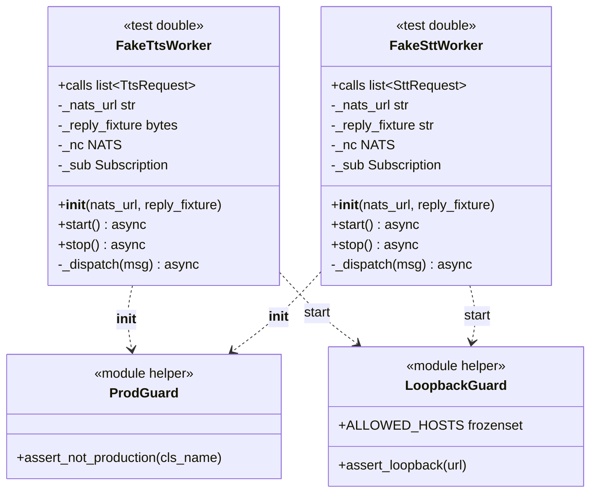
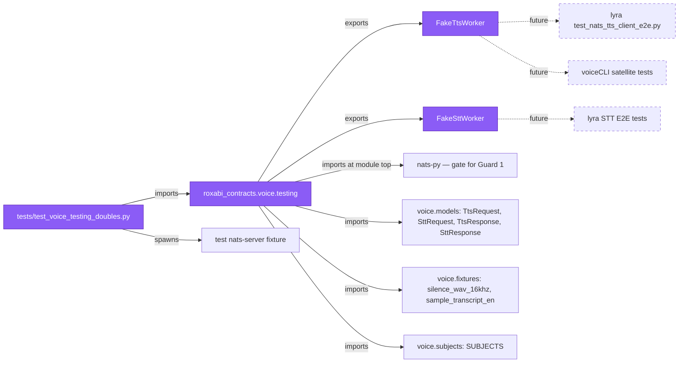

## Context

Promoted from `artifacts/frames/764-voice-test-doubles-frame.mdx`. Blocker #763 merged on 2026-04-17 (PR #777) — `roxabi_contracts.voice` now exports `TtsRequest`, `TtsResponse`, `SttRequest`, `SttResponse`, `SUBJECTS`, and `silence_wav_16khz`/`sample_transcript_en` fixtures on staging.

Canonical source for the test-double contract: [ADR-049 §Test-double pattern](../../docs/architecture/adr/049-roxabi-contracts-shared-schema-package.mdx) (lines 148–170). Canonical subjects: `lyra.voice.tts.request` / `lyra.voice.stt.request` (from `SUBJECTS` in #763). The `[testing]` optional-dependency declaration already lists `nats-py>=2.6 · roxabi-nats · scipy>=1.11` — no `pyproject.toml` edit needed here.

Naming note: ADR-049 §Loopback-only NATS URL (line 156) and #764's issue body use the identifier `connect()` for the point where Guard 3 fires. The §API surface table (lines 163–167) shows only `start()` / `stop()`. This spec **resolves that ambiguity in favour of `start()`** — it is the public method that establishes the NATS connection, so Guard 3 fires there. No separate `connect()` method is introduced.

## Goal

Ship `roxabi_contracts.voice.testing` — an opt-in, `[testing]`-extra-gated module containing `FakeTtsWorker` and `FakeSttWorker` — wired with three independent, non-bypassable guards (`[testing]` extra at import-time, `LYRA_ENV=production` assertion in `__init__`, loopback-only URL check in `start()`) that (a) subscribe to the canonical voice subjects on a loopback NATS, (b) reply with a configurable fixture, (c) record every decoded request in a `calls` list for test assertions, and (d) are accompanied by a test file that asserts each guard fires in isolation.

## Users

- **Primary:** contracts maintainer implementing the fakes + guards; reviewers verifying each guard's independence and the ADR-049 API signature.
- **Secondary (future consumers, not migrated in this issue):**
  - lyra `test_nats_tts_client_e2e.py` — will import `FakeTtsWorker` to drive hub-side publish/reply without voiceCLI.
  - voiceCLI satellite tests — will import `FakeSttWorker` / `FakeTtsWorker` for hub-less tests.
  - **Note:** downstream consumers in sibling repos (voiceCLI, 2ndBrain) can only install this module from a published `roxabi-contracts` git tag. Tag publication is out of scope here and gated by ADR-049 Phase 1 completion across all domains — until then, in-repo consumers (`test_nats_tts_client_e2e.py` in the same workspace) are the only immediate beneficiaries.
- **Tertiary:** security reviewers auditing the three-guard defense-in-depth posture; later domain test-doubles (image, memory, llm) use this module as the template.

## Expected Behavior

After merge:

- `from roxabi_contracts.voice.testing import FakeTtsWorker, FakeSttWorker` resolves **only** in an environment where `roxabi-contracts[testing]` is installed. In a bare `roxabi-contracts` install (no `[testing]` extra), the import fails with `ModuleNotFoundError: No module named 'nats'` (Guard 1 — see below for why this bites at module-top-level import).
- `FakeTtsWorker(nats_url="nats://127.0.0.1:4222", reply_fixture=None)` is the canonical constructor. `reply_fixture=None` means the fake replies with `silence_wav_16khz` (TTS) or `sample_transcript_en` (STT) from `roxabi_contracts.voice.fixtures`.
- Constructing with `os.environ.get("LYRA_ENV", "").casefold() == "production"` raises `RuntimeError("FakeTtsWorker cannot run in production")` (or `FakeSttWorker cannot run in production`). Comparison is **case-insensitive** — `PRODUCTION`, `Production`, `pRoDuCtIoN` all trip the guard (amended from exact-match per PR #789 review item W5; closes a latent case-sensitivity bypass). The guard fires **before** any field is stored on `self`, and **before** any NATS import is exercised lazily. No override flag exists — no kwarg, no subclass escape hatch, no environment flag to disable the guard. Security-by-obscurity is explicitly rejected per ADR-049.
- Calling `await worker.start()` with a non-loopback URL raises `ValueError` with a message enumerating the allowed hosts (`127.0.0.1`, `localhost`). The guard fires **before** `nats_connect()` is called. No override. This closes the accidental-prod-queue-group-shadowing class of bugs even when Guard 2 is misconfigured.
- Allowed URL hosts for Guard 3 (rationale in `## Risks`):
  - `127.0.0.1` (IPv4 loopback)
  - `localhost` (hostname loopback)
  - `::1` (IPv6 loopback, compact form — what `urlparse` returns for `nats://[::1]:...`)
  - `0:0:0:0:0:0:0:1` (IPv6 loopback, expanded form — Python's `urlparse` does NOT normalize this to `::1`, so the full form must be explicitly allowed or tests on systems that emit the expanded form silently fail)
  - **Rejected:** `0.0.0.0` (wildcard bind is accidentally-prod-shaped), any routable hostname, any non-loopback IP literal.
  - The check uses `urllib.parse.urlparse(url).hostname` on the parsed URL — string-match alone is not enough because `nats://localhost.evilcorp.com:4222` would string-match `"localhost"`.
- After `await worker.start()` succeeds, the fake is subscribed (queue group `tts_workers` or `stt_workers` per `SUBJECTS`) and handles requests by: (1) deserializing via `TtsRequest.model_validate_json(msg.data)` / `SttRequest.model_validate_json(msg.data)`, (2) appending the typed model to `worker.calls`, (3) publishing a `TtsResponse` / `SttResponse` built from the fixture to `msg.reply`.
- `worker.calls: list[TtsRequest]` (or `list[SttRequest]`) is the public attribute for assertions — typed, populated in dispatch order.
- `await worker.stop()` drains the subscription and closes the NATS connection. Re-entrant: calling `stop()` twice is a no-op.
- The test file `tests/test_voice_testing_doubles.py` verifies each guard in isolation (G1 via an `importlib`-level check, G2 by setting `LYRA_ENV=production` and constructing, G3 by constructing with `LYRA_ENV` cleared and passing a routable URL), plus a round-trip test against an embedded `nats-server` binary (or the workspace's `nats_server` fixture — decision point, see `## Risks`).

### Guard independence matrix (frozen invariant)

Each guard MUST fire independently of the state of the other two. The test file asserts this via a 2×2×2 matrix (partial — the all-guards-pass cell is covered by the round-trip test):

| Test | G1 state | G2 state (`LYRA_ENV`) | G3 state (url) | Expected |
|---|---|---|---|---|
| `test_g1_import_without_extra` | bare install (no `nats`) | — | — | `ModuleNotFoundError` at import of `testing.py` |
| `test_g2_prod_env_raises` | installed | `"production"` | loopback | `RuntimeError` from `__init__` |
| `test_g2_prod_env_raises_even_when_g3_would_pass` | installed | `"production"` | `"nats://127.0.0.1:4222"` | `RuntimeError` — proves G2 independent of G3 |
| `test_g3_non_loopback_raises` | installed | unset (non-prod) | `"nats://10.0.0.5:4222"` | `ValueError` from `start()` |
| `test_g3_non_loopback_raises_when_g2_unset` | installed | unset | routable hostname | `ValueError` — proves G3 independent of G2 state |
| `test_g3_rejects_wildcard_bind` | installed | unset | `"nats://0.0.0.0:4222"` | `ValueError` — wildcard ≠ loopback |
| `test_g3_accepts_ipv6_loopback` | installed | unset | `"nats://[::1]:4222"` | `start()` proceeds past guard (¬assertion about connection success) |
| `test_g3_rejects_localhost_subdomain` | installed | unset | `"nats://localhost.evil.com:4222"` | `ValueError` — hostname parsing catches string-match trick |

## Data Model & Consumers

### Data structure



> Mermaid renders method signatures without type annotations and raised exceptions. In code: `_nc: NATS | None`, `_sub: Subscription | None`, `__init__` raises `RuntimeError` on Guard 2, `start()` raises `ValueError` on Guard 3. The `LoopbackGuard` / `ProdGuard` labels above stand in for the two module-private free functions `_assert_loopback_url(url)` and `_assert_not_production(cls_name)` — they are NOT classes in the actual code.

`_LoopbackGuard` and `_ProdGuard` are module-private helpers (underscore prefix). They exist to avoid duplicating Guard 2/Guard 3 logic across the two fakes — the fakes share identical guard implementations. A helper is NOT an escape hatch because it is a private free function inside `testing.py` — external callers cannot import it (`__all__` excludes them) and monkey-patching it from outside still leaves Guard 1 in place.

### Consumer map



### Consumer summary

| Consumer | Fields/symbols consumed | When | Status |
|---|---|---|---|
| `tests/test_voice_testing_doubles.py` | `FakeTtsWorker`, `FakeSttWorker`, guard matrix | this issue | this issue |
| `voice/__init__.py` | **does NOT re-export `testing`** (test-only path) | this issue | this issue (invariant) |
| lyra `test_nats_tts_client_e2e.py` | `FakeTtsWorker` + fixtures | future issue under #761 | future |
| voiceCLI satellite test suite | `FakeSttWorker` / `FakeTtsWorker` | voiceCLI follow-up | future |
| image/memory/llm test-double modules | uses this module as copy-paste template | later ADR-049 Phase 1 issues | future |

## Breadboard

### Affordances

| ID | Name | Type | Handler | Data |
|---|---|---|---|---|
| F1 | `testing.py` module | module | Python import | `packages/roxabi-contracts/src/roxabi_contracts/voice/testing.py` — defines `FakeTtsWorker`, `FakeSttWorker`, `__all__ = ["FakeTtsWorker", "FakeSttWorker"]`. Imports `nats` at module top (Guard 1 gate). |
| F2 | `_assert_not_production` helper | function | direct call from `__init__` | `testing.py::_assert_not_production(cls_name: str) -> None` — raises `RuntimeError(f"{cls_name} cannot run in production")` when `os.environ.get("LYRA_ENV", "").casefold() == "production"` (case-insensitive, per PR #789 amendment). Underscore-private. No kwargs. No override path. |
| F3 | `_assert_loopback_url` helper | function | direct call from `start()` | `testing.py::_assert_loopback_url(url: str) -> None` — uses `urllib.parse.urlparse` to extract `.hostname`; raises `ValueError` if `hostname not in ALLOWED_LOOPBACK_HOSTS`. |
| F4 | `ALLOWED_LOOPBACK_HOSTS` | module const | frozenset lookup | `frozenset({"127.0.0.1", "localhost", "::1"})`. Module-level, underscore-prefixed only if not documented in README; otherwise public for grepability. |
| F5 | `FakeTtsWorker` class | class | instantiate → `await start()` → assertions on `.calls` → `await stop()` | `__init__(nats_url: str = "nats://127.0.0.1:4222", reply_fixture: bytes \| None = None)`; `calls: list[TtsRequest]`; `start()`; `stop()`. Constructor calls F2; `start()` calls F3 then connects. |
| F6 | `FakeSttWorker` class | class | same shape as F5, `str` payload | `__init__(nats_url: str = "nats://127.0.0.1:4222", reply_fixture: str \| None = None)`; `calls: list[SttRequest]`; same guard wiring. |
| F7 | `start()` semantics | method | async | Validates URL (F3), opens `nats_connect(url)` (reusing `roxabi_nats.connect`), subscribes to `SUBJECTS.tts_request` (or `.stt_request`) with queue `SUBJECTS.tts_workers` / `.stt_workers`, stores NC + subscription handles. Idempotent: second call with `self._nc` already set raises `RuntimeError`. |
| F8 | `_dispatch(msg)` semantics | method | async callback | Decodes payload via `TtsRequest.model_validate_json(msg.data)` (or `SttRequest`). On `ValidationError`: logs, drops, returns (does NOT reply — upstream will time out, same as a crashed worker). On success: appends to `self.calls`, builds `TtsResponse`/`SttResponse` from `reply_fixture` or the default fixture, publishes to `msg.reply`. |
| F9 | `stop()` semantics | method | async | If `_sub` set: unsubscribe. If `_nc` set and connected: `await _nc.drain()` bounded by a 2-second timeout, then `await _nc.close()`. Clear both handles. Safe to call twice. |
| F10 | Guard 1 import wiring | module-top import | `import nats` at top of `testing.py` | Unconditional `import nats` at module top (no `try/except`) — if `nats` is missing, the module's first line raises `ModuleNotFoundError`. This is load-bearing: a `try/except ImportError` here would DEFEAT Guard 1. |
| F11 | `tests/test_voice_testing_doubles.py` | test file | pytest | Covers the 8-row guard matrix in `## Expected Behavior`, plus the TTS + STT round-trip tests against a test NATS fixture (see F12). |
| F12 | Test NATS fixture | pytest fixture | session-scoped | Provides a loopback `nats://127.0.0.1:{random_port}/` for round-trip tests. Reuses `packages/roxabi-nats/tests/conftest.py::nats_server` if it exists; otherwise scopes a local fixture in `packages/roxabi-contracts/tests/conftest.py`. Decision in `## Risks`. |

### Wiring

```
F1 (testing.py) — module top
   ├─ import os
   ├─ import nats          ← F10: Guard 1 gate (fails here without [testing] extra)
   ├─ from urllib.parse import urlparse
   ├─ from roxabi_nats.connect import nats_connect    (loopback guard runs BEFORE this is called)
   ├─ from roxabi_contracts.voice.models import TtsRequest, TtsResponse, SttRequest, SttResponse
   ├─ from roxabi_contracts.voice.subjects import SUBJECTS
   ├─ from roxabi_contracts.voice.fixtures import silence_wav_16khz, sample_transcript_en
   └─ __all__ = ["FakeTtsWorker", "FakeSttWorker"]

F2 _assert_not_production(cls_name) ← called by F5.__init__ and F6.__init__ FIRST LINE
   └─ os.environ.get("LYRA_ENV", "").casefold() == "production" → RuntimeError  (case-insensitive; amended per PR #789 review)

F3 _assert_loopback_url(url) ← called by F7 FIRST LINE (before nats_connect)
   ├─ parsed = urlparse(url)
   ├─ host = parsed.hostname  (normalizes [::1] → ::1)
   └─ host not in ALLOWED_LOOPBACK_HOSTS → ValueError

F5 FakeTtsWorker.__init__(nats_url, reply_fixture)
   ├─ _assert_not_production("FakeTtsWorker")   ← G2
   ├─ self._nats_url = nats_url
   ├─ self._reply_fixture = reply_fixture if reply_fixture is not None else silence_wav_16khz
   ├─ self._nc = None
   ├─ self._sub = None
   └─ self.calls = []

F7 FakeTtsWorker.start()
   ├─ _assert_loopback_url(self._nats_url)   ← G3
   ├─ if self._nc is not None: raise RuntimeError("already started")
   ├─ self._nc = await nats_connect(self._nats_url)
   └─ self._sub = await self._nc.subscribe(
          SUBJECTS.tts_request,
          queue=SUBJECTS.tts_workers,
          cb=self._dispatch,
      )

F8 FakeTtsWorker._dispatch(msg)
   ├─ try: req = TtsRequest.model_validate_json(msg.data)
   ├─ except ValidationError: log.warning(...); return
   ├─ self.calls.append(req)
   ├─ reply = TtsResponse(
   │      ok=True, request_id=req.request_id,
   │      contract_version=req.contract_version, trace_id=req.trace_id,
   │      issued_at=datetime.now(UTC),
   │      audio_b64=base64.b64encode(self._reply_fixture).decode("ascii"),
   │      mime_type="audio/wav", duration_ms=1000,
   │  )
   └─ if msg.reply: await self._nc.publish(msg.reply, reply.model_dump_json().encode())

F9 FakeTtsWorker.stop()
   ├─ if self._sub is not None: await self._sub.unsubscribe(); self._sub = None
   ├─ if self._nc is not None and self._nc.is_connected:
   │     await asyncio.wait_for(self._nc.drain(), timeout=2.0)
   │     self._nc = None
   (F6 shape is symmetric: reply_fixture is str; default = sample_transcript_en; reply model is SttResponse with text=reply_fixture, language="en", duration_seconds=1.0)

F11 test_voice_testing_doubles.py
   ├─ test_g1_import_without_extra  — uses importlib in a subprocess with PYTHONPATH that hides nats
   ├─ test_g2_prod_env_raises[FakeTtsWorker]
   ├─ test_g2_prod_env_raises[FakeSttWorker]
   ├─ test_g2_prod_env_raises_even_when_g3_would_pass[...]
   ├─ test_g3_non_loopback_raises[nats://10.0.0.5:4222]
   ├─ test_g3_rejects_wildcard_bind[nats://0.0.0.0:4222]
   ├─ test_g3_accepts_ipv4_loopback[FakeTtsWorker|FakeSttWorker]  # URL nats://127.0.0.1:4222
   ├─ test_g3_accepts_ipv6_loopback[FakeTtsWorker|FakeSttWorker]  # URL nats://[::1]:4222
   ├─ test_g3_accepts_ipv6_loopback_full[FakeTtsWorker|FakeSttWorker]  # URL nats://[0:0:0:0:0:0:0:1]:4222
   ├─ test_g3_rejects_localhost_subdomain[FakeTtsWorker|FakeSttWorker]  # URL nats://localhost.evil.com:4222
   ├─ test_tts_roundtrip_default_fixture — uses F12, drives publish → reply → assert calls
   ├─ test_stt_roundtrip_default_fixture — same, for STT
   └─ test_calls_records_multiple_requests_in_order — issues 3 serial requests with distinct request_id values, asserts len(calls) == 3 and [r.request_id for r in calls] matches the send order. Amended from "parallel" per PR #789 review: NATS queue groups serialize dispatch per-message; serial send-order is the stronger, more reliable ordering assertion and avoids event-loop scheduling non-determinism on loaded CI runners.
```

## Slices

| # | Slice | Affordances | Demo-able |
|---|---|---|---|
| 1 | **Guard 2 + Guard 3 helpers with their own tests** — Add `voice/testing.py` with only `_assert_not_production`, `_assert_loopback_url`, `ALLOWED_LOOPBACK_HOSTS`, `__all__ = []` placeholder. Add `tests/test_voice_testing_doubles.py` with only the G2 and G3 rows (tests skip where FakeTtsWorker is referenced). Fails guard checks prove helpers work **before** the classes exist. | F1 (skeleton), F2, F3, F4, F10, F11 (partial: G2 + G3 rows only) | `uv run pytest tests/test_voice_testing_doubles.py -k "guard"` passes |
| 2 | **FakeTtsWorker + FakeSttWorker bodies wired to helpers** — Add both classes to `voice/testing.py` with `__init__` + `start` + `stop` + `_dispatch`; update `__all__`. Extend test file with the round-trip tests (requires F12). | F5, F6, F7, F8, F9, F11 (roundtrip rows), F12 | `uv run pytest tests/test_voice_testing_doubles.py` (full) green; a manual `python -c "from roxabi_contracts.voice.testing import FakeTtsWorker; FakeTtsWorker()"` succeeds with default loopback URL |
| 3 | **Guard 1 subprocess test + docs** — Add `test_g1_import_without_extra` (executes a subprocess with `sys.path` crafted to hide `nats`, asserts `ModuleNotFoundError`). Add one-paragraph section to `packages/roxabi-contracts/README.md` documenting the three-guard design + how to opt in via `roxabi-contracts[testing]`. | F11 (G1 row), README stub | `uv run pytest tests/test_voice_testing_doubles.py::test_g1_import_without_extra` passes; README renders |

**Collapse decision:** Slices 1 + 2 + 3 merge into a single PR (three logical commits). Slice 1 on its own has no consumer — shipping only the guard helpers in one PR and the classes in another would leave the `__all__` export empty for a full release cycle. F-lite, one PR.

## Success Criteria

### Guard 1 — `[testing]` extra at import time

- [ ] `src/roxabi_contracts/voice/testing.py` imports `nats` **at module top-level** (no `try`/`except ImportError` wrap — that would defeat Guard 1)
- [ ] `tests/test_voice_testing_doubles.py::test_g1_import_without_extra` launches a subprocess with `PYTHONPATH` crafted to hide `nats` (e.g., via `find_spec` shim), imports `roxabi_contracts.voice.testing`, and asserts `ModuleNotFoundError: No module named 'nats'` or equivalent
- [ ] The test documents the hide-nats mechanism in its docstring

### Guard 2 — `LYRA_ENV=production` assertion in `__init__`

- [ ] `FakeTtsWorker.__init__` and `FakeSttWorker.__init__` call the private helper `_assert_not_production("FakeTtsWorker")` / `_assert_not_production("FakeSttWorker")` as their **first statement**, before any attribute assignment
- [ ] `_assert_not_production(cls_name: str)` raises `RuntimeError(f"{cls_name} cannot run in production")` when `os.environ.get("LYRA_ENV", "").casefold() == "production"` (case-insensitive per PR #789 amendment), returns `None` otherwise
- [ ] `test_g2_prod_env_case_insensitive` parametrized over `["PRODUCTION", "Production", "pRoDuCtIoN"]` × both fakes — asserts the `RuntimeError` with class name message for each casing
- [ ] `__init__` accepts only the two documented kwargs (`nats_url`, `reply_fixture`) — no additional kwargs exist that could bypass Guard 2 (structurally verifiable via pyright on the signature)
- [ ] `test_g2_prod_env_raises[FakeTtsWorker]` and `[FakeSttWorker]` assert the `RuntimeError` with the class name in the message
- [ ] `test_g2_prod_env_raises_even_when_g3_would_pass` sets `LYRA_ENV=production` AND passes a loopback URL → still `RuntimeError` (proves Guard 2 independent of Guard 3)

### Guard 3 — Loopback-only URL in `start()`

- [ ] `FakeTtsWorker.start` and `FakeSttWorker.start` call `_assert_loopback_url(self._nats_url)` as their **first statement**, before `nats_connect()`
- [ ] `_assert_loopback_url(url: str)` parses via `urllib.parse.urlparse` and compares `.hostname` against `ALLOWED_LOOPBACK_HOSTS = frozenset({"127.0.0.1", "localhost", "::1", "0:0:0:0:0:0:0:1"})`
- [ ] Raises `ValueError` with a message naming the rejected hostname and listing the allowed set
- [ ] `test_g3_non_loopback_raises[nats://10.0.0.5:4222]` → `ValueError`
- [ ] `test_g3_rejects_wildcard_bind[nats://0.0.0.0:4222]` → `ValueError` (wildcard is NOT loopback)
- [ ] `test_g3_accepts_ipv4_loopback[FakeTtsWorker|FakeSttWorker]` (URL `nats://127.0.0.1:4222`) → call proceeds past the guard
- [ ] `test_g3_accepts_ipv6_loopback[FakeTtsWorker|FakeSttWorker]` (URL `nats://[::1]:4222`) → call proceeds past the guard (asserts no `ValueError`; does not require a real nats-server at ::1)
- [ ] `test_g3_accepts_ipv6_loopback_full[FakeTtsWorker|FakeSttWorker]` (URL `nats://[0:0:0:0:0:0:0:1]:4222`) → call proceeds past the guard (expanded IPv6 form also allowed)
- [ ] `test_g3_rejects_localhost_subdomain[nats://localhost.evil.com:4222]` → `ValueError` (URL parsing, not substring match)
- [ ] `test_g3_non_loopback_raises_when_g2_unset` with `LYRA_ENV` unset → still `ValueError` (proves Guard 3 independent of Guard 2 state)
- [ ] `start` takes no extra kwargs beyond `self` — no override surface for Guard 3 (structurally verifiable via pyright on the signature)

### API surface — matches ADR-049 §Test-double pattern

- [ ] `FakeTtsWorker.__init__(nats_url: str = "nats://127.0.0.1:4222", reply_fixture: bytes | None = None)` — exact signature
- [ ] `FakeSttWorker.__init__(nats_url: str = "nats://127.0.0.1:4222", reply_fixture: str | None = None)` — exact signature (symmetric; `str` transcript for STT)
- [ ] Both classes expose `async def start(self) -> None` and `async def stop(self) -> None`
- [ ] `FakeTtsWorker.calls: list[TtsRequest]` — typed public attribute, populated in dispatch order
- [ ] `FakeSttWorker.calls: list[SttRequest]` — typed public attribute, populated in dispatch order
- [ ] `__all__ = ["FakeTtsWorker", "FakeSttWorker"]` at module bottom — helpers excluded from the public surface
- [ ] `voice/__init__.py` does NOT re-export `testing` — verified by asserting `"testing" not in vars(roxabi_contracts.voice)` in a test

### Runtime behavior

- [ ] `start()` raises `RuntimeError("already started")` if called a second time before `stop()`
- [ ] `stop()` is idempotent — calling twice is a no-op (no exception from closing a closed connection)
- [ ] `_dispatch` decodes via `Model.model_validate_json(msg.data)`; on `ValidationError` logs at WARNING and drops (does NOT reply)
- [ ] `_dispatch` appends the typed request to `self.calls` BEFORE replying (so a test that crashes during reply still has the request recorded)
- [ ] Default `reply_fixture` for TTS resolves to `silence_wav_16khz` from `voice.fixtures` — base64-encoded into `TtsResponse.audio_b64`
- [ ] Default `reply_fixture` for STT resolves to `sample_transcript_en` from `voice.fixtures` — placed verbatim in `SttResponse.text` (STT response is a plain str, no base64)
- [ ] `TtsResponse` built by `_dispatch` sets `ok=True`, `mime_type="audio/wav"`, `duration_ms=1000` (matches success-path invariant from #763)
- [ ] `SttResponse` built by `_dispatch` sets `ok=True`, `request_id=req.request_id`, `language="en"`, `duration_seconds=1.0`, `text=self._reply_fixture or sample_transcript_en` (matches success-path invariant; `request_id` is required by the model)
- [ ] Response envelope fields (`contract_version`, `trace_id`, `issued_at`): `contract_version` and `trace_id` are echoed from the incoming request; `issued_at` is set to `datetime.now(UTC)` at reply time

### Integration tests (round-trip against a real NATS)

- [ ] `test_tts_roundtrip_default_fixture` uses the test NATS fixture (F12), instantiates `FakeTtsWorker`, publishes a valid `TtsRequest` via `nats.NATS.request()`, awaits the reply, decodes as `TtsResponse`, asserts: `ok == True`, `mime_type == "audio/wav"`, `audio_b64` decodes to exactly `silence_wav_16khz`, and `worker.calls[0].text` equals the sent text
- [ ] `test_stt_roundtrip_default_fixture` — symmetric for STT, asserts `text == sample_transcript_en`, `language == "en"`
- [ ] `test_calls_records_multiple_requests_in_order` — issues 3 serial requests with distinct `request_id` values, asserts `len(worker.calls) == 3` and `[r.request_id for r in worker.calls]` matches the send order

### Tooling gates

- [ ] `cd packages/roxabi-contracts && uv run pytest` passes (pre-existing + new `test_voice_testing_doubles.py`)
- [ ] `uv run pyright` has zero new errors under `packages/roxabi-contracts/src/roxabi_contracts/voice/testing.py` and `packages/roxabi-contracts/tests/test_voice_testing_doubles.py`
- [ ] `uv run ruff check packages/roxabi-contracts/` has zero findings
- [ ] No changes to `packages/roxabi-contracts/pyproject.toml` required (the `[testing]` extra already declares `nats-py>=2.6 · roxabi-nats · scipy>=1.11` from #762/#763)

### Documentation

- [ ] `packages/roxabi-contracts/README.md` gains a §Test doubles paragraph: installation (`uv pip install roxabi-contracts[testing]`), the three-guard contract, one-sentence rationale per guard, and a pointer to ADR-049 §Test-double pattern
- [ ] PR description links ADR-049 §Test-double pattern and explicitly lists the three guards with their triggering scenarios

## Risks

- **Guard 1 test is subprocess-heavy.** To assert `import roxabi_contracts.voice.testing` fails without `nats`, the test must run in a subprocess whose `sys.path` hides the `nats` package — the parent pytest process HAS `nats` installed (else the whole test file fails to import). **Chosen approach:** `subprocess.run([sys.executable, "-c", script], env={"PYTHONPATH": crafted})` where `crafted` points to a temp dir containing a sabotaging `nats.py` that raises `ModuleNotFoundError` on import (or equivalently a `nats/__init__.py` that raises). **Rejected — same-process `sys.modules` manipulation:** removing `nats` from `sys.modules` in the parent process leaves the real `nats` package findable via the import finder, and reliably poisoning the finder mid-process is fragile. Subprocess isolation is simpler and CI-stable. **Also rejected:** module-level `try: import nats` with a custom exception — would defeat Guard 1's fail-at-import property.
- **Test NATS fixture provenance.** F12 needs a loopback NATS for round-trip tests. Three options:
  1. Reuse `packages/roxabi-nats/tests/conftest.py::nats_server` if already session-scoped there (preferred; zero new infra).
  2. Port/copy the fixture into `packages/roxabi-contracts/tests/conftest.py` (next best; keeps the contracts tests self-contained, at the cost of duplicated code).
  3. Depend on an externally-running `nats-server` (rejected — fragile CI).
  **Decision:** plan step verifies (1) is available; if not, implement (2). Plan owns this branching.
- **`0.0.0.0` is not loopback.** Some test harnesses publish via `nats://0.0.0.0:...` when the server binds wildcard. The guard rejects this correctly (wildcard ≠ loopback), but the error message must be clear: "nats://0.0.0.0:... is a wildcard bind, not loopback — use 127.0.0.1 explicitly for test clients". Asserted in `test_g3_rejects_wildcard_bind`.
- **`nats_connect` side-effects in `start()`.** `roxabi_nats.connect.nats_connect` reads `NATS_NKEY_SEED_PATH` and `NATS_CA_CERT` envs. In a test environment these are typically unset and it connects unauthenticated — fine. But if an adversarial test environment sets those envs to paths that would require root to read, `nats_connect` calls `sys.exit(...)` (see `connect.py:42–63`). Mitigation: test file documents this in its docstring; not a guard issue, just a caveat. No code change needed.
- **IPv6 loopback handling.** `urlparse("nats://[::1]:4222").hostname` returns `"::1"` (without brackets). The `ALLOWED_LOOPBACK_HOSTS` frozenset therefore contains `"::1"` (no brackets). Asserted in `test_g3_accepts_ipv6_loopback`.
- **`localhost` is a hostname, not an IP.** DNS could theoretically resolve `localhost` to a non-loopback address on a misconfigured system. The guard accepts `localhost` as a string literal (matches ADR-049 §Loopback-only). Real defense comes from the union of Guard 2 (`LYRA_ENV ≠ production`) and Guard 3 — both must fire simultaneously for a prod-bound `localhost` to escape. Accepted risk.
- **Drain timeout.** `stop()` uses `asyncio.wait_for(_nc.drain(), timeout=2.0)`. If a test leaks a long-running handler, `stop()` will raise `asyncio.TimeoutError` on the teardown path. Tests that expect clean shutdown must `await` their work before calling `stop()`. Acceptable — tests should not be flaky from this; if they are, bump to 5s.
- **`_dispatch` drops malformed requests silently.** By design — an upstream with a drift bug would time out waiting for a reply, the same failure mode as a crashed real worker. Adding a reply path for malformed requests would hide contract drift. Aligned with `roxabi_nats.adapter_base._validate_envelope` behavior (logs and drops).
- **No FakeTtsWorker heartbeat.** Production workers heartbeat on `SUBJECTS.tts_heartbeat`. The fake does NOT heartbeat — this is intentional (tests that care about heartbeats fake them directly). Out of scope here; callers that need heartbeat simulation in tests will compose a separate helper.

## Notes

- **Shared guard helpers** (F2, F3) live in the same module as the classes. Moved them to a separate `_guards.py` submodule was considered and rejected — two tiny helpers with one-line bodies each do not warrant a second file, and keeping them adjacent to the classes makes Guard 2/Guard 3's call sites locally readable.
- **`FakeTtsWorker` does NOT inherit from `NatsAdapterBase`** (the real worker base class in `roxabi-nats`). Reasons:
  1. `NatsAdapterBase.__init__` takes seven kwargs (subject, queue_group, envelope_name, schema_version, ...) — none of that ceremony is useful for a fixture replier.
  2. The fake intentionally does NOT run the `_validate_envelope` (`contract_version` + `schema_version` checks) logic — tests that want to verify envelope compliance test it via `TtsRequest.model_validate_json` directly.
  3. Inheriting would tie test-double stability to adapter_base refactors — exactly the coupling the test-double pattern should avoid.
- `voice.__init__.py` stays untouched by this issue (the invariant "no `testing` re-export at package root" is already in force since #763).
- `roxabi_contracts.__init__` is not touched (ADR-049 §Layout: no top-level re-exports).
- Subject literals used by fakes come exclusively from `SUBJECTS` (imported from `roxabi_contracts.voice.subjects` per F1's imports block) — no hardcoded strings in `testing.py`. Prevents drift from the canonical namespace.
