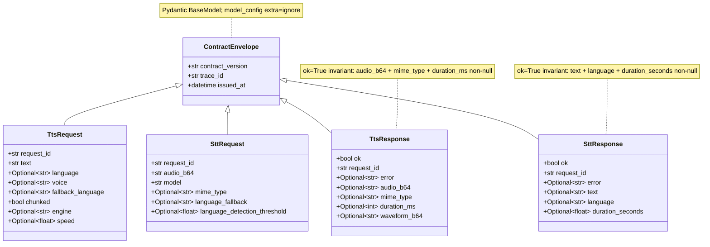
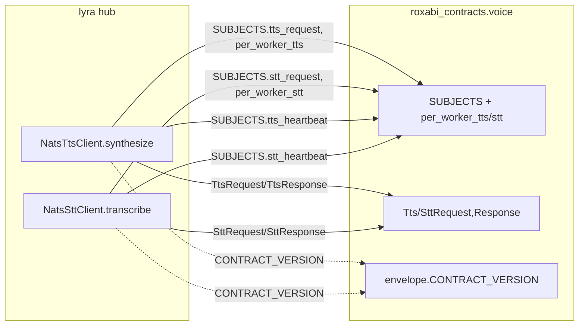

## Context

Frame: `artifacts/frames/766-migrate-lyra-voice-publishers-frame.mdx`. Analysis skipped (F-lite, single domain, no unknowns). Blockers #763 (voice port) and #765 (CONTRACT_VERSION compat shim) are both closed.

Current lyra code in `src/lyra/nats/nats_tts_client.py` and `src/lyra/nats/nats_stt_client.py`:

- Carries hard-coded subject string literals (`SUBJECT` class attr + `_HB_SUBJECT` module constant + `f"{SUBJECT}.{worker_id}"` fan-out).
- Builds outgoing payloads as **plain dicts** (no inline Pydantic models exist today — the frame's "inline TtsRequest/TtsResponse definitions" was aspirational; the real inline artifact is the **dict shape** implicit in the code).
- Parses incoming replies via `json.loads()` + `.get()` on raw dicts.
- Stamps `contract_version` via `roxabi_nats.adapter_base.CONTRACT_VERSION`, which is already a deprecation-warning compat shim re-exporting `roxabi_contracts.envelope.CONTRACT_VERSION` (landed via #765).

The contracts package `roxabi_contracts.voice` exports `TtsRequest` / `TtsResponse` / `SttRequest` / `SttResponse` (Pydantic, inherit `ContractEnvelope` which mandates `contract_version` + `trace_id` + `issued_at`) and a frozen `SUBJECTS` namespace with `per_worker_tts` / `per_worker_stt` helpers that validate worker_id against a safe-chars regex. All of this is pyright-checked and covered by `packages/roxabi-contracts/tests/`.

## Goal

Make `roxabi_contracts.voice` the single source of truth for every voice-domain wire-shape and subject string used by lyra's hub-side NATS clients, so that any future drift between lyra and the contracts package is caught by pyright or by Pydantic validation at runtime.

## Users

- **Primary:** lyra hub maintainer updating `NatsTtsClient` / `NatsSttClient` and reviewing the PR. Needs a mechanical, auditable port with no behavioral change.
- **Secondary:** future contracts-domain ports (image, memory, llm) — this migration is the template they will copy. Also: voiceCLI Cohort A migration, which runs in parallel and needs the wire shape to match exactly what lyra now publishes.

## Expected Behavior

The two hub clients continue to synthesize TTS and transcribe STT with identical observable behavior (same subjects on the wire, same bytes in the payload up to Pydantic field ordering, same return types — `SynthesisResult` / `TranscriptionResult`), but their internal implementation shifts:

1. **Subjects come from imports, not literals.** `SUBJECT = "lyra.voice.tts.request"` class attributes and `_HB_SUBJECT = "lyra.voice.tts.heartbeat"` module constants are deleted. Every publish/subscribe site reads `SUBJECTS.tts_request` / `SUBJECTS.tts_heartbeat` / `SUBJECTS.stt_request` / `SUBJECTS.stt_heartbeat`. Per-worker fan-out (`f"{self.SUBJECT}.{worker_id}"`) is replaced by `per_worker_tts(worker_id)` / `per_worker_stt(worker_id)`, which also enforce the worker-id safe-chars regex — a small defense-in-depth win for free.

2. **Requests are Pydantic, not dicts.** `synthesize()` and `transcribe()` construct `TtsRequest(...)` / `SttRequest(...)` instances, then serialize via `.model_dump_json(exclude_none=True).encode("utf-8")`. Envelope fields passed explicitly to each constructor: `contract_version` from `roxabi_contracts.envelope.CONTRACT_VERSION`, `trace_id = str(uuid4())` generated fresh by the caller for every call (lyra does not currently propagate an upstream correlation id through to the voice clients; introducing one is out of scope), `issued_at = datetime.now(timezone.utc)`. The existing `request_id = str(uuid4())` is also caller-generated and passed as a distinct field — it is NOT automatically filled by the Pydantic model.

3. **Responses are Pydantic, not dicts, with a typed error boundary.** `_send()` / `_request_with_fallback()` replace `json.loads(reply.data)` + raw `.get()` with `TtsResponse.model_validate_json(reply.data)` / `SttResponse.model_validate_json(reply.data)` wrapped in a `try/except pydantic.ValidationError`; on a `ValidationError` the client calls `self._cb.record_failure()` and raises `TtsUnavailableError("TTS reply failed schema validation") from exc` (STT: `STTUnavailableError("STT reply failed schema validation")`). Without this wrap, a malformed reply would propagate a raw `pydantic.ValidationError` past `_send()` — the existing `except Exception` handler in `_send()` only covers `nc.request()` failures, not the parse step. The response model's `_enforce_success_invariant` plus this wrap are the primary anti-drift guard on the receive path. **Note:** `ContractEnvelope`'s docstring recommends `roxabi_nats.deserialize()` as the entry point for validation (with a pre-size gate), but that helper is dataclass-oriented and does not handle Pydantic models. Using `model_validate_json()` directly is the pragmatic choice for now; the deferred size-gate for Pydantic is tracked under ADR-049's later phases.

4. **Heartbeat parsing is unchanged.** `_on_heartbeat` still reads a raw dict (`json.loads(msg.data)` → `data.get("worker_id")`). The contracts package does not yet define a heartbeat envelope model — out of scope for this issue. Only the subscription SUBJECT flips to `SUBJECTS.tts_heartbeat` / `SUBJECTS.stt_heartbeat`.

5. **`contract_version` import relocates.** `from roxabi_nats.adapter_base import CONTRACT_VERSION` becomes `from roxabi_contracts.envelope import CONTRACT_VERSION`. This is mechanical (`adapter_base.CONTRACT_VERSION` is a deprecation-warning re-export) and clears one DeprecationWarning at import time.

6. **Tests require one semantic update on the TTS side.** `tests/nats/test_nats_tts_client.py` mocks several `TtsResponse` payloads without `duration_ms`. Under `TtsResponse.model_validate_json()` with `_enforce_success_invariant`, `ok=True` payloads missing `duration_ms` raise `ValidationError`. Every such mock must be updated to include `duration_ms`. STT tests are already compliant (`duration_seconds` is always present in the mocks).

7. **pyproject + lockfile — deviation from issue AC, scoped out.** The issue body asks for `roxabi-contracts = { workspace = true, extras = ["testing"] }` in `[tool.uv.sources]`. **Two independent reasons drop this from scope:**
   - (a) **Invalid uv syntax.** Verified against `uv 0.11.1`: `extras = [...]` is not a valid key on a workspace source — `uv lock` errors with `unknown field \`extras\`, expected one of git, subdirectory, ..., workspace, marker, extra, group`. The singular `extra = "testing"` field exists but means something different (conditional application). The correct uv-idiomatic way to get `roxabi-contracts[testing]` into lyra's env would be to add `"roxabi-contracts[testing]"` to lyra's `[project.optional-dependencies]` or a `[dependency-groups]` section, NOT to the workspace source.
   - (b) **No test needs scipy yet.** The point of the `testing` extra is access to `silence_wav_16khz` (scipy-built at import time). No current lyra test imports from `roxabi_contracts.voice.fixtures`, and slice 4's demo signal was a one-shot import check, not a test assertion. Architect review called for deferral until a real test consumer exists.
   
   **Resolution:** leave `pyproject.toml` `[tool.uv.sources]` untouched (`roxabi-contracts = { workspace = true }` is already present). Do NOT touch `uv.lock`. The issue's AC item about workspace extras + lockfile regen is replaced, in the PR description, with a short note pointing at this deviation and asking for an AC amendment on #766 as part of the review. A follow-up issue adds the fixtures access the day the first lyra test needs it, using the correct dependency-group syntax.

## Data Model & Consumers

**Consumer summary (lyra side, this issue):**

| Consumer | Fields / helpers consumed | When | Status |
|----------|---------------------------|------|--------|
| `nats_tts_client.py: NatsTtsClient.synthesize` | `TtsRequest`, `TtsResponse`, `SUBJECTS.tts_request`, `per_worker_tts`, `CONTRACT_VERSION` | every synthesize call | this issue |
| `nats_tts_client.py: NatsTtsClient.start` | `SUBJECTS.tts_heartbeat` | startup | this issue |
| `nats_stt_client.py: NatsSttClient.transcribe` | `SttRequest`, `SttResponse`, `SUBJECTS.stt_request`, `per_worker_stt`, `CONTRACT_VERSION` | every transcribe call | this issue |
| `nats_stt_client.py: NatsSttClient.start` | `SUBJECTS.stt_heartbeat` | startup | this issue |
| `src/lyra/cli_voice_smoke.py` + `src/lyra/bootstrap/{tts,stt}_adapter_standalone.py` + `voice_overlay.py` | subject literals today | various | **follow-up** (out of scope — Epic #761 Cohort B remainder) |

## Breadboard

Affordance → handler → data:

| ID | File | Affordance | Handler | Data |
|----|------|------------|---------|------|
| T1 | `src/lyra/nats/nats_tts_client.py` | Build outgoing TTS request | `NatsTtsClient.synthesize` | `TtsRequest(...).model_dump_json(exclude_none=True).encode()` |
| T2 | `src/lyra/nats/nats_tts_client.py` | Parse incoming TTS reply | `NatsTtsClient._send` / `_fallback` | `TtsResponse.model_validate_json(reply.data)` → read `.ok`, `.audio_b64`, `.mime_type`, `.duration_ms`, `.waveform_b64`, `.error` |
| T3 | `src/lyra/nats/nats_tts_client.py` | Publish subject (queue + per-worker) | `NatsTtsClient._send` / `_fallback` | `SUBJECTS.tts_request` + `per_worker_tts(worker_id)` |
| T4 | `src/lyra/nats/nats_tts_client.py` | Heartbeat subscription subject | `NatsTtsClient.start` | `SUBJECTS.tts_heartbeat` |
| S1 | `src/lyra/nats/nats_stt_client.py` | Build outgoing STT request | `NatsSttClient.transcribe` | `SttRequest(...).model_dump_json(exclude_none=True).encode()` |
| S2 | `src/lyra/nats/nats_stt_client.py` | Parse incoming STT reply | `NatsSttClient._request_with_fallback` | `SttResponse.model_validate_json(reply.data)` → read `.ok`, `.text`, `.language`, `.duration_seconds`, `.error` |
| S3 | `src/lyra/nats/nats_stt_client.py` | Publish subject (queue + per-worker) | `NatsSttClient._request_with_fallback` | `SUBJECTS.stt_request` + `per_worker_stt(worker_id)` |
| S4 | `src/lyra/nats/nats_stt_client.py` | Heartbeat subscription subject | `NatsSttClient.start` | `SUBJECTS.stt_heartbeat` |
| E1 | both clients | CONTRACT_VERSION source | import | `from roxabi_contracts.envelope import CONTRACT_VERSION` (replaces `roxabi_nats.adapter_base`) |
| V1 | both clients | ValidationError → domain error boundary | `_send` / `_request_with_fallback` | wrap `model_validate_json` in `try/except pydantic.ValidationError`; record CB failure, raise `TtsUnavailableError` / `STTUnavailableError` with `from exc` |
| X1 | `tests/nats/test_nats_tts_client.py` | Fix TTS reply mocks to include `duration_ms` | test payload dicts | add `"duration_ms": <int>` to every `"ok": True` TTS response mock |
| X2 | `tests/nats/test_nats_tts_client.py` + `test_nats_stt_client.py` | New: malformed-reply behavior | test cases | one test per client verifying that a reply failing Pydantic validation produces the domain-specific unavailable error (not a raw `ValidationError`) and records a CB failure |

## Slices

| # | Slice | Affordances | Demo-able signal |
|---|-------|-------------|------------------|
| 1 | **Swap subjects (no model change yet)** — delete `SUBJECT` / `_HB_SUBJECT` literals, import `SUBJECTS` + `per_worker_tts` / `per_worker_stt`. Keep dict payloads. | T3, T4, S3, S4 | `grep -rE '"lyra\.voice\.(tts\|stt)\.'` inside `src/lyra/nats/` returns zero hits. Existing tests still pass. |
| 2 | **Adopt request models** — `synthesize()` / `transcribe()` build `TtsRequest` / `SttRequest`, serialize via `.model_dump_json(exclude_none=True)`. Envelope: `contract_version`, `trace_id = uuid4()`, `issued_at = datetime.now(timezone.utc)`. Response path still uses raw dict. | T1, S1, E1 | Existing TTS/STT request-shape tests (`contract_version` assertions, field presence) pass. Request bytes deserialize cleanly via `TtsRequest.model_validate_json()`. |
| 3 | **Adopt response models + error boundary + fix tests** — parse replies via `TtsResponse.model_validate_json` / `SttResponse.model_validate_json`, wrapped in `try/except pydantic.ValidationError` that records a CB failure and raises the domain `TtsUnavailableError` / `STTUnavailableError`. Update every TTS test mock that sets `"ok": True` to include `"duration_ms"`. Add one malformed-reply test per client asserting the domain error is raised (not a raw `ValidationError`). | T2, S2, V1, X1, X2 | `uv run pytest tests/nats/` green including the two new malformed-reply tests. `uv run pyright` green. |

Slices 1→3 are ordered for bisect-friendliness: if CI breaks at slice 3, the bad commit is the response-model adoption + error-boundary layer, not the subject swap or the request serialization.

**Scoped-out slice (issue AC deviation, tracked as follow-up):** workspace source `[testing]` extras + `uv.lock` regen. Invalid uv syntax and no current consumer; see Expected Behavior §7 for the full rationale.

## Success Criteria

**Automated gates (binary pass/fail):**

- [ ] `grep -nE 'from roxabi_contracts\.voice import' src/lyra/nats/nats_tts_client.py` matches a line that contains all of `TtsRequest`, `TtsResponse`, `SUBJECTS`, `per_worker_tts` (order-agnostic).
- [ ] `grep -nE 'from roxabi_contracts\.voice import' src/lyra/nats/nats_stt_client.py` matches a line that contains all of `SttRequest`, `SttResponse`, `SUBJECTS`, `per_worker_stt` (order-agnostic).
- [ ] `grep -nE 'from roxabi_contracts\.envelope import CONTRACT_VERSION' src/lyra/nats/nats_tts_client.py src/lyra/nats/nats_stt_client.py` matches both files.
- [ ] `grep -nE 'from roxabi_nats\.adapter_base import.*CONTRACT_VERSION' src/lyra/nats/nats_tts_client.py src/lyra/nats/nats_stt_client.py` returns zero hits.
- [ ] `grep -nE '"lyra\.voice\.(tts|stt)\.(request|heartbeat)' src/lyra/nats/` returns zero hits (no subject string literals remain in the client files).
- [ ] `grep -nF 'f"{' src/lyra/nats/nats_tts_client.py src/lyra/nats/nats_stt_client.py | grep -E 'SUBJECT|\.request\.'` returns zero hits (no f-string subject derivation; only `per_worker_*` helpers).
- [ ] `grep -nE '^class (Tts|Stt)(Request|Response)|@dataclass' src/lyra/nats/` returns zero hits.
- [ ] `grep -nE '\.get\("(audio_b64|mime_type|duration_ms|waveform_b64|text|language|duration_seconds|ok|error)"' src/lyra/nats/nats_tts_client.py src/lyra/nats/nats_stt_client.py` returns zero hits (responses are accessed as Pydantic attributes, not dict keys).
- [ ] `grep -nE '(nats_tts_client|nats_stt_client)\.SUBJECT\b' src/lyra/ tests/` returns zero hits (no external caller imported the deleted class attribute — out-of-scope modules must stay compiling).
- [ ] `grep -nE 'except\s+ValidationError|except\s+pydantic\.ValidationError' src/lyra/nats/nats_tts_client.py src/lyra/nats/nats_stt_client.py` matches both files (error-boundary wrap is in place).
- [ ] Every TTS response mock in `tests/nats/test_nats_tts_client.py` with `"ok": True` includes `"duration_ms"` as an int, **except inside functions whose name starts with `test_malformed_`** (those are negative fixtures that deliberately omit `duration_ms` to trigger the success-invariant check). Verified: AST walk that descends into `FunctionDef`/`AsyncFunctionDef` and skips nodes whose enclosing function name starts with `test_malformed_` — exits non-zero on any other `"ok": True` literal missing a sibling `"duration_ms"`.
- [ ] Two new tests exist: one in `tests/nats/test_nats_tts_client.py` and one in `tests/nats/test_nats_stt_client.py` named like `test_malformed_reply_raises_domain_error` that send a reply failing Pydantic validation and assert (a) the domain exception is raised (`TtsUnavailableError` / `STTUnavailableError`), not a raw `ValidationError`, and (b) `client._cb.record_failure` was called.
- [ ] `uv run pyright` exits 0 over the full lyra tree.
- [ ] `uv run pytest tests/nats/ --cov-fail-under=0` exits 0. (The project-level `--cov-fail-under=50` in `pyproject.toml addopts` fires against any targeted run that covers <50% of the full codebase — `tests/nats/` alone covers ~25%. The gate-local `--cov-fail-under=0` override keeps the manual check runnable; CI still enforces the 50% threshold on the full suite.)
- [ ] `uv run pytest` (full lyra suite) exits 0; no test previously passing now fails.

**Manual review item (not a binary gate):**

- [ ] PR description contains a "Wire-shape drift vs prior lyra payloads" paragraph calling out at minimum: (a) new `trace_id` + `issued_at` envelope fields now present on every request (previously absent — new drift introduced by this port, intentional, matches contracts package), (b) the issue-AC deviation on workspace `[testing]` extras + the `uv.lock` non-regen decision with a link back to this spec's Expected Behavior §7.
