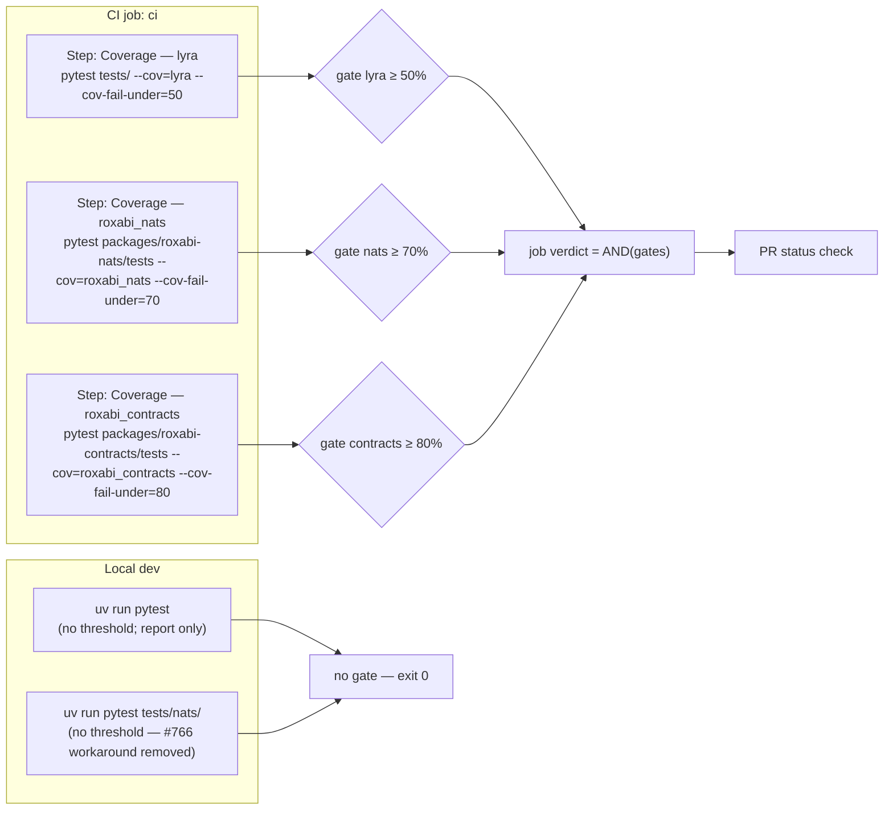

## Context

Promoted from [frame #795](../frames/795-split-cov-fail-under-per-package-frame.mdx).

Today the root `pyproject.toml addopts` pins a single combined coverage gate across several packages:

```
addopts = "--import-mode=importlib --cov=lyra --cov=roxabi_nats --cov-report=term-missing --cov-report=xml --cov-fail-under=50"
```

Because `pytest-cov` computes one statements-covered/statements-total ratio across every `--cov=` target in the same invocation, a regression in the large package (`lyra`, ~13.8k stmts) can be masked by the tiny sub-packages (`roxabi_nats` ~900 stmts, `roxabi_contracts` ~200 stmts) sitting near 100%. The gate fails to isolate per-package regressions.

A second, related pain shows up in #766 (spec): because `--cov-fail-under=50` is baked into global `addopts`, any targeted local run (e.g. `uv run pytest tests/nats/`) trips the gate — maintainers have been adding `--cov-fail-under=0` overrides at call sites. Moving the threshold out of `addopts` removes both problems in one change.

## Goal

Each top-level installable package (`lyra`, `roxabi_nats`, `roxabi_contracts`) has its own independent coverage gate in CI so a regression in one package cannot be diluted by another, and local targeted `pytest` runs are no longer forced through a combined global threshold.

## Users

- **Primary:** Lyra maintainers relying on the CI coverage gate to surface real regressions before merge.
- **Secondary:** Developers running targeted local subsets of the test suite (e.g. `uv run pytest tests/nats/`) who currently need `--cov-fail-under=0` workarounds.
- **Tertiary:** Future sub-package extractions (voice, memory, llm) that will land small and high-coverage — per-package gates make them first-class rather than denominator noise.

## Expected Behavior

**Default local run** — `uv run pytest` from the repo root collects the full suite and emits a coverage summary (no threshold enforcement). Developers can opt in to a gate locally by passing `--cov-fail-under=N` explicitly.

**Targeted local run** — `uv run pytest tests/nats/` (or any subset) executes without tripping a coverage gate. The `--cov-fail-under=0` override in #766's gate scripts is no longer necessary.

**CI run** — the single `Test with coverage` step is replaced by three per-package steps. Each invokes `pytest` against that package's test directory with an explicit `--cov=<pkg> --cov-fail-under=<N>`. CI still yields one overall pass/fail verdict (any step failing fails the job).

**Regression isolation** — a drop below `N` in package `X` fails only step `X`; the other package steps remain green. The failing step's log clearly names the offending package (`Coverage — lyra failed`).

**Integration job** — unchanged. The `integration` job still uses `--no-cov` and is independent of the coverage gate split.

**Threshold policy (this issue):**

| Package | Threshold | Rationale |
|---|---|---|
| `lyra` | 50% | Keep current project-wide floor. |
| `roxabi_nats` | 70% | Small (~900 stmts), isolated transport SDK. Proposed; plan phase records the measured actual before committing — current baseline has never been isolated from the combined ratio (captured as a plan-phase success criterion below). |
| `roxabi_contracts` | 80% | Very small (~200 stmts) schema package. Proposed; plan phase must measure actual coverage on a bare `ubuntu-latest` runner where `nats-server` is not installed and `requires_nats_server` tests silently skip (see Edge Cases). If skip-adjusted actual < 75%, set gate to `actual − 2%` as a provisional floor. |

Thresholds are inputs the plan phase may nudge by ±5 if current actual coverage sits under the proposed bar — nudges recorded in the plan, not re-litigated here.

## Data Model & Consumers

The "data" in this spec is the coverage gate's pass/fail signal per package. One diagram: which invocation feeds which gate.



**Consumer summary:**

| Consumer | Reads | When | Status |
|---|---|---|---|
| CI `ci` job | 3 independent `--cov-fail-under` gate signals | Every push/PR | this issue |
| PR status check | Aggregated `ci` job verdict | Every push/PR | unchanged |
| Integration `integration` job | none (`--no-cov`) | Every push/PR | unchanged |
| Local dev | pytest-cov term-missing report, no gate | On-demand | this issue |
| #766 gate script | Targeted tests without `--cov-fail-under=0` override | #766 work | this issue unblocks |

## Breadboard

**Affordances:**

| ID | Affordance | Handler | Data/Effect |
|---|---|---|---|
| N1 | Root `pyproject.toml` `[tool.pytest.ini_options].addopts` | Static config | `--import-mode=importlib` only (coverage flags removed) |
| N2 | Root `pyproject.toml` `[tool.pytest.ini_options].testpaths` | Static config | Includes `packages/roxabi-contracts/tests` alongside existing entries |
| N3 | CI step `Coverage — lyra` | `.github/workflows/ci.yml` | `pytest tests/ --cov=lyra --cov-report=term-missing --cov-report=xml --cov-fail-under=50` |
| N4 | CI step `Coverage — roxabi_nats` | `.github/workflows/ci.yml` | `pytest packages/roxabi-nats/tests --cov=roxabi_nats --cov-report=term-missing --cov-fail-under=70` |
| N5 | CI step `Coverage — roxabi_contracts` | `.github/workflows/ci.yml` | `pytest packages/roxabi-contracts/tests --cov=roxabi_contracts --cov-report=term-missing --cov-fail-under=80` |
| N6 | #766 gate script `--cov-fail-under=0` override | `tests/nats/` runner call sites | Removed (no longer needed with coverage out of `addopts`) |

**Wiring:**

- N1 removes combined coverage from `addopts`; N3/N4/N5 each re-declare coverage explicitly for one package only.
- N2 ensures `roxabi_contracts` tests are discoverable by pytest from the repo root (today `testpaths = ["tests", "packages/roxabi-nats/tests"]`).
- `--cov-report=xml` is emitted only by N3 (`lyra`) — N4 and N5 omit it intentionally; no downstream consumer reads `coverage.xml` today (confirmed via repo grep — only `.gitignore` / `.dockerignore` hits).
- N6 is a cleanup follow-on — the workaround's reason disappears as soon as N1 lands.

## Slices

| # | Slice | Affordances | Demo |
|---|---|---|---|
| 1 | **Strip coverage from global `addopts` + extend testpaths** | N1, N2 | `uv run pytest tests/nats/` no longer fails on `--cov-fail-under`. Full local `uv run pytest` still runs, reports coverage if invoker passes `--cov=`, no gate. |
| 2 | **Per-package CI coverage steps** | N3, N4, N5 | CI job shows three steps, each named `Coverage — <pkg>`, each enforcing its own threshold. Forcing a regression in `roxabi_contracts` only fails that step. |
| 3 | **Drop #766 `--cov-fail-under=0` workaround** | N6 | Targeted `uv run pytest tests/nats/` run docs/scripts no longer pass the override. |

Slices 1 and 2 must land in the same PR — stripping `addopts` without the CI steps would silently remove the only coverage gate. Slice 3 is a small follow-on inside the same PR once 1+2 pass CI.

## Success Criteria

- [ ] Root `pyproject.toml` `addopts` contains `--import-mode=importlib` and no `--cov=*`, `--cov-report=*`, or `--cov-fail-under=*` flags.
- [ ] Root `pyproject.toml` `testpaths` includes `packages/roxabi-contracts/tests` so the contracts suite is collected from the repo root.
- [ ] `.github/workflows/ci.yml` `ci` job has exactly three coverage steps named `Coverage — lyra`, `Coverage — roxabi_nats`, `Coverage — roxabi_contracts`; the previous single `Test with coverage` step is removed.
- [ ] Each coverage step enforces exactly one package (`--cov=<pkg>`) at the pinned thresholds: `lyra=50`, `roxabi_nats` and `roxabi_contracts` values finalized in the plan per the Threshold policy table.
- [ ] Plan phase records each sub-package's measured coverage on a bare `ubuntu-latest` runner (no `nats-server` installed) before pinning `roxabi_nats` and `roxabi_contracts` thresholds.
- [ ] On a spike branch, a seeded regression in package `X` fails only step `X` and leaves the other two steps green — verifying gate isolation before the final PR.
- [ ] On the final (non-seeded) PR branch, all three coverage steps are green and the `integration` job still passes unchanged.
- [ ] `uv run pytest tests/nats/` from the repo root exits 0 without any `--cov-fail-under=0` override.
- [ ] All existing `--cov-fail-under=0` workarounds introduced by #766 are removed from the repo (source files, scripts, docs).

## Edge Cases

| Case | Handling |
|---|---|
| Threshold is higher than current actual coverage for a package | Plan phase verifies actual coverage; if actual < proposed, nudge proposed down by ≤5 and note in plan. Never silently weaken. |
| `pytest-cov` data-file collision when three consecutive pytest runs share `.coverage` | Harmless in the target topology: each CI step evaluates its `--cov-fail-under` in-process before the next step runs, so `.coverage` being overwritten between steps does not affect gate outcomes. `--cov-report=xml` is emitted only by the lyra step, so `coverage.xml` is not overwritten either. Plan adds `COVERAGE_FILE=.coverage.<pkg>` per step only if we later add a `coverage combine` / upload step. |
| `packages/roxabi-contracts/tests/` currently has tests (e.g. `test_envelope.py`, `test_voice_*.py`), but several are gated by a `requires_nats_server` fixture that silently skips on bare `ubuntu-latest` (no `nats-server` installed in the `ci` job) | Plan phase audits which contracts tests skip on the CI runner and measures the skip-adjusted actual coverage before committing to 80%. If actual < 75% with nats-server-gated tests skipped, plan drops the gate to `actual − 2%` and files a follow-up to either install `nats-server` in the `ci` job or relocate the affected tests to the `integration` job. |
| `packages/roxabi-contracts/tests/` is reduced to zero collectible tests in the future | pytest exits 0 with 0% coverage measured against a non-empty package — `--cov-fail-under=80` then trips, which is correct (vacuous-empty no longer bypasses the gate). Plan-phase audit step verifies ≥1 test collects today. |
| New sub-package added later (voice, memory, llm) | Add a fourth coverage step + threshold. Documented as the extension pattern in the spec → plan handoff. |
| Dev wants combined local coverage report | Explicit opt-in: `uv run pytest --cov=lyra --cov=roxabi_nats --cov=roxabi_contracts`. Not a default. |
| `packages/roxabi-contracts/tests` not currently in root `testpaths` | Slice 1 adds it; CI step pins the path anyway, so the gate still holds even if the addopts change is forgotten. |
