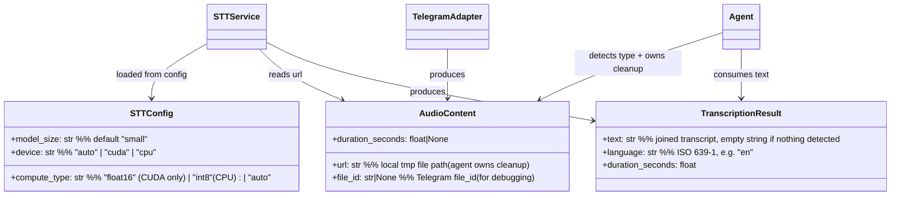
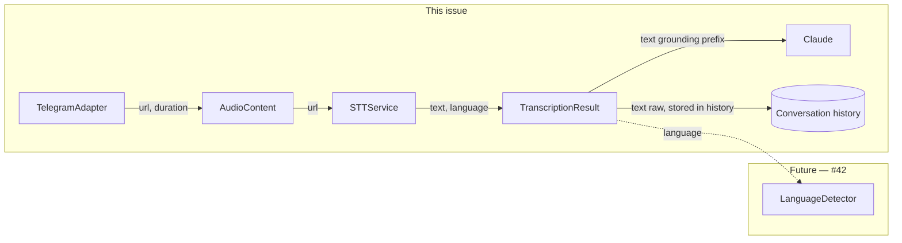

## Context

Part of the voice pipeline epic (#74). Lyra currently ignores incoming voice messages on Telegram — the aiogram handler is text-only and `AudioContent` (already modelled in `core/message.py`) is never populated. This spec covers the full path: Telegram voice download → faster-whisper transcription → text injection into the existing LLM pipeline.

Blocked by #79 (TTS, shared voice infra). Related: #42 (language detection, future).

**Ordering constraint — #139:** Issue #139 (Message & Media Normalization epic) will refactor `TelegramAdapter._normalize()`. Slice 1 below adds a voice handler against the *current* normalization contract. If #139 lands before #80 is fully implemented, Slice 1 must be rebased against #139's new envelope API. The planner must coordinate with #139 status before scheduling Slice 1.

See also: `docs/architecture/adr/013-media-temp-file-lifecycle-ownership.mdx` — temp file cleanup owned by the caller (agent), not `STTService`.

## Goal

When a user sends a voice message on Telegram, Lyra transcribes it via faster-whisper and processes the transcript as if the user had typed it — no special commands required.

## Users

- **Primary:** Lyra users who send Telegram voice messages (OGG/Opus format)
- **Secondary:** The Lyra pipeline — all downstream intent handlers gain access to voice input without modification

## Expected Behavior

1. User sends a voice message on Telegram.
2. Lyra immediately sends a Telegram "typing" action so the user sees `...` while transcription proceeds.
3. Lyra downloads the audio file from Telegram servers into a temp file.
4. The adapter normalises the message to `Message(type=AUDIO, content=AudioContent(url=<tmp_path>, duration_seconds=<n>))` and pushes to the hub.
5. The agent detects `MessageType.AUDIO` and calls `STTService.transcribe()` in a `try/finally` block — **the agent owns temp file cleanup** (per ADR-013).
6. If the transcript is empty or contains only Whisper hallucination markers (e.g. `"[Music]"`, `"[Applause]"`), Lyra replies: `"I couldn't make out your voice message, please try again."` and stops.
7. Otherwise, the transcript is prepended with `"🎤 [transcribed]: "` for **LLM grounding only** — this prefix is passed to the LLM but **stripped before the message is stored in conversation history**. The raw transcript (without prefix) is stored.
8. The LLM responds normally; Lyra replies as text. The transcript is **not** echoed to the user.
9. Temp file is deleted in the agent's `finally` block (success, empty transcript, or failure).
10. On transcription failure (model load error, timeout, exception), Lyra replies: `"Sorry, I couldn't transcribe your voice message."`.

**Language handling:** Auto-detect at transcription time. The detected language is logged at INFO level but not acted on (deferred to #42).

**Long audio:** `STTService` handles chunked transcription internally and joins segments into a single string before returning `TranscriptionResult`.

**GPU/CPU fallback:** When `device="auto"`, `STTService` attempts `cuda` first; falls back to `cpu` if CUDA is unavailable. `compute_type` is automatically adjusted per device: `float16` on CUDA, `int8` on CPU. User-supplied combinations are validated at startup (see `STTConfig` constraints below).

---

## Data Model & Consumers





| Consumer | Fields consumed | When | Status |
|----------|----------------|------|--------|
| `STTService` | `AudioContent.url` | On AUDIO message | This issue |
| `Agent` | `TranscriptionResult.text` | Post-transcription (grounding + history) | This issue |
| `LanguageDetector` (#42) | `TranscriptionResult.language` | Post-transcription | Future |

---

## Breadboard

### Affordances

| ID | Affordance | Handler | Data in | Data out |
|----|-----------|---------|---------|---------|
| U1 | Voice message arrives | `TelegramAdapter._on_voice_message()` | aiogram `Voice` | — |
| N0 | Typing indicator | `TelegramAdapter._on_voice_message()` | chat_id | Telegram "typing" action sent |
| N1 | Audio download | `TelegramAdapter._download_audio()` | `file_id` | `bytes` → temp file path |
| N2 | Normalize to Message | `TelegramAdapter._normalize()` | aiogram message | `Message(type=AUDIO, content=AudioContent(...))` |
| N3 | Hub routing | `Hub.run()` → `Pool.submit()` | `Message` | message in pool queue |
| N4 | AUDIO detection | `AnthropicAgent.process()` (primary) + `SimpleAgent.process()` | `Message.type == AUDIO` | enters STT branch |
| N5 | Transcription | `STTService.transcribe(path)` | tmp file path | `TranscriptionResult` |
| N6 | Empty check | `Agent.process()` | `TranscriptionResult.text` | retry prompt ∨ continue |
| N7 | Text injection (grounding) | `Agent.process()` | transcript + prefix | LLM call (prefix stripped from stored history) |
| S1 | LLM response | `AnthropicAgent` / `SimpleAgent` | transcript as user input | text reply |
| E1 | Transcription error | `Agent.process()` error handler | exception | localised error reply |
| C1 | Temp file cleanup | `Agent.process()` `finally` block (ADR-013) | tmp path | file deleted |

### Wiring

```
U1 → N0 → N1 → N2 → N3 → N4 → N5 → N6 → N7 → S1
                                    ↓ (empty)
                                    E1 (retry prompt)
                              ↓ (exception)
                              E1 (error reply)
                    C1 (always, in agent finally)
```

---

## Slices

| # | Name | Affordances | Deliverable |
|---|------|-------------|-------------|
| 1 | Voice download + normalize | U1, N0, N1, N2 | Telegram voice messages reach hub as `MessageType.AUDIO` with valid tmp path; typing indicator fires; logs confirm receipt. Note: implement against current adapter contract; rebase if #139 lands first. |
| 2 | STT service + config | N5, STTConfig | `STTService` transcribes a local OGG file; `STTConfig` loaded from env vars (`STT_MODEL_SIZE`, `STT_DEVICE`, `STT_COMPUTE_TYPE=auto`); validation rejects invalid device/compute_type combos; unit tests cover GPU→CPU fallback |
| 3 | Agent integration + cleanup | N4, N6, N7, S1, E1, C1 | End-to-end: voice message → LLM reply; empty transcript → retry prompt; error → error reply; tmp file always deleted |
| 4 | Observability | logging | Language + duration logged at INFO per transcription; VRAM budget documented in ARCHITECTURE.md |

---

## Success Criteria

- [ ] Sending a voice message on Telegram triggers a text reply from Lyra (no `/transcribe` command needed)
- [ ] Telegram "typing" indicator appears while Lyra is transcribing
- [ ] Transcript is not echoed to the user; only the LLM response is shown
- [ ] The `🎤 [transcribed]:` prefix is present in the LLM call but absent from stored conversation history
- [ ] Empty or noise-only transcript (e.g. `""`, `"[Music]"`) triggers a retry prompt, not a crash or empty reply
- [ ] Voice messages longer than one Whisper inference window are correctly transcribed (chunked join)
- [ ] When CUDA is unavailable, transcription completes on CPU without error
- [ ] Temp audio file is deleted after transcription — verified in test: file does not exist in agent `finally` (success and failure paths)
- [ ] On transcription exception, user receives localised error message (not a crash or silent failure)
- [ ] `STT_MODEL_SIZE` env var controls model (default `small`); changing it takes effect on restart
- [ ] `STT_COMPUTE_TYPE=float16` + `STT_DEVICE=cpu` raises a validation error at startup
- [ ] Detected language is logged at INFO level per transcription
- [ ] Non-voice messages (text, images) are unaffected — no regression
- [ ] VRAM usage with `small` model documented in ARCHITECTURE.md (target ≤1 GB)
