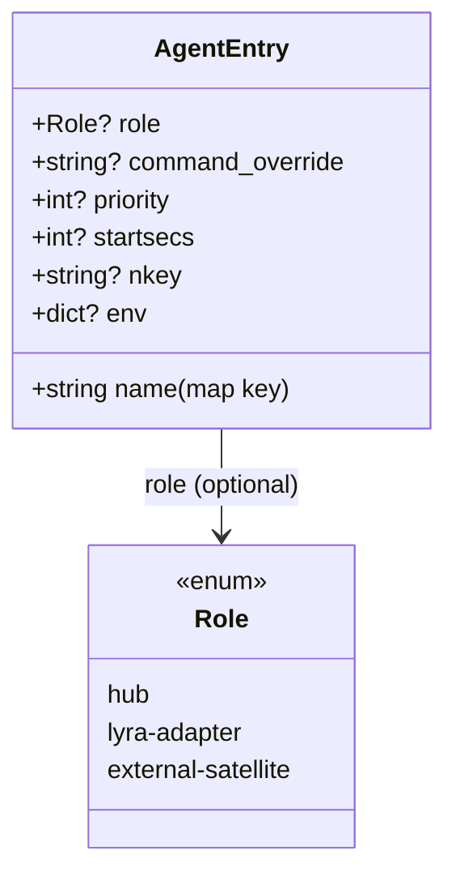
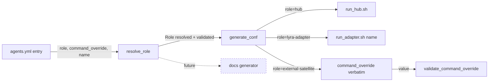

## Context

Deferred from #804 code review (architect verdict, 72%). `deploy/gen-supervisor-conf.py` currently selects the launcher via three code branches:

1. `command_override` present → use verbatim
2. `name == "hub"` → `run_hub.sh`
3. default → `run_adapter.sh <name>`

The dispatch lives in code, not in the `agents.yml` data model. A new external-satellite entry that forgets `command_override` silently falls through to branch 3, producing `run_adapter.sh <name>` for a program whose launcher does not exist. Today all `agents.yml` entries are lyra-native (`hub`, `telegram`, `discord`, `stt`, `tts`); no entry exercises `command_override` in the current file. The risk materializes the first time an external satellite is added.

Note: existing entries carry a `command:` field (e.g. `command: lyra hub`) that is *not* read by the generator — it is dead/documentation. The role-based dispatch is gated on `command_override` only, never on `command`. No change to that behavior.

Frame: `artifacts/frames/807-agents-role-enum-frame.mdx`.

## Goal

Move the command-selection taxonomy from implicit code conditions to an explicit `role` enum in `agents.yml`, with generation-time validation that fails fast on misconfiguration. Validation must ship together with the resolver (no intermediate window where dispatch runs without cross-checks).

## Users

- **Primary:** Lyra maintainer editing `deploy/agents.yml` or adding an external satellite entry. Gets a descriptive `ValueError` at `make gen-conf` time instead of a broken conf file discovered at supervisord startup.
- **Secondary:** `make gen-conf` CI step — surfaces misconfiguration before prod.

## Expected Behavior

1. Maintainer adds an external satellite entry without `command_override`:
   ```yaml
   voicecli_stt:
     role: external-satellite
     priority: 200
   ```
   `make gen-conf` fails with: `role=external-satellite requires command_override (agent 'voicecli_stt')`.

2. Maintainer adds a lyra adapter with a stray `command_override`:
   ```yaml
   telegram:
     role: lyra-adapter
     command_override: "lyra adapter telegram"
   ```
   `make gen-conf` fails with: `role=lyra-adapter must not set command_override (agent 'telegram')`.

3. Maintainer declares hub role on a non-hub name:
   ```yaml
   side_hub:
     role: hub
   ```
   `make gen-conf` fails with: `role=hub requires name=='hub' (got 'side_hub')`.

4. Maintainer mistypes the role value:
   ```yaml
   tts:
     role: adapter   # wrong — should be 'lyra-adapter'
   ```
   `make gen-conf` fails with: `unknown role 'adapter' (agent 'tts'); expected one of: hub, lyra-adapter, external-satellite`.

5. Existing entries without `role` continue to generate identical confs (backward-compat via inference).

6. All five existing entries in `deploy/agents.yml` gain explicit `role:` lines (`hub` → `hub`; `telegram`, `discord`, `stt`, `tts` → `lyra-adapter`). Generated conf content is byte-identical to pre-change output.

## Data Model & Consumers

### Schema addition



### Consumer map



### Consumer summary

| Consumer | Fields consumed | When | Status |
|----------|-----------------|------|--------|
| `resolve_role` (new) | `role`, `command_override`, name (map key) | At load, before `generate_conf` | This issue |
| `generate_conf` | resolved `Role`, `command_override`, name | Per agent during generation | This issue (modified) |
| `validate_command_override` (existing) | `command_override` value | Per agent when dispatching to external-satellite | This issue (unchanged logic; still called) |
| Docs generator | `role` | Future | Out of scope — field must remain introspectable |

## Breadboard

### Affordances

| ID | Surface | Affordance | Wires to |
|----|---------|------------|----------|
| N1 | `deploy/agents.yml` | Optional `role:` field per entry | N2 |
| N2 | `deploy/gen-supervisor-conf.py` | `ROLES = {"hub", "lyra-adapter", "external-satellite"}` module-level constant set | N3 |
| N3 | `deploy/gen-supervisor-conf.py` | `resolve_role(name, agent) -> str` — resolves explicit `role` (validates against `ROLES`), else infers; applies all cross-checks; raises `ValueError` with agent name in the message | N4, N6 |
| N4 | `deploy/gen-supervisor-conf.py` | `generate_conf` dispatches launcher by resolved role (replaces 3-branch if/elif). `validate_command_override` still called on the `external-satellite` branch | N5 |
| N5 | `deploy/supervisor/conf.d/*.conf` | Generated output — byte-identical for existing entries | — |
| N6 | `tests/deploy/test_gen_supervisor_conf.py` | New test cases for role resolution + validation | N2, N3, N4 |
| N7 | `deploy/agents.yml` comment header | One-line note: canonical form `# role: hub \| lyra-adapter \| external-satellite (optional — inferred when absent; see resolve_role in gen-supervisor-conf.py)` | — |

### Wiring

```
agents.yml entry  →  resolve_role(name, agent)  →  Role  (raises on any misconfig)
                                                    ↓
                             generate_conf(…, role)  →  conf block
                                                    ↓
                     role == external-satellite branch → validate_command_override (existing, unchanged)
```

## Slices

| # | Slice | Files | Demo-able |
|---|-------|-------|-----------|
| 1 | Introduce `ROLES` constant + `resolve_role(name, agent)` **with inference and full validation (all 4 cross-checks) combined** — never ships without validation | `deploy/gen-supervisor-conf.py` | Unit tests (added in slice 3) — function is callable in isolation |
| 2 | Wire `generate_conf` to dispatch launcher via resolved role; ensure `validate_command_override` still runs on the external-satellite branch | `deploy/gen-supervisor-conf.py` | `make gen-conf` against pre-change `deploy/agents.yml` produces byte-identical conf.d/*.conf |
| 3 | Add test coverage: 3 happy paths (one per role) + 4 error cases + 3 inference-when-absent paths + 1 `validate_command_override` pass-through case | `tests/deploy/test_gen_supervisor_conf.py` | All new tests green; existing tests unchanged (or fixtures gain `role:` only) |
| 4 | Migrate `deploy/agents.yml` — add explicit `role:` to all 5 entries + one-line header comment | `deploy/agents.yml` | `make gen-conf` output unchanged; diff shows only new `role:` lines + header comment |

## Success Criteria

- [ ] `ROLES` is defined as a closed set of 3 string values: `hub`, `lyra-adapter`, `external-satellite`.
- [ ] `resolve_role(name, agent)` returns the explicit `role` when present; when absent, it infers: `command_override` present → `external-satellite`; else name=="hub" → `hub`; else → `lyra-adapter`.
- [ ] `resolve_role` raises `ValueError` with agent name in the message when `role` is present but not in `ROLES` (unknown value case).
- [ ] `role=external-satellite` without `command_override` raises `ValueError` naming the agent.
- [ ] `role=lyra-adapter` with `command_override` raises `ValueError` naming the agent.
- [ ] `role=hub` when the agent name is not `"hub"` raises `ValueError` naming the agent and the expected name.
- [ ] All validation cross-checks live inside `resolve_role` (not in `generate_conf`), so `generate_conf` receives a guaranteed-valid role.
- [ ] `generate_conf` dispatches the launcher exclusively via the resolved `Role` (the three original branches collapse into a role-keyed dispatch).
- [ ] `generate_conf` still invokes `validate_command_override` on the `external-satellite` branch before emitting the `command=` line (the pre-existing garbage-character guard is not bypassed by the refactor).
- [ ] Running `uv run deploy/gen-supervisor-conf.py --dry-run` against the current `deploy/agents.yml` (with added `role:` lines) produces output byte-identical to the pre-change output of the same command against pre-change `deploy/agents.yml`.
- [ ] `deploy/agents.yml` contains explicit `role:` on every one of the 5 existing entries.
- [ ] `deploy/agents.yml` header comment documents the `role` field, its 3 values, and the default-when-absent rule using the canonical wording from N7.
- [ ] `tests/deploy/test_gen_supervisor_conf.py` contains exactly: 3 test functions for happy paths (one per role, including an `external-satellite` entry with a valid `command_override`), 4 test functions for the error cases (unknown value, external-satellite without command_override, lyra-adapter with command_override, hub on wrong name), 3 test functions for inference-when-absent (one per role), and 1 test function asserting that a garbage-character `command_override` on a valid `role=external-satellite` entry still raises through `validate_command_override`.
- [ ] Pre-existing tests (`test_command_override_used_verbatim`, `test_fallback_run_hub_for_hub_name`, `test_fallback_run_adapter_for_other_names`) remain green. Any fixture modification is limited to adding explicit `role:` lines.

## Out of Scope

- Runtime behavior of supervisord or the launched programs.
- Enum values beyond the three.
- Migrating external satellites into `agents.yml` (belongs to #690).
- Changes to `run_hub.sh` / `run_adapter.sh`.
- A standalone schema file (JSON Schema / Pydantic model) — inline module-level constants + validation functions keep the dependency surface at zero.
- **Deprecating the inference-when-absent path.** Inference is retained intentionally as a transitional mechanism: zero existing entries break, and the single pre-#690 external-satellite authoring path still works without `role:`. A follow-on issue post-#690 may tighten this to require `role:` explicitly and emit a deprecation warning when absent — that is not this issue.
- Reading or acting on the existing `command:` field in `agents.yml` entries (dead/documentation field, untouched by this change).
