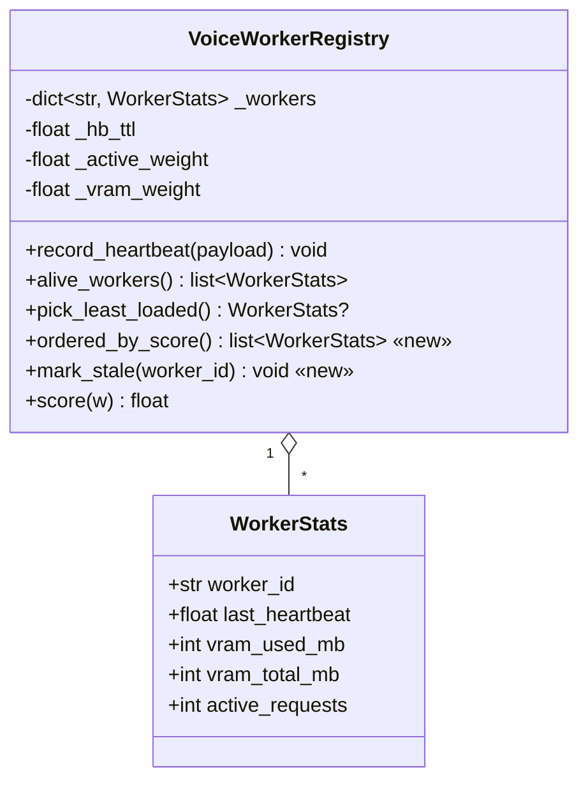

## Context

Source: [frame #813](../frames/813-registry-authoritative-voice-routing-frame.mdx). Hub-side voice clients run two disagreeing load balancers in series (hub registry + NATS queue group). Liveness views diverge on paused / kernel-hung / partitioned workers, causing fallback to re-route to the same dead worker and surface as `STTUnavailableError` / `TtsUnavailableError` despite healthy peers. Clean worker exit additionally bypasses fallback because `NoRespondersError` is treated as terminal. PR #811's CI run reproduced the race deterministically.

## Goal

Make `VoiceWorkerRegistry` the single source of routing truth. On failure, the client walks registry-ordered candidates itself; bad workers are evicted immediately, re-admitted on the next heartbeat. Remove all queue-group `nc.request(...)` call sites from both clients.

## Users

- **Primary:** Hub — `NatsSttClient.transcribe`, `NatsTtsClient.synthesize`. User-facing voice availability during worker hangs / clean exits.
- **Secondary:** #733 integration tests (unblocked once semantics change). Voicecli worker-side queue-group subscriptions (retired later, out of scope).

**Observable user impact:** without this fix, a Telegram/Discord user sending a voice message (or the agent attempting TTS) while a worker is paused/hung/partitioned receives a `STTUnavailableError` / `TtsUnavailableError` timeout after `_timeout` seconds — even though a healthy peer was alive the whole time. With the fix, the hub walks to the healthy peer within one per-worker timeout and the message transcribes / synthesizes normally.

## Expected Behavior

Happy path:
1. `transcribe(path)` → registry returns ordered candidate list `[W1, W2, W3]` (least-loaded first).
2. Client sends to `per_worker_stt(W1)` → reply → decode → return.

Stuck-worker path (`TimeoutError`):
1. Candidate list `[W1, W2]`; send to `W1` → times out after `_timeout`.
2. `registry.mark_stale(W1)` → W1 excluded until next heartbeat.
3. Send to `W2` → reply → return.

Clean-exit path (`NoRespondersError`):
1. Candidate list `[W1, W2]`; send to `W1` → `NoRespondersError` (subscription removed on exit).
2. `registry.mark_stale(W1)` → send to `W2` → reply → return.

Exhaustion path:
1. All candidates fail (timeout or no-responders). After the loop, raise `STTUnavailableError("STT: all workers unresponsive")` (TTS: `TtsUnavailableError("TTS: all workers unresponsive")`) chained from the last exception via `raise ... from last_exc`.
2. **Debuggability contract:** the chained `__cause__` is authoritative — it distinguishes "all hung" (`TimeoutError`) from "all cleanly exited" (`NoRespondersError`). Implementation must log `type(last_exc).__name__` at WARNING level before raising so operators see the distinction.

Empty-registry path:
1. `ordered_by_score()` returns `[]` → raise `STTUnavailableError("STT: no live worker (heartbeat stale >15s)")` (TTS: `TtsUnavailableError("TTS: no live worker (heartbeat stale >15s)")`) immediately.

Circuit-breaker interaction in walk:
- `record_failure()` is called **once per walk exhaustion** (after the loop raises), not per failed candidate. Rationale: a two-worker evict-and-retry is normal degraded operation, not a circuit-trip event. Only the terminal "all workers unresponsive" outcome counts toward the breaker.
- `record_success()` is called on the first successful candidate — same as today.
- Non-retryable errors (payload too large, schema validation failure) call `record_failure()` via `_raise_nats_failure` as today (unchanged).

Non-retryable errors (payload too large, schema validation failure, etc.) stay terminal for the current request — same translation boundary as today via `_raise_nats_failure`. The walk does NOT continue past them.

## Data Model & Consumers

### Registry shape



Notes:
- `mark_stale(worker_id)` **mutates** the entry's `last_heartbeat` in place (does NOT delete). Set it to `0.0` (or equivalently `time.monotonic() - hb_ttl * 2 - 1`) so the worker falls out of `alive_workers()` immediately and is pruned by `_prune()` on the next read — but the slot stays in `_workers` until the next prune pass. Deletion is prohibited: if the registry is at `MAX_WORKERS=64` when `mark_stale` fires, a delete would permanently lock the worker out until another entry is pruned.
- Idempotency: concurrent callers calling `mark_stale(W)` simultaneously write the same past-timestamp. Writes are monotonic (never move forward), so order-of-arrival is irrelevant and no lock is required. Two in-flight `transcribe` calls observing the same bad worker will both mark_stale and both walk to the next candidate — this is correct behavior, not a bug.
- `ordered_by_score()` returns alive workers sorted ascending by `(score(w), w.worker_id)` — same tiebreaker as `pick_least_loaded()`.
- Heartbeat re-admits evicted workers automatically via existing `record_heartbeat` path (which overwrites `last_heartbeat` with the current monotonic time). No special re-admit method.

### Consumer map

```mermaid
flowchart TD
    subgraph hub [Lyra Hub]
        STT[NatsSttClient.transcribe]
        TTS[NatsTtsClient.synthesize]
        REG[VoiceWorkerRegistry]
    end
    subgraph nats [NATS]
        PWS[lyra.voice.stt.request.&#123;W&#125;]
        PWT[lyra.voice.tts.request.&#123;W&#125;]
        QGS[lyra.voice.stt.request - queue]
        QGT[lyra.voice.tts.request - queue]
    end
    STT -->|ordered_by_score| REG
    TTS -->|ordered_by_score| REG
    STT -->|mark_stale on fail| REG
    TTS -->|mark_stale on fail| REG
    STT --> PWS
    TTS --> PWT
    STT -.->|REMOVED| QGS
    TTS -.->|REMOVED| QGT
```



### Consumer summary

| Consumer | Fields / methods used | When | Status |
|---|---|---|---|
| `NatsSttClient.transcribe` | `ordered_by_score()`, `mark_stale(id)` | Every transcription | this issue |
| `NatsTtsClient.synthesize` | `ordered_by_score()`, `mark_stale(id)` | Every synthesis | this issue |
| `NatsSttClient._on_heartbeat` | `record_heartbeat(payload)` (unchanged) | Every heartbeat received | unchanged |
| `NatsTtsClient._on_heartbeat` | `record_heartbeat(payload)` (unchanged) | Every heartbeat received | unchanged |
| `SUBJECTS.stt_request` / `tts_request` | — (queue-group request call sites removed) | Never, client-side | removed |

## Breadboard

### Affordances

| ID | Component | Responsibility | New? |
|---|---|---|---|
| R1 | `VoiceWorkerRegistry.ordered_by_score()` | Return alive workers sorted by load score | **new** |
| R2 | `VoiceWorkerRegistry.mark_stale(worker_id)` | Idempotently evict a worker until next heartbeat | **new** |
| S1 | `NatsSttClient._walk_registry(payload)` | Iterate candidates, dispatch to per-worker subject, `mark_stale` on retryable fail, aggregate last exception, invoke CB `record_success` on win or `record_failure` on exhaustion (once) | **new** (replaces `_request_with_fallback`) |
| S2 | `NatsTtsClient._walk_registry(payload)` | Symmetric to S1 for TTS | **new** (replaces `_send`/`_fallback`) |
| S3 | `NatsSttClient.transcribe` | Build request, call `_walk_registry`, post-process result | modified (remove pre-picked `preferred`) |
| S4 | `NatsTtsClient.synthesize` | Build request, call `_walk_registry`, post-process result | modified (remove pre-picked `preferred`) |
| D1 | ADR — registry-authoritative routing | Document single-LB design, heartbeat-failure regression | **new** |

### Wiring

```
transcribe(path)
  └─→ _walk_registry(payload)
        ├─→ registry.ordered_by_score()  [R1]
        │     └─ if empty → STTUnavailableError("no live worker")
        └─→ for worker in candidates:
              ├─→ nc.request(per_worker_stt(worker.id), payload, timeout)
              │     ├─ TimeoutError / NoRespondersError:
              │     │    └─→ registry.mark_stale(worker.id)  [R2]
              │     │          continue loop
              │     └─ other Exception:
              │          └─→ _raise_nats_failure(exc)  [terminal]
              └─ after loop exhausted:
                   ├─→ log.warning("… last error type=%s", type(last_exc).__name__)
                   ├─→ self._cb.record_failure()
                   └─→ STTUnavailableError("STT: all workers unresponsive") from last_exc
```

TTS mirrors this exactly — only names differ.

## Slices

Ordered by dependency; each is independently demo-able.

| # | Slice | Affordances | Demo | Tests |
|---|---|---|---|---|
| 1 | Registry primitives | R1, R2 | Unit: `ordered_by_score` returns sorted-by-score list; `mark_stale` excludes then re-admits on new heartbeat; idempotent across repeated calls | `test_voice_health.py` — new cases for `ordered_by_score`, `mark_stale`, re-admit |
| 2 | STT registry walk | S1, S3 | Unit: single-worker success, preferred-worker timeout walks to second, preferred-worker NoRespondersError walks to second, all-workers-fail raises `STTUnavailableError`, eviction idempotent across requests | `test_nats_stt_client.py` — rewrite `_request_with_fallback` tests as walk-order tests |
| 3 | TTS registry walk | S2, S4 | Unit: symmetric to STT (same five scenarios) | `test_nats_tts_client.py` — rewrite `_send`/`_fallback` tests as walk-order tests |
| 4 | Documentation | D1 | ADR file exists; `voice_health.py` module docstring (or inline comment near `mark_stale`) explains single-LB design + heartbeat-failure regression note from frame | no tests (docs-only) |

Slice 1 is a dependency for 2 and 3. Slices 2 and 3 are independent (could run in parallel agent-wise). Slice 4 can run any time after 1.

Queue-group subjects in `SUBJECTS` constants remain — worker-side subscriptions retire in a later cleanup PR (out of scope, noted in ADR).

## Success Criteria

- [ ] `VoiceWorkerRegistry.ordered_by_score()` exists, returns alive workers sorted ascending by `(score, worker_id)`, returns `[]` when no alive workers.
- [ ] `VoiceWorkerRegistry.mark_stale(worker_id)` exists, excludes the worker from `alive_workers()` / `ordered_by_score()` / `pick_least_loaded()`, and is idempotent when called multiple times on the same id.
- [ ] `mark_stale`'d worker is re-admitted automatically when a subsequent heartbeat arrives (existing `record_heartbeat` path).
- [ ] `NatsSttClient._request_with_fallback` is removed; `NatsSttClient` no longer calls `self._nc.request(SUBJECTS.stt_request, ...)` anywhere.
- [ ] `NatsTtsClient._send` + `NatsTtsClient._fallback` are removed or rewritten; `NatsTtsClient` no longer calls `self._nc.request(SUBJECTS.tts_request, ...)` anywhere.
- [ ] Both clients call `registry.mark_stale(worker_id)` **once per failed candidate** — `TimeoutError` or `NoRespondersError` on worker `W` triggers exactly one `mark_stale(W)` call before advancing to the next candidate.
- [ ] Both clients raise `STTUnavailableError` / `TtsUnavailableError` with message `"{STT|TTS}: all workers unresponsive"` (chained from the last exception via `raise ... from last_exc`) when the walk exhausts all candidates.
- [ ] Before raising the exhaustion error, both clients log a WARNING including `type(last_exc).__name__` so operators can distinguish "all hung" (`TimeoutError`) from "all cleanly exited" (`NoRespondersError`).
- [ ] Both clients raise `STTUnavailableError` / `TtsUnavailableError` with message `"{STT|TTS}: no live worker (heartbeat stale >15s)"` when `ordered_by_score()` returns `[]`.
- [ ] Circuit-breaker `record_failure()` is invoked **once per walk exhaustion** (not per failed candidate). `record_success()` is invoked on the first successful candidate. Non-retryable errors still call `record_failure()` via `_raise_nats_failure` as today.
- [ ] Non-retryable errors (payload too large, schema validation failure) still funnel through `_raise_nats_failure` and remain terminal — walk does NOT continue past them.
- [ ] `test_voice_health.py` covers: `ordered_by_score` sort order + empty list; `mark_stale` exclusion + idempotency + heartbeat re-admit; `mark_stale` does NOT delete the entry (verifiable by counting `_workers` dict size).
- [ ] `test_nats_stt_client.py` covers all five scenarios listed in Slice 2 (single-worker success, timeout walk, no-responders walk, all-fail, eviction idempotency across requests) plus circuit-breaker-invoked-once-per-exhaustion.
- [ ] `test_nats_tts_client.py` covers the symmetric five scenarios for TTS plus circuit-breaker.
- [ ] New ADR `docs/architecture/adr/NNN-voice-registry-authoritative-routing.mdx` exists and explains: single-LB rationale, walk semantics, heartbeat-failure regression acceptance, voicecli queue-group retirement as follow-up.
- [ ] `uv run pytest tests/nats/` passes.
- [ ] `uv run pyright src/lyra/nats/` passes.
- [ ] `uv run ruff check src/lyra/nats/` passes.
