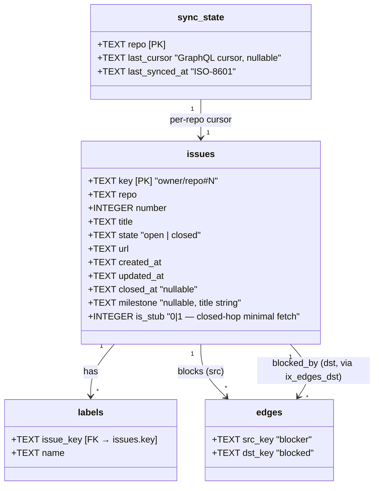
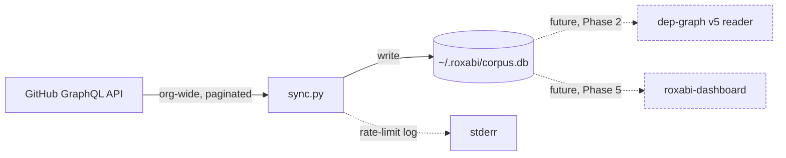

## Context

Promoted from the approved frame. Today's dep-graph reads a per-project `gh.json` (lyra-only) and applies a primary-repo-scoped visibility rule; cross-repo chains stay invisible. The long-term UX ("select repo → tree + shared subtrees from other repos") needs a workspace-wide data layer. Phase 1 builds that layer only — readers are migrated in Phase 2.

## Goal

Provide a single, local SQLite corpus of every Roxabi-org issue (open set + 1-hop closed ancestors), refreshed incrementally via a GraphQL sync. Expose it through `scripts/corpus/` and a `make corpus sync` target.

## Users

| User | Role | Interaction |
|------|------|-------------|
| Mickael | primary and sole user in Phase 1 | runs `make corpus sync` manually; later, scheduled via cron |

Downstream readers (dep-graph v5 in Phase 2, roxabi-dashboard in Phase 5) are **constraints on the schema**, not users of this feature. They appear in the consumer map below; the schema must survive extraction to a dedicated repo without rewrite.

## Expected Behavior

**First run:** `make corpus sync`
1. Creates `~/.roxabi/corpus.db` with schema if absent.
2. Enumerates every non-archived repository under `Roxabi` via GraphQL.
3. For each repo, paginates open + closed issues with `updatedAt` ordering.
4. Writes issues, labels, edges; upserts edge rows canonically (`src blocks dst` only).
5. Collects `blocked_by` refs pointing at keys not yet in the DB; second pass stub-fetches those (capturing only `key`, `repo`, `number`, `state`, `title`, `closed_at`).
6. Logs GraphQL rate-limit `cost`, `remaining`, `resetAt` after each page.
7. Updates `sync_state(repo, last_cursor, last_synced_at)` per repo.

**Subsequent runs:** same flow, but each repo's query is filtered `since: last_synced_at` — touching only issues updated since.

**Failure modes:**
- Missing `gh` auth → exit code 2, clear message pointing at `gh auth login`.
- Rate-limit exhausted mid-run → abort cleanly, leaving `sync_state` consistent (last fully-synced cursor preserved). Next run resumes.
- GraphQL transport error on a repo → log, skip to next repo, exit non-zero.

## Data Model & Consumers

### Corpus schema



- `edges` is canonical one-direction (`src blocks dst`). `blocked_by` derived by `SELECT src_key FROM edges WHERE dst_key = ?` via `ix_edges_dst`.
- `is_stub = 1` rows come from the +1 closed-hop pass; only a subset of fields populated.
- Labels and edges are wiped-and-rewritten per issue on upsert (simpler than M:N diffing).

### Consumer map



### Consumer summary

| Consumer | Fields consumed | When | Status |
|---|---|---|---|
| sync.py | all (writes) | during sync | **this issue** |
| dep-graph v5 reader | issues.*, labels.name, edges.* | on build | Phase 2 — out of scope |
| roxabi-dashboard | issues.*, labels.name, edges.*, sync_state.last_synced_at | on render | Phase 5 — out of scope |

## Breadboard

### Affordances

| ID | Surface | Handler |
|---|---|---|
| C1 | `make corpus sync` (Makefile target) | `scripts/corpus/cli.py sync` |
| C2 | `make corpus init` (Makefile target) | `scripts/corpus/cli.py init` |
| C3 | `make corpus stats` (Makefile target) | `scripts/corpus/cli.py stats` |
| N1 | `scripts/corpus/schema.py` | `bootstrap(conn)`, `SCHEMA_VERSION` |
| N2 | `scripts/corpus/sync.py` | `run_sync(db_path, org, since=None)`, `enumerate_repos`, `fetch_issues_page`, `closed_hop_pass`, `write_issue` |
| N3 | `scripts/corpus/cli.py` | argparse → `cmd_init`, `cmd_sync`, `cmd_stats` |
| N4 | `scripts/corpus/graphql.py` | query templates, `gh_graphql(query, vars)` wrapper |
| D1 | `~/.roxabi/corpus.db` | SQLite file, WAL mode |

### Wiring

```
C1 ─▶ N3.cmd_sync ─▶ N2.run_sync ─▶ N4.gh_graphql ─▶ GitHub
                          │
                          ├─▶ N1.bootstrap (if DB absent)
                          ├─▶ write issues+labels+edges (per page)
                          ├─▶ closed_hop_pass (after open-set)
                          └─▶ update sync_state

C2 ─▶ N3.cmd_init ─▶ N1.bootstrap (idempotent)
C3 ─▶ N3.cmd_stats ─▶ reads DB → prints counts
```

## Slices

| # | Slice | Demo | Affordances |
|---|---|---|---|
| 1 | **Schema + CLI scaffold + stats** — bootstrap DB, wire CLI, show counts | `make corpus init && make corpus stats` → prints `0 issues, 0 repos, 0 edges` from fresh DB | C2, C3, N1, N3, D1 |
| 2 | **Single-repo sync + rate-limit logging + sync_state writes** — sync `Roxabi/lyra` only (no org iteration, no cursor yet); write issues+labels+edges; write `sync_state` row for the repo; emit cost/remaining/resetAt to stderr each page | `make corpus sync --repo Roxabi/lyra && make corpus stats` → counts match `gh issue list`; stderr shows GraphQL cost logs; `sync_state` has one row | C1 (partial), N2, N4, `sync_state` writes |
| 3 | **Org-wide iteration + incremental cursor + closed-hop** — enumerate all Roxabi repos; per-repo `since:` cursor from `sync_state`; +1 closed-hop stub pass after open-set | `make corpus sync` on clean DB populates every repo; second immediate run fetches 0 issues (identical stats) | C1 (full), N2 (full), closed-hop pass |

Every affordance appears in ≥1 slice. Slice 3 closes the spec.

## Success Criteria

- [ ] `make corpus sync` creates/populates `~/.roxabi/corpus.db` with schema tables `issues`, `labels`, `edges`, `sync_state`.
- [ ] All open issues from every non-archived Roxabi-org repo present in `issues`; cross-repo refs in `edges` stored as `owner/repo#N` strings (never bare numbers).
- [ ] `edges` contains exactly one row per blocker-blocked pair (canonical `src blocks dst`); reverse lookup via `ix_edges_dst` works.
- [ ] Closed issues referenced in `blocked_by` of an open/visible issue appear in `issues` with `is_stub = 1`; `is_stub = 0` for normally-fetched rows.
- [ ] Second immediate `make corpus sync` run (no upstream activity) fetches 0 issues — `make corpus stats` shows identical `issues` / `edges` / `labels` counts before and after.
- [ ] Rate-limit `cost`, `remaining`, `resetAt` logged to stderr at least once per repo page.
- [ ] Full body text is never stored in any table (no `body` column exists; `body_hash` dropped from schema — bodies not needed by any Phase 1 consumer).
- [ ] Unit tests pass for: schema bootstrap idempotency, edge dedup on repeat sync, key canonicalisation (bare int → `owner/repo#N`), closed-hop pass triggers when referenced blocker is missing.

## Edge Cases

| Case | Handling |
|---|---|
| `~/.roxabi/` directory missing | `cmd_init` creates it; `cmd_sync` errors if DB absent with a hint to run `init` |
| Archived repo in org | Skipped during enumeration |
| Issue with no milestone | `milestone = NULL` |
| Issue deleted on GitHub | Not automatically removed from DB in Phase 1 — tombstones are Phase 2+ concern |
| Cross-repo blocker in a repo outside `Roxabi` org | Stored as-is in `edges`; stub fetched if accessible, else logged as orphan |
| User runs `sync` mid-write (two concurrent processes) | SQLite file lock; second process fails cleanly, no partial writes |
| GraphQL dependencies field fails for a specific page | Retry that page via REST `/repos/{owner}/{repo}/issues/{n}/dependencies` for just the issues on the failing page (bounded, ≤100 REST calls), not the whole sync |
| Repo deleted between syncs (not archived) | `sync_state` row and corresponding `issues` rows remain as orphans; explicit cleanup deferred to a later phase |

## Non-functional

- First full sync budget: < 30s wall-clock and < 300 GraphQL points on current org size (~30 repos, ~6k issues; 100-per-page → ~60 pages × ~3 pts ≈ 180 pts expected).
- Incremental re-sync (no upstream changes): < 5s and < 20 points (one `since:`-filtered page per repo, mostly empty).
- DB size: < 5 MB after full sync (no bodies stored, no body_hash column).
- No external Python deps beyond stdlib + `httpx` (or `requests`) and `gh` CLI for auth token.
