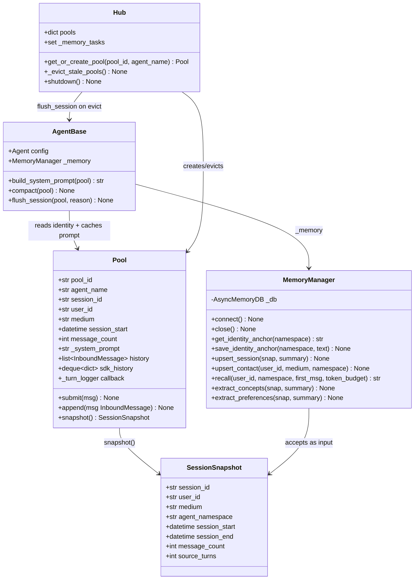
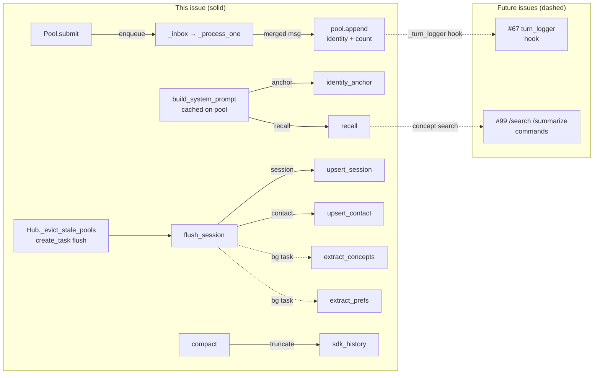

## Context

Promoted from: `artifacts/analyses/83-memory-agent-integration-analysis.mdx`
Parent epic: #9 (Memory layer Phase 1)
Architecture: `docs/ARCHITECTURE.md`

Lyra is fully stateless between sessions. This spec wires `AsyncMemoryDB` (roxabi-vault, already
installed) into `Pool` and `AgentBase` to add identity, session persistence, and four memory
pillars: identity anchor, session records, contacts, concepts, preferences, and cross-session
recall.

## Goal

Make Lyra remember: every session is persisted to L3, the identity anchor evolves over time, and
at session start the agent receives a `[MEMORY]` + `[PREFERENCES]` block with relevant past
context injected into the system prompt.

## Users

- **Primary:** `AgentBase` subclasses (`SimpleAgent`) — gain session lifecycle hooks, a living
  identity anchor, and access to past context at session start.
- **Secondary:** Mickael (end user) — benefits from an agent that remembers across sessions,
  channels, and context resets.
- **Downstream #67** — raw turn logging — needs `Pool.append()` hook + `session_id` + `user_id`.

## Expected Behavior

### First boot (no L3 records)

1. Hub constructs `MemoryManager` and injects it into `AgentBase` at startup.
2. Telegram/Discord adapter calls `hub.get_or_create_pool(pool_id, agent_name)` → new `Pool`
   is created with a fresh `session_id` (UUID), empty `user_id`, `medium`, `message_count=0`.
3. First `InboundMessage` arrives → `Pool.submit(msg)` enqueues to `_inbox` as before.
   Inside `_process_one()`, after the merged message is resolved, `pool.append(msg)` is called:
   promotes `user_id` and `medium` from `msg`, increments `message_count`.
4. Before the first LLM call in `AgentBase.process()`, `build_system_prompt(pool)` is called
   **once per pool** and cached as `pool._system_prompt`. On first boot, `get_identity_anchor()`
   returns `None` → seeds from `agent.config.system_prompt` (which itself may have been composed
   from a persona TOML), writes the result to L3 as `IDENTITY_ANCHOR`.
   `recall()` returns `""` (no prior sessions). Cached system prompt = identity anchor only.
5. Conversation proceeds. History accumulates in `pool.sdk_history`.
6. Session ends (idle eviction or adapter disconnect):
   - `Hub._evict_stale_pools()` pops the pool, gets the agent, and schedules
     `asyncio.create_task(agent.flush_session(pool, 'idle'))` — registered in `_memory_tasks`.
   - `flush_session()` awaits its own LLM summary call, then `upsert_session()` + `upsert_contact()`.
   - Background tasks (`extract_concepts`, `extract_preferences`) are scheduled inside
     `flush_session()` and added to `Hub._memory_tasks`.

### Subsequent session (L3 records exist)

1. New pool created. On first LLM turn, `build_system_prompt(pool)` called and cached.
2. `get_identity_anchor()` returns stored anchor from L3 — TOML value ignored.
3. `recall(user_id, namespace, first_msg="", token_budget=1000)` fetches last 5 session
   summaries. When `first_msg` is empty (pool just created, no message yet), concept search
   is skipped — summaries only. Returns a `[MEMORY]` block (≤1 000 tokens).
4. Preference entries already in L3 — loaded as `[PREFERENCES]` block.
5. Cached system prompt = identity anchor + `[MEMORY]` + `[PREFERENCES]`.
6. Lyra appears to "remember" the user: previous topics, preferences, known contacts.

### Compaction (long session)

When estimated token count of `pool.sdk_history` exceeds `COMPACT_THRESHOLD`:
- Token estimate: `sum(len(turn["content"]) // 4 for turn in sdk_history)`
- `COMPACT_THRESHOLD = int(0.8 * MODEL_CONTEXT_TOKENS)` where `MODEL_CONTEXT_TOKENS = 200_000`
  (hardcoded constant; configurable via `AgentBase` constructor kwarg for testing)
- **Interaction with `max_sdk_history`:** when `compact()` is wired up, `Pool.max_sdk_history`
  is set to `sys.maxsize` — compaction owns truncation; the deque cap is disabled.
- `compact()` fires:
  1. LLM generates incremental summary (includes prior system summary if one exists in history).
  2. **Write partial session to L3** — `upsert_session(snap, summary, status='partial')`. This
     persists the summary before truncation. If Lyra crashes before `flush_session()` runs,
     the partial summary is not lost. `flush_session()` overwrites it with `status='final'`.
  3. `sdk_history = [{"role": "system", "content": summary}] + list(sdk_history)[-COMPACT_TAIL:]`

---

## Data Model & Consumers





**Consumer summary**

| Consumer | Fields | When | Status |
|----------|--------|------|--------|
| `pool.append()` | `user_id`, `medium` from `InboundMessage` | Every message (via `_process_one`) | This issue |
| `build_system_prompt()` | identity anchor, recall results, preferences | First LLM turn per pool (cached) | This issue |
| `flush_session()` | `session_id`, `user_id`, `medium`, `session_start`, `message_count` | Session end (eviction / disconnect) | This issue |
| `compact()` | `sdk_history`, `COMPACT_THRESHOLD` | Token threshold hit | This issue |
| `#67 turn_logger` | `session_id`, `user_id`, `InboundMessage` | Every message | Future |
| `#99 /search` | concept entries, session summaries | On command | Future |

---

## Breadboard

### B1 — Pool identity lifecycle

| Affordance | Handler | Data |
|------------|---------|------|
| `Pool.__init__()` | Generate `session_id = uuid4()`, set `session_start = now(UTC)`, `message_count = 0`, `user_id = ""`, `medium = ""`, `_system_prompt = ""` | Pool |
| `Pool.append(msg)` | Called from `_process_one()` after debounce merge. If `user_id == ""`: promote from `msg.user_id` + `msg.platform`. Increment `message_count`. Call `_turn_logger(session_id, msg)` if set. **Not a replacement for `submit()`** — `submit()` is the external entry point; `append()` is the internal identity/accounting mutator. | Pool, InboundMessage |
| `Pool.snapshot()` | Return `SessionSnapshot(session_id, user_id, medium, agent_namespace, session_start, session_end=now(UTC), message_count, source_turns=len(sdk_history))` | SessionSnapshot |

### B2 — MemoryManager lifecycle

| Affordance | Handler | Data |
|------------|---------|------|
| `Hub.__init__()` | Construct `MemoryManager(vault_path)` + `await _memory.connect()`. Initialize `_memory_tasks: set[asyncio.Task] = set()`. | MemoryManager, AsyncMemoryDB |
| `Hub.shutdown()` | `await asyncio.gather(*_memory_tasks, return_exceptions=True)` then `await _memory.close()` | Hub._memory_tasks |
| `AgentBase.__init__()` | Accept `memory: MemoryManager \| None = None` as DI kwarg. Store as `self._memory`. | AgentBase |

### B3 — Identity anchor seeding + retrieval

| Affordance | Handler | Data |
|------------|---------|------|
| `build_system_prompt(pool)` — first call | `get_identity_anchor(agent.memory_namespace)` → `None` → seed text = `agent.config.system_prompt` (composed from persona or TOML `[prompt].system`). `save_identity_anchor(namespace, seed_text)`. Cache result on `pool._system_prompt`. | L3 `type='anchor'` |
| `build_system_prompt(pool)` — subsequent | `get_identity_anchor(namespace)` → returns stored text. **TOML value not re-read.** Cache on `pool._system_prompt`. | L3 `type='anchor'` |
| `memory_namespace` source | `agent.memory_namespace` is a field on the `Agent` dataclass, loaded from `[agent] memory_namespace` in the agent's TOML (defaults to agent name). No inference — must be explicit. | Agent.memory_namespace |
| Identity anchor entry | `type='anchor'`, `title='IDENTITY_ANCHOR'`, `namespace=agent.memory_namespace` | AsyncMemoryDB entries |

### B4 — Cross-session recall

| Affordance | Handler | Data |
|------------|---------|------|
| `recall(user_id, namespace, first_msg, token_budget)` | Fetch last 5 `type='session'` entries for `user_id` ordered by `created_at DESC`. If `first_msg != ""`: hybrid-search `type='concept'` entries. If `first_msg == ""`: **skip concept search** (return summaries only). Compose `[MEMORY]` block. Truncate oldest entries until within `token_budget`. | L3 `type='session'`, `type='concept'` |
| `[PREFERENCES]` block | Fetch `type='preference'` entries for `user_id`. Format as `- key: value` bullet list. Return `""` if none. | L3 `type='preference'` |
| `build_system_prompt()` final composition | `parts = [identity_anchor]`. Append memory block if non-empty. Append prefs block if non-empty. `return "\n\n".join(parts)`. | str |

### B5 — Session flush

| Affordance | Handler | Data |
|------------|---------|------|
| `Hub._evict_stale_pools()` | **Stays synchronous.** For each stale pool: `pool = self.pools.pop(pid)`. `agent = self.get_agent(pool.agent_name)`. If agent and `pool.user_id != ""`: `task = asyncio.create_task(agent.flush_session(pool, 'idle'))`, `self._memory_tasks.add(task)`, `task.add_done_callback(self._memory_tasks.discard)`. | Hub, asyncio.Task |
| Hub adapter disconnect | `pool = self.pools.pop(pool_id)`. `await agent.flush_session(pool, 'end')`. (Disconnect is already in async context — can await directly.) | Pool |
| `flush_session(pool, reason)` | `snap = pool.snapshot()`. Await LLM summary call. `await _memory.upsert_session(snap, summary)`. `await _memory.upsert_contact(snap.user_id, snap.medium, snap.agent_namespace)`. Schedule `extract_concepts` + `extract_preferences` as `asyncio.create_task()`, registered in Hub via callback. | SessionSnapshot, AsyncMemoryDB |
| Session record | `type='session'`, `metadata={session_id, user_id, medium, agent_namespace, session_start, session_end, message_count, source_turns}`, `content=summary` | AsyncMemoryDB entries |
| Contact record | `type='contact'`, `metadata={user_id, medium, last_seen}`, upsert by `user_id` JSON key | AsyncMemoryDB entries |

### B6 — Compaction

| Affordance | Handler | Data |
|------------|---------|------|
| `compact(pool)` trigger check | Called at end of `_process_one()`. Token estimate: `sum(len(t.get("content","")) // 4 for t in pool.sdk_history)`. Fire if `> COMPACT_THRESHOLD`. | Pool.sdk_history |
| `COMPACT_THRESHOLD` | `int(0.8 * MODEL_CONTEXT_TOKENS)`. `MODEL_CONTEXT_TOKENS = 200_000` (constant, overridable via `AgentBase.__init__(compact_context_tokens=200_000)`). | AgentBase |
| `max_sdk_history` interaction | When `compact()` is wired, `Pool.max_sdk_history` is set to `sys.maxsize` so compaction owns truncation exclusively. | Pool |
| `compact(pool)` body | Await LLM incremental summary (pass existing `_system_prompt` summary if any + last `COMPACT_TAIL` turns). **Before truncation:** `await _memory.upsert_session(pool.snapshot(), summary, status='partial')`. Then: `pool.sdk_history = deque([{"role":"system","content":summary}] + list(pool.sdk_history)[-COMPACT_TAIL:])`. `COMPACT_TAIL = 10` (configurable). | Pool.sdk_history, LLM, L3 |
| Partial session record | `type='session'`, `metadata={..., status='partial'}`. Written at every compaction. `flush_session()` overwrites same `session_id` with `status='final'`. Prevents summary loss on crash between compaction and flush. | AsyncMemoryDB entries |

### B7 — Background extraction

| Affordance | Handler | Data |
|------------|---------|------|
| `extract_concepts(snap, summary)` | LLM prompt: extract concepts from `summary`. For each: upsert by `(name, user_id)`. If fresh (within TTL): merge `relations`, increment `mention_count`, update `confidence`. If stale: fully replace content + reset `mention_count = 1`. | L3 `type='concept'` |
| `extract_preferences(snap, summary)` | LLM prompt: extract explicit preferences. For each: upsert by `(name, user_id)`. If found: `strength = min(1.0, strength + 0.1)` (confirmation strengthens). If new: `strength = confidence`. | L3 `type='preference'` |
| Concept entry | `type='concept'`, `namespace=agent_namespace`, `content=<1-2 sentence description>`, `metadata={name, category, relations, mention_count, confidence, source_session_id, first_mentioned, last_mentioned}` | AsyncMemoryDB entries |
| Preference entry | `type='preference'`, `namespace=agent_namespace`, `content=<description>`, `metadata={user_id, name, domain, strength, source, source_session_id}` | AsyncMemoryDB entries |
| Concept categories | `technology` (libraries, tools, frameworks), `project` (active work), `decision` (architectural choices), `fact` (atomic facts about user/world), `entity` (people, orgs) | — |
| Concept relation types | `used_by`, `uses`, `part_of`, `depends_on`, `related_to`, `decided_in` — stored as `relations: [{type, target}]` in metadata | — |
| Preference domains | `communication` (tone, verbosity), `technical` (stack choices, patterns), `workflow` (habits, tools) | — |
| Upsert key | Concepts: `(name, user_id, namespace)`. Preferences: `(name, user_id, namespace)`. No duplicates per user per agent. | — |
| Provenance | Every extracted entry includes `source_session_id: snap.session_id` in metadata. Enables invalidating all facts from a session. | — |
| Error handling | Both extraction methods: `try/except Exception` → `log.warning(...)` — never raise. | — |

### B8 — Freshness model

Different entry types decay at different rates. Freshness governs both **recall ranking** and
**extraction upsert behavior**.

**TTL table:**

| Entry type | Category | TTL (days) | Rationale |
|------------|----------|-----------|-----------|
| `anchor` | — | never | Explicitly evolved, never auto-expires |
| `session` | — | never | Permanent archive; recency used for ordering |
| `contact` | — | never | Updated on each session; never stale |
| `concept` | `technology` | 180 | Library descriptions change slowly |
| `concept` | `project` | 90 | Projects evolve within months |
| `concept` | `decision` | never | Decisions are stable; superseded explicitly |
| `concept` | `fact` | 60 | User setup facts can change (hardware, config) |
| `concept` | `entity` | 180 | People and orgs are stable |
| `preference` | any | 30 | Preferences shift; must be re-confirmed regularly |

**Freshness constant:**
```python
FRESHNESS_TTL_DAYS: dict[str, int | None] = {
    "concept:technology": 180,
    "concept:project":    90,
    "concept:decision":   None,
    "concept:fact":       60,
    "concept:entity":     180,
    "preference":         30,
}
```

**How freshness affects `recall()`:**

Entries are ranked into two tiers within the token budget:

1. **Fresh** (`updated_at` within TTL): ranked by relevance score, fill budget first.
2. **Stale** (`updated_at` beyond TTL): ranked by recency, appended only if budget allows,
   prefixed with `[~Nd ago]` marker so the LLM knows to treat with lower confidence.

```
[MEMORY]
- roxabi-vault: SQLite-backed memory library (concept, technology)
- decided to use Shape A for memory layer (concept, decision)
[~45d ago] uses WSL2 on ROXABITOWER (concept, fact) ← stale marker
```

**How freshness affects `extract_concepts()`:**

| Entry age vs TTL | Extraction behavior |
|-----------------|---------------------|
| No existing entry | Insert new with `mention_count=1` |
| Existing, fresh | Merge relations, increment `mention_count`, update `confidence` |
| Existing, stale | Fully replace content, reset `mention_count=1`, reset `first_mentioned` |

**How freshness affects `extract_preferences()`:**

| State | Behavior |
|-------|----------|
| No existing entry | Insert with `strength = confidence` from LLM |
| Existing, fresh | `strength = min(1.0, strength + 0.1)` — confirmation strengthens |
| Existing, stale | Treat as new — reset `strength = confidence` |

---

## Slices

| # | Slice | Deliverable | Depends |
|---|-------|-------------|---------|
| S1 | Pool identity | New fields: `session_id`, `user_id`, `medium`, `session_start`, `message_count`, `_system_prompt`. New methods: `Pool.append(msg)` (called from `_process_one`), `Pool.snapshot()`. `_turn_logger` hook. `max_sdk_history → sys.maxsize` when compact wired. | — |
| S2 | MemoryManager + Hub injection | `src/lyra/core/memory.py`: `MemoryManager` + `SessionSnapshot`. Hub constructs + injects into agents. `connect()`/`close()`. `_memory_tasks` registry + shutdown drain. | S1 |
| S3 | Identity anchor | `AgentBase.build_system_prompt(pool)`: seed on first boot, retrieve from L3 after. Cached on `pool._system_prompt`. Replaces direct use of `agent.config.system_prompt` in LLM calls. | S1, S2 |
| S4 | Session flush + Hub integration | `AgentBase.flush_session(reason, pool)`. Hub `_evict_stale_pools()` schedules flush via `create_task`. Hub disconnect path awaits flush. `upsert_session()` + `upsert_contact()`. | S1, S2 |
| S5 | Compaction | `AgentBase.compact(pool)`. Token estimate. `COMPACT_THRESHOLD` constant. `max_sdk_history` disabled. Incremental LLM summary. **Partial session write to L3 before truncation.** `sdk_history` truncation. | S1, S2 |
| S6 | Cross-session recall | `MemoryManager.recall()`. `[MEMORY]` + `[PREFERENCES]` injection in `build_system_prompt()`. Token budget: fresh entries first, stale appended with age marker. Anchor uncapped. | S2, S4 |
| S7 | Concept + preference extraction | Background `extract_concepts()` + `extract_preferences()`. Concept schema: `name`, `category`, `relations`, `mention_count`, `confidence`, `source_session_id`. Preference schema: `name`, `domain`, `strength`, `source_session_id`. Upsert by `(name, user_id, namespace)`. Freshness-aware merge vs. replace. | S4 |

---

## Success Criteria

### S1 — Pool identity
- [ ] `Pool` has `session_id: str` (UUID4), `user_id: str = ""`, `medium: str = ""`, `session_start: datetime` (UTC), `message_count: int = 0`, `_system_prompt: str = ""`
- [ ] `Pool.append(msg)` is called from `_process_one()` after debounce merge — it does **not** replace `submit()`
- [ ] `Pool.append(msg)` promotes `user_id` and `medium` from first message only; subsequent calls do not overwrite
- [ ] `Pool.append(msg)` increments `message_count` on every call
- [ ] `Pool.append(msg)` calls `_turn_logger(session_id, msg)` if set; no-op if `None`
- [ ] `Pool.snapshot()` returns a `SessionSnapshot` with correct fields and `session_end = datetime.now(UTC)`
- [ ] `_turn_logger` defaults to `None`; setting it does not change other Pool behavior

### S2 — MemoryManager + Hub injection
- [ ] `MemoryManager(vault_path)` constructs without error; `connect()` opens DB and runs schema migration
- [ ] `MemoryManager` public methods accept only value types — never `Pool` or `AgentBase`
- [ ] Hub constructs one `MemoryManager` at startup and awaits `connect()`
- [ ] Hub passes `MemoryManager` instance to each `AgentBase.__init__(memory=...)` at construction
- [ ] `memory=None` is valid — all `AgentBase` memory calls are guarded by `if self._memory`; no crashes
- [ ] `Hub.shutdown()` awaits all `_memory_tasks` (with `return_exceptions=True`) then calls `await _memory.close()`
- [ ] `Hub._memory_tasks` is a `set[asyncio.Task]`; tasks are discarded on completion via `add_done_callback`

### S3 — Identity anchor
- [ ] First `build_system_prompt(pool)` call: `get_identity_anchor(agent.memory_namespace)` returns `None` → seeds text from `agent.config.system_prompt`, calls `save_identity_anchor()`, caches on `pool._system_prompt`
- [ ] Subsequent boots: `get_identity_anchor(namespace)` returns stored text — `agent.config.system_prompt` not read
- [ ] Identity anchor stored as `type='anchor'`, `title='IDENTITY_ANCHOR'`, `namespace=agent.memory_namespace`
- [ ] `agent.memory_namespace` comes from `[agent] memory_namespace` in the TOML file (no inference)
- [ ] `build_system_prompt()` caches result on `pool._system_prompt`; subsequent turns reuse the cache (no re-read from L3 per turn)
- [ ] LLM backends use `pool._system_prompt` instead of `agent.config.system_prompt` directly

### S4 — Session flush + Hub integration
- [ ] `Hub._evict_stale_pools()` remains synchronous; uses `asyncio.create_task()` (not `await`) for flush
- [ ] Each flush task registered in `Hub._memory_tasks` and auto-removed on completion
- [ ] Hub disconnect path (async context) awaits `agent.flush_session(pool, 'end')` directly
- [ ] `flush_session()` generates session summary via LLM call (awaited — not background)
- [ ] `upsert_session()` writes `type='session'` entry; re-flush of same `session_id` updates, not duplicates
- [ ] `upsert_contact()` writes/updates `type='contact'` entry; `last_seen` updated on every flush
- [ ] Background extraction tasks registered in `Hub._memory_tasks`
- [ ] `flush_session()` is a no-op when `pool.user_id == ""` (zero-message session)

### S5 — Compaction
- [ ] Token estimate: `sum(len(t.get("content","")) // 4 for t in pool.sdk_history)`
- [ ] `COMPACT_THRESHOLD = int(0.8 * MODEL_CONTEXT_TOKENS)` where `MODEL_CONTEXT_TOKENS = 200_000`
- [ ] `MODEL_CONTEXT_TOKENS` overridable via `AgentBase.__init__(compact_context_tokens=...)` for tests
- [ ] When `compact()` is wired up, `Pool.max_sdk_history` is set to `sys.maxsize` — deque cap disabled
- [ ] LLM summary is incremental: prior system summary (if present in history) included in prompt input
- [ ] **Before** truncating `sdk_history`: `upsert_session(snapshot, summary, status='partial')` written to L3
- [ ] After compaction: `sdk_history = deque([system_summary_turn] + last_COMPACT_TAIL_turns)`
- [ ] `COMPACT_TAIL = 10` (default), configurable
- [ ] `flush_session()` overwrites the partial session record with `status='final'` using the same `session_id`

### S6 — Cross-session recall
- [ ] `recall(user_id, namespace, first_msg, token_budget)` fetches last 5 `type='session'` entries by recency
- [ ] When `first_msg != ""`: hybrid-searches `type='concept'` entries; when `first_msg == ""`: summaries only
- [ ] Returns `""` when no prior records exist — no exception
- [ ] Within `token_budget`: fresh entries (within TTL) ranked first, stale entries appended last with `[~Nd ago]` prefix
- [ ] `[MEMORY]` block respects `token_budget` (default 1 000 tokens); stale entries dropped first when over budget
- [ ] `[PREFERENCES]` block fetched separately; omitted when no preference entries exist for `user_id`
- [ ] `build_system_prompt()` composes: `"\n\n".join(filter(None, [anchor, memory, prefs]))`; anchor is uncapped
- [ ] All L3 queries in `recall()` scoped to `user_id` — no cross-user entries returned

### S7 — Concept + preference extraction
- [ ] `extract_concepts()` runs as background task on every `flush_session()` where `source_turns >= 3`
- [ ] Concept upsert key: `(name, user_id, namespace)` — no duplicates per user per agent
- [ ] Concept entry: `type='concept'`, metadata has `name`, `category` (technology|project|decision|fact|entity), `relations` (`[{type, target}]`), `mention_count`, `confidence`, `source_session_id`, `first_mentioned`, `last_mentioned`
- [ ] Concept freshness on upsert: fresh → merge relations + increment `mention_count`; stale → fully replace content + reset `mention_count=1`
- [ ] `extract_preferences()` upserts preferences by `(name, user_id, namespace)` — no duplicates
- [ ] Preference entry: `type='preference'`, metadata has `user_id`, `name`, `domain` (communication|technical|workflow), `strength` (0.0–1.0), `source`, `source_session_id`
- [ ] Preference freshness on upsert: fresh confirmation → `strength = min(1.0, strength + 0.1)`; stale → reset `strength = confidence`
- [ ] Every extracted entry (concept and preference) includes `source_session_id: snap.session_id` in metadata
- [ ] Both methods: any exception is caught, logged at WARNING level, and swallowed — flush never fails due to extraction
