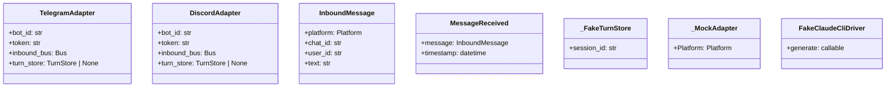

## Context

**Promoted from:** [Frame](../frames/830-arg-type-ignores-refactor-frame.mdx)

Follow-up to #828 quick-win cleanup. The frame identified 10 sites; spec expanded to 12 after full grep audit.

**Prior work:** #828 removed 50/60 inline type ignores (83%), leaving 12 `# type: ignore[arg-type]` in test files.

**Justified retentions:** 6 pre-existing ignores from #828 with `# justified:` comments (V4 PLC0415 + V2 ARG002) are **out of scope**. These remain as-is.

## Problem

12 `# type: ignore[arg-type]` sites in test files require manual maintenance and mask potential type mismatches. Developers cannot trust pyright output without manually auditing each ignore. Pattern types:

- **Splat pattern** (6 sites): kwargs dict → `**kwargs` splat into constructor
- **Direct kwargs** (6 sites): single kwarg with wrong type (e.g., `turn_store=fake_turn_store`)

## Goal

Eliminate all 12 `# type: ignore[arg-type]` in test files via factory functions, achieving pyright green.

## Users

- **Primary:** Developers — type-safe test helpers reduce maintenance burden
- **Secondary:** CI — pyright passes without suppressions

## Constraints

- Must not change test behavior (refactor only)
- Factory functions stay local to test files (no shared test utilities)
- No new dependencies
- Must work with pyright's type narrowing

## Out of Scope

- The 6 `# justified:` retentions from #828 (in `src/` and a few test files)
- Type ignores with other codes (e.g., `type: ignore[assignment]`, `type: ignore[misc]`)
- Modifying adapter/constructor signatures upstream
- Converting tests to use real adapters instead of fakes

## Expected Behavior

1. Test helpers use factory functions with explicit typed params
2. No `**kwargs` splats in test code
3. Pyright validates all constructor calls
4. All tests pass unchanged

## Data Model & Consumers

**Consumer map:**

| Consumer | When | Fields Used |
|----------|------|-------------|
| `test_session_telegram.py` | Test setup | bot_id, token, inbound_bus, turn_store |
| `test_session_dm_discord.py` | Test setup | bot_id, token, inbound_bus, turn_store |
| `test_discord_auth.py` | Message fixtures | platform, chat_id, user_id, text |
| `test_pipeline_event_bus.py` | Event fixtures | message, timestamp |
| `test_session_reply_to.py` | Message fixtures | platform, chat_id, user_id, text |
| `test_middleware.py` | Mock adapter | Platform, mock methods |
| `test_nats_bus.py` | NATS mock | nc (None for testing) |
| `agent_harness.py` | Agent fixture | config, provider (fake driver) |

## Breadboard

| ID | Element | Signature |
|----|---------|-----------|
| U1 | `_make_telegram_adapter()` | `(bot_id: str = "main", token: str = "test-token", inbound_bus: Bus \| None = None, turn_store: TurnStore \| None = None) -&gt; tuple[TelegramAdapter, MagicMock]` |
| U2 | `_make_discord_adapter()` | `(bot_id: str = "main", token: str = "test-token", inbound_bus: Bus \| None = None, turn_store: TurnStore \| None = None) -&gt; DiscordAdapter` |
| U3 | `_make_inbound_message()` | `(**overrides: Any) -&gt; InboundMessage` — explicit typed params for common fields, `**overrides` for rest |
| U4 | `_make_message_received()` | `(message: InboundMessage \| None = None, timestamp: datetime \| None = None) -&gt; MessageReceived` |
| N1 | `CapturingHub` | conftest fixture with typed `__init__` |
| N2 | `CapturingDcAdapter` | conftest fixture with typed `__init__` |
| N3 | `_make_mock_adapter()` | `(platform: Platform = Platform.TELEGRAM) -&gt; _MockAdapter` |
| N4 | `_make_nats_bus_for_test()` | `(nc: NatsClient \| None = None) -&gt; NatsBus` |
| N5 | `_make_agent_with_fake_driver()` | `(config: AgentConfig, provider: Provider \| None = None) -&gt; SimpleAgent` |

## Slices

| Slice | Scope | Files | Type ignores addressed |
|-------|-------|-------|------------------------|
| S1 | Telegram adapter factory | `test_session_telegram.py` | Lines 85, 191 (2 sites) |
| S2 | Discord adapter factory | `test_session_dm_discord.py` | Lines 82, 152 (2 sites) |
| S3 | InboundMessage factory | `test_discord_auth.py`, `test_session_reply_to.py` | Lines 282, 52 (2 sites) |
| S4 | MessageReceived factory | `test_pipeline_event_bus.py` | Line 39 (1 site) |
| S5 | conftest fixtures | `conftest.py`, `test_bootstrap_credential_resolution.py` | Lines 310, 65 (2 sites) |
| S6 | Misc test fixtures | `test_middleware.py`, `test_nats_bus.py`, `agent_harness.py` | Lines 171, 183, 235 (3 sites) |

## Edge Cases

- **Factory cannot express required type:** Keep ignore with `# justified: &lt;reason&gt;` comment
- **Constructor signature changes mid-refactor:** Update factory accordingly in same PR
- **Fake class doesn't satisfy protocol:** Either fix fake class to satisfy protocol, or justify ignore

## Success Criteria

- [ ] 0 `# type: ignore[arg-type]` in `tests/` directory (excluding 6 pre-existing justified retentions)
- [ ] `uv run pyright` passes with 0 errors
- [ ] `uv run pytest` passes (no behavior change)
- [ ] Factory functions have explicit typed params (no `**kwargs` splats)
