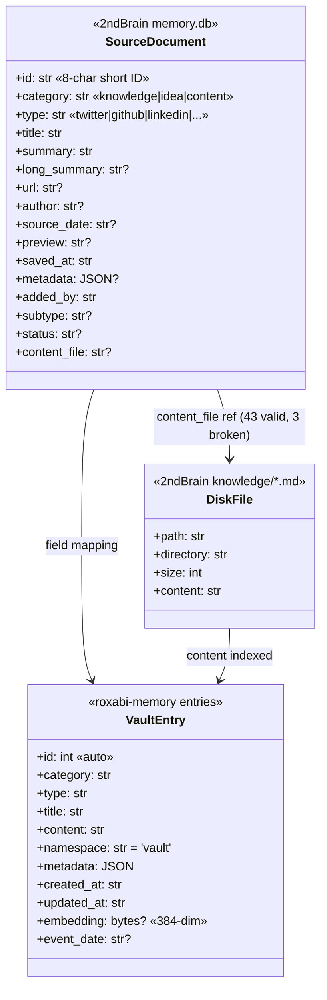
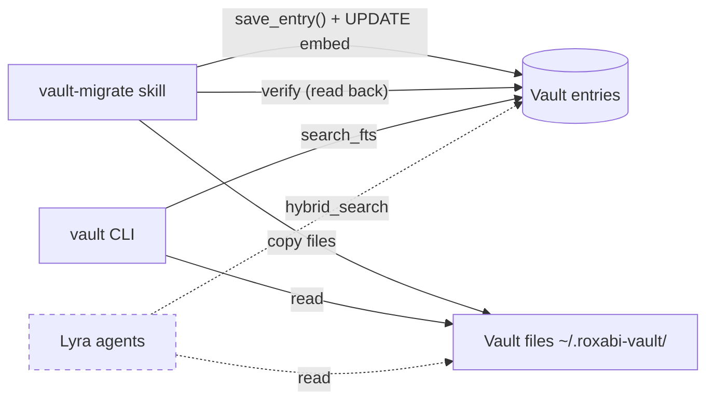

## Context

Promoted from [frame #84](../frames/84-vault-migrate-v2-update-frame.mdx). Parent issue: #9 (memory layer phase 1).

The `vault:vault-migrate` skill currently uses generic field mapping with raw SQL inserts — no embeddings, no namespace, no dedup, no file migration. The roxabi-memory package has since shipped v2 with `MemoryDB.save_entry()`, namespace support, and fastembed ONNX embeddings.

2ndBrain holds **465 DB entries** (documents table) + **59 markdown files** (~511KB). The vault has 2 existing entries. Cross-reference found 43 valid DB→file links, 3 broken refs, and 16 disk-only files with no DB entry.

**Out of scope** (from frame): migrating old sqlite-vec 384-dim embeddings, UI for browsing migrated data, cleanup/deletion of 2ndBrain source, hybrid search features.

**Prerequisites:** `roxabi-memory[embeddings]` (fastembed extra) must be installed in the skill runtime environment. Depends on `roxabi/roxabi-memory#7` (fastembed `embed()` must exist).

## Goal

Rewrite the vault-migrate skill to perform a complete, idempotent migration from 2ndBrain to Roxabi Vault using roxabi-memory v2 API with fastembed embeddings.

## Users

- **Primary:** Mickael — all 2ndBrain knowledge becomes FTS5-searchable via vault CLI
- **Secondary:** Lyra agents — richer context retrieval from vault namespace

## Expected Behavior

1. User runs `vault-migrate` (or triggers via skill)
2. Skill detects 2ndBrain `memory.db` at `~/projects/2ndBrain/knowledge/memory.db`. If not found → error with clear message, exit
3. Skill validates source schema (documents table exists, expected columns present)
4. Instantiate `Embedder` once (loads ONNX model) and `MemoryDB` pointing to `~/.roxabi-vault/vault.db`
5. Read all 465 rows from `documents` table, map fields to vault schema
6. For each entry: check dedup via `json_extract(metadata, '$.source_id')`, skip if exists, else call `MemoryDB.save_entry()` with namespace='vault', then raw `UPDATE entries SET embedding = ?, event_date = ? WHERE id = ?` for embedding + event_date (not exposed by `save_entry()`)
7. Skill scans 2ndBrain `knowledge/` directories for all 59 markdown files
8. Files are copied to corresponding `~/.roxabi-vault/` subdirectories (see file destination mapping below)
9. 16 disk-only files get new vault entries created from their content, auto-categorized by directory, deduped by `metadata.source_id` = relative file path
10. 3 broken DB→file refs: DB row migrated, file copy skipped, warning logged
11. Verification report: count check, FTS5 smoke test, file integrity, idempotency confirmation
12. Re-running produces 0 new entries (dedup covers both DB entries by source `id` and disk-only files by relative path)

## Data Model & Consumers

### Data Structure



### Field Mapping

| Source (documents) | Target (entries) | Transform |
|--------------------|-----------------|-----------|
| `title` | `title` | direct |
| `summary` + `long_summary` | `content` | `summary` alone if `long_summary IS NULL`; else `summary + "\n\n" + long_summary` |
| `category` | `category` | direct |
| `type` | `type` | direct |
| `saved_at` | `created_at` | direct (ISO 8601 — verify format matches before implementing) |
| `source_date` | `event_date` | raw UPDATE after `save_entry()` (not exposed by API) |
| `id` → `source_id`, `url`, `author`, `preview`, `added_by`, `subtype`, `status`, `content_file` | `metadata` | JSON: `{"source_id": id, "url": url, "author": author, "preview": preview, "added_by": added_by, "subtype": subtype, "status": status, "content_file": content_file}` |
| — | `namespace` | always `'vault'` |
| — | `embedding` | raw UPDATE after `save_entry()`: `Embedder.embed(content)` → 384-dim float32 BLOB |

**Implementation note:** `save_entry()` does not accept `event_date` or `embedding` parameters. After each `save_entry()` call, a raw SQL UPDATE sets both fields on the returned entry ID. `Embedder` is instantiated once before the migration loop.

### Directory → Category/Type Mapping (disk-only files)

| Directory | category | type | `source_id` (dedup key) |
|-----------|----------|------|------------------------|
| `analyses/` | `knowledge` | `analysis` | `file:analyses/{filename}` |
| `content/` (linkedin in filename) | `content` | `linkedin` | `file:content/{filename}` |
| `content/` (other) | `content` | `article` | `file:content/{filename}` |
| `cv/` (root) | `content` | `cv-base` | `file:cv/{filename}` |
| `cv/adapted/` | `content` | `cv-adapted` | `file:cv/adapted/{...}/{filename}` |
| `ideas/` | `idea` | `idea` | `file:ideas/{filename}` |
| `learnings/` | `knowledge` | `learning` | `file:learnings/{filename}` |
| Root | `knowledge` | `note` | `file:{filename}` |

### File Destination Mapping

| Source directory | Vault destination |
|-----------------|-------------------|
| `knowledge/analyses/` | `~/.roxabi-vault/analyses/` |
| `knowledge/content/` | `~/.roxabi-vault/content/` |
| `knowledge/cv/` | `~/.roxabi-vault/cv/` |
| `knowledge/cv/adapted/{job}/` | `~/.roxabi-vault/cv/adapted/{job}/` |
| `knowledge/ideas/` | `~/.roxabi-vault/ideas/` |
| `knowledge/learnings/` | `~/.roxabi-vault/learnings/` |
| `knowledge/` (root files) | `~/.roxabi-vault/` |

### Consumer Map



| Consumer | Fields | When | Status |
|----------|--------|------|--------|
| vault CLI | title, content, category, type, metadata | `vault search`, `vault list` | this issue |
| vault-migrate | all fields + embedding | migration + verify | this issue |
| Lyra agents | content, embedding, metadata | context retrieval | future (#83+) |

## Breadboard

### Affordances

| ID | Element | Type | Handler |
|----|---------|------|---------|
| U1 | `vault-migrate` trigger | skill entry | `run_migration()` |
| N1 | Detect + validate source DB | auto | `detect_source()` → validates schema, exits on failure |
| N2 | Read documents table | query | `read_source_documents()` |
| N3 | Map fields | transform | `map_document_to_entry()` |
| N4 | Check dedup | query | `check_dedup(source_id)` via `json_extract(metadata, '$.source_id')` |
| N5 | Save entry | write | `MemoryDB.save_entry()` → returns entry ID |
| N6 | Embed + set event_date | write | `Embedder.embed(content)` → raw UPDATE on entry ID |
| N7 | Scan disk files | filesystem | `scan_knowledge_dir()` |
| N8 | Copy files to vault | filesystem | `copy_file_to_vault()` |
| N9 | Create entry for disk-only file | write | `create_file_entry()` → N5 + N6 |
| N10 | Handle broken refs | log | `log_broken_ref()` |
| N11 | Verify migration | query+fs | `verify_migration()` |
| O1 | Migration report | output | `generate_report()` → JSON to stdout |

### Wiring

```
U1 → N1
  N1 (not found / bad schema) → error message → exit
  N1 (ok) → init Embedder + MemoryDB → N2

N2 → [for each doc] → N3 → N4
  N4 (exists) → skip
  N4 (new) → N5 → N6
  N3 (content_file exists on disk) → mark for N8 skip
  N3 (content_file not on disk) → N10

→ N7 → [for each file on disk]
  file has DB entry already migrated → N8 (copy only)
  file is disk-only → N8 + N9

→ N11 → O1
```

**Error policy:** best-effort. Individual entry failures are logged and counted but do not abort the migration. The report includes error count and details. Partial runs are recoverable via re-run (dedup skips already-migrated entries).

## Slices

| Slice | Name | Scope | Demo |
|-------|------|-------|------|
| SL1 | DB migration core | Read 465 docs, map fields (with null-safe `long_summary`), dedup by `metadata.source_id`, save via `save_entry()` + raw UPDATE for embedding + event_date. Detect broken file refs (log warning). | `vault search "twitter"` returns migrated entries. `vault stats` shows ~467 entries. |
| SL2 | File migration | Copy 59 files to vault dirs per destination mapping. Create 16 new entries for disk-only files (auto-categorized, dedup by `file:{path}`). Set `metadata.content_file` for all file-backed entries. | Files exist in `~/.roxabi-vault/{ideas,learnings,...}/`. `vault search "mmorpg"` finds learnings. |
| SL3 | Verification + idempotency | Count check per category/type vs source. FTS5 smoke tests (5 queries below). File integrity check. Second run = 0 new entries. Generate JSON report to stdout. | Report: 465+16=481 entries, 59 files, 0 errors, idempotent. |

### FTS5 Smoke Test Queries (SL3)

| Query | Expected | Pass condition |
|-------|----------|----------------|
| `twitter` | entries from knowledge/twitter type | ≥1 result |
| `github` | entries from knowledge/github type | ≥1 result |
| `linkedin` | entries from content/linkedin type | ≥1 result |
| `mmorpg` | learnings/histoire-mmorpg content | ≥1 result |
| `Product Manager` | CV entries | ≥1 result |

## Success Criteria

- [ ] All 465 `documents` rows exist in vault `entries` with `metadata.source_id` matching source `id` and `content` = `summary` (or `summary + "\n\n" + long_summary` when non-null)
- [ ] 16 disk-only files get new vault entries auto-categorized by directory, deduped by `metadata.source_id` = `file:{relative_path}`
- [ ] All migrated entries receive `namespace='vault'`
- [ ] Fastembed 384-dim embeddings stored in `embedding` BLOB for every migrated entry (via raw UPDATE after `save_entry()`)
- [ ] `event_date` populated from `source_date` for DB entries (via raw UPDATE after `save_entry()`)
- [ ] Dedup by `metadata.source_id`: re-run produces 0 new entries (covers both DB entries and disk-only files)
- [ ] 59 markdown files copied to `~/.roxabi-vault/` subdirectories per file destination mapping
- [ ] 3 broken file refs: DB row migrated, file skip logged with warning, no crash
- [ ] FTS5 smoke tests: all 5 queries return ≥1 result
- [ ] Existing vault data (2 entries without `source_id` in metadata + existing files) untouched — protected by dedup key mismatch
- [ ] Migration report: JSON to stdout with entry counts by category/type, file counts by directory, warnings list, idempotency status (new/skipped/error counts)
- [ ] Original `memory.db` opened read-only (`sqlite3.connect(..., uri=True)` with `?mode=ro` or equivalent)
