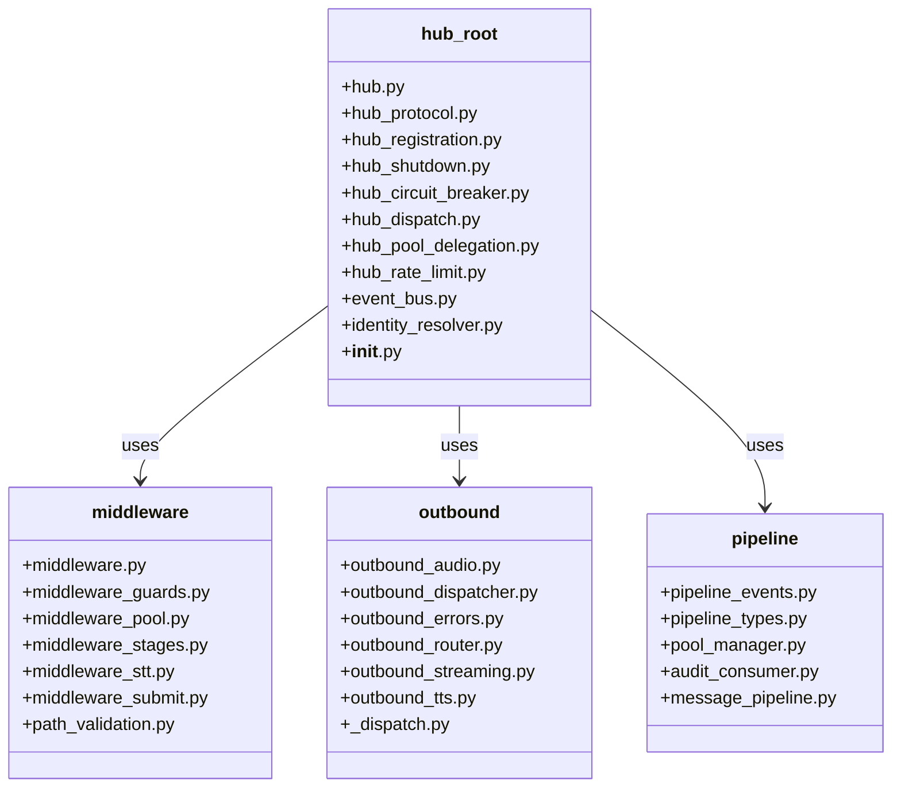
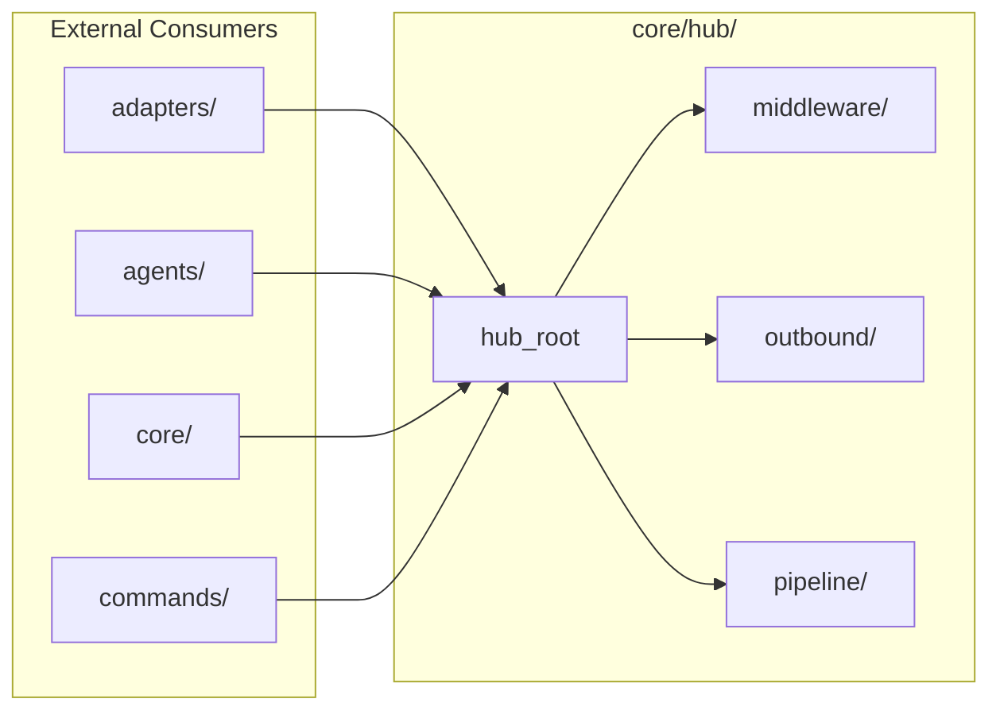

## Context

**Promoted from:** [Frame: decompose core/hub/ V5](../frames/848-decompose-core-hub-v5-frame.mdx)

`core/hub/` contains **30 files** (excluding `__pycache__`), violating the 12-file folder cap. This is the last remaining folder exemption in `tools/folder_exemptions.txt`, blocking spec #760 SC-quality-1 (zero exemptions).

Follow-up to #773 V4 using the same slice-by-slice approach with RED-GATE after each slice.

### Current File Inventory

| File | Destination |
|------|-------------|
| middleware.py | middleware/ |
| middleware_guards.py | middleware/ |
| middleware_pool.py | middleware/ |
| middleware_stages.py | middleware/ |
| middleware_stt.py | middleware/ |
| middleware_submit.py | middleware/ |
| path_validation.py | middleware/ |
| outbound_audio.py | outbound/ |
| outbound_dispatcher.py | outbound/ |
| outbound_errors.py | outbound/ |
| outbound_router.py | outbound/ |
| outbound_streaming.py | outbound/ |
| outbound_tts.py | outbound/ |
| _dispatch.py | outbound/ |
| pipeline_events.py | pipeline/ |
| pipeline_types.py | pipeline/ |
| pool_manager.py | pipeline/ |
| audit_consumer.py | pipeline/ |
| message_pipeline.py | pipeline/ (deprecated shim) |
| hub.py | hub_root |
| hub_protocol.py | hub_root |
| hub_registration.py | hub_root |
| hub_shutdown.py | hub_root |
| hub_circuit_breaker.py | hub_root |
| hub_dispatch.py | hub_root |
| hub_pool_delegation.py | hub_root |
| hub_rate_limit.py | hub_root |
| event_bus.py | hub_root |
| identity_resolver.py | hub_root |
| __init__.py | hub_root |

## Goal

Decompose `core/hub/` into cohesive sub-packages, each ≤12 files, eliminating all folder exemptions.

## Users & Use Cases

- **Developers** — need predictable file locations for middleware, outbound routing, and pipeline concerns
- **Code reviewers** — clearer module boundaries speed review cycles

## Expected Behavior

### Happy path

1. Developer navigates to `core/hub/` and finds clear sub-package structure
2. Middleware concerns live in `middleware/`, outbound in `outbound/`, pipeline in `pipeline/`
3. Core hub orchestration remains in `core/hub/` root (≤12 files)
4. All imports continue to work via re-exports in `__init__.py`

### Edge cases

- **External imports**: Existing `from lyra.core.hub import X` must continue to work
- **Internal imports**: Files within `core/hub/` must update import paths after move
- **Test imports**: Tests importing from `core.hub` must remain valid
- **TYPE_CHECKING cycles**: `pool_manager.py` ↔ `Hub` uses TYPE_CHECKING; acceptable across sub-packages

## Data Model & Consumers

### Module Structure Diagram

### Consumer Map

### Consumer Summary

| Consumer | Modules Used | When | Status |
|----------|--------------|------|--------|
| adapters/ | hub.py, hub_protocol.py | Adapter bootstrap | This issue |
| agents/ | hub_protocol.py, hub_registration.py | Agent delegation | This issue |
| core/ | hub.py, event_bus.py | Core coordination | This issue |
| commands/ | Various hub types | Command handlers | This issue |

## Breadboard

> **Note:** Affordances show primary public interfaces; internal modules (guards, stages, errors, streaming, events) follow same patterns as their parent packages.

### Module Affordances

| ID | Module | Location | Trigger |
|----|--------|----------|---------|
| M1 | middleware.py | middleware/ | Inbound message processing |
| M2 | middleware_stages.py | middleware/ | Stage execution |
| O1 | outbound_dispatcher.py | outbound/ | Message dispatch |
| O2 | outbound_router.py | outbound/ | Platform routing |
| P1 | pipeline_types.py | pipeline/ | Type definitions |
| P2 | pool_manager.py | pipeline/ | Pool coordination |
| H1 | hub.py | hub_root | Hub orchestration |
| H2 | hub_protocol.py | hub_root | Protocol definitions |

### Import Wiring

| ID | Handler | Wiring | Logic |
|----|---------|--------|-------|
| N1 | middleware pipeline | H1 → M1 → M2 → O1 | Process inbound → dispatch outbound |
| N2 | pool delegation | H1 → P2 → adapters | Delegate pool operations |
| N3 | registration | H2 → agents | Register agent capabilities |
| N4 | platform routing | O1 → O2 | Dispatch to platform-specific handler |

### Data Stores

| ID | Store | Type | Accessed by |
|----|-------|------|-------------|
| S1 | Hub state | In-memory | H1, M1 |
| S2 | Pool state | In-memory | P2, N2 |

## Slices

| Slice | Description | Files Moved | Demo |
|-------|-------------|--------------|------|
| V1 | Extract `middleware/` | middleware*.py (6) + path_validation.py | `ls core/hub/middleware/` shows 7 files, tests pass |
| V2 | Extract `outbound/` | outbound*.py (6) + _dispatch.py | `ls core/hub/outbound/` shows 7 files, tests pass |
| V3 | Extract `pipeline/` | pipeline*.py, pool_manager.py, audit_consumer.py, message_pipeline.py (5 files) | `ls core/hub/pipeline/` shows 5 files, tests pass |
| V4 | Verify root | Confirm hub_root has 11 files (≤12) | `ls core/hub/*.py | wc -l` ≤ 12, exemptions empty |

## Constraints

- RED-GATE after each slice: `uv run pyright`, `uv run pytest tests/`, `uv run lint-imports`, `bash tools/check_folder_size.sh`
- No functional changes — pure refactoring
- Must maintain backward-compatible imports via `__init__.py` re-exports
- Must satisfy spec #760 SC-quality-1 (zero exemptions)

## Non-goals

- Functional changes to hub behavior
- Changes to adapters, agents, or other core/ subpackages
- Addressing `src/lyra/core/` exemption (tracked in #858)
- Removing `message_pipeline.py` shim (document deprecation only)

## Technical Decisions

1. **Re-export strategy**: Each sub-package `__init__.py` re-exports public API; root `__init__.py` re-exports from sub-packages for backward compatibility.

2. **Import path updates**: Internal imports within `core/hub/` will use relative imports; external consumers use absolute paths.

3. **Test isolation**: No test changes required — tests import via `lyra.core.hub` which remains valid.

4. **Hub mixins**: `hub_circuit_breaker.py`, `hub_dispatch.py`, `hub_pool_delegation.py`, `hub_rate_limit.py` remain in hub_root as they're tightly coupled to `hub.py`.

5. **_dispatch.py**: Private helper for `outbound_dispatcher.py`; moves to `outbound/` alongside its caller.

6. **message_pipeline.py**: Backward-compat shim re-exporting from `pipeline_types.py`; document as deprecated, move to `pipeline/`.

## Success Criteria

- [ ] `core/hub/middleware/` exists with ≤12 files (target: 7)
- [ ] `core/hub/outbound/` exists with ≤12 files (target: 7)
- [ ] `core/hub/pipeline/` exists with ≤12 files (target: 5)
- [ ] `core/hub/` root has ≤12 files (target: 11)
- [ ] `tools/folder_exemptions.txt` has no `core/hub` entry
- [ ] All existing tests pass: `uv run pytest tests/`
- [ ] Type check passes: `uv run pyright`
- [ ] Import layers pass: `uv run lint-imports`
- [ ] Folder size check passes: `bash tools/check_folder_size.sh`

## Open Questions

None — boundaries are clear from file naming conventions and dependency analysis.
