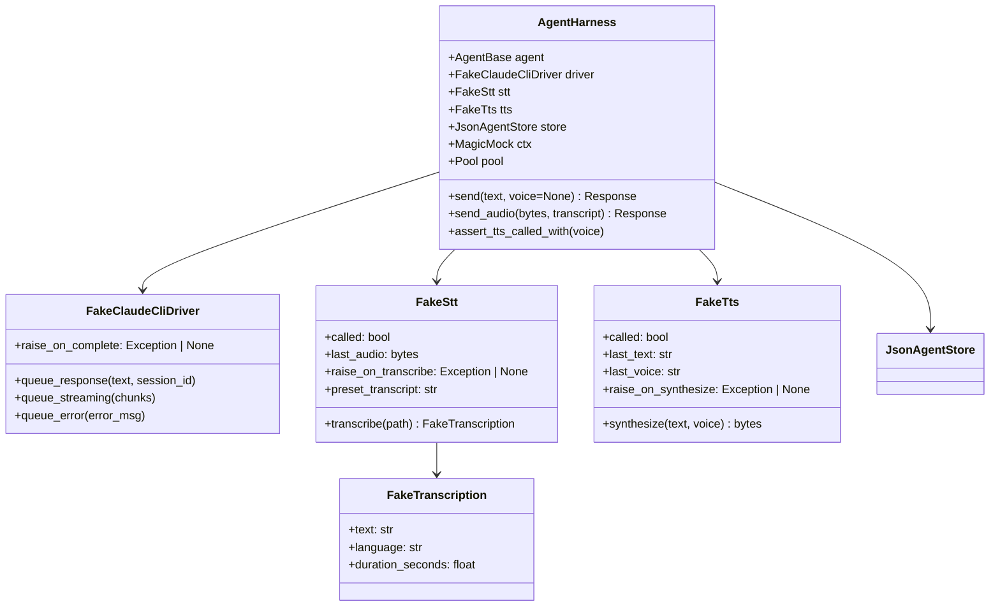
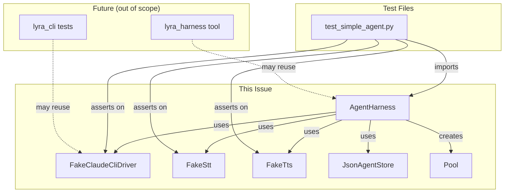

## Context

Promoted from [frame](../frames/851-agent-integration-test-harness-frame.mdx). SimpleAgent has 0% test coverage due to high-ceremony setup. This spec defines a reusable harness that wires Hub + Pool + LlmProvider + STT/TTS mocks in one ergonomic async context manager.

## Goal

A test harness that lets developers write agent integration tests in <10 lines, with deterministic LLM responses and full audio path coverage.

## Users

- **Primary:** Lyra developers — need fast, reliable agent tests
- **Secondary:** Future lyra_harness consumers (external integrators)

## Expected Behavior

```python
# MINIMAL_TOML is a fixture/constant providing a minimal Agent TOML config
MINIMAL_TOML = """
[agent]
name = "test"
system_prompt = "You are a test agent."

[model]
backend = "claude-cli"
model = "claude-sonnet-4-6"
"""

async with agent_harness(SimpleAgent, toml=MINIMAL_TOML) as h:
    # Text path
    h.driver.queue_response("Hello back!", session_id="test-sess")
    resp = await h.send("hello")
    assert resp.content == "Hello back!"

    # Audio/STT path
    resp = await h.send_audio(b"fake audio bytes", transcript="hello from audio")
    assert h.stt.called

    # TTS path
    resp = await h.send("speak this", voice="Sohee")
    h.assert_tts_called_with(voice="Sohee")

    # Error injection
    h.stt.raise_on_transcribe = STTUnavailableError("service down")
    resp = await h.send_audio(b"...")
    assert "could not transcribe" in resp.content.lower()
```

## Data Model & Consumers

### Data Structure



### Consumer Map



### Consumer Summary

| Consumer | Fields/Methods Consumed | When | Status |
|----------|------------------------|------|--------|
| `test_simple_agent.py` | `send`, `send_audio`, `assert_tts_called_with` | Test runtime | This issue |
| `test_simple_agent.py` | `driver.queue_response`, `driver.queue_error` | Test setup | This issue |
| `test_simple_agent.py` | `stt.raise_on_transcribe`, `tts.last_text` | Error injection | This issue |
| `lyra_harness` (#633) | Full harness API | Future | Out of scope |
| `lyra_cli` tests (#628) | `FakeClaudeCliDriver` | Future | Out of scope |

## Breadboard

### Affordance: Send Text Message

| ID | Element | Handler | Data |
|----|---------|---------|------|
| U1 | `h.send("hello")` | `Pool.submit` → `Agent.process` | `InboundMessage(text="hello")` |
| N1 | Pool → Agent | `SimpleAgent.process` | `PoolContext.get_agent` |
| N2 | Agent → Driver | `FakeClaudeCliDriver.complete` | `LlmRequest(text, config)` |
| S1 | Driver response | Returns queued `LlmResult` | `Response(content, metadata)` |

### Affordance: Send Audio (STT Path)

| ID | Element | Handler | Data |
|----|---------|---------|------|
| U2 | `h.send_audio(bytes, transcript="hi")` | Sets `h.stt.preset_transcript = "hi"` | — |
| N3a | Harness builds `InboundMessage` with audio attachment | `Pool.submit` | Audio bytes |
| N3b | Agent → STT | `FakeStt.transcribe` returns `FakeTranscription(text=preset_transcript)` | `"hi"` |
| N3c | STT → Agent | `build_llm_text` concatenates | `"Transcription: hi\n\nUser: "` |
| S2 | Agent response | Normal text path | `Response` |

### Affordance: TTS Synthesis

| ID | Element | Handler | Data |
|----|---------|---------|------|
| U3 | `h.send("speak", voice="Sohee")` | Sets response `speak=True`, voice config | — |
| N4 | Agent → TTS | `FakeTts.synthesize` | `text, voice="Sohee"` |
| S3 | TTS output | Records `last_text`, `last_voice` | `bytes (mock)` |
| Assert | `h.assert_tts_called_with(voice="Sohee")` | Checks `tts.called && tts.last_voice == voice` | — |

### Affordance: Error Injection

| ID | Element | Handler | Data |
|----|---------|---------|------|
| U4 | `h.stt.raise_on_transcribe = STTUnavailableError("down")` | Sets error trigger | — |
| N5 | `h.send_audio(bytes)` → STT | `FakeStt.transcribe` raises | `STTUnavailableError` |
| N6 | Agent catches | `SimpleAgent.process` → `except STTError` | Returns error `Response` |
| S4 | Error response | `Response(content="could not transcribe")` | — |

## Slices

| Slice | Scope | Demo | Depends on |
|-------|-------|------|------------|
| S1: Fake drivers | `FakeClaudeCliDriver`, `FakeTts`, enhance `FakeStt` | `driver.queue_response("hi")` → `result = await driver.complete(pool_id, text, model_cfg, system_prompt)` | — |
| S2: Harness core | `AgentHarness.__aenter__`, `__aexit__`, `send()`, `ctx_mock` wiring | Single text turn test passes | S1 |
| S3: Audio path | `send_audio()`, STT wiring, `preset_transcript` | Audio → transcript → response | S1, S2 |
| S4: TTS path | `expect_tts=True`, `assert_tts_called_with()` | TTS assertions pass | S1, S2 |
| S5: Error injection | `raise_on_*` attributes | STT error → graceful response | S1, S3, S4 |
| S6: SimpleAgent suite | 8+ test cases in `test_simple_agent.py` | Full coverage demo | S1–S5 |

## Success Criteria

- [ ] `FakeClaudeCliDriver` class exists with `queue_response`, `queue_error`, `complete`, `stream` methods
- [ ] `FakeTts` class exists with `synthesize`, `called`, `last_text`, `last_voice` attributes
- [ ] `FakeStt` enhanced with `raise_on_transcribe`, `preset_transcript` attributes
- [ ] `agent_harness()` async context manager exists
- [ ] `h.send(text)` returns `Response` with `content` matching queued driver response
- [ ] `h.send_audio(bytes, transcript)` sets `h.stt.preset_transcript`, triggers STT path (`h.stt.called == True`), returns `Response`
- [ ] `h.send(text, voice="Sohee")` triggers TTS synthesis (`h.tts.called == True`)
- [ ] `h.assert_tts_called_with(voice="Sohee")` passes when TTS was called with that voice
- [ ] Error injection via `h.stt.raise_on_transcribe = Error` returns error `Response`
- [ ] `tests/agents/test_simple_agent.py` exists with ≥8 test cases
- [ ] `pytest tests/agents/test_simple_agent.py` passes with 100% of tests green in <5s
- [ ] Harness reuses existing fixtures: `json_agent_store`, `_make_ctx_mock()` pattern
- [ ] Basic text turn test case is <10 lines including setup (ergonomics goal)
