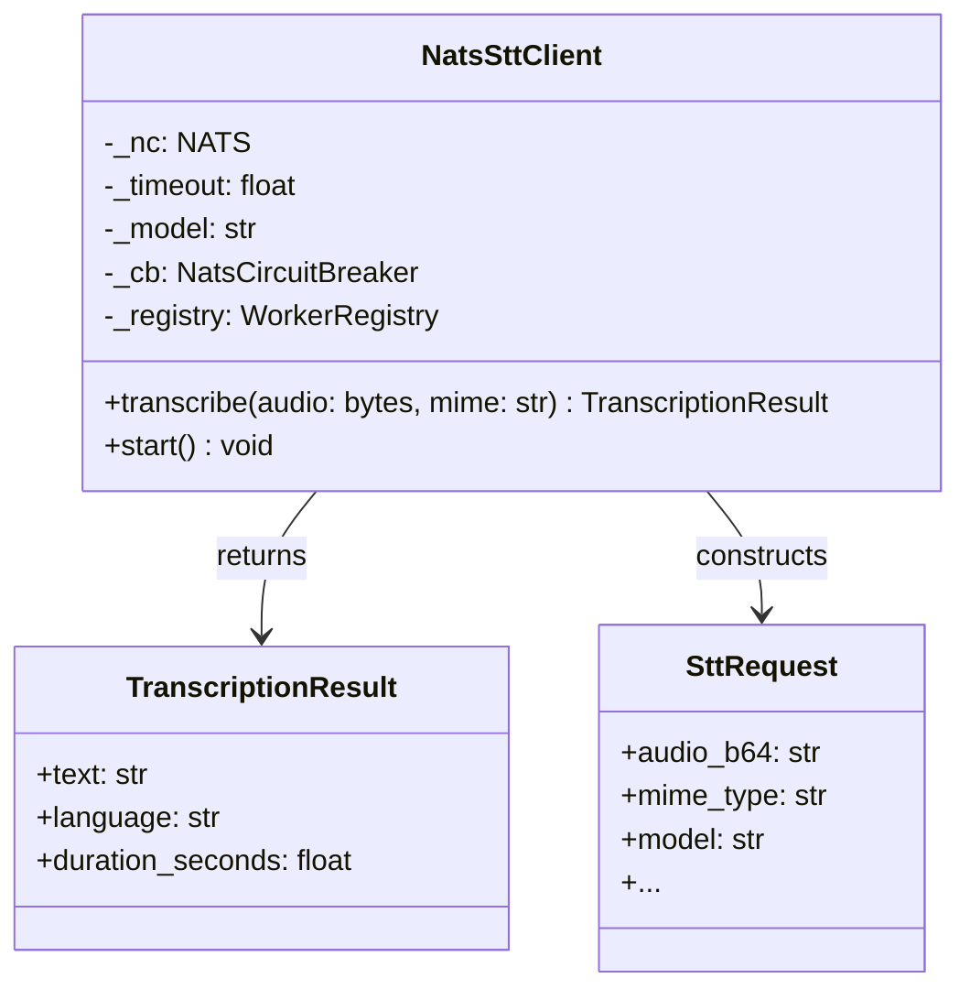
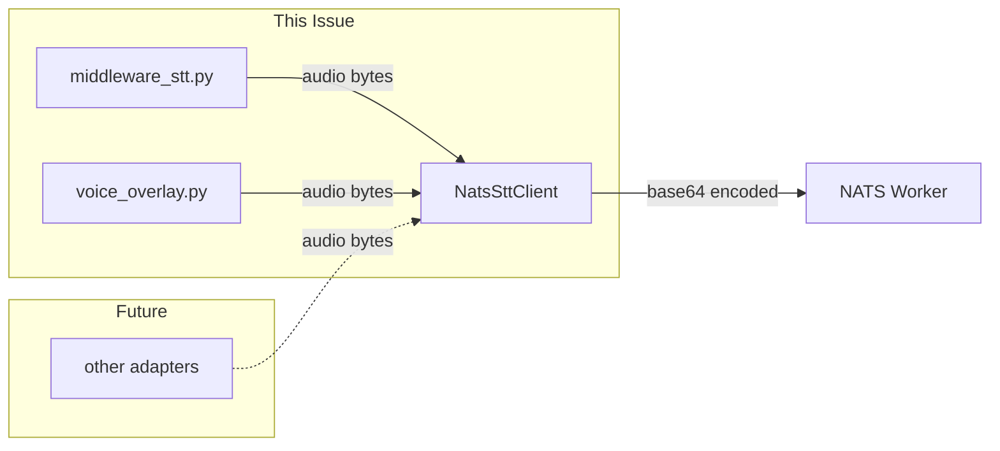

## Context

Promoted from frame `852-transcribe-bytes-signature-frame.mdx`. Security-driven refactor to eliminate path-traversal surface in `NatsSttClient.transcribe()` by accepting bytes directly instead of a file path.

## Goal

Replace `transcribe(path: Path | str)` with `transcribe(audio: bytes, mime: str)` so callers pass audio bytes directly, eliminating the path-traversal surface and tempfile overhead.

## Users

- **Primary:** Hub developers — simpler calling code, no tempfile dance
- **Secondary:** Security auditors — path-traversal surface eliminated

## Expected Behavior

1. Caller has audio bytes in memory (from Telegram voice note, etc.)
2. Caller invokes `await stt_client.transcribe(audio_bytes, "audio/ogg")`
3. Client base64-encodes bytes, sends to NATS worker
4. Worker returns transcription, client returns `TranscriptionResult`
5. No file I/O, no path resolution, no tempfile cleanup

## Data Model & Consumers

### Data Structure



### Consumer Map



### Consumer Summary

| Consumer | Fields Used | When | Status |
|----------|-------------|------|--------|
| middleware_stt.py | `transcribe(bytes, mime)` | Voice note processing | This issue |
| voice_overlay.py | `transcribe(bytes, mime)` | Voice overlay flow | This issue |
| Other adapters | `transcribe(bytes, mime)` | Future integrations | Future |

## Breadboard

### Affordance Table

| ID | Element | Handler | Data |
|----|---------|---------|------|
| U1 | Caller has audio bytes | — | `bytes`, `mime: str` |
| N1 | `NatsSttClient.transcribe()` | `_walk_registry()` | `SttRequest` |
| N2 | NATS request | Worker via `per_worker_stt()` | `payload: bytes` |
| S1 | `TranscriptionResult` | Caller | `text`, `language`, `duration_seconds` |

### Wiring

```
U1 (bytes, mime) → N1 (transcribe) → N2 (NATS) → S1 (result)
```

## Slices

| Slice | Scope | Demo | Acceptance |
|-------|-------|------|------------|
| S1 | SDK signature change | `client.transcribe(b"...", "audio/ogg")` compiles | Type checker passes |
| S2 | Caller updates | End-to-end voice note transcription works | Integration test passes |

## Success Criteria

- [ ] `NatsSttClient.transcribe()` signature is `async def transcribe(self, audio: bytes, mime: str) -> TranscriptionResult`
- [ ] `_mime_from_suffix()` function removed (mime now caller-provided)
- [ ] `Path` import removed from `nats_stt_client.py`
- [ ] `middleware_stt.py` passes bytes directly (no tempfile)
- [ ] All callers updated in same PR
- [ ] Existing tests pass
- [ ] Type checker passes (`uv run pyright`)
- [ ] No `Path` references in `nats_stt_client.py`
