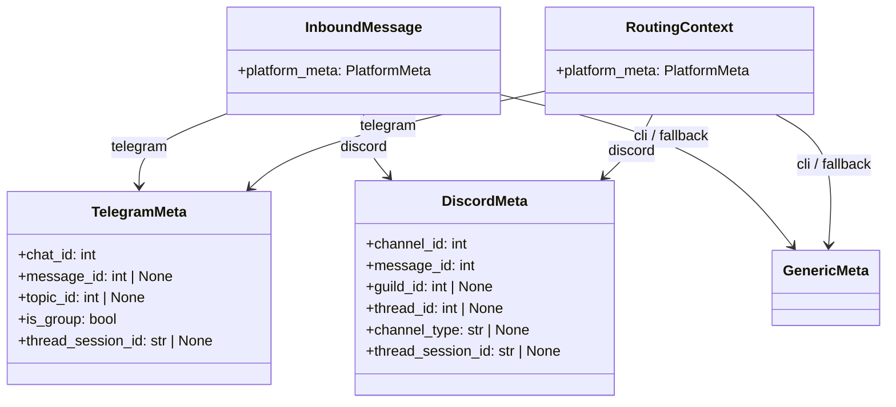
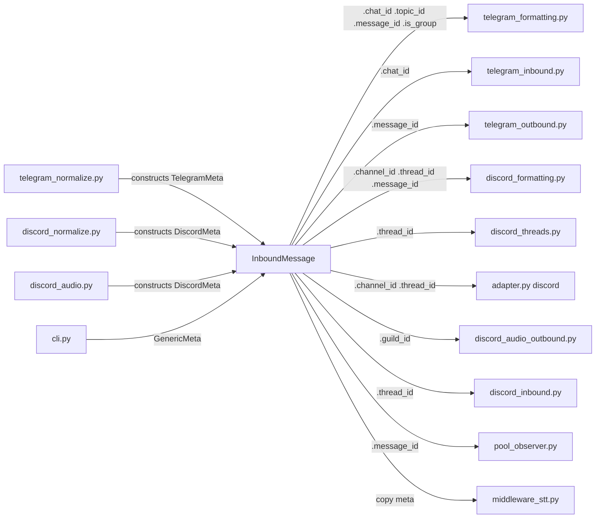
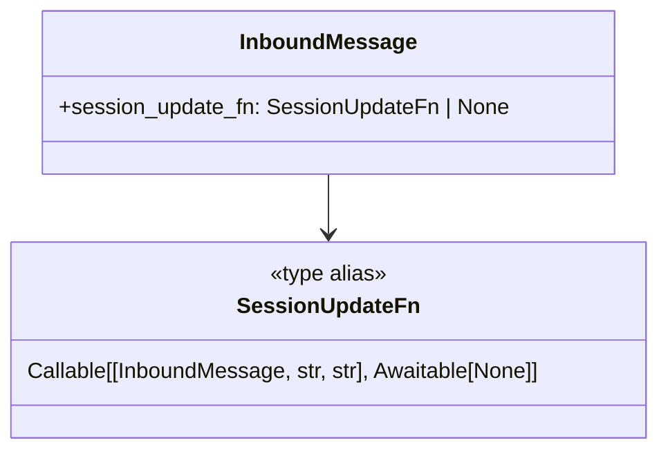
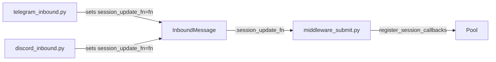

## Context

Derived from frame #853. `InboundMessage.platform_meta: dict` currently mixes two
unrelated concerns: serializable routing data (chat IDs, message IDs) and a per-message
callable (`_session_update_fn`) injected by adapters for session persistence.

This spec defines the typed replacements and the two-slice migration path.

Related: #525 (NATS boundary sanitization — sanitizes platform_meta from untrusted NATS
payloads; this issue types the field itself so the type checker prevents future misuse).

## Goal

Replace `platform_meta: dict[str, Any]` on `InboundMessage` and `RoutingContext` with:
1. A typed `PlatformMeta` union (`TelegramMeta | DiscordMeta | GenericMeta`) for data fields.
2. A dedicated typed field `session_update_fn: SessionUpdateFn | None` on `InboundMessage`
   for the session persistence callable — removed from the dict entirely.

Zero behavior change. Pyright clean on all affected files after migration.

## Users

- **Primary:** Core developers — type-safe access to platform metadata without `.get("key")` guessing.
- **Secondary:** Future adapters — typed union makes the contract explicit and prevents
  new adapters from accidentally adding untyped keys.

## Expected Behavior

Before: `chat_id = msg.platform_meta.get("chat_id")` → returns `Any`, type checker blind.
After: `chat_id = msg.platform_meta.chat_id` (for `TelegramMeta`) → returns `int`, fully typed.

Before: `_session_update_fn` injected as `TrustedCallback` into `platform_meta` dict.
After: `msg.session_update_fn` is a typed `SessionUpdateFn | None` field set by adapters
at normalization time. `TrustedCallback` wrapper no longer needed for this path (typed
field is the trust mechanism). `middleware_submit.py` reads `msg.session_update_fn`
directly instead of `unwrap_callback(msg.platform_meta, "_session_update_fn")`.

NATS serialization: the `roxabi-nats` serializer already strips callables from `dict`
fields. After this change, the serializer must also skip callable-typed dataclass fields.
One-line addition to `_encode` in `_serialize.py`. After NATS round-trip,
`session_update_fn=None` — consistent with current behavior (callables are already
stripped today).

## Data Model & Consumers

### Slice 1 — Typed PlatformMeta





**Consumer summary — Slice 1:**

| Consumer | Fields accessed | Status |
|----------|----------------|--------|
| `telegram_formatting.py` | `chat_id`, `topic_id`, `message_id` | This issue |
| `telegram_inbound.py` | `chat_id`, `is_group` | This issue |
| `telegram_outbound.py` | `message_id` | This issue |
| `discord_formatting.py` | `channel_id`, `thread_id`, `message_id` | This issue |
| `discord_threads.py` | `thread_id` | This issue |
| `adapter.py` (discord) | `channel_id`, `thread_id` | This issue |
| `discord_audio_outbound.py` | `guild_id` | This issue |
| `discord_inbound.py` | `thread_id` | This issue |
| `pool_observer.py` | `message_id` | This issue |
| `path_validation.py` | `thread_session_id` | This issue |
| `middleware_stt.py` | full copy via `dict(msg.platform_meta)` | This issue (copy → replace) |
| `nats_bus.py` | `sanitize_platform_meta` call — remove (redundant after typed union) | This issue |

### Slice 2 — Typed session_update_fn





**Consumer summary — Slice 2:**

| Consumer | Action | Status |
|----------|--------|--------|
| `telegram_inbound.py` | Sets `session_update_fn=_tg_session_update_fn` | This issue |
| `discord_inbound.py` | Sets `session_update_fn=_dm/_thread_session_update_fn` | This issue |
| `middleware_submit.py` | Reads `msg.session_update_fn`, registers on pool | This issue |
| `_serialize.py` (roxabi-nats) | Skip callable fields in dataclass `_encode` | This issue |
| `callbacks.py` | `TrustedCallback` wrapping removed for this path | This issue |

## Breadboard

### Affordances

| ID | Element | Handler | Data |
|----|---------|---------|------|
| U1 | `TelegramMeta` dataclass | `telegram_normalize._build_routing()` | `chat_id`, `topic_id`, `message_id`, `is_group` |
| U2 | `DiscordMeta` dataclass | `discord_normalize.normalize()`, `discord_audio._normalize_audio_message()` — constructs both `InboundMessage.platform_meta` and `RoutingContext.platform_meta` | `guild_id`, `channel_id`, `message_id`, `thread_id`, `channel_type` |
| U3 | `GenericMeta` dataclass | `cli.py` zero-value | — |
| N1 | `PlatformMeta` union type | `message.py` | `TelegramMeta \| DiscordMeta \| GenericMeta` |
| N2 | `SessionUpdateFn` type alias | `message.py` | `Callable[[InboundMessage, str, str], Awaitable[None]]` |
| N3 | `InboundMessage.session_update_fn` | adapters set at inbound time | `SessionUpdateFn \| None` |
| S1 | Read `platform_meta.chat_id` | `telegram_formatting.py`, `telegram_inbound.py` | was `.get("chat_id")` |
| S2 | Read `platform_meta.message_id` | all outbound + observer | was `.get("message_id")` |
| S3 | Read `platform_meta.channel_id` | `discord_formatting.py`, `adapter.py` | was `.get("channel_id")` |
| S4 | Copy platform_meta for STT | `middleware_stt.py` | was `dict(msg.platform_meta)` → identity copy via typed field (no conversion needed) |
| S5 | Extract session callback | `middleware_submit.py` | was `unwrap_callback(msg.platform_meta, "_session_update_fn")` |
| S6 | Serialize InboundMessage | `roxabi-nats/_serialize.py` | skip callable fields in dataclass `_encode` |
| S7 | NATS receive path | `nats_bus.py` | remove `sanitize_platform_meta` call — typed union enforces allowlist; dict-based sanitization no longer applicable |
| S8 | Read `platform_meta.thread_session_id` | `path_validation.py` | was `.get("thread_session_id")` |

### Wiring

```
telegram_normalize  →  TelegramMeta(chat_id=…) → InboundMessage(platform_meta=TelegramMeta)
telegram_inbound    →  dataclasses.replace(hub_msg, session_update_fn=_fn, platform_meta=dataclasses.replace(hub_msg.platform_meta, thread_session_id=…))
discord_normalize   →  DiscordMeta(channel_id=…) → InboundMessage(platform_meta=DiscordMeta)
discord_inbound     →  dataclasses.replace(hub_msg, session_update_fn=_fn, platform_meta=dataclasses.replace(hub_msg.platform_meta, thread_session_id=…))
cli.py              →  InboundMessage(platform_meta=GenericMeta())

middleware_submit   →  pool.register_session_callbacks(update_fn=msg.session_update_fn)
pool_observer       →  msg.platform_meta.message_id  (typed access)
middleware_stt      →  dataclasses.replace(msg, platform_meta=msg.platform_meta)  (identity copy, no more dict())
```

## Slices

| Slice | Scope | Deliverable | Independently demoable? |
|-------|-------|-------------|------------------------|
| 1 | Define `TelegramMeta`, `DiscordMeta`, `GenericMeta`, `PlatformMeta` in `message.py`; update `InboundMessage` + `RoutingContext` field types; migrate all construction sites (normalize + audio files, both `InboundMessage` and `RoutingContext`); migrate all read sites (formatting, inbound, outbound, path_validation, observer); fix `middleware_stt.py` copy; remove `sanitize_platform_meta` call from `nats_bus.py` (redundant with typed union) | Pyright clean on all adapter + middleware files; all `.platform_meta.get()` calls gone across the entire codebase | Yes — passes all tests, adapters work |
| 2 | Add `SessionUpdateFn` alias + `InboundMessage.session_update_fn` field; update `telegram_inbound.py` + `discord_inbound.py` to set typed field; update `middleware_submit.py` to read typed field; update `_serialize.py` in `roxabi-nats` (separate package — requires coordinated version bump) to skip callable-valued dataclass fields; remove `TrustedCallback` wrapping from this path | Pyright clean on middleware + adapters; `_session_update_fn` gone from platform_meta | Yes — session persistence continues to work in unified mode |

## Success Criteria

- [ ] `InboundMessage.platform_meta` and `RoutingContext.platform_meta` are typed as `PlatformMeta` (not `dict`)
- [ ] `TelegramMeta`, `DiscordMeta`, `GenericMeta` are frozen dataclasses in `core/messaging/message.py`
- [ ] All `.platform_meta.get("key")` call sites replaced with typed attribute access across the entire codebase
- [ ] `platform_meta: dict[str, Any]` literal no longer appears in any source file
- [ ] `_session_update_fn` key no longer appears in any `platform_meta` dict
- [ ] `InboundMessage.session_update_fn: SessionUpdateFn | None` field exists and is set by both adapters
- [ ] `middleware_submit.py` reads `msg.session_update_fn` (no `unwrap_callback` on `platform_meta`)
- [ ] `roxabi-nats/_serialize.py` skips callable-valued fields when encoding dataclasses (note: `roxabi-nats` is a separate package — requires coordinated version bump alongside lyra changes)
- [ ] `nats_bus.py` `sanitize_platform_meta` call removed (typed union enforces the allowlist)
- [ ] `middleware_stt.py` no longer calls `dict(msg.platform_meta)` — platform_meta propagated as typed value
- [ ] `uv run pyright` reports zero new errors on all files touched by this refactor
- [ ] `uv run pytest` passes (all existing tests)
- [ ] `cli.py` uses `platform_meta=GenericMeta()` (not empty dict)
