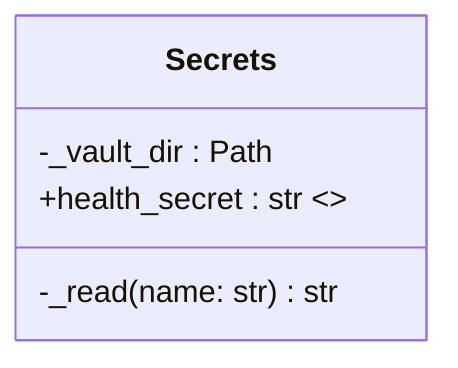

## Context

Derived from frame `artifacts/frames/854-typed-secrets-registry-frame.mdx`.  
Security audit §P0 #4 flagged `_read_secret(name: str)` in
`src/lyra/bootstrap/infra/health.py` as a latent path-traversal surface.
Single callsite today: `_read_secret("health_secret")` at line 77.

## Goal

Replace the stringly-typed `_read_secret(name: str)` with a `Secrets` class
whose properties enumerate known secrets at the type level — making path
traversal structurally impossible.

## Users

- **Bootstrap maintainers** — adding a new secret requires a new property, not
  a new string literal; the compiler rejects unknown names.
- **Security auditors** — the complete secret set is enumerable from the class
  definition; no codebase grep required.

## Expected Behavior

1. A `Secrets` class is defined in `src/lyra/bootstrap/infra/health.py`.
2. The class reads `$LYRA_VAULT_DIR/secrets/` exactly as `_read_secret` does:
   same `LYRA_VAULT_DIR` resolution, same silent-empty-string fallback on
   `FileNotFoundError`, same `log.warning` on other `OSError`.
3. `Secrets.health_secret` (a `@cached_property`) returns the contents of
   `secrets/health_secret` stripped of leading/trailing whitespace — no
   string argument at the call site. `_read` is a private helper; it is
   not a public surface.
4. `create_health_app` gains an optional keyword parameter
   `secrets: Secrets | None = None` (backward-compatible). It constructs
   `Secrets()` internally when not supplied, and calls `.health_secret`
   instead of `_read_secret("health_secret")`.
5. `_read_secret` is deleted; no module-level function with a free `name`
   parameter remains.
6. All callers (currently one) continue to work without config changes.
7. **Known trade-off:** `@cached_property` caches the secret value for the
   process lifetime. A secret file rotated on disk is not picked up until
   the process restarts — identical to the current behaviour where the value
   is read once and stored in the closure. Acceptable for the stated goal.

## Data Model & Consumers

| Consumer | Fields consumed | When | Status |
|---|---|---|---|
| `create_health_app` | `health_secret` | `/health/detail` request | this issue |
| Future adapters | `telegram_token`, `discord_token` (not yet) | Lane H | future |

## Breadboard

| Affordance | Handler | Data |
|---|---|---|
| `Secrets.__init__` | resolve `LYRA_VAULT_DIR` → `self._vault_dir` | `Path` |
| `Secrets._read(name)` | open `_vault_dir/secrets/{name}`, handle `FileNotFoundError`/`OSError` | `str` |
| `Secrets.health_secret` | `cached_property` → `self._read("health_secret")` | `str` |
| `create_health_app(…, secrets?)` | `_secrets = secrets or Secrets()` | `Secrets` |
| `/health/detail` handler | `_secrets.health_secret` (replaces `_read_secret("health_secret")`) | `str` |

## Slices

| # | Slice | Description | Criteria |
|---|---|---|---|
| 1 | Secrets class + wire | Define `Secrets` in `health.py`, add `secrets: Secrets \| None = None` param to `create_health_app`, delete `_read_secret`, migrate test monkeypatches to inject `Secrets` instance | AC-1 through AC-7 |

## Success Criteria

- [ ] AC-1: `Secrets` class exists in `src/lyra/bootstrap/infra/health.py` with a `health_secret: str` cached property.
- [ ] AC-2: `Secrets._read(name)` preserves the exact fallback semantics of the deleted `_read_secret`: content stripped of leading/trailing whitespace on success, empty string on `FileNotFoundError`, `log.warning` + empty string on other `OSError`.
- [ ] AC-3: `Secrets.__init__` resolves `LYRA_VAULT_DIR` identically to `_read_secret` (same env var, same `~/.lyra` default, `.resolve()` call).
- [ ] AC-4: `create_health_app` no longer calls `_read_secret`; it uses `Secrets().health_secret` (or an injected `Secrets` instance).
- [ ] AC-5: `_read_secret` function is deleted; `grep -r '_read_secret' src/` returns no matches.
- [ ] AC-6: `uv run pyright` reports 0 errors after the change.
- [ ] AC-7: `uv run pytest` exits 0 after the change; test fixtures that previously monkeypatched `_read_secret` now inject a `Secrets` instance via the optional `secrets` parameter on `create_health_app`; `test_read_secret.py` is migrated to test `Secrets` directly.
