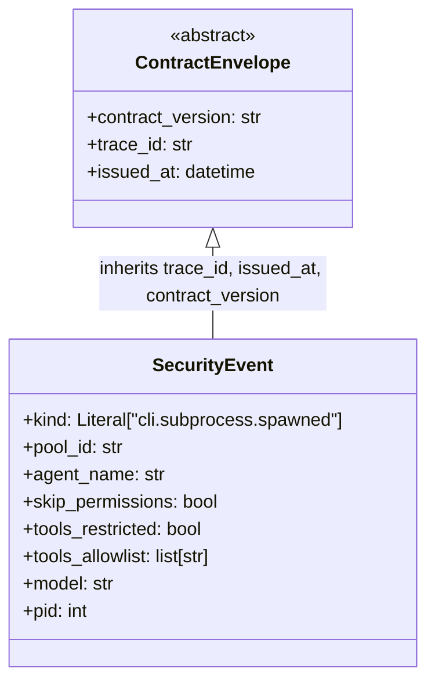

## Context

Promoted from `artifacts/analyses/855-security-event-stream-cli-spawn-audit-analysis.mdx`.
Quality audit §P0 #5 (2026-04-22). Parent: M3 observability epic #667.

Shape A selected: **JetStream durable stream** — `SecurityEvent(ContractEnvelope)`
in `roxabi-contracts/audit/` → `JetStreamAuditSink` in `lyra.infrastructure.audit`
→ `LYRA_AUDIT` JetStream stream → `lyra.audit.security` subject.

**Architecture corrections from spec review:**
- `AuditSink` protocol lives in `lyra.core.cli` (not `lyra.infrastructure`) so
  `CliPool` can import it without a layer violation
- `agent_name` ContextVar is set per-turn from within `guarded_process_one`
  in `pool_processor_exec.py` (not `middleware_pool.py`) — this is the only
  reliable site that runs inside the pool's `asyncio.Task`, making the ContextVar
  visible to `_spawn()` on both first and subsequent turns

## Goal

Every CLI subprocess spawn emits a structured `SecurityEvent` to a durable
JetStream stream so that operators can answer "who ran unrestricted, when, and
under what trace" after the fact — independent of log rotation.

## Users

- **Primary:** Operators running Lyra in production multi-agent deployments who
  need post-hoc accountability for unrestricted agent spawns.
- **Secondary:** Future SIEM/alerting consumers subscribing to `lyra.audit.>`.

## Expected Behavior

**Per-turn context wiring:** At the start of each turn, `guarded_process_one`
in `pool_processor_exec.py` sets `TraceContext.agent_name(pool.agent_name)` inside
a `try/finally` block, resetting on turn exit. This runs inside the pool's
`asyncio.Task` — the ContextVar is therefore visible to all code called
synchronously within the same task during that turn (including `_spawn()`).

**Spawn emission:** `CliPoolWorkerMixin._spawn()` constructs a `SecurityEvent`
immediately after the 100ms liveness gate passes (process confirmed alive). It
reads `pool_id` from the `pool_id` parameter, `model_config` fields, `proc.pid`,
`TraceContext.get_agent_name()`, and `TraceContext.get_trace_id()`. If a
`JetStreamAuditSink` was injected into `CliPool`, it creates
`asyncio.create_task(sink.emit(event))`, stores the task in
`CliPool._audit_tasks: set[asyncio.Task]`, and registers a done-callback that
calls `self._audit_tasks.discard(task)`. `_spawn()` does not await the task.
If no sink was injected (`audit_sink=None`), the emit path is a no-op.

**Emit safety:** `JetStreamAuditSink.emit()` wraps the entire publish in
`try/except Exception`. On failure it logs at `WARNING` with the serialised event
JSON as the message — allowing log-shippers to parse the event from the fallback
log. The function never raises.

**JetStream fallback (degraded mode):** If `provision()` detects JetStream is
unavailable (nats-server has no `jetstream {}` block), it logs
`WARNING: AUDIT: JetStream not available — emitting to lyra.security logger`
and marks the sink as degraded. In degraded mode, `emit()` logs the event JSON
to `lyra.security` at `WARNING` level instead of publishing to JetStream.
Bootstrap does not fail.

**Stream provisioning:** At bootstrap startup, after the NATS connection is
established, `JetStreamAuditSink.provision(nc)` calls `js.add_stream(StreamConfig(
name="LYRA_AUDIT", subjects=["lyra.audit.>"], retention=LIMITS, storage=FILE,
max_age=90×86400s, max_bytes=1GiB, duplicate_window=60s))`. On
`BadRequestError` (stream exists), it calls `js.update_stream()` with the same
config. On config mismatch it logs `WARNING` and continues.

**Injection:** `build_cli_pool` in `hub_builder.py` accepts an optional
`audit_sink: AuditSink | None = None` kwarg and passes it to `CliPool`. Both
bootstrap entry points (`hub_standalone.py`, `bootstrap_lifecycle.py`) provision
the stream then inject the sink.

## Data Model & Consumers



`tools_restricted=False` + `tools_allowlist=[]` → agent ran with all tools
available. `tools_restricted=True` → `tools_allowlist` contains the configured
allowlist. Always read `tools_restricted` to determine restriction status —
never infer from empty list alone.

```mermaid
flowchart LR
    Spawn["_spawn()\ncli_pool_worker.py\n(post liveness gate)"] -->|constructs| SE["SecurityEvent"]
    SE -->|emit()| Sink["JetStreamAuditSink\nlyra.infrastructure.audit"]
    Sink -->|js.publish — connected| JS["NATS JetStream\nLYRA_AUDIT stream\nlyra.audit.security"]
    Sink -->|log JSON — degraded| Log["lyra.security logger\nWARNING level"]
    JS -.->|future| SIEM["SIEM / alerting"]
    JS -.->|future| CLI["lyra audit query CLI"]
    JS -.->|future| Dash["compliance dashboard"]
```

| Consumer | Fields used | When | Status |
|----------|-------------|------|--------|
| `JetStreamAuditSink.emit()` | all | at spawn | this issue |
| `lyra.security` logger (degraded) | all (as JSON) | JetStream unavailable | this issue |
| SIEM / alerting | `skip_permissions`, `agent_name`, `trace_id` | on event | future |
| `lyra audit query` CLI | all | on demand | future |
| Compliance dashboard | `agent_name`, `skip_permissions`, `issued_at` | reporting | future |

## Breadboard

### Nodes

| ID | Component | Location | Role |
|----|-----------|----------|------|
| N1 | `SecurityEvent` | `roxabi-contracts/audit/` | Pydantic schema |
| N2 | `TraceContext._agent_name` | `lyra.core.trace` | ContextVar |
| N3 | `AuditSink` | `lyra.core.cli` | protocol (imported by `CliPool`) |
| N4 | `JetStreamAuditSink` | `lyra.infrastructure.audit` | concrete sink (implements N3) |
| N5 | `CliPool._audit_tasks` | `lyra.core.cli.cli_pool` | task anchor set |
| N6 | `JetStreamAuditSink.provision()` | `lyra.infrastructure.audit` | stream setup |

### Wiring

| Source | → Target | Trigger | Data |
|--------|----------|---------|------|
| `guarded_process_one` (pool_processor_exec.py) | N2 set | start of each turn, inside pool task | `pool.agent_name` |
| `guarded_process_one` finally | N2 reset | end of each turn | token |
| `_spawn()` post-liveness-gate | N1 construct | subprocess confirmed alive | `pool_id`, N2, `trace_id`, `model_config`, `proc.pid` |
| `_spawn()` | N4.emit(N1) | after N1 construct | `SecurityEvent` instance |
| N4.emit() | N5 add | task created | `asyncio.Task` |
| N4.emit() task done | N5 discard | done-callback fires | task reference |
| N4.emit() | JetStream publish | connected mode | serialised JSON |
| N4.emit() | `lyra.security` WARNING | degraded mode | same JSON string |
| Bootstrap | N6 | after NATS connect | `nc` |
| Bootstrap | `build_cli_pool(..., audit_sink=N4)` | after N6 | injected N3 |
| `CliPoolWorkerMixin` | N5 (TYPE_CHECKING stub) | attribute access in `_spawn` | `set[asyncio.Task]` |

## Slices

| # | Name | Deliverable | Demo signal |
|---|------|-------------|-------------|
| S1 | Schema + ContextVar | `SecurityEvent` validates; `TraceContext.get/set/reset_agent_name()` works; `guarded_process_one` sets/resets it | Unit tests pass; `pyright` clean |
| S2 | Sink + CliPool wiring | `AuditSink` protocol; `JetStreamAuditSink.emit()` (mock JetStream); `CliPool._audit_tasks` anchor; `_spawn()` calls emit post-liveness-gate | Inject a sink whose `emit()` is frozen by `asyncio.Event`; spawn a process; assert task enters `_audit_tasks` before event releases; assert no exception when sink raises |
| S3 | JetStream provisioning + bootstrap | `provision()` creates/updates `LYRA_AUDIT`; both bootstrap entry points wire sink; live end-to-end | Run hub against local NATS with JetStream; subscribe to `lyra.audit.security`; trigger spawn; assert `SecurityEvent` received with correct fields |

## Success Criteria

### S1 — Schema + ContextVar

- [ ] `SecurityEvent` is a Pydantic model subclassing `ContractEnvelope`; all fields type-check under `pyright`
- [ ] `SecurityEvent` with `tools_restricted=False, tools_allowlist=[]` validates without error
- [ ] `SecurityEvent` with `tools_restricted=True, tools_allowlist=["Read","Bash"]` validates without error
- [ ] `TraceContext.get_agent_name()` returns `None` when not set and the correct string when set
- [ ] `TraceContext.reset_agent_name(token)` restores prior value correctly
- [ ] `guarded_process_one` sets `agent_name` ContextVar before calling `process_one` and resets it in `finally`

### S2 — Sink + CliPool wiring

- [ ] `AuditSink` protocol is importable from `lyra.core.cli` with no import-layer violation
- [ ] `JetStreamAuditSink.emit()` never raises — catching `RuntimeError` from a mock sink logs at `WARNING` and `_spawn()` returns the entry normally
- [ ] Emitted `SecurityEvent` has `pid` equal to `proc.pid` of the spawned process
- [ ] Emitted `SecurityEvent` has `trace_id` equal to the value set via `TraceContext.set_trace_id()` before the spawn
- [ ] A process that exits within the 100ms liveness gate does NOT emit a `SecurityEvent`
- [ ] When `CliPool` is constructed without `audit_sink`, `_spawn()` completes without error and `_audit_tasks` remains empty
- [ ] After a task in `_audit_tasks` completes, the done-callback removes it from the set (set does not grow unboundedly)

### S3 — JetStream provisioning + live emit

- [ ] `provision()` creates the `LYRA_AUDIT` stream when it does not exist
- [ ] `provision()` completes without error when the stream already exists with identical config
- [ ] `provision()` logs `WARNING` and does not raise when the stream exists with different `max_age`
- [ ] `provision()` marks the sink as degraded and does not raise when JetStream is entirely unavailable
- [ ] In degraded mode, `emit()` logs the `SecurityEvent` as a valid JSON string to `lyra.security` at `WARNING`
- [ ] Provisioned `LYRA_AUDIT` stream has `retention=LIMITS`, `storage=FILE`, `max_age=90d`, `max_bytes=1GiB`
- [ ] A spawn with `skip_permissions=True` emits `SecurityEvent.skip_permissions == True`
- [ ] A spawn with `skip_permissions=False` emits `SecurityEvent.skip_permissions == False` (field always present)
- [ ] A spawn with an explicit tools list emits `tools_restricted=True` and matching `tools_allowlist`
- [ ] A spawn with no tools configured emits `tools_restricted=False` and `tools_allowlist=[]`
