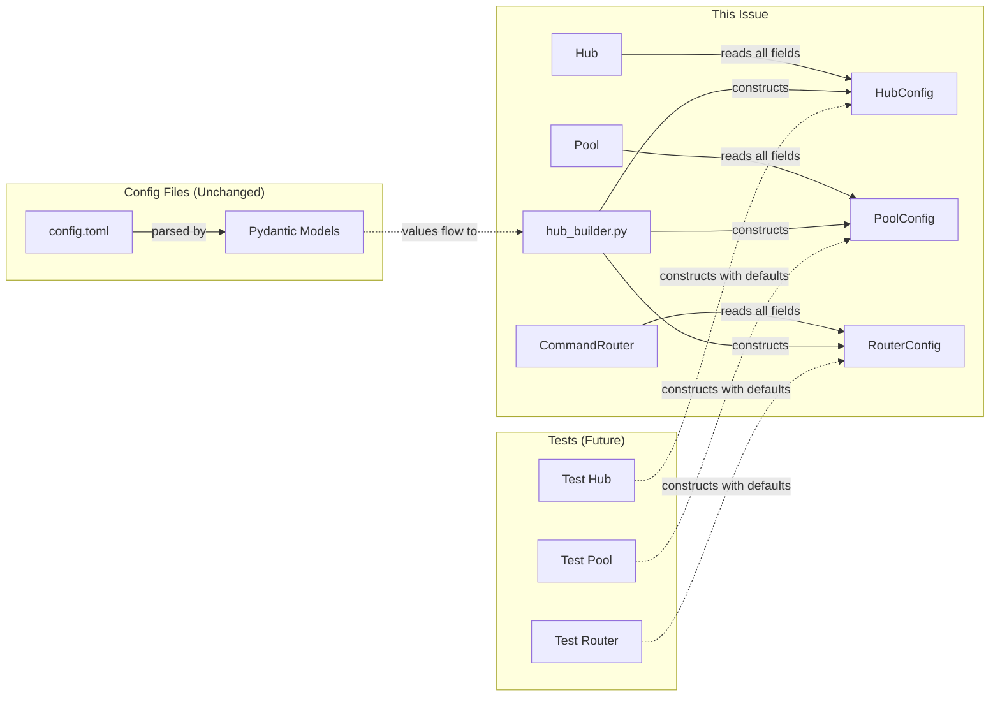

## Context

Promoted from frame `artifacts/frames/858-extract-config-dataclasses-frame.mdx`.

Three core constructors have parameter explosions blocking testability. This refactor groups scalar config values into frozen dataclasses, reducing each constructor to essential identity/dependency params plus a config object.

## Goal

Reduce Hub/Pool/CommandRouter constructor params from 13-21 to 3-5 essential params + config dataclass.

## Users

- **Primary:** Developers writing unit/integration tests — simpler constructor calls
- **Secondary:** Future maintainers — clearer separation of config vs dependencies

## Expected Behavior

```python
# Before (Hub)
Hub(
    rate_limit=20, rate_window=60, pool_ttl=604800, debounce_ms=0,
    cancel_on_new_message=False, turn_timeout=None, max_sdk_history=50,
    safe_dispatch_timeout=10.0, staging_maxsize=500, platform_queue_maxsize=100,
    queue_depth_threshold=100, max_merged_chars=4096,
    # + 8 dependencies (circuit_registry, msg_manager, etc.)
)  # 21 params

# After (Hub)
Hub(
    circuit_registry=...,
    msg_manager=...,
    config=HubConfig(
        rate_limit=20, rate_window=60, pool_ttl=604800, debounce_ms=0,
        cancel_on_new_message=False, turn_timeout=None, max_sdk_history=50,
        safe_dispatch_timeout=10.0, staging_maxsize=500, platform_queue_maxsize=100,
        queue_depth_threshold=100, max_merged_chars=4096,
    ),
    # + remaining dependencies (pairing_manager, stt, tts, prefs_store, event_bus, inbound_bus)
)  # ~8 params
```

Test code becomes:
```python
# Before
hub = Hub(rate_limit=20, rate_window=60, pool_ttl=..., [21 args])

# After
hub = Hub(config=HubConfig())  # defaults apply
```

## Data Model & Consumers

### Data Structure

```mermaid
classDiagram
    class HubConfig {
        <<frozen dataclass>>
        rate_limit: int = 20
        rate_window: int = 60
        pool_ttl: float = 604800.0
        debounce_ms: int = 0
        cancel_on_new_message: bool = False
        turn_timeout: float | None = None
        max_sdk_history: int = 50
        safe_dispatch_timeout: float = 10.0
        staging_maxsize: int = 500
        platform_queue_maxsize: int = 100
        queue_depth_threshold: int = 100
        max_merged_chars: int = 4096
    }

    class PoolConfig {
        <<frozen dataclass>>
        turn_timeout: float | None = None
        debounce_ms: int = 300
        turn_timeout_ceiling: float | None = None
        max_sdk_history: int = 50
        safe_dispatch_timeout: float = 10.0
        max_merged_chars: int = 4096
        cancel_on_new_message: bool = False
    }

    class RouterConfig {
        <<frozen dataclass>>
        builtins: dict = DEFAULT_BUILTINS
        workspaces: dict = {}
        patterns: dict = {}
        pattern_configs: dict = load_pattern_configs()
    }

    Hub --> HubConfig : config
    Pool --> PoolConfig : config
    CommandRouter --> RouterConfig : config
```

### Consumer Map



### Consumer Summary

| Consumer | Fields Consumed | When | Status |
|----------|-----------------|------|--------|
| `Hub.__init__` | all HubConfig fields | construction | this issue |
| `Pool.__init__` | all PoolConfig fields | construction | this issue |
| `CommandRouter.__init__` | all RouterConfig fields | construction | this issue |
| `hub_builder.py` | all config fields | bootstrap | this issue |
| Unit tests | config defaults | test setup | this issue |
| Pydantic config models | same field names | config parsing | unchanged |

## Breadboard

### Construction Sites

| ID | File | Current | After |
|----|------|---------|-------|
| U1 | `core/hub/hub.py:74-96` | 21 params | 8 params + HubConfig |
| U2 | `core/pool/pool.py:32` | 13 params | 3 params + PoolConfig |
| U3 | `core/commands/command_router.py:46` | 14 params | 7 params + RouterConfig |
| N1 | `core/hub/config.py` | — | new file: dataclasses |
| S1 | `bootstrap/factory/hub_builder.py` | direct args | config objects |

### Wiring

| From | To | How |
|------|-----|-----|
| N1 | U1 | `from lyra.core.hub.config import HubConfig` |
| N1 | U2 | `from lyra.core.hub.config import PoolConfig` |
| N1 | U3 | `from lyra.core.hub.config import RouterConfig` |
| S1 | N1 | `from lyra.core.hub.config import HubConfig, PoolConfig, RouterConfig` |

## Slices

| # | Slice | Files | Demo |
|---|-------|-------|------|
| 1 | **HubConfig extraction** | `core/hub/config.py`, `core/hub/hub.py`, `bootstrap/factory/hub_builder.py` | `Hub(config=HubConfig())` works |
| 2 | **PoolConfig extraction** | `core/hub/config.py`, `core/pool/pool.py`, `bootstrap/factory/hub_builder.py` | `Pool(..., config=PoolConfig())` works |
| 3 | **RouterConfig extraction** | `core/hub/config.py`, `core/commands/command_router.py`, `bootstrap/factory/hub_builder.py` | `CommandRouter(..., config=RouterConfig())` works |
| 4 | **Test updates** | `tests/` | Existing tests pass with new constructors |

## Success Criteria

- [ ] `HubConfig` frozen dataclass exists with all 12 config fields and correct defaults
- [ ] `PoolConfig` frozen dataclass exists with all 7 config fields and correct defaults
- [ ] `RouterConfig` frozen dataclass exists with all 4 config fields and correct defaults
- [ ] `Hub.__init__` has ≤10 params (config + essential dependencies)
- [ ] `Pool.__init__` has ≤5 params (pool_id, agent_name, ctx, config)
- [ ] `CommandRouter.__init__` has ≤8 params (loader, plugins, config + callbacks)
- [ ] `hub_builder.py` constructs config objects and passes to constructors
- [ ] All existing tests pass without behavior change
- [ ] `Hub(config=HubConfig())` creates a valid Hub instance with defaults
- [ ] No changes to external API surface (Hub/Pool/CommandRouter methods unchanged)
