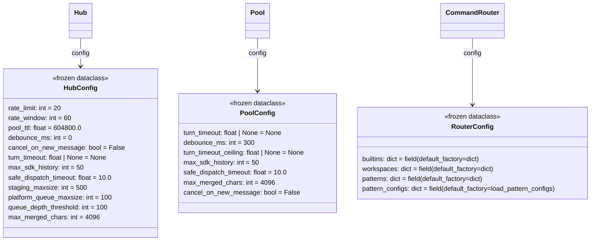
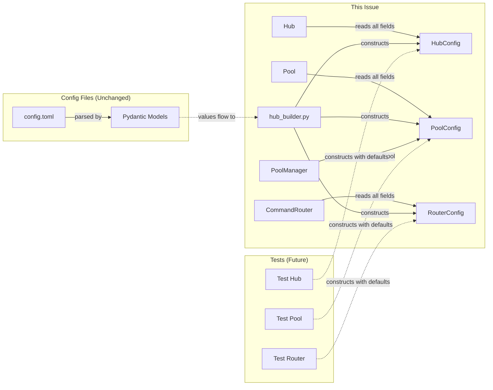

## Context

Promoted from frame `artifacts/frames/858-extract-config-dataclasses-frame.mdx`.

Three core constructors have parameter explosions blocking testability. This refactor groups scalar config values into frozen dataclasses, reducing each constructor to essential identity/dependency params plus a config object.

## Goal

Reduce Hub/Pool/CommandRouter constructor params to essential params (identity + dependencies) + config dataclass:
- Hub: ~8 params + HubConfig
- Pool: 3 params + PoolConfig (pool_id, agent_name, ctx)
- CommandRouter: ~7 params + RouterConfig (loader, plugins, callbacks)

## Users

- **Primary:** Developers writing unit/integration tests — simpler constructor calls
- **Secondary:** Future maintainers — clearer separation of config vs dependencies

## Constraints

- Frozen dataclasses required (immutability guarantee per architecture-patterns.md §3)
- No behavior change — only signature restructuring
- External API surface unchanged (Hub/Pool/CommandRouter methods stay identical)
- ~1 day effort
- Must unblock #851 (agent test harness)

## Out of Scope

- Migrating Pydantic config models (`bootstrap/factory/config.py`) to dataclasses
- Changing `config.toml` structure or section names
- Adding new config options — only grouping existing params
- Changing how `hub_builder.py` loads config from TOML

## Expected Behavior

```python
# Before (Hub)
Hub(
    rate_limit=20, rate_window=60, pool_ttl=604800, debounce_ms=0,
    cancel_on_new_message=False, turn_timeout=None, max_sdk_history=50,
    safe_dispatch_timeout=10.0, staging_maxsize=500, platform_queue_maxsize=100,
    queue_depth_threshold=100, max_merged_chars=4096,
    # + 8 dependencies (circuit_registry, msg_manager, etc.)
)  # 21 params

# After (Hub)
Hub(
    circuit_registry=...,
    msg_manager=...,
    pairing_manager=...,
    stt=...,
    tts=...,
    prefs_store=...,
    event_bus=...,
    inbound_bus=...,
    config=HubConfig(),  # defaults apply
)  # 9 params (8 deps + config)
```

Test code becomes:
```python
# Before
hub = Hub(rate_limit=20, rate_window=60, pool_ttl=..., [21 args])

# After
hub = Hub(config=HubConfig())  # defaults apply
```

## Edge Cases

| Case | Handling |
|------|----------|
| Caller passes both old params AND config | **Merge:** old params override config values (backward-compat path, deprecated) |
| config object is None | Use `HubConfig()` defaults — no None allowed |
| `RouterConfig.pattern_configs` lazy load | Use `field(default_factory=load_pattern_configs)` to avoid I/O at import time |

## Data Model & Consumers

### Data Structure



**Defaults source:** `core/hub/hub.py:65-72`, `core/pool/pool.py:32-43`, `core/commands/command_router.py:65-78`

### Consumer Map



### Consumer Summary

| Consumer | Fields Consumed | When | Status |
|----------|-----------------|------|--------|
| `Hub.__init__` | all HubConfig fields | construction | this issue |
| `Pool.__init__` | all PoolConfig fields | construction | this issue |
| `CommandRouter.__init__` | all RouterConfig fields | construction | this issue |
| `hub_builder.py` | all config fields | bootstrap | this issue |
| `PoolManager` | PoolConfig | pool creation | this issue |
| Unit tests | config defaults | test setup | this issue |
| Pydantic config models | same field names | config parsing | unchanged |

## Breadboard

### Construction Sites

| ID | File | Current | After |
|----|------|---------|-------|
| U1 | `core/hub/hub.py:74-96` | 21 params | 9 params + HubConfig |
| U2 | `core/pool/pool.py:32` | 13 params | 3 params + PoolConfig |
| U3 | `core/commands/command_router.py:46` | 14 params | 7 params + RouterConfig |
| N1 | `core/hub/config.py` | — | new file: dataclasses |
| S1 | `bootstrap/factory/hub_builder.py` | direct args | config objects |
| S2 | `core/hub/pool_manager.py` | direct args | PoolConfig from Hub |

### Verification sites

| ID | File | Verifies |
|----|------|----------|
| V1 | `tests/unit/test_hub.py` | Hub(config=HubConfig()) works |
| V2 | `tests/unit/test_pool.py` | Pool(..., config=PoolConfig()) works |
| V3 | `tests/unit/test_command_router.py` | CommandRouter(..., config=RouterConfig()) works |
| V4 | `tests/` (all) | Existing tests pass |

### Wiring

| ID | From | To | How |
|----|------|-----|-----|
| W1 | N1 | U1 | `from lyra.core.hub.config import HubConfig` |
| W2 | N1 | U2 | `from lyra.core.hub.config import PoolConfig` |
| W3 | N1 | U3 | `from lyra.core.hub.config import RouterConfig` |
| W4 | S1 | N1 | `from lyra.core.hub.config import HubConfig, PoolConfig, RouterConfig` |
| W5 | S2 | N1 | `from lyra.core.hub.config import PoolConfig` |

## Slices

| # | Slice | Files | Demo |
|---|-------|-------|------|
| 1 | **HubConfig extraction** | `core/hub/config.py`, `core/hub/hub.py`, `core/hub/__init__.py`, `bootstrap/factory/hub_builder.py` | `Hub(config=HubConfig())` works |
| 2 | **PoolConfig extraction** | `core/hub/config.py`, `core/pool/pool.py`, `core/hub/pool_manager.py`, `bootstrap/factory/hub_builder.py` | `Pool(..., config=PoolConfig())` works |
| 3 | **RouterConfig extraction** | `core/hub/config.py`, `core/commands/command_router.py`, `bootstrap/factory/hub_builder.py` | `CommandRouter(..., config=RouterConfig())` works |
| 4 | **Test updates** | `tests/` | Existing tests pass with new constructors |

**Note:** Slices 1-3 all touch `hub_builder.py` → must be sequential. HubConfig enables PoolConfig (Hub passes config to PoolManager).

## Success Criteria

- [ ] `HubConfig` frozen dataclass exists in `core/hub/config.py` with all 12 fields and defaults matching `core/hub/hub.py:65-72`
- [ ] `PoolConfig` frozen dataclass exists with all 7 fields and defaults matching `core/pool/pool.py:32-43`
- [ ] `RouterConfig` frozen dataclass exists with all 4 fields using `field(default_factory=...)` for mutable defaults
- [ ] `Hub.__init__` has 9 params (8 dependencies + HubConfig)
- [ ] `Pool.__init__` has 4 params (pool_id, agent_name, ctx, PoolConfig)
- [ ] `CommandRouter.__init__` has 8 params (loader, plugins, 5 callbacks + RouterConfig)
- [ ] `hub_builder.py` constructs config objects and passes to constructors
- [ ] `PoolManager.get_or_create_pool()` receives PoolConfig from Hub
- [ ] `core/hub/__init__.py` re-exports HubConfig, PoolConfig, RouterConfig
- [ ] All existing tests pass without behavior change
- [ ] `Hub(config=HubConfig())` creates a valid Hub instance with defaults
- [ ] No changes to external API surface (Hub/Pool/CommandRouter methods unchanged)
