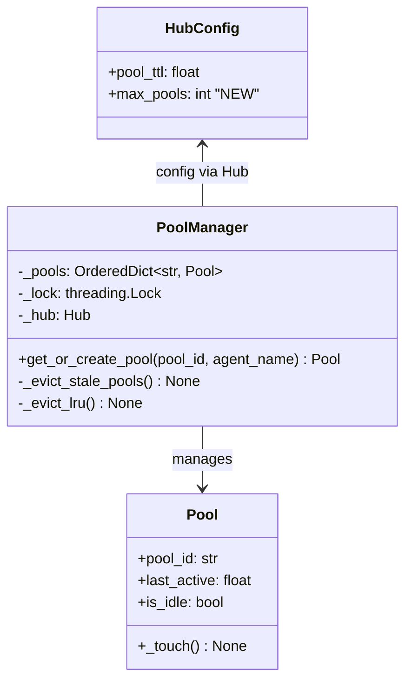
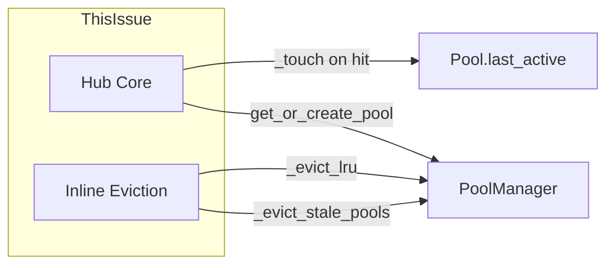

## Context

**Promoted from:** [Frame #859](../frames/859-poolmanager-bounded-lru-eviction-frame.mdx)

From 2026-04-22 code quality audit §P1 Async #6. Two related issues in `core/hub/pool_manager.py`:
1. **Race condition (lines 63–69)** — iterating `self.pools.items()` then calling `pop()` in the same loop
2. **Unbounded growth** — TTL-only eviction; memory grows without cap under high concurrent-scope load

## Goal

PoolManager safely evicts pools with bounded memory and no race conditions under concurrent reaper + message load.

## Users

- **Primary:** Hub operators running Lyra in production — stable memory footprint
- **Secondary:** DevOps — predictable memory behavior, no OOM surprises

## Constraints

| Constraint | Value | Rationale |
|------------|-------|-----------|
| `max_pools` default | 500 | Existing pools are per-conversation; 500 concurrent is generous |
| `max_pools` minimum | 1 | Allow single-pool mode for testing |
| Lock overhead | O(1) | `threading.Lock` — no async context needed |
| Backward compat | TTL eviction unchanged | Existing `pool_ttl` semantics preserved |
| Sync path required | `get_or_create_pool()` is sync | Cannot make async without Hub refactor (out of scope) |

## Out of Scope

- Making `get_or_create_pool()` async
- Changing existing TTL eviction timing or thresholds
- Adding eviction policies beyond LRU/TTL hybrid
- Modifying `Pool` public interface
- Background reaper task (inline eviction remains)
- Metrics/Prometheus export of pool count
- `memory_pressure_trigger` (future enhancement)

## Expected Behavior

1. Hub starts with empty PoolManager, `max_pools` configured via `HubConfig`
2. Conversations create pools via `get_or_create_pool()`
3. Pool hit → `_touch()` updates `last_active`, pool moves to end of `OrderedDict`
4. Pool miss + at capacity → evict leftmost (LRU) pool, create new
5. Inline TTL eviction (`_evict_stale_pools()`) runs with lock — no race
6. Memory stays bounded at `max_pools`; no `RuntimeError: dictionary changed size`

## Edge Cases

| Case | Handling |
|------|----------|
| `max_pools = 0` | Invalid config — raise `ValueError` at Hub init |
| `max_pools = 1` | Every new scope evicts the single pool |
| Pool in active use when evicted | Lock prevents race — eviction is atomic |
| Concurrent TTL + LRU eviction | Same `threading.Lock` serializes both |
| Lock held >100ms under extreme load | Log warning; never block — sync path is fast |

## Data Model & Consumers

### Data Structure



### Consumer Map



| Consumer | Fields | When | Status |
|----------|--------|------|--------|
| Hub Core | `_pools`, `Pool.last_active` | Every message | This issue |
| Inline Eviction | `_pools`, `Pool.is_idle`, `Pool.last_active` | TTL check | This issue |

## Breadboard

| ID | Affordance | Handler | Lock | Data |
|----|------------|---------|------|------|
| N1 | `get_or_create_pool(pool_id, agent_name)` | Check `_pools`, create/evict, return | **yes** | `Pool` |
| N2 | `_touch()` (on hit) | Move to end of `OrderedDict` | **yes** | None |
| N3 | `_evict_lru()` | Pop leftmost from `OrderedDict` | **yes** | None |
| N4 | `_evict_stale_pools()` | Iterate with lock, pop expired | **yes** | None |

### Wiring

```
Hub message → N1 get_or_create_pool (holds lock)
                 ├─ hit → N2 _touch → return pool
                 └─ miss → if at cap → N3 _evict_lru → create → return pool

Inline TTL check → N4 _evict_stale_pools (holds lock)
```

**Lock invariant:** All `_pools` reads/writes hold `_lock`.

## Slices

| # | Name | Demo-able | Dependencies |
|---|------|-----------|--------------|
| 1 | `HubConfig.max_pools` field | Config loads with new field, default 500 | None |
| 2 | `threading.Lock` + iteration safety | Unit test: concurrent pop + iterate, no race | S1 |
| 3 | `OrderedDict` + LRU eviction | Unit test: fill to cap, verify LRU evicted | S1, S2 |
| 4 | Integration + regression | Load test: high concurrency, existing TTL tests pass | S1–S3 |

## Success Criteria

- [ ] `HubConfig` has `max_pools: int = 500` field
- [ ] `PoolManager` uses `OrderedDict` for `_pools` (move-to-end on hit)
- [ ] `threading.Lock` guards all `_pools` mutations and iterations
- [ ] `_evict_lru()` removes leftmost pool when at capacity
- [ ] No `RuntimeError` under concurrent mutation (test with ≥100 threads)
- [ ] Pool count never exceeds `max_pools` (test with simulated high load)
- [ ] TTL eviction unchanged — existing tests pass
- [ ] `max_pools <= 0` raises `ValueError` at Hub init
- [ ] Typecheck passes (`uv run pyright`)
- [ ] Ruff passes (`uv run ruff check .`)
