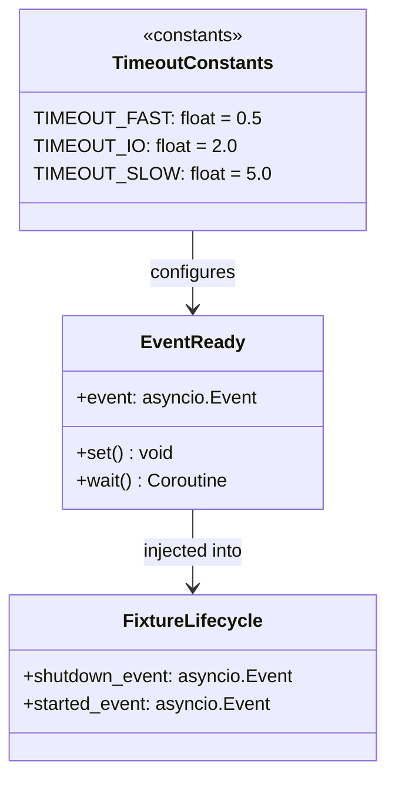
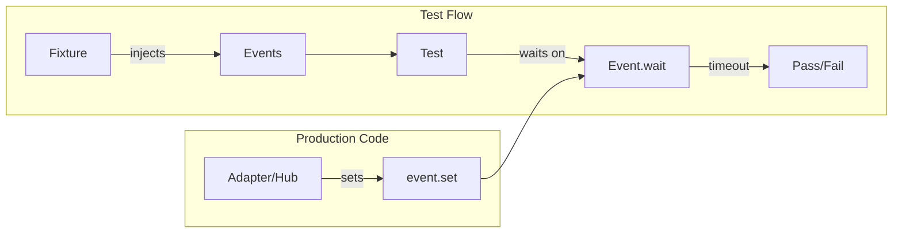

## Context

**Promoted from:** [Event-based sync frame](../frames/861-event-sync-flaky-tests-frame.mdx)

CI tests use `asyncio.sleep(N)` for coordination, causing flaky failures on slow runners and obscuring test intent.

## Goal

Replace all sleep-based waits with explicit event coordination, making CI tests deterministic and intent-clear.

## Users

- **Primary:** Developers running CI — reliable, fast test feedback
- **Secondary:** Maintainers — reduced flaky-failure investigations

## Expected Behavior

**Before:** Test guesses how long startup takes, sleeps, hopes it's ready.
```python
await asyncio.sleep(10)  # wait for NATS startup
```

**After:** Test waits for explicit readiness signal with timeout.
```python
await asyncio.wait_for(nats_ready.wait(), timeout=TIMEOUT_SLOW)
```

## Data Model & Consumers





| Consumer | Fields | When | Status |
|----------|--------|------|--------|
| Fake adapters | `shutdown_event` | Teardown | This issue |
| Test functions | `started_event` | Task readiness | This issue |
| Test helpers | `call_count` | Invocation polling | This issue |

## Breadboard

| Pattern | ID | Input | Handler | Data |
|---------|----|-------|---------|----|
| Fixture shutdown | P1 | `_shutdown: Event` | `await _shutdown.wait()` | Fixture state |
| Readiness signal | P2 | `started = Event()` | `task sets on start` | Task state |
| Invocation counter | P3 | `call_count = 0` | `side_effect increments` | Mock state |
| Yield helper | P4 | `yield_once()` | `await asyncio.sleep(0)` | None |

## Slices

| Slice | Scope | Demo | Files |
|-------|-------|------|-------|
| **A: Event-ready fixtures** | `conftest.py` fakes (`_FakeDp`, `_FakeDcAdapter`) | CI: adapters block on shutdown event | `tests/conftest.py` |
| **B: Yield semantics** | `sleep(0)` → `yield_once()` helper | grep: zero `asyncio.sleep(0)` | Multiple test files |
| **C: Task coordination** | `sleep(N)` where N > 0 | CI: typing/debouncer tests pass on slow runners | `test_telegram_typing.py`, `test_debouncer_pool.py`, etc. |

## Success Criteria

- [ ] Zero `asyncio.sleep(N)` where N >= 1 in test files (grep audit passes)
- [ ] All `asyncio.sleep(0)` replaced with `yield_once()` helper or removed
- [ ] Every event wait has explicit timeout (no bare `event.wait()`)
- [ ] All modified tests pass on 10 consecutive CI runs
- [ ] No test runtime increase > 10%

**Verification:**
```bash
grep -rn "asyncio.sleep([1-9]" tests/ --include="*.py" && echo "FAIL" || echo "PASS"
```

## Priority Files

| Priority | File | Issue |
|----------|------|-------|
| P0 | `tests/conftest.py` | `sleep(1_000)` in fake adapters |
| P1 | `tests/core/conftest.py` | `sleep(10)` in SlowAgent |
| P2 | `tests/nats/test_hub_standalone.py` | Startup timing |
| P3 | `tests/adapters/test_telegram_typing.py` | Debouncer timing |

## Timeout Constants

```python
TIMEOUT_FAST = 0.5   # In-memory operations
TIMEOUT_IO = 2.0     # Single network round-trip
TIMEOUT_SLOW = 5.0   # Multi-step coordination, CI variance buffer
```
