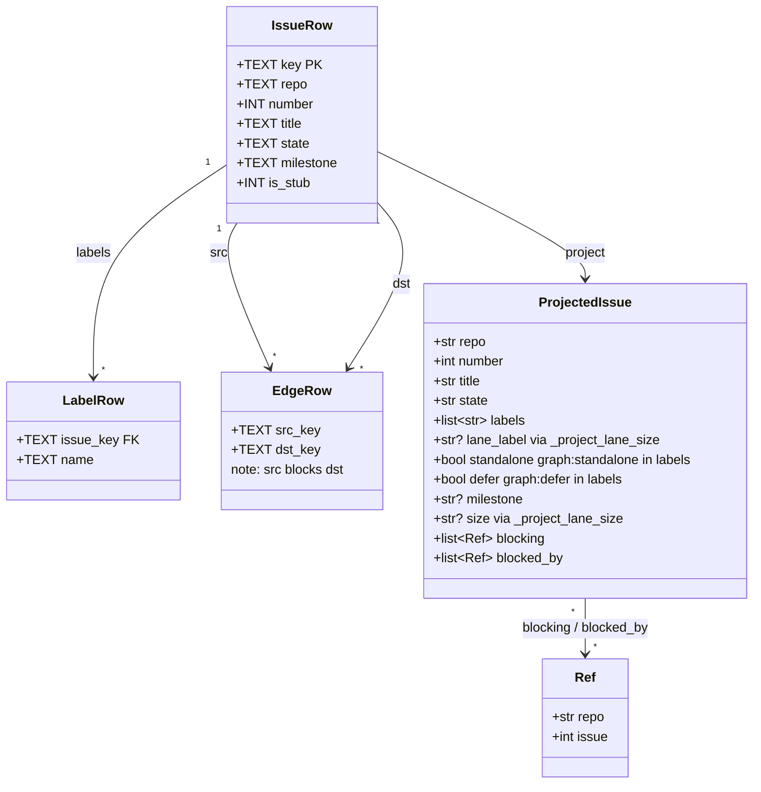
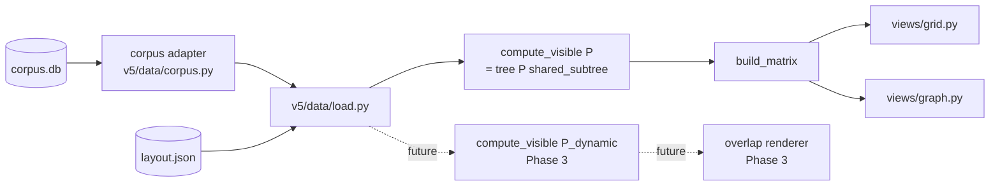

## Context

- **Source:** `artifacts/frames/864-corpus-sync-phase-2-v5-reader-frame.mdx` (approved)
- **Parent:** #829 (Phase 1 — corpus sync, landed). Schema at `scripts/corpus/schema.py` (`issues`, `labels`, `edges`, `sync_state`); rows populated nightly.
- **Current v5 reader:** `scripts/dep-graph/v5/data/load.py` reads `~/.roxabi/forge/lyra/visuals/lyra-v2-dependency-graph.gh.json` and calls `compute_visible(issues, "Roxabi/lyra")` = `open-in-primary + forward cascade + 1-hop backward` (`derive.py:58`).
- **Taxonomy in flight:** `roxabi-plugins#119` is moving Lane/Priority/Size/Status to a Project V2 hub. Hub scaffolding is done (project #24, all 4 fields + options configured), but **zero issues are enrolled yet**. `graph:lane/*` and `size:*` labels remain the de facto source today. #864 ships **in parallel** with #119 and reads labels from corpus.db today; a single projector function is isolated so the source flips in a follow-up once the hub has data and corpus.db gains a `lane` column.

## Goal

Swap v5's data source from `gh.json` to `~/.roxabi/corpus.db` and generalise `compute_visible(P)` to `tree(P) ∪ ⋃_Q shared_subtree(Q, P)` so cross-project chains (e.g. voiceCLI `#69 → … → #83`) render alongside lyra's tree.

## Users

- **Primary:** Mickael — runs `make graph`; needs cross-project chains visible when they share nodes with lyra.
- **Secondary:** Phase 3 (toolbar project-select) will call the same `compute_visible(corpus, P)` with a user-chosen `P`; `roxabi-dashboard` (Phase 5) will reuse this reader.

## Expected Behavior

1. `make graph` runs against corpus.db; `gh.json` is no longer read by v5.
2. The adapter projects SQL rows into the `issues[key] = dict` shape `derive.py` already consumes — no downstream math changes.
3. `compute_visible("Roxabi/lyra")` returns a **superset** of today's v5 output on the same data: every tile that renders today still renders, plus any cross-project subtree sharing a node with lyra's tree.
4. The voiceCLI `#69 → #53/55/80/81/85 → #83` chain renders on the graph view.
5. Missing `~/.roxabi/corpus.db` → `FileNotFoundError` with message referencing `make corpus-sync`. No silent fallback to `gh.json`.
6. Primary repo is fixed at a single constant `PRIMARY_REPO = "Roxabi/lyra"` (Phase 3 flips to parameter).
7. `layout.json` is still read by `load.py` for lanes/milestones/column_groups/colors — out of scope for #864 (follow-up below).

## Data Model & Consumers

### Corpus rows → projected issue dict



Projection rules (mirror `scripts/dep-graph/dep_graph/fetch.py:46-60`):
- `standalone` = `graph:standalone` ∈ labels
- `defer`      = `graph:defer` ∈ labels
- `blocking`   = `[{repo, issue} for dst_key in edges where src_key == key]`
- `blocked_by` = `[{repo, issue} for src_key in edges where dst_key == key]`

**Isolated projector** — `_project_lane_size(labels: list[str]) -> tuple[str | None, str | None]`:
- `lane_label` = strip `graph:lane/` prefix from first matching label, else `None`
- `size`       = strip `size:` prefix from first matching label, else `None`

This function is the single swap point for follow-up work: once `roxabi-plugins#119` enrollment completes and corpus.db grows `lane`/`size` columns, only this function and its call site change. Its docstring must name `#119` + the follow-up issue.

### Consumer map



Solid = this issue. Dashed = Phase 3 (out of scope). `layout.json` stays.

### Consumer summary

| Consumer | Fields consumed | When | Status |
|---|---|---|---|
| corpus adapter (new) | all issue/label/edge rows | load | this issue |
| `_project_lane_size` | labels list | load | this issue — single swap point for #119 follow-up |
| `compute_visible` | `state`, `repo`, `blocking`, `blocked_by` | every render | **rewritten** this issue |
| `build_matrix` | `milestone`, `lane_label`, `state` + `visible` | every render | unchanged |
| `tasks_for_graph` | `number`, `title`, `url`, `state`, `milestone`, `lane_label`, `size`, `blocking`, `blocked_by`, `depth` | every render | unchanged |
| `load.py` (layout.json) | `lanes`, `column_groups`, `milestones`, `meta` | every render | unchanged |
| Phase-3 dropdown | whole `issues` set | future | out of scope |

## Breadboard

### Affordances (backend only — no UI)

| ID | Element | Handler | Data |
|---|---|---|---|
| N1 | Corpus adapter module | `scripts/dep-graph/v5/data/corpus.py` | opens `~/.roxabi/corpus.db`, projects rows → `dict[key, ProjectedIssue]`; loads all repos |
| N1a | `_project_lane_size(labels)` | same module | isolated projector; swap point for #119 follow-up |
| N2 | `load.py` source swap | `scripts/dep-graph/v5/data/load.py` | calls N1 instead of reading `gh.json`; introduces `PRIMARY_REPO` constant |
| N3 | `compute_visible` rewrite | `scripts/dep-graph/v5/data/derive.py` | replaces 1-hop-backward with `tree(P) ∪ ⋃_Q shared_subtree(Q, P)` |
| N4 | `tree(P)` helper | `derive.py` | seed = open-in-P; closure over `blocking` ∪ `blocked_by`, any repo, any state |
| N5 | `shared_subtree(Q, P)` helper | `derive.py` | for each repo Q ≠ P with `Q ∩ tree(P) ≠ ∅`, close over Q-local edges from those shared nodes |
| N6 | Missing-corpus hint | `load.py` | `FileNotFoundError("run `make corpus-sync`")` |
| S1 | Adapter tests | `scripts/dep-graph/v5/tests/test_corpus.py` | seed sqlite → project → expected dicts; projector unit tests |
| S2 | `tree(P)` tests | `tests/test_derive.py` (additions) | full backward closure beyond 1-hop |
| S3 | `shared_subtree` tests | `tests/test_derive.py` (additions) | Q unrelated → ∅; Q with shared node → Q-local closure |
| S4 | Superset test | `tests/test_derive.py` (new) | on a fixture approximating today's gh.json, `new_visible ⊇ old_visible` and the voiceCLI chain is among the additions |

### Wiring

```
corpus.db → N1 (+ N1a) → N2 (load.py) → N3 (compute_visible = N4 ∪ N5) → GraphData.visible → build_matrix → views
layout.json ──────────→ N2
```

## Slices

| # | Slice | Includes | Demo |
|---|---|---|---|
| 1 | **Adapter** | N1, N1a, N6, S1 | `python -c "from scripts.dep_graph.v5.data.corpus import load_issues; print(len(load_issues()))"` prints row count; missing-DB path shows `make corpus-sync` hint |
| 2 | **Reader swap (algebra unchanged)** | N2, keep old `compute_visible` | `make graph` runs on corpus.db; output matches pre-swap run on equivalent data |
| 3 | **New visibility algebra** | N3, N4, N5, S2, S3, S4 | Graph renders voiceCLI `#83` chain; superset test confirms no tiles disappear |

Slices 1 → 2 → 3 are strictly ordered; each is demo-able independently.

## Success Criteria

- [ ] `scripts/dep-graph/v5/data/corpus.py` exists, exports `load_issues(db_path: Path | None = None) -> dict[str, dict]`
- [ ] `_project_lane_size(labels)` isolated in the adapter module; docstring names `roxabi-plugins#119` and the follow-up issue
- [ ] Projected issue dict carries all fields current gh.json rows carry (`repo`, `number`, `title`, `state`, `labels`, `lane_label`, `standalone`, `defer`, `milestone`, `size`, `blocking`, `blocked_by`)
- [ ] Adapter loads all repos from corpus.db (no `layout.json` filter)
- [ ] `scripts/dep-graph/v5/data/load.py` no longer reads `lyra-v2-dependency-graph.gh.json`; `layout.json` read path unchanged
- [ ] `PRIMARY_REPO = "Roxabi/lyra"` constant introduced in `load.py`
- [ ] Missing `~/.roxabi/corpus.db` → `FileNotFoundError` whose message includes `make corpus-sync`
- [ ] `compute_visible` signature unchanged: `(issues: dict[str, dict], primary_repo: str) -> set[str]`
- [ ] `tree(P)` test: given open-in-P → blocked-by-X → blocked-by-Y (all in P), returns `{open, X, Y}` (old rule returns `{open, X}` only)
- [ ] `shared_subtree(Q, P)` test: Q with no node in `tree(P)` contributes ∅
- [ ] `shared_subtree(Q, P)` test: Q with one shared node `x` returns the Q-local closure of `{x}`
- [ ] Superset test: on a fixture covering current gh.json issues + edges, `new_visible ⊇ old_visible` and the voiceCLI `#83` chain is one of the additions
- [ ] `uv run pytest scripts/dep-graph/v5/tests/` green
- [ ] `uv run ruff check scripts/dep-graph/v5/` clean
- [ ] `uv run pyright scripts/dep-graph/v5/` clean
- [ ] `make graph` runs end-to-end against corpus.db without touching `gh.json`

## Follow-ups (out of scope, tracked separately)

1. **#872 — `feat(corpus): add Lane/Size columns from projectV2 + swap dep-graph reader`** (blocked by `roxabi-plugins#119` enrollment) — extends corpus.db schema, pulls Lane/Size from `projectV2.items`, flips `_project_lane_size` to read columns instead of labels.
2. **Drop `layout.json`, derive presentation config from GH** — lane names/colors, column groups, milestone short labels need a GH-native carrier (label convention, milestone description, or pinned config issue). Not tied to #864; deserves its own frame.
