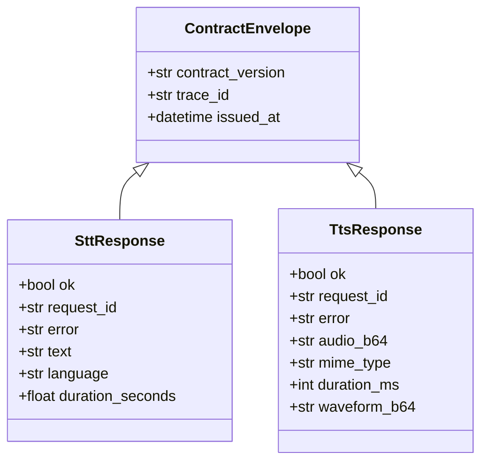
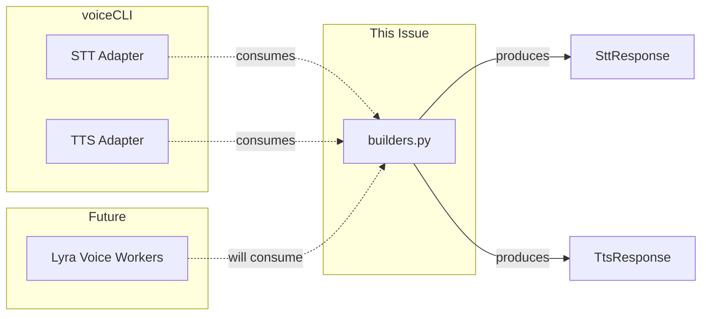

## Context

Promoted from frame #896. voiceCLI adapters were omitting required `ContractEnvelope` fields (`trace_id`, `issued_at`) when constructing STT/TTS responses, causing schema validation failures.

## Goal

Provide a fail-safe response builder that guarantees all required envelope fields are set correctly.

## Users

- **Primary:** NATS worker developers — call builder instead of manual construction
- **Secondary:** DevOps/debuggers — benefit from consistent `trace_id` propagation

## Constraints

- Must live in `roxabi-contracts/voice/` (contracts package ownership)
- Must handle both `SttResponse` and `TtsResponse` schemas
- `trace_id` fallback: from payload, else `request_id`
- `issued_at`: auto-set to UTC now
- voiceCLI adoption blocked by this issue (separate PR)

## Out of Scope

- Lyra voice workers (future — will consume this helper)
- Modifying existing schemas (`SttResponse`, `TtsResponse`)
- Error handling patterns beyond basic `error` field

## Expected Behavior

1. Worker receives request payload (parsed JSON)
2. Worker calls `build_stt_response(payload, ok=True, text="...", ...)` or `build_tts_response(payload, ok=True, audio_b64="...", ...)`
3. Builder returns valid JSON string with all envelope fields set
4. Worker publishes response to NATS

## Data Model & Consumers

### Data Structure



### Consumer Map



### Consumer Summary

| Consumer | Fields Consumed | When | Status |
|----------|-----------------|------|--------|
| voiceCLI STT Adapter | `build_stt_response()` | On response | This issue (blocked) |
| voiceCLI TTS Adapter | `build_tts_response()` | On response | This issue (blocked) |
| Lyra Voice Workers | Both builders | Future | Out of scope |

## Breadboard

| ID | Element | Handler | Data Flow |
|----|---------|---------|-----------|
| U1 | Worker code | `build_stt_response()` | payload → SttResponse JSON |
| U2 | Worker code | `build_tts_response()` | payload → TtsResponse JSON |
| N1 | `trace_id` | Fallback chain | `payload.trace_id` ∨ `payload.request_id` |
| N2 | `issued_at` | Auto-set | `datetime.now(timezone.utc)` |
| N3 | `contract_version` | Default | `"1"` (from `CONTRACT_VERSION`) |

### Wiring

```
payload (dict)
    │
    ├─ trace_id ──► N1 ──► fallback to request_id if missing
    ├─ request_id ───────► passed through
    └─ (response fields) ─► builder specific

Builder output:
    {
      "contract_version": "1",
      "trace_id": <N1 result>,
      "issued_at": <N2 result>,
      "ok": <provided>,
      "request_id": <from payload>,
      ...response-specific fields
    }
```

## Slices

| # | Slice | Demo | Test Dependencies |
|---|-------|------|-------------------|
| 1 | `build_stt_response()` core | Success + error paths | None |
| 2 | `build_tts_response()` core | Success + error paths | None |
| 3 | Edge case tests | Missing trace_id, extra fields, KeyError on missing request_id | 1, 2 |

> **Note:** Each builder handles both success (`ok=True`) and error (`ok=False`) paths internally. Slice 3 adds edge case test coverage.

## Success Criteria

- [ ] `build_stt_response()` returns valid JSON string that parses as `SttResponse`
- [ ] `build_tts_response()` returns valid JSON string that parses as `TtsResponse`
- [ ] `trace_id` falls back to `request_id` when not in payload
- [ ] `issued_at` is auto-set to UTC now
- [ ] `contract_version` defaults to `"1"`
- [ ] Error responses (`ok=False`) set `error` field
- [ ] Success responses (`ok=True`) include all required fields per schema invariant (STT: text+language+duration_seconds; TTS: audio_b64+mime_type+duration_ms)
- [ ] Unit tests cover success, error, and edge cases
- [ ] Builders exported from `roxabi_contracts.voice.__init__`
