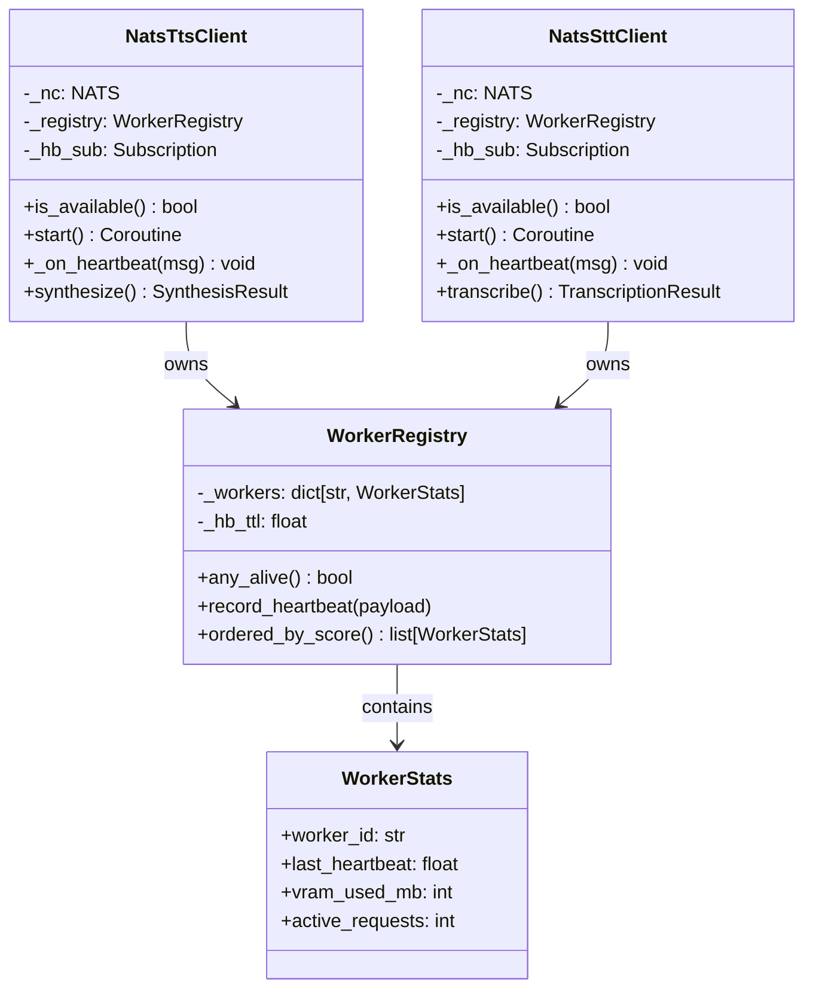
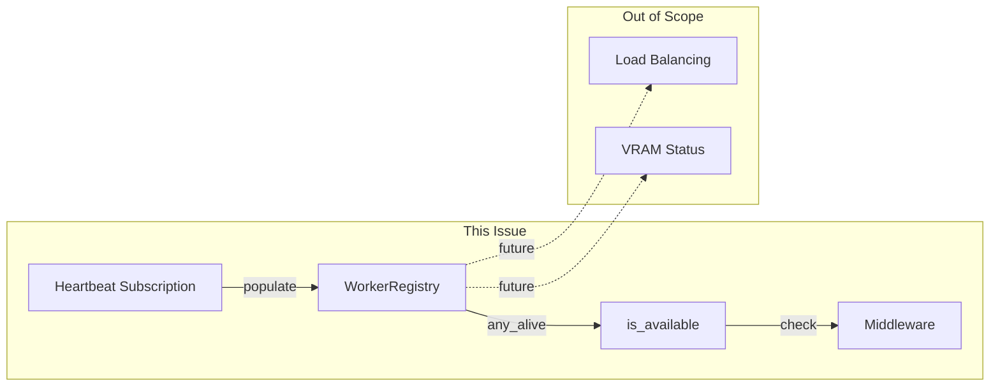

## Context

Promoted from [frame 897](../frames/897-auto-detect-tts-stt-heartbeat-frame.mdx).

## Goal

Hub auto-detects TTS/STT satellite availability via heartbeat subscription instead of requiring explicit env vars.

## Users

- **Primary:** Hub operators running voiceCLI satellites
- **Secondary:** Developers testing voice features locally

## Expected Behavior

1. Hub starts and creates `NatsTtsClient` / `NatsSttClient` unconditionally
2. Hub calls `client.start()` unconditionally to begin heartbeat subscription
3. Clients subscribe to heartbeat subjects (`lyra.voice.tts.heartbeat`, `lyra.voice.stt.heartbeat`)
4. When a satellite starts, it emits heartbeats → client's `WorkerRegistry` records the worker
5. Hub routes TTS/STT requests only when `registry.any_alive()` returns `True`
6. When satellite stops (heartbeat TTL expires), routing is disabled automatically
7. Operators no longer need to set `LYRA_TTS_ENABLED` / `LYRA_STT_ENABLED`

## Constraints

- **Heartbeat TTL:** `WorkerRegistry` uses 15s TTL (DEFAULT_HB_TTL in `worker_registry.py`)
- **Heartbeat emission:** voiceCLI satellites emit heartbeats every 5s (out of scope for this issue)
- **Backward compatibility:** `LYRA_TTS_ENABLED` / `LYRA_STT_ENABLED` env vars are deprecated but ignored — no fallback behavior needed
- **Message distinction:** Previous "stt_unsupported" (feature disabled) becomes "stt_unavailable" (satellite not running) — semantically different user messages

## Data Model & Consumers

### Data Structure



**Note:** `WorkerRegistry` already exists with `any_alive()` and `record_heartbeat()` — no changes needed.

### Consumer Map



### Consumer Summary

| Consumer | Fields | When | Status |
|----------|--------|------|--------|
| `middleware_stt.py` | `is_available()` | Before STT routing | This issue |
| `outbound_tts.py` | `is_available()` | Before TTS routing | This issue |
| `voice_overlay.py` | `NatsSttClient`, `NatsTtsClient` | Bootstrap | This issue |
| `hub_standalone.py` | `stt.start()`, `tts.start()` | Bootstrap | This issue |
| `unified.py` | `stt.start()`, `tts.start()` | Bootstrap | This issue |

## Breadboard

### Affordance Table

| ID | Affordance | Handler | Data |
|----|------------|---------|------|
| U1 | Satellite starts | `voiceCLI` daemon (out of scope) | emits heartbeat |
| N1 | Heartbeat received | `NatsXttClient._on_heartbeat` | `worker_id`, `active_requests`, `vram_*` |
| N2 | Worker recorded | `WorkerRegistry.record_heartbeat` | updates `_workers` dict |
| N3 | Availability check | `NatsXttClient.is_available` | returns `registry.any_alive()` |
| S1 | Middleware routes | `middleware_stt`, `outbound_tts` | checks `is_available()` before routing |
| S2 | Satellite stops | heartbeat TTL expires (15s) | `any_alive()` returns `False` |
| S3 | User notified | `middleware_stt._dispatch_error` | sends "stt_unavailable" message |

### Wiring

```
Satellite → [heartbeat subject] → NatsXttClient._on_heartbeat
                                        ↓
                               WorkerRegistry.record_heartbeat
                                        ↓
                               (registry.any_alive())
                                        ↓
  Hub middleware ← is_available() ← NatsXttClient
      ↓
  [routes request] or [sends "stt_unavailable" message via S3]
```

## Edge Cases

| Case | Handling |
|------|----------|
| In-flight request when satellite dies | Client's `_walk_registry` marks worker stale, continues to next worker, or raises `TtsUnavailableError`/`STTUnavailableError` — existing error path |
| Race: hub routes as `any_alive()` flips to `False` | Request may reach dying satellite → timeout → circuit breaker records failure → retry with next worker — existing behavior |
| Cold start: hub routes before first heartbeat | `is_available()` returns `False` → middleware sends "unavailable" message — graceful degradation |
| Stale worker cleanup | `WorkerRegistry._prune()` removes workers with `last_heartbeat > 2 * hb_ttl` (30s) — existing behavior |

## Slices

| # | Slice | Files | Demo |
|---|-------|-------|------|
| 1 | Add `is_available()` to clients | `nats_tts_client.py`, `nats_stt_client.py` | Unit test: `client.is_available()` reflects registry state |
| 2 | Remove env var checks + unconditional `start()` | `voice_overlay.py`, `hub_standalone.py`, `unified.py` | Integration test: clients created and started without env vars |
| 3 | Update middleware to check availability | `middleware_stt.py`, `outbound_tts.py` | Unit test: middleware respects `is_available()` |
| 4 | Remove env vars from supervisor configs | `deploy/supervisord.d/*.conf` (if any use `LYRA_*_ENABLED`) | Manual: no `LYRA_*_ENABLED` in configs |
| 5 | Update tests | `test_voice_overlay.py`, `test_nats_*_client.py`, `test_hub_standalone.py` | All tests pass |

## Success Criteria

- [ ] `NatsTtsClient.is_available()` returns `True` when registry has alive workers, `False` otherwise
- [ ] `NatsSttClient.is_available()` returns `True` when registry has alive workers, `False` otherwise
- [ ] `init_nats_stt()` creates client without checking `LYRA_STT_ENABLED`
- [ ] `init_nats_tts()` creates client without checking `LYRA_TTS_ENABLED`
- [ ] `hub_standalone.py` calls `stt.start()` and `tts.start()` unconditionally (not `if stt: await stt.start()`)
- [ ] `unified.py` calls `stt.start()` and `tts.start()` unconditionally
- [ ] `middleware_stt.py` checks `stt.is_available()` instead of `stt is None`
- [ ] `outbound_tts.py` checks `tts.is_available()` instead of `tts is None`
- [ ] Existing tests updated to reflect new behavior
- [ ] `LYRA_TTS_ENABLED` / `LYRA_STT_ENABLED` documented as deprecated
- [ ] Hub routes voice requests when satellites are running, sends "stt_unavailable" message when not
