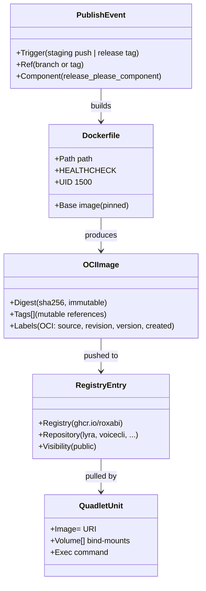
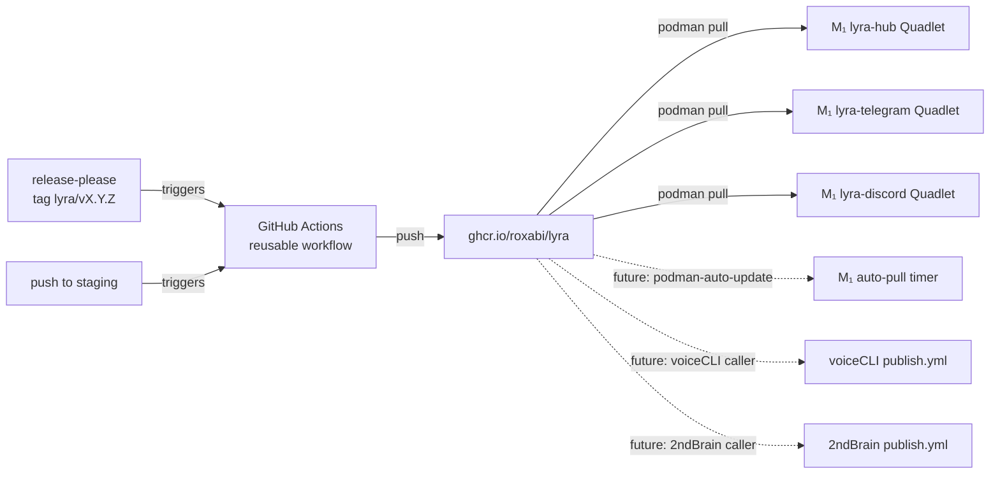

## Context

Promoted from `artifacts/analyses/920-container-publishing-pattern-analysis.mdx`. Shape 2 chosen: reusable GitHub Actions workflow hosted in `Roxabi/.github`, invoked via `workflow_call` from each Roxabi repo.

Confirmed preconditions:
- `Roxabi/.github` repo exists, is public, no `.github/workflows/` directory yet.
- Lyra `Dockerfile` is production-ready (two-stage, UID 1500, HEALTHCHECK).
- Lyra `release-please-config.json` emits tags in format `lyra/X.Y.Z` (component `lyra`, tag-separator `/`).
- Quadlet units on M₁ are rootless, run as systemd `--user` units, podman 5.x.
- Decision: GHCR packages published **public** (matches open-code posture, eliminates M₁ pull-auth burden). M₁ auth doc still written as an "if you ever go private" reference.

## Goal

Define once — in `Roxabi/.github` — a reusable container-publishing workflow; prove it with lyra; leave every other Roxabi repo able to adopt by adding ~15 lines to `.github/workflows/publish.yml` and swapping three `Image=` lines.

## Users

- **Primary:** Mickael (solo operator) — pushes to lyra `staging`, expects `ghcr.io/roxabi/lyra:staging` to appear; cuts a release-please release on `main`, expects `:X.Y.Z` + `:X` + `:latest`; runs `podman pull` on M₁ and restarts the three Quadlet services.
- **Secondary:** Future adopters — voiceCLI (unblocks #111), 2ndBrain, imageCLI, llmCLI. Each adopts by copying the ~15-line caller, setting two inputs, swapping image URI in their Quadlets.

## Expected Behavior

### Staging branch push (every merge to `staging`)

1. Developer merges PR to `staging` in lyra repo.
2. Lyra's `.github/workflows/publish.yml` fires on `push: [staging]`.
3. Caller invokes `Roxabi/.github/.github/workflows/publish-container.yml@v1` with `image_name: ghcr.io/roxabi/lyra`, `release_please_component: lyra`.
4. Reusable workflow: checkout → buildx setup → login to ghcr.io via `GITHUB_TOKEN` → `docker/metadata-action` produces tags `[staging]` + OCI labels → `docker/build-push-action` builds multi-arch (amd64 only for v1, arm64 deferred) → pushes to `ghcr.io/roxabi/lyra:staging`.
5. M₁ operator (manual for v1): `podman pull ghcr.io/roxabi/lyra:staging` → `systemctl --user restart lyra-hub lyra-telegram lyra-discord`.

### Release-please tag publish (cut a release)

1. release-please PR merged to `main`; release-please creates GitHub Release with tag `lyra/v0.3.0`.
2. Lyra's publish workflow fires on `push: [tags: 'lyra/v*']`.
3. Caller passes component filter `lyra`; reusable workflow extracts semver `0.3.0` from the tag.
4. `metadata-action` produces tags `[0.3.0, 0, latest]` on `main`-built artifact.
5. `build-push-action` publishes all three tags + full OCI labels (source, revision, version, created).
6. M₁ operator pins a specific semver in Quadlet: `Image=ghcr.io/roxabi/lyra:0.3.0` — immutable, rollback trivial.

### Other Roxabi repos adopt

1. Copy `.github/workflows/publish.yml` template (from lyra docs) into new repo.
2. Set two inputs: `image_name` + `release_please_component`.
3. Ensure repo has a `Dockerfile` at default path (or override `dockerfile_path`).
4. Ensure repo's release-please config emits tags matching `<component>/v*`.
5. Swap Quadlet `Image=` lines to `ghcr.io/roxabi/<project>:<tag>`.

## Data Model & Consumers

### Artifact model

### Consumer map

Solid = this issue. Dashed = future (out of scope here, but unblocked by this design).

### Consumer summary

| Consumer | Consumes | When | Status |
|---|---|---|---|
| `lyra-hub` Quadlet | `ghcr.io/roxabi/lyra:<tag>` | On `podman pull` / unit (re)start | This issue |
| `lyra-telegram` Quadlet | same | same | This issue |
| `lyra-discord` Quadlet | same | same | This issue |
| voiceCLI caller workflow | reusable workflow `@v1` | Each voiceCLI staging push / release | Future (#111 PR, not here) |
| 2ndBrain / imageCLI / llmCLI | reusable workflow `@v1` | Per-repo adoption | Future |
| `podman-auto-update.timer` | `ghcr.io/roxabi/lyra:<floating>` | Scheduled poll | Future (cosign + digest pins first) |

## Breadboard

### Affordances in `Roxabi/.github`

| ID | Affordance | Handler | Data |
|---|---|---|---|
| N1 | `.github/workflows/publish-container.yml` (reusable) | `on: workflow_call` | inputs: `image_name` (str, req), `release_please_component` (str, req), `dockerfile_path` (str, default `./Dockerfile`), `build_context` (str, default `.`) |
| N2 | `README.md` quickstart section | human reader | caller snippet + required inputs + link to lyra canonical doc |
| N3 | git tag `v1` (floating) | `workflow_call` ref resolution | points at latest non-breaking commit |

### Affordances in `lyra`

| ID | Affordance | Handler | Data |
|---|---|---|---|
| U1 | `.github/workflows/publish.yml` (caller) | `on: push` triggers | `branches: [staging]` + `tags: ['lyra/v*']` |
| U2 | `deploy/quadlet/lyra-hub.container` `Image=` line | podman/systemd | `ghcr.io/roxabi/lyra:<tag>` replaces `localhost/lyra:latest` |
| U3 | `deploy/quadlet/lyra-telegram.container` `Image=` | same | same |
| U4 | `deploy/quadlet/lyra-discord.container` `Image=` | same | same |
| U5 | `docs/ops/container-publishing.md` | human reader | canonical pattern: Dockerfile conventions, caller template, Quadlet convention, M₁ pull runbook, M₁ auth setup (for future private-image case), rollback recipe |
| U6 | `Makefile` — `LYRA_IMAGE` default + `push` target semantics | make | `LYRA_IMAGE ?= ghcr.io/roxabi/lyra:latest`; keep `podman save \| ssh` flow as opt-in fallback, not default |
| U7 | `CLAUDE.md` key-files table | human reader | add row pointing to `docs/ops/container-publishing.md` |

### Wiring

- **Staging push:** U1 `on: push[staging]` → invokes N1 with inputs U1.inputs → N1 pushes `:staging` to ghcr.io → U2/U3/U4 consume on manual `podman pull` + restart.
- **Release-please tag:** tag `lyra/v0.3.0` created on main → U1 `on: push[tags: 'lyra/v*']` → N1 extracts semver → pushes `:0.3.0, :0, :latest` → operator updates U2/U3/U4 `Image=` to `:0.3.0`, commits, restarts.
- **Ref pinning:** U1 uses `uses: Roxabi/.github/.github/workflows/publish-container.yml@v1`. N3 ensures `@v1` resolves to latest non-breaking.

## Slices

Vertical increments; each independently demo-able.

| # | Slice | Affordances | Demo |
|---|---|---|---|
| 1 | **Reusable workflow + staging publish working** | N1, N3, U1 (staging trigger only), U6 | Push to lyra `staging` → `ghcr.io/roxabi/lyra:staging` appears, `podman pull` succeeds from M₂. |
| 2 | **Release-please tag publish working** | U1 (tag trigger added) | Manually tag `lyra/v0.0.1-rc.1` (throwaway pre-release) or wait for next real release-please cut → `:X.Y.Z`, `:X`, `:latest` all pushed. |
| 3 | **Lyra Quadlets swapped + M₁ pulling** | U2, U3, U4 | M₁: `podman pull ghcr.io/roxabi/lyra:<tag>` → `systemctl --user daemon-reload` → `systemctl --user restart lyra-hub lyra-telegram lyra-discord` → health endpoint green. |
| 4 | **Canonical doc + quickstart published** | N2, U5, U7 | `lyra/docs/ops/container-publishing.md` renders; `Roxabi/.github/README.md` quickstart section links to it; a naive reader can adopt the pattern in <10 min. |

Slice 1 is the riskiest (first live publish); 2 is a follow-through on the same design; 3 and 4 are mechanical.

## Success Criteria

- [ ] `Roxabi/.github/.github/workflows/publish-container.yml` exists and is invoked via `workflow_call` with documented inputs (`image_name`, `release_please_component`, `dockerfile_path`, `build_context`).
- [ ] `Roxabi/.github` has a `v1` floating tag (or branch) that lyra's caller pins via `@v1`.
- [ ] Lyra `.github/workflows/publish.yml` exists, ≤30 lines, only declares triggers + calls reusable workflow with the two required inputs.
- [ ] Push to lyra `staging` publishes `ghcr.io/roxabi/lyra:staging` successfully end-to-end (verified by `podman pull ghcr.io/roxabi/lyra:staging` from M₂).
- [ ] A release-please tag (real or a throwaway pre-release) publishes `:X.Y.Z`, `:X`, `:latest` successfully.
- [ ] Published images carry OCI labels: `org.opencontainers.image.source`, `.revision`, `.version`, `.created`.
- [ ] GHCR package `ghcr.io/roxabi/lyra` visibility is public (no auth required for pull).
- [ ] Lyra's three `.container` files use `Image=ghcr.io/roxabi/lyra:<pinned semver>` (not `localhost/*`, not `:latest` floating).
- [ ] M₁ successfully runs `podman pull ghcr.io/roxabi/lyra:<tag>` without additional auth; all three units start and pass health check.
- [ ] `docs/ops/container-publishing.md` exists and covers: Dockerfile conventions, caller workflow template (copy-pasteable), Quadlet `Image=` convention, M₁ pull + restart runbook, M₁ `containers-auth.json` setup (for future private-image adopters), rollback recipe (pin previous semver + restart).
- [ ] `Roxabi/.github/README.md` has a quickstart section: "How to publish container images across Roxabi repos" linking to the lyra canonical doc.
- [ ] Lyra `CLAUDE.md` Key files table references `docs/ops/container-publishing.md`.
- [ ] Lyra `Makefile` default `LYRA_IMAGE` is `ghcr.io/roxabi/lyra:latest`; the `make push` SSH+`podman save` flow is documented as an opt-in fallback only.
- [ ] voiceCLI #111 cross-references this PR/issue as the unblocking artifact (one comment link, no deeper change here).

## Out of Scope (carried forward from frame)

- cosign / sigstore signing.
- Renovate auto-PR for image bumps.
- Digest pins (`@sha256:…`) in Quadlet.
- `podman-auto-update.timer` on M₁.
- arm64 multi-arch build (amd64 only for v1; flag for follow-up if any M₁ or M₂ replacement goes arm).
- Adoption PRs in 2ndBrain, imageCLI, llmCLI (each repo owns its migration once the pattern is live).
- Rewriting release-please or changing the `<component>/vX.Y.Z` tag format.

## Open Questions

None blocking. (GHCR visibility = public decided; `Roxabi/.github` existence confirmed; M₁ auth deferred to doc since public image eliminates the need.)
